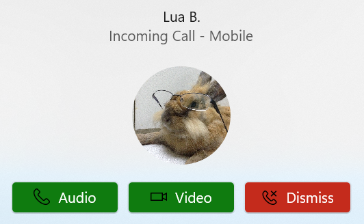

# Incoming Call Notifications

Authors: [Gabriel Brito](https://github.com/gabrielsanbrito), [Steve Becker](https://github.com/SteveBeckerMSFT), [Jungkee Song](https://github.com/jungkees)

## Status of this Document
This document is a starting point for engaging the community and standards bodies in developing collaborative solutions fit for standardization. As the solutions to problems described in this document progress along the standards-track, we will retain this document as an archive and use this section to keep the community up-to-date with the most current standards venue and content location of future work and discussions.
* This document status: **Active**
* Expected venue: [Web Hypertext Application Technology Working Group (WHATWG)](https://whatwg.org/)
* Current version: **This document**
    
## Introduction
Native applications that also have a Web counterpart might want the behavior of latter to be as similar to the former as much as possible to provide a consistent user experience across various devices and platforms. VoIP (Voice over Internet Protocol) applications - e.g., Microsoft Teams, Google Meet, Zoom, etc - are no exception and have become increasingly popular and demanded for remote collaboration over the last couple of years.

  

*Figure 1: Incoming call notification scenario.*

We would like to propose an extension to the [Notifications API](https://notifications.spec.whatwg.org/) standard for incoming call scenarios to allow the notification action buttons to be customized and also allow the application to play a ringtone. This capability would make the incoming call notifications, which may require a faster immediate response, clearly distinguishable from the others to the user and would also contribute to increasing accessibility on the Web. Moreover, browsers may also decide to increase the priority of notifications for this scenario type by making it show immediately and for a longer duration. 

## Goals

Propose an extension to the Notifications API to allow more customization for VoIP Progressive Web Apps (PWAs). 

## Non-Goals

Allow general web contents to arbitrarily change action button colors and sound sources without restrictions from the underlying platforms.

## Use Cases 

- A video conferencing PWA can produce its call notification pop-up with a green "accept" button and red "decline" button and make it visually distinguishable from the default notifications. This could make it easier for the users to quickly parse the options and choose one.
- VoIP applications might want to use a ringtone and higher priority notifications to quickly draw the user's attention to an incoming call and take immediate action.

## Proposed Solution

We propose the creation of a new property `scenario` in the `NotificationOptions` dictionary of type `NotificationScenario`, that is an `enum` with two values: `"default"` and `"incoming-call"`. The color treatment and ringtone capabilities will only be available in the `"incoming-call"` scenario. As a side note, the Notifications API could support additional scenarios in the future - e.g., alarms and reminders - by having more values added to the `NotificationScenario` enum.

```javascript
enum NotificationScenario {
  "default",
  "incoming-call"
}

dictionary NotificationOptions {
  NotificationScenario scenario = "default";
  ...
}
```

When the scenario is `"incoming-call"`, the notification will always have a default dismiss button. This way, when a calling notification is displayed to the user, we can guarantee that he or she will always be capable to dismiss it. 

Moreover, notifications created within the `"incoming-call"` scenario should have increased priority over the regular ones. That is, if a `"default"` notification is currently being displayed and another `"incoming-call"` notification gets created, it should break through and be displayed immediately, requiring immediate action from the user.

### Color Treatment

For notifications with `"scenario"` of type `"incoming-call"`, the User Agent (UA) may style the notification's action buttons' differently than the `"default"` scenario. Additionally, it is preferable that the default dismiss button is colored distinctly than the others in the `Notfication.actions` array. We propose that the default dismiss action button should have a red theme - e.g., red background color with some predefined icon on it - while all the other buttons are green-themed, but it is up to the platform to define the style.

Finally, if the platform does not allow color treatment for notification buttons, the UA should fallback to the `"default"` scenario colors.

### Ringtone

We also propose that, when a notification is displayed in the `"incoming-call"` scenario, a ringtone is played. The UA should play a predefined - possibly platform-provided - audio, suitable for executing in a loop, and keep playing it for the duration of the notification. If the platform does not allow  displaying a notification with a ringtone, the UA must fallback to the `"default"` scenario sound.

### Use Examples

An incoming call notification from a VoIP PWA without any specified action buttons could be instantiated through a service worker by using:

```javascript
const title = "Andrew Bares";
const options = {
  scenario: "incoming-call",
  body: "Incoming Call - Mobile",
}

serviceWorkerRegistration.showNotification(title, options);
```

In this case, the notification would be displayed with a ringtone and also have the default dismiss button as depicted in the figure below.


*Figure 2: Incoming call notification scenario without provided action buttons.*

If the web app specifies any action buttons they should show up alongside with the default dismiss buttons and, if the platform allows, they should have colors different from the dismiss button. A PWA would be able to send a `"incoming-call"` notification with colored buttons by means of a service worker using:

```javascript
const title = "Incoming call";
const options = {
  scenario: "incoming-call",
  title: "Andrew Bares",
  body: "Incoming Call - Mobile",
  actions: [
    {
        action: "accept-audio-call",
        title: "audio",
        icon: "https://web.app.com/assets/accept_audio_call.png"
    },
    {
        action: "accept-video-call",
        title: "video"
        icon: "https://web.app.com/assets/accept_video_call.png"
    }
  ]
}

serviceWorkerRegistration.showNotification(title, options);
```

The notification should look like this:



*Figure 3: Incoming call notification scenario with action buttons.*

### Extension Scope

The Notifications API is a [powerful feature](https://w3c.github.io/permissions/#dfn-powerful-feature) and, given that the full capabilities of the extensions proposed in this explainer could be potentially abused, they should only be made available for installed PWAs. Suppose that a domain which does not have an installed PWA in the user's machine attempts to create a notification with the `Notification.scenario` property set to `"incoming-call"`. In this case, the resulting notification should still have the default dismiss button and, apart from that, it should look and behave just like a `"default"` notification would - i.e., it should not have color treatment in its buttons, the ringtone should not be played, and it should not have increased priority over other notifications.

If a domain that does not have an installed PWA attempts to create an `"incoming-call"` notification (like in Figure 3), the resulting notification should look like the one below.


*Figure 4: Incoming call notification with action buttons created by non-installed domain*

## Privacy and Security Considerations

### Privacy
No privacy-related concerns were identified up to the moment.

### Security

#### Preventing Ringtone Abuse

Bad-behaved web apps might abuse this functionality to trigger many notifications together with a ringtone and disturb the user. The simplest mitigation in this case would be for the user to disable the notifications for that specific application. Besides that, the user can uninstall the PWA and use only its website version, which will not be able to play ringtones or change the button colors.

## Alternative Solutions
### Fully Customizable Colors
Another option considered was to allow developers to select any color they wanted. Therefore, instead of having a `NotificationActionStyle` value, the `NotificationAction` dictionary would have a [DOMString](https://webidl.spec.whatwg.org/#idl-DOMString) `color` variable storing a [simple HTML color](https://webidl.spec.whatwg.org/#idl-DOMString).

```javascript
dictionary NotificationAction {
  required DOMString action;
  required DOMString title;
  USVString icon;
  DOMString color;
};
```

However, this approach was not proposed as the main one because the only platform that seems to allow such degree of customization is [Android](https://developer.android.com/training/notify-user/custom-notification)

### Play Ringtone from Inside the Tab

Previouly, a `sound` property was part of the Notifications API specification, but was removed mainly due to the lack of support across many platforms (refer to the discussion [here](https://github.com/whatwg/notifications/pull/127)). [Windows](https://docs.microsoft.com/en-us/windows/apps/design/shell/tiles-and-notifications/custom-audio-on-toasts#add-the-custom-audio), [Mac OS and iOS](https://developer.apple.com/documentation/usernotifications/unnotificationsound) allow the notifications to play custom sound, but the audio files should be stored beforehand in the local system. Besides that, it seems not possible to provide an audio file from the Web in any platform.

An option to circumvent this issue would be to trigger a silent notification, the moment the user receives an incoming call in the web app, and then play the custom audio inside the tab. However, synchronicity problems might arise with the audio starting to play before or after the notification showing up in the screen.

### CallNotification Child Interface

Another viable option would be to subclass the Notification interface into a CallNotification interface to better outline the incoming call notification scenario:

```javascript
enum CallNotificationActionStyle {
  "default",
  "accept",
  "decline"
};

dictionary CallNotificationAction : NotificationAction {
  NotificationActionStyle style = "default";
};

dictionary CallNotificationOptions : NotificationOptions {
  sequence<CallNotificationAction> actions = [];
};

interface CallNotification : Notification {
    [SameObject] readonly attribute FrozenArray<CallNotificationAction> actions;
};
```

In this case, we would not need to have a NotificationSoundType attribute, given that it is implied that it is a ringtone audio played in a loop and we would be able to define a standard duration time for incoming call notifications. 

Nevertheless, this option was not selected as the first choice, because it confines the action buttons color customization to incoming call scenarios and there might have unmapped valid use cases that fall out of this scenario.

### Create a new permission type for websites

Websites that were already given permission to send notifications in a `"default"` scenario shouldn't automatically be allowed to customize notifications or play a ringtone. Therefore, one option would be to create a new type of permission for that scenario called "Ringing notifications". In this case, if the website "xyz.com" asks for permission to send calling notifications, a prompt with the following text should popup:

**xyz.com wants to**  
[icon] Send you ringing notifications

VoIP web applications will probably want to prompt permissions for both `"default"` and `"incoming-call"` notifications. Therefore, similarly to what happens with Camera and Microphone permissions, we could also create of a new compound permission prompt for both `"default"` and `"incoming-call"` notifications. The prompt text would be:

**xyz.com wants to**  
[icon_1] Send notifications  
[icon_2] Send ringing notifications

Another idea would be to create just this compound type of permission prompt and provide toggles for each notification scenario - i.e., `"default"` and `"incoming-call"` -, which the user could interact with and select only the types of notification he or she wants to receive.

However, we think that creating more permission types introduces new elements that the users need to read and understand, which contributes to fatigue. Moreover, conveying the exact meaning of a permission type through a permission prompt can be challenging.
