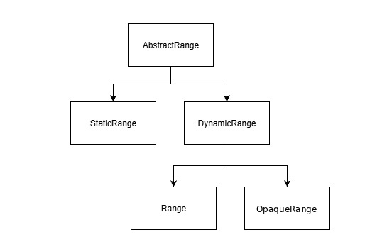

# OpaqueRange

## Authors:

- [Andres Regalado Rosas](t-andresre@microsoft.com)
- [Ana Sollano Kim](https://github.com/anaskim)
- [Stephanie Zhang](https://github.com/stephanieyzhang)

## Participate

- [WHATWG tracking issue](https://github.com/whatwg/html/issues/11478)
- [CSSWG issue tracking initial discussions](https://github.com/w3c/csswg-drafts/issues/10346)
- [TPAC 2025 WHATWG Meeting Minutes](https://www.w3.org/2025/11/11-whatwg-minutes.html)
- [TPAC 2024 WHATWG meeting minutes on initial proposal](https://github.com/whatwg/meta/issues/326#issuecomment-2377500295)
- [Issue tracker](https://github.com/MicrosoftEdge/MSEdgeExplainers/labels/OpaqueRange)

## Introduction

The current `Range` interface methods do not support retrieving or creating ranges that represent the `value` (rather than the element itself) of `<textarea>` and `<input>` elements. As a result, if web developers want to use the `getBoundingClientRect()` method in a `<textarea>` or `<input>` element to position a popup beneath the user's current caret for delivering contextual autocomplete suggestions or marking syntax errors as users type using the [Custom Highlight API](https://developer.mozilla.org/en-US/docs/Web/API/CSS_Custom_Highlight_API), they must find workarounds. These workarounds often involve cloning these elements and their styles into `<div>`s, which is both difficult to maintain and may impact the web application's performance.

This proposal aims to address these issues by introducing `OpaqueRange`, a new `AbstractRange` subclass that references spans of encapsulated content within elements whose internal structures are not exposed to authors, like `<textarea>` and `<input>`. `OpaqueRange` has real start and end containers internally, but the `startContainer` and `endContainer` getters return `null`, ensuring that the internal DOM structure is never exposed. Authors interact with the range only through offsets into the element's value.

## User-Facing Problem

1. Place a popup near the caret when the user presses a certain key, as shown in the following GIF.


2. Mark syntax errors using the [Custom Highlight API](https://developer.mozilla.org/en-US/docs/Web/API/CSS_Custom_Highlight_API) as shown in the following image.


Today, web developers have two options to implement these use cases:

### Option 1: Cloning the form control element and copying styles into a `<div>`

If web authors already use a `<textarea>` and/or an `<input>` element in their applications, they might:
1. Clone the elements as `<div>`s,
2. Copy layout-affecting styles
3. Use `<div>` to get a `Range` and:
    - For use case 1: call `getBoundingClientRect()`.
    - For use case 2: create a Highlight object and use `CSS.highlights.set('syntax-highlight')`.

In practice, this approach is hard to get fully correct. Authors report issues keeping styles synchronized between the original control and the overlay, and can see noticeable visual lag during scrolling or layout changes where the overlay falls behind the underlying field. This class of problems has also come up in [CSSWG discussions](https://github.com/w3c/csswg-drafts/issues/8982) about adding APIs to observe computed style changes.

This is roughly the sample code from the aforementioned use cases, some functionality is omitted for brevity:

```html
<form id="messageForm" onsubmit="return handleSubmit(event)">
    <textarea id="messageArea" name="message" required placeholder="Type your message here. Use @ to mention users."></textarea>
    <div id="userList"></div>
    <div id="measuringDiv"></div>
    <button type="submit">Submit</button>
</form>
<style>
    ::highlight(syntax-highlight) {
        background-color: rgba(255, 0, 0, 0.3);
        border-radius: 2px;
    }
</style>
```

Cloning the `<textarea>` and copying relevant styles from `<textarea>` to measuring `<div>` and getting the coordinates to position the popup:

```js
// Copy relevant styles from textarea to measuring div
function copyStyles() {
    const styles = window.getComputedStyle(textarea);
    const relevantStyles = [...];
    relevantStyles.forEach(style => {
        measuringDiv.style[style] = styles[style];
    });
    ensureWordWrapMatches();
}

// Use Case 1

function getCaretCoordinates() {
    const text = textarea.value;
    const caretPos = textarea.selectionStart;
    // Create a copy of the content up to the caret
    const textBeforeCaret = text.substring(0, caretPos);
    // Copy styles before measuring
    copyStyles();
    // Set content and create a range
    measuringDiv.textContent = textBeforeCaret;
    // Add a span where the caret would be
    const caretSpan = document.createElement('span');
    caretSpan.textContent = '|';
    measuringDiv.appendChild(caretSpan);
    // Position the div over the textarea to measure
    measuringDiv.style.visibility = 'hidden';
    measuringDiv.style.position = 'fixed';
    document.body.appendChild(measuringDiv);
    // Get the position of the caret span
    const caretRect = caretSpan.getBoundingClientRect();
    const textareaRect = textarea.getBoundingClientRect();
    // Clean up
    measuringDiv.textContent = '';
    // Return coordinates relative to the viewport
    return {
        left: textareaRect.left + (caretRect.left - measuringDiv.getBoundingClientRect().left),
        top: textareaRect.top + (caretRect.top - measuringDiv.getBoundingClientRect().top),
        height: caretRect.height
    };
}

// Use Case 2

function highlightSyntax(start_index, end_index) {
    const text = textarea.value;
    // Copy styles
    copyStyles();
    // Set content
    measuringDiv.textContent = text;

    // Create range
    const range = document.createRange();
    range.setStart(measuringDiv.firstChild, start_index);
    range.setEnd(measuringDiv.firstChild, end_index);

    // Add highlight
    highlight.add(range);
    
    // Apply highlight
    CSS.highlights.set('syntax-highlight', highlight);
}

textarea.addEventListener('input', (e) => {
    const selectionStart = textarea.selectionStart;
    const text = textarea.value;
    // Check if the last character typed was @ for Use Case 1
    if (text[selectionStart - 1] === '@') {
        const coords = getCaretCoordinates();
        // Position and show the user list
        userList.style.left = `${coords.left}px`;
        userList.style.top = `${coords.top + coords.height}px`;
        userList.style.display = 'block';
        populateUserList();
    } else {
        userList.style.display = 'none';
    }
    
    // Check if the last character typed was ' ' for Use Case 2
    if (text[selectionStart - 1] === ' ' ) {
        if(!dictionary.has(previousWord)){
            highlightSyntax(selectionStart, selectionStart-previousWord.length);
            previousWord = '';
        }
    }
    else {
        previousWord += text[selectionStart - 1];
    }
});


// Initial style copy
copyStyles();
// Initial word setup for highlight
var previousWord = '';
// Dictionary for syntax check
const dictionary = new Set();
// Create highlight object
const highlight = new Highlight();
// Handle window resize
window.addEventListener('resize',copyStyles);
```

### Option 2: Using `contenteditable` `<div>`

Using a `<div contenteditable>` for direct text handling can be challenging. Web authors may need to implement behaviors for form integration, cross-browser consistency, and accessibility to match `<textarea>` and `<input>` elements.

This is roughly the sample code from the example above, some functionality is omitted for brevity:

```html
<form id="messageForm" onsubmit="return validateAndSubmit(event)">
    <!-- Hidden input for form validation -->
    <input type="hidden" id="hiddenContent" name="message" required>
    <div contenteditable="true" id="nameField">Type your message here. Use @ to mention users.</div>
    <div id="userList"></div>
    <button type="submit">Submit</button>
</form>
```

Event listener of `contenteditable` `<div>`:

```js
nameField.addEventListener('input', (e) => {
    const selection = document.getSelection();
    const text = nameField.textContent;
    const position = selection.getRangeAt(0).startOffset;
    // Check if the last character typed was @ for Use Case 1
    if (text[position - 1] === '@') {
        const range = selection.getRangeAt(0);
        const rect = range.getBoundingClientRect();
        // Position and show the user list
        userList.style.left = `${rect.left}px`;
        userList.style.top = `${rect.bottom + 5}px`;
        userList.style.display = 'block';
        populateUserList();
    } else {
        userList.style.display = 'none';
    }
    
    // Check if the last character typed was ' ' for Use Case 2
    if (text[position - 1] === ' ' ) {
        if(!dictionary.has(previousWord)){
            // Create Range
            const range = document.createRange()
            range.setStart(nameField.firstChild, position);
            range.setEnd(nameField.firstChild, position-previousWord.length);
            previousWord = '';
            // Add highlight
            highlight.add(range);
            // Apply highlight
            CSS.highlights.set('syntax-highlight', highlight);
        }
    }
    else {
        previousWord += text[position - 1];
    }
    // Update hidden input for form validation
    updateHiddenInput();
});
```


### Goal

Provide a way for web developers to obtain ranges over the value of `<textarea>` and `<input>` elements, enabling operations like `getBoundingClientRect()` and setting custom highlights, without exposing the elements' internal DOM structure.

### Non-goals

- Modifying the existing Range API to accommodate the creation of ranges inside `<textarea>` and `<input>` contents.
- Modifying existing functions in the Range API and Highlight API. 
- Modify the behavior of `getSelection()` or `getRangeAt()` methods from the Selection API to allow retrieval of `<textarea>` or `<input>` ranges.

## Proposed Approach

The `OpaqueRange` interface extends `AbstractRange` and provides a controlled way to reference encapsulated content within elements whose internal structures are not exposed to authors (such as the text value of `<textarea>`, text supporting `<input>`, or [content within custom elements in the future](#extending-to-custom-elements)). `OpaqueRange` instances are created and updated internally — web authors obtain them through APIs such as `createValueRange()` on text controls.

Unlike `StaticRange`, `OpaqueRange` is **live** — it tracks changes to the underlying content and automatically updates its start and end offsets, similar to how a regular `Range` tracks DOM mutations. This ensures that operations like `getBoundingClientRect()` or `getClientRects()` always reflect the current content, even after edits. See the [Supports Opaque Ranges](#supports-opaque-ranges) section for how the update behavior is defined.

`OpaqueRange` aligns conceptually with the `InputRange()` from [Keith Cirkel's Richer Text Fields proposal](https://open-ui.org/components/richer-text-fields.explainer/), which also proposed adding a new range subclass for `<input>` and `<textarea>` elements. `OpaqueRange` differs in that it extends `AbstractRange` (not `Range`) and is designed as a general-purpose, extensible API not limited to form controls.

### Properties and Methods

#### Properties
`OpaqueRange` objects cannot be constructed directly; they are created internally by elements that [support opaque ranges](#supports-opaque-ranges). In HTML, they are obtained via `createValueRange()`.

`OpaqueRange` exposes useful endpoint information while maintaining encapsulation:
- `startOffset` and `endOffset`: Non negative integers that index into the element's relevant value (for example, the value of a `<textarea>` in HTML), using the same UTF-16 code unit indices as `selectionStart`/`selectionEnd`. These offsets are updated automatically as the content changes.
- `collapsed`: Returns whether `startOffset` equals `endOffset`.
- `startContainer` and `endContainer`: Return `null`, ensuring the element's internal structure is never exposed to authors.

#### Available Methods
- `getClientRects()`: Returns a list of rectangles for the rendered portion of the range.
- `getBoundingClientRect()`: Returns a single rectangle that is the union of the rectangles from `getClientRects()`.

#### Unavailable Methods
The following methods are not available on `OpaqueRange` in order to avoid exposing or mutating inner browser implementation details:
- `setStart()`, `setEnd()`
- `setStartBefore()`, `setStartAfter()`, `setEndBefore()`, `setEndAfter()`
- `selectNode()`, `selectNodeContents()`
- `surroundContents()`
- `extractContents()`
- `deleteContents()`
- `insertNode()`
- `cloneContents()`
- `cloneRange()`

`OpaqueRange` does not expose the underlying text directly (e.g. it does not provide a `toString()` method). Access to the text is only available through existing APIs (e.g. `element.value`).

Additional methods can be later introduced progressively based on developer feedback and how `OpaqueRange` is used.

`OpaqueRange` is a separate type from `Range`, but it extends `AbstractRange` and can therefore be passed to any API that accepts `AbstractRange`, such as the [Custom Highlight API](https://developer.mozilla.org/en-US/docs/Web/API/CSS_Custom_Highlight_API).

The following sample code showcases how the new `OpaqueRange` interface would solve the main use cases laid out in the [User-Facing Problem](#user-facing-problem) section.

```html
<form id="messageForm" onsubmit="return handleSubmit(event)">
    <textarea id="messageArea" name="message" required placeholder="Type your message here. Use @ to mention users."></textarea>
    <div id="userList"></div>
    <button type="submit">Submit</button>
</form>
```

Event listener for `<textarea>`:

```js
textarea.addEventListener('input', (e) => {
    const selectionStart = textarea.selectionStart;
    const text = textarea.value;
    // Check if the last character typed was @ for Use Case 1
    if (text[selectionStart - 1] === '@') {
        // Obtain an OpaqueRange (e.g. via createValueRange())
        const range = textarea.createValueRange(selectionStart, selectionStart);
        // Use the range to obtain the bounding client rect
        const rect = range.getBoundingClientRect();
        // Position and show the user list
        userList.style.left = `${rect.left}px`;
        userList.style.top = `${rect.bottom}px`;
        userList.style.display = 'block';
        populateUserList();
    } else {
        userList.style.display = 'none';
    }
    // Check if the last character typed was " " for Use Case 2
    if (text[selectionStart - 1] === ' ') {
        if(!dictionary.has(previousWord)){
            // Obtain an OpaqueRange (e.g. via createValueRange())
            const range = textarea.createValueRange(selectionStart-previousWord.length, selectionStart);
            // Add highlight
            highlight.add(range);
            // Apply highlight
            CSS.highlights.set('syntax-highlight', highlight);
            previousWord = '';
        }
    }
    else {
        previousWord += text[selectionStart - 1];
    }
});
```

This implementation simplifies obtaining the caret's position inside `<input>` and `<textarea>` elements. It also allows web developers to use the Highlight API directly on those elements. The `OpaqueRange` interface eliminates the need for cloning elements and copying styles, improving performance while maintaining the benefits of using native form controls, such as accessibility, built-in form validation, and consistent behavior across browsers.

The `createValueRange(start, end)` method is defined on elements that [support opaque ranges](#supports-opaque-ranges). It uses the same UTF-16 code unit offset units as `selectionStart`/`selectionEnd`.

`createValueRange()` has the following behavior:
1. If the element is an `<input>` and `createValueRange()` does not apply to it (per the input type applicability table), throw a `"NotSupportedError"` `DOMException`.
2. Let _length_ be the length of the element's relevant value.
3. If _start_ is greater than _length_, throw an `"IndexSizeError"` `DOMException`.
4. If _end_ is greater than _length_, throw an `"IndexSizeError"` `DOMException`.
5. If _start_ is greater than _end_, set _end_ to _start_ (collapse the range to _start_).
6. Create a new `OpaqueRange` with start container and end container set to the element's **opaque range internal container**, start offset _start_, and end offset _end_.
7. Append the range to the element's **set of associated OpaqueRanges**.
8. Return the range.

Sample code for `<input type="text">`:

```html
<input type="text" id="messageInput" placeholder="Type a message..." />
<div id="emojiPicker"></div>
```

Event listener for `<input>`:

```js
input.addEventListener('input', (e) => {
    const selectionStart = input.selectionStart;
    const text = input.value;
    
    // Show emoji picker when user types ':' for Use Case 1
    if (text[selectionStart - 1] === ':') {
        // Obtain an OpaqueRange (e.g. via createValueRange())
        const range = input.createValueRange(selectionStart, selectionStart);
        // Use the range to obtain the bounding client rect
        const rect = range.getBoundingClientRect();
        // Position the emoji picker under the caret
        emojiPicker.style.position = 'fixed';
        emojiPicker.style.left = `${rect.left}px`;
        emojiPicker.style.top = `${rect.bottom}px`;
        emojiPicker.style.display = 'block';
    } else {
        emojiPicker.style.display = 'none';
    }
    // Check if the last character typed was " " for Use Case 2
    if (text[selectionStart - 1] === ' ') {
        if(!dictionary.has(previousWord)){
            // Obtain an OpaqueRange (e.g. via createValueRange())
            const range = input.createValueRange(selectionStart-previousWord.length, selectionStart);
            // Add highlight
            highlight.add(range);
            // Apply highlight
            CSS.highlights.set('syntax-highlight', highlight);
            previousWord = '';
        }
    }
    else {
        previousWord += text[selectionStart - 1];
    }
});
```

### Supports Opaque Ranges

Initially, the following HTML elements would support opaque ranges:
- `<textarea>`
- `<input>` with type: `text`, `search`, `tel`, `url`, or `password`

Each element that supports opaque ranges has:
- An **opaque range internal container** — an implementation-defined representation of the element's relevant value text.
- A **set of associated OpaqueRanges** — a set of `OpaqueRange` objects, initially empty.

When an element is removed from the document or an `<input>` element's type changes from a type that supports OpaqueRange to a type that doesn't, all associated OpaqueRanges have their `startOffset` and `endOffset` set to 0 and the element's set of associated OpaqueRanges is cleared.

When the underlying content changes, the browser automatically adjusts the offsets of all associated OpaqueRanges. For incremental edits (such as user typing or `setRangeText()`), offsets shift to reflect inserted or deleted characters. For wholesale value changes (such as setting the `value` property or changing the `type` attribute), offsets are reset.

## Live Range Example

The example below demonstrates how `OpaqueRange` updates in real time as the text content of the control changes, without requiring manual offset adjustments.

### Highlight Follows Word Through Edits
```js
<textarea id="messageArea">hello world</textarea>
const textarea = document.querySelector("#messageArea");

// Create a live range covering "hello".
const range = textarea.createValueRange(0, 5);

// Bind a highlight to that live range.
const highlight = new Highlight(range);
CSS.highlights.set("tracked-word", highlight);

// No input-handler needed: as the control’s value changes, the range stays in sync and the highlight repaints automatically.
```
If text is inserted before `"hello"`, the highlight automatically shifts so it still covers the same word.

## Alternatives considered

Apart from the solutions described in the [User-Facing Problem](#user-facing-problem) section, we have also considered the following alternatives:

### getSelectionBoundingClientRect()

As one of the main use cases, the original proposal involved obtaining the bounds of a selection within a `<textarea>` or `<div>` element through a new API, `getSelectionBoundingClientRect()`. This new API would mimic the behavior of `document.getSelection().getRangeAt(0).getBoundingClientRect();`
which can be currently used to obtain a DOMRect object representing the selection bounds within a `<div>` element. A sample code for an autocomplete menu positioning using this original approach could look as follows:

```javascript
// Get current selection range in a form control
const input = document.querySelector('input[type="text"]');
const rect = input.getSelectionBoundingClientRect();
// Position autocomplete menu using rect coordinates
showAutocomplete(rect.left, rect.bottom);
```

This alternative has the following disadvantages:

1. **Redundancy**
    - `getSelectionBoundingClientRect()` overlaps with `getSelection().getRangeAt(0).getBoundingClientRect()` for every element other than `<textarea>` and `<input>`.

2. **Too specific**
    - This proposal is not compatible with the Highlight API, or any other Range API method, such as `Range.getClientRects()`.
    - It does not allow for obtaining the bounding rectangle of any text range other than the one currently selected.
    - While this proposal addresses a specific issue with the Range API's interaction with `<textarea>` and `<input>` (namely, `getBoundingClientRect()`), a more general solution—like `OpaqueRange`—could resolve this and other related problems more broadly.
    
### getRangeFromValue()

The following proposal considered adding a `getRangeFromValue()` method directly to `<textarea>` and `<input>` elements that would return a regular `Range` object. However, this approach held concerns regarding how using certain Range API methods (namely, those mentioned in the [Proposed Approach](#proposed-approach) section) with text control elements would result in the exposure of inner browser implementation details through Range attributes like `startContainer` and `endContainer`, creating encapsulation concerns.

```javascript
// getRangeFromValue() sample usage
const range = textarea.getRangeFromValue(startOffset, endOffset);
// This would expose hidden <textarea> nodes
console.log(range.startContainer);
```

### Extending the Range API (1st Approach)

Another considered approach was extending the Range API by allowing `setStart()` and `setEnd()` to work when a Range's boundary points are within a form control.

```javascript
Range.setStart(formControl: HTMLInputElement | HTMLTextAreaElement, offset: number)
Range.setEnd(formControl: HTMLInputElement | HTMLTextAreaElement, offset: number)
```

Using this approach, a sample code for an autocomplete menu positioning could look as follows:

```javascript
// Get current selection range in a form control
const input = document.querySelector('input[type="text"]');
const range = document.createRange();
range.setStart(input, input.selectionStart);
range.setEnd(input, input.selectionEnd);
const rect = range.getBoundingClientRect();
// Position autocomplete menu using rect coordinates
showAutocomplete(rect.left, rect.bottom);
```

While this approach would help solve the two main use cases stated above, `OpaqueRange` was chosen instead because making changes or updating the behavior of `setStart()` and `setEnd()` in the Range API could cause issues for websites that rely on the current specified behavior. Additional changes would also be required to certain accessor methods in order to avoid exposing inner implementation details, as mentioned in the [getRangeFromValue()](#getrangefromvalue).

### Extending the Range API (2nd Approach)

As previously noted, the first approach regarding the extension of the Range API posed backward compatibility risks due to changes in the behavior of `setStart()` and `setEnd()`. It also raised interoperability concerns regarding breaking the encapsulation of the implementation-defined structures of `<textarea>` and `<input>`. The second approach avoids one of these issues by **not modifying** `setStart()` and `setEnd()`. Instead, it introduces a new method specifically for setting ranges within `<textarea>` and `<input>` elements:

```javascript
// Existing behavior remains unchanged
const range = new Range();
range.setStart(startNode, startOffset);
range.setEnd(endNode, endOffset);

// New method for form controls
const opaqueRange = new Range();
opaqueRange.setOpaqueRange(textarea, startOffset, endOffset);
```
This `setOpaqueRange()` method would set a new flag `IsFormControl()` in the Range interface, that would be then used to regulate which attributes and methods the Range object can access. Continuing the previous example:

```javascript
range.startContainer        // Returns startNode
opaqueRange.startContainer    // Returns the host <textarea>/<input> element
```

This approach addresses encapsulation concerns for ranges in form controls. It also offers better compatibility than the `OpaqueRange` interface, since it remains a `Range` and is compatible at the type level with APIs that involve `Range` (not only `AbstractRange`) objects, such as the Selection API. However, Selection behavior for value-space ranges is not defined today and would require additional spec work.

```javascript
// Using this approach
selection.addRange(opaqueRange)     // Type-checks; actual behavior would need explicit spec rules

// Using OpaqueRange interface
selection.addRange(opaqueRange2)    // Throws exception: "parameter 1 is not of type Range."
```

Ultimately, the `OpaqueRange` interface was chosen instead. While the `setOpaqueRange()` approach offered better type-level compatibility, it did not provide an explicit distinction between regular and form control ranges—both would be of type `Range`, potentially confusing web authors about why some methods may or may not be available depending on how the `Range` was set (using `setStart()` and `setEnd()` or `setOpaqueRange()`).

### FormControlRange (DOM-level alternative)

As a later iteration of this work, we explored an interface named `FormControlRange`, a specialized `AbstractRange` subclass for `<textarea>` and text-supporting `<input>` elements. It provided start and end offsets into the element’s value string and supported layout methods (such as `getBoundingClientRect()`), demonstrating that value-space ranges could address the core use cases.

However, this design had two limitations:

1. **Scoped only to form controls**  
   The interface was built directly around behaviors specific to `<textarea>` and text-supporting `<input>` types. This made it difficult to apply the same model to other hosts—such as custom elements—that may also want to expose encapsulated text surfaces.

2. **Limited extensibility**  
   Because the design encoded form-control-specific concepts into the API surface, extending it to additional environments would have required redefining or duplicating similar ideas elsewhere.

`OpaqueRange` resolves these issues by providing an extensible abstraction. The HTML standard defines which elements [support opaque ranges](#supports-opaque-ranges), creates or updates `OpaqueRange` instances accordingly, and specifies the internal container nodes used — without the interface being tied to form controls or their internal mechanisms.

## Other Considerations

### Privacy

- There are no anticipated privacy concerns.

### Security

- There are no anticipated security concerns.

### Compatibility

The `OpaqueRange` interface is currently compatible with any API that utilizes `AbstractRange` objects, such as the [Custom Highlight API](https://developer.mozilla.org/en-US/docs/Web/API/CSS_Custom_Highlight_API). However, this means that `OpaqueRange` is not compatible with methods and APIs that expect a regular `Range`.

## Potential Future Work
### DynamicRange
To address the compatibility limition above, one proposed solution is to introduce a new interface called `DynamicRange`. This interface would serve as the counterpart to `StaticRange` and would also extend `AbstractRange`.

A `DynamicRange` object would not have a direct use in JavaScript beyond serving as a parent class for `Range` and `OpaqueRange`. However, common methods such as `getBoundingClientRect()` and `getClientRects()`—which are implemented in both `Range` and `OpaqueRange`—could be moved into `DynamicRange` to reduce redundancy.

This change would enable APIs like the Selection API to support `OpaqueRange` simply by updating parameter types from `Range* new_range` to `DynamicRange* new_range`. Importantly, this would not introduce any backward compatibility issues: existing methods that expect a `Range` and are not intended to support `OpaqueRange` would continue to function just as before.

The resulting `AbstractRange` inheritance structure would look like this:



### Extending to Custom Elements
It has been [discussed](https://github.com/whatwg/html/issues/11478#issuecomment-3113360213) (see also [TPAC 2025 minutes](https://www.w3.org/2025/11/11-whatwg-minutes.html)) that custom elements and other standards could also use this API to expose encapsulated ranges, enabling richer editing or selection behaviors while maintaining internal structure.

### Relationship to CSS Anchor Positioning
As noted in the [W3C TAG early design review](https://github.com/w3ctag/design-reviews/issues/1142), some of the positioning use cases addressed by `OpaqueRange` (such as anchoring popups or highlights to caret positions) could also be explored declaratively through future extensions to [CSS Anchor Positioning](https://drafts.csswg.org/css-anchor-position/).

While `OpaqueRange` focuses on providing a programmatic mechanism aligned with existing Range APIs, a complementary declarative model in CSS could offer improved performance, reduced scripting overhead, and more consistent accessibility behavior.

## References & acknowledgements

Many thanks for valuable feedback and advice from:

- [Anne van Kesteren](https://github.com/annevk)
- [Daniel Clark](https://github.com/dandclark)
- [Ian Sanders](https://github.com/iansan5653)
- [Keith Cirkel](https://github.com/keithamus)
- [Leo Lee](https://github.com/leotlee)
- [Mike Jackson](https://github.com/mwjacksonmsft)
- [Sanket Joshi](https://github.com/sanketj)
- [Siye Liu](https://github.com/siliu1)

### Related Work

- [Richer Text Fields proposal](https://open-ui.org/components/richer-text-fields.explainer/) by Keith Cirkel, which takes a broader approach to enabling richer interactions in form controls but shares the goal of supporting dynamic text interaction.
