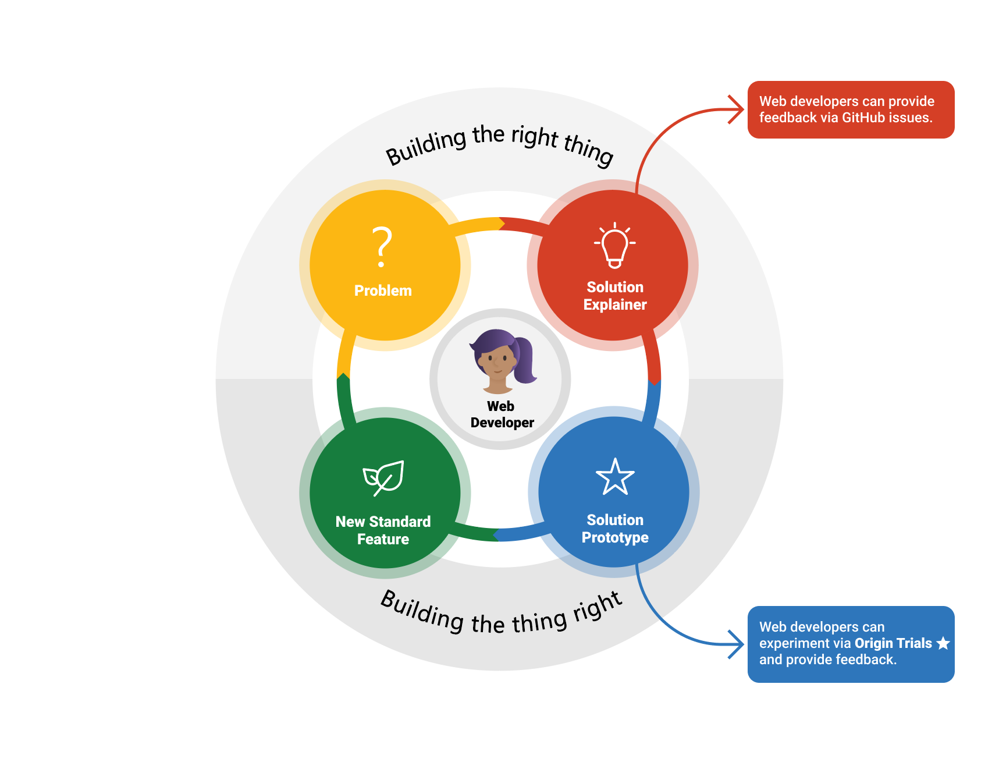

# Microsoft Edge Origin Trials Guide

Author: Zouhir Chahoud

The Origin Trials framework is a great way for Web developers to connect with browser engineers and the Web standards community, it enables Web developers to experiment in new web platform capabilities and offers a medium where they can continuously provide feedback on various APIs shape, usability and effectiveness after experimenting with them for a limited period of time in real production sites.



Once you have registered your website for an experiment, you will be able to use the experimental API without requiring your beta testers to turn a feature flag in [edge://flags](about://flags).

# Getting Started
## Browse Available Experiments

You can visit the [Edge Origin Trials Developer Console](https://developer.microsoft.com/en-us/microsoft-edge/origin-trials) to see a list of the experimental APIs Edge browser engineers are offering and would like to you try and give them feedback on.

## Register for an Experiment
Our framework is consistent with [Chrome Origin Trials](https://developers.chrome.com/origintrials/#/trials/active), simply click the `register` button for any of the available experiments in our Origin Trials Developer console, provide your website's origin, and we will instantly generate a token once you agree to our terms and conditions and submit the form.

There are 2 ways to use the tokens provide in your page:

#### Option 1: Using a `<meta>` Tag
Add an origin-trial <meta> tag to the head of any page, example:

```html
<meta http-equiv="origin-trial" content="your-token-gues-here">
```

#### Option 2: Using a HTTP Header
Another option is to add `Origin-Trial` to your HTTP server response headers, example:

```json
Origin-Trial: your-token-goes-here
```

# Web Developer Guidelines

## Allowed Origins

The Edge Origin Trials portal today **only supports SSL Enabled Origins**, websites wanting to register for an experiment must have `HTTPS` properly implemented. However, in future portal releases we are looking to enable more secure origins such as:

- Localhost: it's going to be possible to register `http://localhost` in experiments, today developer can *enable* the appropriate feature flag in [edge://flags](about://flags).
- Extensions: it's going to be possible for `extensions://` prefixed origins to enroll in experiments.

## Subdomains, URL Paths and Query Params

It is possible to only enroll a specific subdomain such as `https://dev.example.com` or an origin with wild-card match to all it's subdomains by answering *Yes* to the "Do you need to match all subdomains for the provided origin?" question in the [Microsoft Edge Origin Trials Developer Console](https://developer.microsoft.com/en-us/microsoft-edge/origin-trials). However, the following scenarios are **not** possible:

- `https://example.com/path/new-feature`
- `https://example.com/path/new-feature?test_id=12345`

## Registered Trial Duration

Once you have registered for a trial, your token will be valid for **6 weeks**, which this is the standard duration for a trial cycle, and the end of each cycle, you are eligible to renew after providing your feedback on the API you are experimenting with.

We will send out emails reminding you to provide feedback and renew before your token expires.

## Experiment duration

The duration of an experiment is usually longer than 6 weeks, the standard duration for a trial cycle. When browsing available experiments you will be able to see which versions of Edge the experiment will be available for as well as the estimated end date.

NOTE ⚠️: a browser feature team may decide to early-end an experiment in case of any major security incidents caused by the feature, or they have collected enough feedback and concluded the currently proposed API does not meet the web developer needs, and a major redesign need to happen. We will be sending out emails to all developers enrolled in an experiment in the case of early-end.

## Opting out of an experiment

To opt out of an experiment, you can simply remove the token we have provided from your page's HEAD `meta` tag or server's response HTTP header.   

## Experimental feature implementation best practices

MDN has a great resource on best practices for feature detection, you can [view it here](https://developer.mozilla.org/en-US/docs/Learn/Tools_and_testing/Cross_browser_testing/Feature_detection). In summary, it is important to always provide a working experience if the feature your website is using does not exist in the browser your visitor is running, this is extremely applicable when relying on an experimental feature using a token that needs to be renewed every 6 weeks.