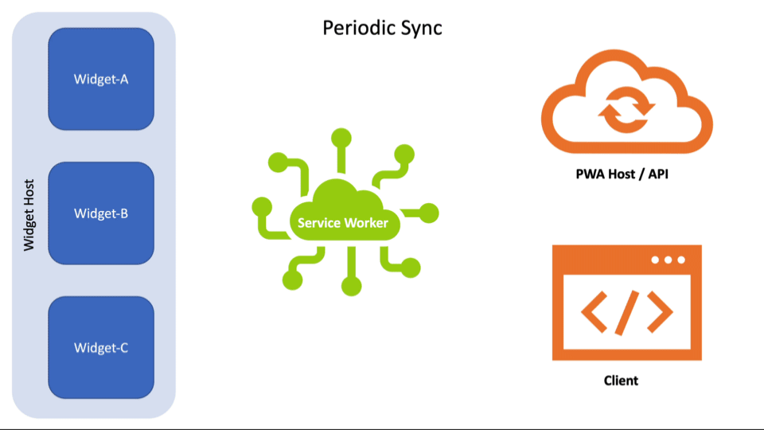
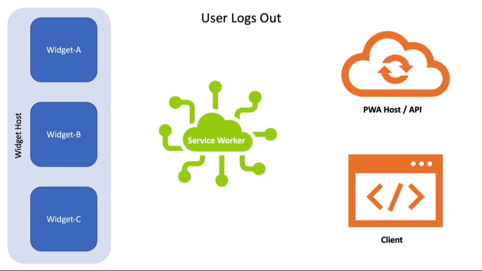
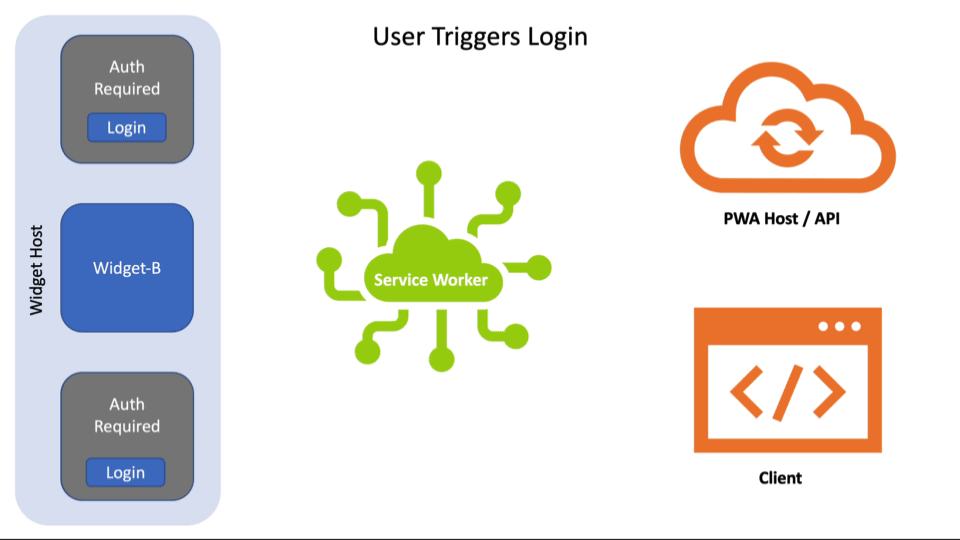

# PWA-driven Widgets Explainer

Consider all sections required unless otherwise noted.

Author: [Aaron Gustafson](https://github.com/aarongustafson)

## Status of this Document

This document is a starting point for engaging the community and standards bodies in developing collaborative solutions fit for standardization. As the solutions to problems described in this document progress along the standards-track, we will retain this document as an archive and use this section to keep the community up-to-date with the most current standards venue and content location of future work and discussions.

* This document status: **Active**
* Expected venue: [W3C Web Incubator Community Group](https://wicg.io/)
* **Current version: this document**

## Introduction

Native applications can expose information and/or focused tasks within operating systems using widgets. Examples of this include Android Home Screen Widgets, macOS Dashboard and Today Panel Widgets, the Apple Touch Bar, Samsung Daily Cards, Mini App Widgets, smart watch app companions, and so on. When building Progressive Web Apps, it would useful to be able to project aspects of the web app onto these surfaces.

## Goals

* Enable developers to build lightweight, template-driven PWA-driven Widgets.
* Enable developers to configure widgets using the Web App Manifest.
* Enable developers to update widgets from their Service Worker.
* Enable developers to respond to user interaction within their widgets from within their Service Worker.
* Enable support for multiple widget hosts within a host operating system.
* Enable users to have multiple instances of a given widget (optionally, with distinct settings values).

## Non-goals

* Enable developers to designate a web page to act as a Widget (see [Rich Widgets in my original proposal](https://github.com/aarongustafson/pwa-widgets#Rich-Widgets)).

## Use Cases

* A streaming video service could offer access to all of the shows or movies you have in your queue that is distinct from the actual player. It might live in a widget on one device, but, with access to all of the plumbing of the PWA itself, could enable users to control the services’ PWA running on the user’s smart TV.
* A stock tracking app could offer a widget for viewing current stock prices for stocks you are watching.
* A calendar service could provide a daily agenda at a glance.

## Definitions

### Nouns

<dl>
<dt id="dfn-widget">Widget</dt><dd>

A discrete user experience that represents a part of a website or app’s functionality. Refers to the prototypical definition of an experience (e.g., follow an account), *not* the <a href="#dfn-widget-instance">individual representations of this widget</a> (e.g., follow bob) that exist in a [Widget Host](#dfn-widget-host).
  
</dd>
<dt id="dfn-widget-host">Widget Host</dt><dd>
  
A container that manages and renders widgets.
  
</dd>
<dt id="dfn-widget-instance">Widget Instance</dt><dd>
  
The interactive experience of a [Widget](#dfn-widget) within a [Widget Host](#dfn-widget-host). Multiple instances of a [Widget](#dfn-widget) may exist within a [Widget Host](#dfn-widget-host). These distinct instances may have associated [settings](#dfn-widget-settings).
  
</dd>
<dt id="dfn-widget-settings">Widget Settings</dt><dd>
  
Configuration options, defined on a [Widget](#dfn-widget) and unique to a [Widget Instance](#dfn-widget-instance), that enable that instance to be customized.
  
</dd>
<dt id="dfn-widget-provider">Widget Provider</dt><dd>

An application that exposes Widgets. A browser would likely be the Widget Provider on behalf of its PWAs and would act as the proxy between those PWAs and any <a href="#dfn-widget-service">Widget Service</a>.

</dd>
<dt id="dfn-widget-registry">Widget Registry</dt><dd>

The list of <a href="#dfn-install">installable</a> <a href="#dfn-widget">Widgets</a> [registered](#dfn-register) by [Widget Providers](#dfn-widget-provider).
</dd>
<dt id="dfn-widget-service">Widget Service</dt><dd>
  
Manages communications between [Widget Hosts](#dfn-widget-host) and [Widget Providers](#dfn-widget-provider).  
</dd>
</dl>

### Verbs

<dl>
<dt id="dfn-install">Install<br> (a.k.a., Instantiate)</dt><dd>

Create a [Widget Instance](#dfn-widget-instance).

</dd>
<dt id="dfn-register">Register</dt><dd>

Add a [Widget](#dfn-widget) to the [Widget Registry](#dfn-widget-registry).

</dd>
<dt id="dfn-uninstall">Uninstall</dt><dd>

Destroy a [Widget Instance](#dfn-widget-instance).

</dd>
<dt id="dfn-unregister">Unregister</dt><dd>

Remove a [Widget](#dfn-widget) from the [Widget Registry](#dfn-widget-registry).

</dd>
<dt id="dfn-unregister">Update</dt><dd>

Push new data to a [Widget Instance](#dfn-widget-instance).

</dd>
</dl>

## Templated Widgets

In order to provide a lightweight experience, this proposal suggests that Widgets be template-driven, similar to [Notifications](https://notifications.spec.whatwg.org/#lifetime-and-ui-integrations). Templated widgets may be more limited in their customization through use of the PWA’s `icons`, `theme_color`, and `background_color` or they may be customizable through use of a templating language (such as Adaptive Cards). A [Widget Host](#dfn-widget-host) should provide a set of common templates — such as an agenda, calendar, mailbox, task list — but its complete list of available templates will likely vary. This proposal suggests [this list of widgets template types](#Suggested-template-types) as a reasonable starting point.

### Suggested template types

For social and productivity apps:

* calendar-agenda
* calendar-day
* calendar-week
* calendar-month

For address books, directories, and social apps:

* contacts-list
* contacts-item

For general purposes (e.g., news, promotions, media, social):

* content-carousel
* content-feed
* content-item

For productivity apps:

* email-list
* task-item
* task-list

For auth-requiring Widgets:

* login-prompt

[A selection of template samples](./template-samples/README.md), composed using Adaptive Cards, accompany this Explainer.

### Data flow

Widgets support user interaction through one or more [developer-defined `WidgetAction` objects](#Defining-a-WidgetAction), which are analogous to a [`NotificationAction`](https://notifications.spec.whatwg.org/#dictdef-notificationaction).

Data flow in a Templated Widget is largely managed in two ways:

1. Data flows from the Service Worker to a Widget instance as part of the [`widgets.updateInstance()`](#widgetsupdateinstance) and [`widgets.updateByTag()`](#widgetsupdatebytag) methods.
2. Data (in the form of interaction) flows from a Widget to the associated PWA’s Service Worker via a [`WidgetEvent`](#widget-related-events).

Here is an example of how this might look in the context of a Periodic Sync:

<figure id="periodic-sync">



</figure>

This video shows the following steps:

1. As part of a Periodic Sync, the Service Worker makes a `Request` to the host or some other endpoint.
2. The `Response` comes back.
3. As the Service Worker is aware of which widgets rely on that data, via the `WidgetDefinition` provided during [install](#dfn-install), the Service Worker can identify which widgets need updating. (This is internal logic and not shown in the video).
3. The Service Worker takes that data — perhaps packaging it with other instructions — and uses [`widgets.updateInstance()`](#widgetsupdateinstance) (or [`widgets.updateByTag()`](#widgetsupdatebytag)) to update the specific widgets that make use of that data.

To show a more complicated example, consider what should happen if certain Widgets depend on authentication and the user happens to log out in the PWA or a browser tab. The developers would need to track this and ensure the Service Worker is notified so it can replace any auth-requiring Widgets with a prompt back into the app to log in.

Here’s how that might work:

<figure id="user-logout">



</figure>

This video shows:

1. The user logging out from the context of a `Client`. When that happens, the `Client`, sends a `postMessage()` to the Service Worker, alerting it to the state change in the app.
2. The Service Worker maintains a list of active Widgets and is aware of which ones require authentication (informed by the `auth` property of the [`WidgetDefinition`](#defining-a-widget)). Knowing auth has been revoked, the Service Worker pushes a new template to each auth-requiring Widget with a notice and a button to prompt the user to log in again.

The next step in this flow is for the user to log back in. They could do that directly in the Client, but let’s use the `WidgetAction` provided in the previous step:

<figure id="user-login">



</figure>

This video shows:

1. The user clicking the "Login" action in the Widget. This triggers a [`WidgetEvent`](#widget-related-events) named "login".
2. The Service Worker is listening for that action and redirects the user to the login page of the app, either within an existing `Client` (or in a new `Client` if one is not open).
3. The user logs in and the app sends a `postMessage()` to the Service Worker letting it know the user is authenticated again.
4. The Service Worker grabs new data for its auth-related widgets from the network.
5. The Service Worker pipes that data back into the auth-requiring Widgets using [`widgets.updateInstance()`](#widgetsupdateinstance) (or [`widgets.updateByTag()`](#widgetsupdatebytag)).

You can see more examples in [the `WidgetEvent` section](#Widget-related-Events).

## Defining a Widget

One or more Widgets are defined within the `widgets` member of a Web App Manifest. The `widgets` member would be an array of `WidgetDefinition` objects.

### Sample `WidgetDefinition` Object

```json
{
  "name": "Agenda",
  "tag": "agenda",
  "template": "agenda",
  "data": "/widgets/data/agenda.ical",
  "type": "text/calendar",
  "auth": true,
  "update": 900,
  "actions": [ ],
  "settings": [ ],
  "icons": [ ],
  "screenshots": [ ],
  "backgrounds": [ ]
}
```

### Required properties

* `name` - `DOMString`. Serves as the title of the Widget that should be presented to users.
* `tag` - `DOMString`. Serves as a way to reference the widget within the Service Worker as a `WidgetClient` and is analogous to a [Notification `tag`](https://notifications.spec.whatwg.org/#tag). `WidgetClient` still needs to be defined, but would be similar to [`WindowClient`](https://www.w3.org/TR/service-workers/#ref-for-dfn-window-client).
* `template` - the template the developer would like the [Widget Host](#dfn-widget-host) to use; if unsupported, the host may offer an analogous widget experience (determined using the `type` value) or the widget would not be offered.
* `data` - the `URL` where the data for the widget can be found; if the format is unsupported, the widget would not be offered.
* `type` - the MIME type of the data feed for the widget; if unsupported, the widget would not be offered.

### Optional business logic properties

* `auth` - Boolean. Informational. Whether or not the Widget requires auth. False if not included.
* `update` - Unsigned Integer. Informational. The frequency (in seconds) a developer wishes for the widget to be updated; for use in registering a Periodic Sync. The actual update schedule will use the Service Worker’s Periodic Sync infrastructure.
* `actions` - An array of [`WidgetAction` objects](#Defining-a-WidgetAction) that will be exposed to users (if the template supports them) within an action-supporting template and trigger an event within the origin’s Service Worker.
* `settings` - A array of [`WidgetSettingDefinition` objects](#Defining-a-WidgetSettingDefinition) that enable multiple instances of the same widget to be configured differently within a [Widget Host](#dfn-widget-host) (e.g., a weather widget that displays a single locale could be installed multiple times, targeting different cities).

### Optional Display-related properties

* `short_name` - `DOMString`. An alternative short version of the `name`.
* `icons` - an array of alternative icons to use in the context of this Widget; if undefined, the Widget icon will be the chosen icon from [the Manifest’s `icons` array](https://w3c.github.io/manifest/#icons-member).
* `backgrounds` - an array of alternative background images (as [`ImageResource` objects](https://www.w3.org/TR/image-resource/)) that could be used in the template (if the [Widget Host](#dfn-widget-host) and template support background images).

A Manifest’s [`theme_color`](https://w3c.github.io/manifest/#theme_color-member) and [`background_color`](https://w3c.github.io/manifest/#background_color-member), if defined, may also be provided alongside this data.

### Promotional properties

* `screenshots` - `Array`. Analogous to [the `screenshots` member of the Manifest](https://w3c.github.io/manifest-app-info/#screenshots-member). It is an array of [`ImageResource` objects](https://www.w3.org/TR/image-resource/#dom-imageresource) with optional [`platform`](https://w3c.github.io/manifest-app-info/#platform-member) values that can associate the screenshot with how it shows up in a specific [Widget Host](#dfn-widget-host). Developers should be sure to include a [`label`](https://w3c.github.io/manifest-app-info/#label-member) value in each [`ImageResource` object](https://www.w3.org/TR/image-resource/#dom-imageresource) for accessibility.

### Extensibility

Some widget platforms may wish to allow developers to further refine a Widget’s appearance and/or functionality within their system. We recommend that those platforms use [the extensibility of the Manifest](https://www.w3.org/TR/appmanifest/#extensibility) to allow developers to encode their widgets with this additional information, if they so choose.

For example, if using something like [Adaptive Cards](https://docs.microsoft.com/en-us/adaptive-cards/templating/) for rendering, a [Widget Host](#dfn-widget-host) might consider adding something like the following to the `WidgetDefinition`:

```json
"ms_ac-template": "/widgets/templates/agenda.ac.json",
```

This could be used to override the `template` value in scenarios where the [Widget Host](#dfn-widget-host) supports this feature.


## Defining a `WidgetAction`

A `WidgetAction` uses the same structure as a [Notification Action](https://notifications.spec.whatwg.org/#dictdef-notificationaction):

```json
{
  "action": "create-event",
  "title": "New Event",
  "icons": [ ]
}
```

The `action` and `title` properties are required. The `icons` array is optional but the icon may be used in space-limited presentations with the `title` providing its [accessible name](https://w3c.github.io/aria/#dfn-accessible-name).

When activated, a `WidgetAction` will dispatch a [`WidgetEvent`](#widget-related-events) (modeled on [`NotificationEvent`](https://notifications.spec.whatwg.org/#example-50e7c86c)) within its Service Worker. Within the Service Worker, the event will contain a payload that includes a reference to the Widget itself and the `action` value.


## Defining a `WidgetSettingDefinition`

A `WidgetSettingDefinition` defines a single field for use in a widget’s setting panel.

```json
{
  "label": "Where do you want to display weather for?",
  "name": "locale",
  "description": "Just start typing and we’ll give you some options",
  "type": "autocomplete",
  "options": "/path/to/options.json?q={{ value }}",
  "default": "Seattle, WA USA"
}
```

Breaking this down:

* `label` is the visible text shown to the end user and acts as the accessible label for the field.
* `name` is the internal variable name used for the field (and is the key that will be sent back to the PWA).
* `description` is the _optional_ accessible description for a field, used to provide additional details/context.
* `type` is the field type that should be used. Support for the following field types are recommended:
  * Basic text field types: "text" || "email" || "password" || "number"
  * One of many selection (requires `options`): "boolean" || "radio" || "select"
  * Many of many selection (requires `options`): "checkbox"
  * Temporal: "date" || "datetime"
  * Auto-complete (requires `options`): "autocomplete"
* `options` is used for specific field `type`s noted above. It can be either an array of options for the field or a URL string referencing an endpoint expected to return an array of values. If the list is dynamic (as in the case of an "autocomplete" field), the URL endpoint may be passed the current `value` of the field via the reference "{{ value }}".
* `default` is the _optional_ default value for the setting.


## Registering Available Widgets

In order for [Widget Hosts](#dfn-widget-host) to be aware of what widgets are available for install, the available widgets must be added to the [Widget Registry](#dfn-widget-registry) in some way. That registration should include the following details from the Web App Manifest and the Widget itself:

* <var>manifest["name"]</var>
* <var>manifest["short_name"]</var> (optionally)
* <var>manifest["icons"]</var>
* <var>manifest["lang"]</var>
* <var>manifest["dir"]</var>
* <var>widget["name"]</var>
* <var>widget["short_name"]</var> (optionally)
* <var>widget["icons"]</var> (optionally)
* <var>widget["screenshots"]</var> (optionally)

The steps for <b id="parsing-widgets-from-a-manifest">parsing widgets from a Web App Manifest</b> with Web App Manifest <var>manifest</var>:

1. Let <var>widgets</var> be a new list.
1. Let <var>collected_tags</var> be a new list.
1. Run the following steps in parallel:
   1. For each <var>manifest_widget</var> in <var>manifest["widgets"]</var>:
      1. If <var>manifest_widget["tag"]</var> exists in <var>collected_tags</var>, continue.
      1. Let <var>widget</var> be a new object.
      1. Set <var>widget["definition"]</var> to the value of <var>manifest_widget</var>.
      1. Set <var>widget["hasSettings"]</var> to false.
      1. Set <var>widget["instances"]</var> to an empty array.
      1. Set <var>widget["installable"]</var> to the result of [determining widget installability](#determining-installability) with <var>manifest_widget</var>, <var>manifest</var>, and Widget Host.
      1. If <var>widget["installable"]</var> is true
         1. Run the steps necessary to register <var>manifest_widget</var> with the [Widget Registry](#dfn-widget-registry), with <var>manifest</var> as necessary.
      1. Add <var>manifest_widget["tag"]</var> to collected_tags</var>.
      1. Add <var>widget</var> to <var>widgets</var>.
1. Store a copy of <var>widgets</var> for use with the Service Worker API.

The steps for <b id="determining-installability">determining install-ability</b> with `WidgetDefinition` <var>widget</var>, Web App Manifest <var>manifest</var>, and Widget Host <var>host</var> are as follows:

1. If <var>host</var> requires any of the above members and they are omitted, classify the Widget as uninstallable and exit.
1. If <var>widget["template"]</var> and <var>widget["data"]</var> are omitted, classify the Widget as uninstallable and exit.
1. If <var>widget["template"]</var> is not an acceptable template generic name according to <var>host</var>, classify the Widget as uninstallable and exit.
1. If <var>widget["type"]</var> is not an acceptable MIME type for <var>widget["data"]</var> according to <var>host</var>, classify the Widget as uninstallable and exit.
1. If <var>host</var> has additional requirements that are not met by <var>widget</var> (e.g., required `WidgetDefinition` extensions), classify the Widget as uninstallable and exit.
1. Classify the widget as installable.


## Service Worker APIs

This proposal introduces a `widgets` attribute to the [`ServiceWorkerGlobalScope`](https://www.w3.org/TR/service-workers/#serviceworkerglobalscope-interface). This attribute references the `Widgets` interface (which is analogous to `Clients`) that exposes the following Promise-based methods:

* `getByTag()` - Requires an <var>tag</var> that matches a Widget’s `tag`. Returns a Promise that resolves to a `Widget` or *undefined*.
* `getByInstance()` - Requires an instance <var>id</var> that is used to find the associated `Widget`. Returns a Promise that resolves to a `Widget` or *undefined*.
* `matchAll()` - Requires [an `options` argument](#Options-for-Matching). Returns a Promise that resolves to an array of zero or more [`Widget` objects](#the-widget-object) that match the `options` criteria.
* `updateInstance()` - Requires an instance `id` and a [<var>payload</var> Object](#the-widgetpayload-object). Returns a Promise that resolves to *undefined* or Error.
* `removeInstance()` - Requires an instance `id`. Returns a Promise that resolves to *undefined* or Error.
* `updateByTag()` - Requires an <var>tag</var> and a [<var>payload</var> Object](#the-widgetpayload-object). Returns a Promise that resolves to *undefined* or Error.
* `removeByTag()` - Requires an <var>tag</var>. Returns a Promise that resolves to *undefined* or Error.

Each Widget defined in the Web App Manifest is represented within the `Widgets` interface. [A `Widget` Object](#the-widget-object) is used to represent each defined widget and any associated [Widget Instances are exposed within that object](#the-widgetinstance-object).


### The `Widget` Object

Each Widget is represented within the `Widgets` interface as a `Widget`. Each Widget’s representation includes the original `WidgetDefinition` (as `definition`), but is mainly focused on providing details on the Widget’s current state and enables easier interaction with its [Widget Instances](#dfn-widget-instance):

```js
{
  "installable": true,
  "hasSettings": false,
  "definition": { },
  "instances": [ ]
}
```

All properties are Read Only to developers and are updated by the User Agent as appropriate.

* `installable` - Boolean. Indicates whether the Widget is installable (based on UA logic around regarding data `type`, chosen `template`, etc.).
* `hasSettings` - Boolean. Indicates whether the `WidgetDefinition` includes a non-empty `settings` array.
* `definition` - Object. The original, as-authored, `WidgetDefinition` provided in the Manifest. Includes any [proprietary extensions](#Extensibility)).
* `instances` - Array. A collection of `WidgetInstance` objects representing the current state of each instance of a Widget (from the perspective of the Service Worker). Empty if the widget has not been [installed](#dfn-install).

### The `WidgetInstance` Object

```js
{ 
  "id": {{ GUID }},
  "host": {{ GUID }},
  "settings": { },
  "updated": {{ Date() }},
  "payload": { }
}
```

All properties are Read Only to developers and are updated by the implementation as appropriate.

* `id` - String. The internal GUID used to reference the `WidgetInstance` (typically provided by the [Widget Service](#dfn-widget-service)).
* `host` - String. Internal pointer to the [Widget Host](#dfn-widget-host) that has installed this `WidgetInstance`.
* `settings` - Object. If the Widget has [settings](#dfn-widget-settings), the key/values pairs set for this [instance](#dfn-widget-instance) are enumerated here.
* `updated` - Date. Timestamp for the last time data was sent to the `WidgetInstance`.
* `payload` - Object. The last payload sent to this `WidgetInstance`.

The steps for <b id="creating-a-widget-instance">creating a `WidgetInstance`</b> with <var>id</var>, <var>host</var>, and <var>payload</var> are as follows:

1. Let <var>instance</var> be a new Object.
1. If <var>id</var> is not a String or <var>host</var> is not a String or <var>payload</var> is not a `WidgetPayload`, throw an Error.
1. Set <var>instance["id"]</var> to <var>id</var>.
1. Set <var>instance["host"]</var> to <var>host</var>.
1. Set <var>instance["settings"]</var> to <var>payload["settings"]</var>.
1. Set <var>instance["payload"]</var> to <var>payload</var>.
1. Set <var>instance["updated"]</var> to the current timestamp.
1. Return <var>instance</var>.

The steps for <b id="creating-a-default-widgetsettings-object">creating a default `WidgetSettings` object</b> with `Widget` <var>widget</var> are as follows:

1. Let <var>settings</var> be a new Object.
1. For each <var>setting</var> in <var>wiget["definition"]["settings"]</var>
   1. If setting["default"] is not null:
      1. Set <var>settings[setting["name"]]<var> to setting["default"].
   2. Else:
      1. Set <var>settings[setting["name"]]<var> to an empty string.
1. Return <var>settings</var>.

### Finding Widgets

There are four main ways to look up information about a Widget: by `tag`, by instance `id`, by Widget Host, and [by characteristics](#widgetsmatchall).

#### `widgets.getByTag()`

The `getByTag` method is used to look up a specific `Widget` based on its `tag`.

* **Argument:** <var>tag</var> (String)
* **Returns:** `Widget` or *undefined*

`getByTag( tag )` must run these steps:

1. If the argument <var>tag</var> is omitted, return a Promise rejected with a TypeError.
1. If the argument <var>tag</var> is not a String, return a Promise rejected with a TypeError.
1. Let <var>promise</var> be a new Promise.
1. Let <var>options</var> be an new Object.
1. Set <var>options["tag"]</var> be the value of <var>tag</var>.
1. Run these substeps in parallel:
   1. Let <var>search</var> be the result of running the algorithm specified in [matchAll(options)](#widgetsmatchall) with <var>options</var>.
   1. Wait until <var>search</var> settles.
   1. If <var>search</var> rejects with an exception, then:
      1. Reject <var>promise</var> with that exception.
   1. Else if <var>search</var> resolves with an array, <var>matches</var>, then:
      1. If <var>matches</var> is an empty array, then:
         1. Resolve promise with *undefined*.
      1. Else:
         1. Resolve <var>promise</var> with the first element of <var>matches</var>.
1. Return <var>promise</var>.


#### `widgets.getByInstance()`

The `getByInstance` method is used to look up a specific `Widget` based on the existence of a `WidgetInstance` object whose `id` matches <var>id</var>.

* **Argument:** <var>id</var> (String)
* **Returns:** `Widget` or *undefined*

`getByInstance( id )` must run these steps:

1. If the argument <var>id</var> is omitted, return a Promise rejected with a TypeError.
1. If the argument <var>id</var> is not a String, return a Promise rejected with a TypeError.
1. Let <var>promise</var> be a new Promise.
1. Let <var>options</var> be an new Object.
1. Set <var>options["id"]</var> be the value of <var>id</var>.
1. Run these substeps in parallel:
   1. Let <var>search</var> be the result of running the algorithm specified in [matchAll(options)](#widgetsmatchall) with <var>options</var>.
   1. Wait until <var>search</var> settles.
   1. If <var>search</var> rejects with an exception, then:
      1. Reject <var>promise</var> with that exception.
   1. Else if <var>search</var> resolves with an array, <var>matches</var>, then:
      1. If <var>matches</var> is an empty array, then:
         1. Resolve promise with *undefined*.
      1. Else:
         1. Resolve <var>promise</var> with the first element of <var>matches</var>.
1. Return <var>promise</var>.


#### `widgets.getByHost()`

The `getByHost` method is used to look up all `Widget`s that have a `WidgetInstance` whose `host` matches <var>id</var>.

* **Argument:** <var>id</var> (String)
* **Returns:** Array of zero or more `Widget` objects

`getByHost( id )` must run these steps:

1. If the argument <var>id</var> is omitted, return a Promise rejected with a TypeError.
1. If the argument <var>id</var> is not a String, return a Promise rejected with a TypeError.
1. Let <var>promise</var> be a new Promise.
1. Let <var>options</var> be an new Object.
1. Set <var>options["host"]</var> be the value of <var>id</var>.
1. Run these substeps in parallel:
   1. Let <var>search</var> be the result of running the algorithm specified in [matchAll(options)](#widgetsmatchall) with <var>options</var>.
   1. Wait until <var>search</var> settles.
   1. If <var>search</var> rejects with an exception, then reject <var>promise</var> with that exception.
   1. Let <var>matches</var> be the resolution of <var>search</var>.
   1. Resolve <var>promise</var> with <var>matches</var>.
1. Return <var>promise</var>.


#### `widgets.matchAll()`

The `matchAll` method is used to find up one or more `Widget`s based on <var>options</var> criteria. The `matchAll` method is analogous to `clients.matchAll()`. It allows developers to limit the scope of matches based on any of the following:

* `tag: "tag_name"` - Only matches a Widget whose `tag` matches `tag` value.
* `instance: "id"` - Only matches a Widget that has a Widget Instance whose `id` matches the `instance` value.
* `host: "id"` - Only matches Widgets that have a Widget Instance whose `host` matches the `host` value.
* `installable: true` - Only matches Widgets supported by a [Widget Host](#dfn-widget-host) on this device.
* `installed: true` - Only matches Widgets that are currently installed on this device (determined by looking for 1+ members of each Widget’s `instances` array).

* **Argument:** <var>options</var> (Object)
* **Returns:** Array of zero or more `Widget` objects

`matchAll( options )` method must run these steps:

1. Let <var>promise</var> be a new Promise.
1. Run the following steps in parallel:
   1. Let <var>matchedWidgets</var> be a new list.
   1. For each service worker `Widget` <var>widget</var>:
      1. If <var>options["installable"]</var> is defined and its value does not match <var>widget["installable"]</var>, continue.
      1. If <var>options["installed"]</var> is defined:
         1. Let <var>instanceCount</var> be the number of items in <var>widget["instances"]</var>.
         1. If <var>options["installed"]</var> is `true` and <var>instanceCount</var> is 0, continue.
         1. If <var>options["installed"]</var> is `false` and <var>instanceCount</var> is greater than 0, continue.
      1. If <var>options["tag"]</var> is defined and its value does not match <var>widget["tag"]</var>, continue.
      1. Let <var>matchingInstance</var> be null.
      1. For each <var>instance</var> in <var>widget["instances"]</var>:
         1. If <var>options["instance"]</var> is defined:
            1. If <var>instance["id"]</var> is equal to <var>options["instance"]</var>
               1. Set <var>matchingInstance</var> to <var>instance</var> and exit the loop.
         1. If <var>options["host"]</var> is defined:
            1. If <var>instance["host"]</var> is equal to <var>options["host"]</var>
               1. Set <var>matchingInstance</var> to <var>instance</var> and exit the loop.
         1. If <var>matchingInstance</var> is null, continue.
      1. If <var>matchingInstance</var> is null, continue.
      1. Add <var>widget</var> to <var>matchedWidgets</var>.
   1. Resolve <var>promise</var> with a new frozen array of <var>matchedWidgets</var>.
1. Return <var>promise</var>.


### Working with Widgets

The `Widgets` interface enables developers to work with individual widget instances or all instances of a widget.

#### The `WidgetPayload` Object

In order to create or update a widget instance, the Service Worker must send the data necessary to render that widget. This data is called a payload and includes both template- and content-related data.  The members of a `WidgetPayload` are:

* `definition` - Object. A `WidgetDefinition` for the Widget. This could be the raw definition from the `Widgets` interface or a constructed/modified version of that `WidgetDefinition`.
* `data` - String. The data to flow into the Widget template. If a developer wants to route JSON data into the Widget, they will need to `stringify()` it first.
* `settings` - Object. The settings for the widget instance (if any).

Before sending a `WidgetPayload` to the Widget Service, the `WidgetDefinition` will be modified to include several members of the Web App Manifest applicable to the web app. The steps for <b id="injecting-manifest-members-into-a-payload">injecting manifest members into a `WidgetPayload`</b> with <var>payload</var> and Web App Manifest <var>manifest</var> are as follows:

1. If <var>payload</var> is not an `WidgetPayload`, then throw an Error.
1. If <var>payload["definition"]</var> is not a `WidgetDefinition`, then throw an Error.
1. If <var>manifest["name"]</var>, set <var>payload["definition"]["app_name"]</var> to <var>manifest["name"]</var>.
1. If <var>manifest["short_name"]</var>, set <var>payload["definition"]["app_short_name"]</var> to <var>manifest["short_name"]</var>.
1. If <var>manifest["icons"]</var>, set <var>payload["definition"]["app_icons"]</var> to <var>manifest["icons"]</var>.
1. If <var>manifest["theme_color"]</var>, set <var>payload["definition"]["theme_color"]</var> to <var>manifest["theme_color"]</var>.
1. If <var>manifest["background_color"]</var>, set <var>payload["definition"]["background_color"]</var> to <var>manifest["background_color"]</var>.
1. Return <var>payload</var>.

#### Widget Errors

Some APIs may return an Error when the widget cannot be created, updated, or removed. These Errors should have descriptive strings like:

* "Widget Host not found"
* "Widget template not supported"
* "Widget instance not found"
* "Data required by the template was not supplied."

#### `widgets.updateInstance()`

Developers will use `updateInstance()` to push data to a new or existing [Widget Instance](#dfn-widget-instance). This method will resolve with *undefined* if successful, but should throw [a descriptive Error](#widget-errors) if one is encountered.

* **Arguments:** <var>instanceId</var> (String) and <var>payload</var> ([`WidgetPayload` Object](#widget-payload))
* **Returns:** *undefined*

`updateInstance( instanceId, payload )` method must run these steps:

1. Let <var>promise</var> be a new promise.
1. If <var>instanceId</var> is null or not a String or <var>payload</var> is null or not an Object or <var>this</var>’s active worker is null, then reject <var>promise</var> with a TypeError and return <var>promise</var>.
1. Let <var>widget</var> be the result of running the algorithm specified in [getByInstance(instanceId)](#widgetsgetbyinstance) with <var>instanceId</var>.
1. Let <var>widgetInstance</var> be null.
1. For <var>i</var> in <var>widget["instances"]</var>:
   1. If <var>i["id"]</var> is equal to <var>instanceId</var>
      1. Set <var>widgetInstance</var> to <var>i</var> and exit the loop.
   1. Else continue.
1. If <var>widgetInstance</var> is null, reject <var>promise</var> with an Error and return <var>promise</var>.
1. Let <var>hostId</var> be <var>widgetInstance["host"]</var>.
1. If <var>widgetInstance["settings"]</var> is null or not an Object
   1. Set <var>payload["settings"]</var> to the result of [creating a default `WidgetSettings` object](#creating-a-default-widgetsettings-object) with <var>widget</var>.
1. Else
   1. Set <var>payload["settings"]</var> to <var>widgetInstance["settings"]</var>.
1. Set <var>payload</var> to the result of [injecting manifest members into a `WidgetPayload`](#injecting-manifest-members-into-a-payload) with <var>payload</var>.
1. Let <var>operation</var> be the result of updating the widget instance on the device (e.g., by calling the appropriate [Widget Service](#dfn-widget-service) API) with <var>instanceId</var> and <var>payload</var>.
   1. If <var>operation</var> is an Error
      1. Reject <var>promise</var> with <var>operation</var> and return promise.
   1. Else
      1. Let <var>instance</var> be the result of [creating an instance](#creating-a-widget-instance) with <var>instanceId</var>, <var>hostId</var>, <var>payload</var>.
      1. Set <var>widgetInstance</var> to <var>instance</var>.
      1. Resolve <var>promise</var>.
1. Return <var>promise</var>.

#### `widgets.updateByTag()`

Developers will use `updateByTag()` to push data to all [Instances](#dfn-widget-instance) of a Widget. This method will resolve with *undefined* if successful, but should throw [a descriptive Error](#widget-errors) if one is encountered.

* **Arguments:** <var>tag</var> (String) and <var>payload</var> ([`WidgetPayload` Object](#widget-payload))
* **Returns:** *undefined*

`updateByTag( tag, payload )` method must run these steps:

1. Let <var>promise</var> be a new promise.
1. If <var>tag</var> is null or not a String or <var>payload</var> is not a `WidgetPayload` or <var>this</var>’s active worker is null, then reject <var>promise</var> with a TypeError and return <var>promise</var>.
1. Let <var>widget</var> be the result of running the algorithm specified in [getByTag(tag)](#widgetsgetbytag) with <var>tag</var>.
1. Set <var>payload["settings"]</var> to the result of [creating a default `WidgetSettings` object](creating-a-default-widgetsettings-object) with <var>widget</var>.
1. Set <var>payload</var> to the result of [injecting manifest members into a `WidgetPayload`](#injecting-manifest-members-into-a-payload) with <var>payload</var>.
1. Let <var>instanceCount</var> be the length of widget["instances"].
1. Let <var>instancesUpdated</var> be 0.
1. For each <var>widgetInstance</var> in <var>widget["instances"]</var>
1. Run the following steps in parallel:
   1. Let <var>operation</var> be the result of updating the widget instance on the device (e.g., by calling the appropriate [Widget Service](#dfn-widget-service) API) with <var>widgetInstance["id"]</var> and <var>payload</var>.
   1. If <var>operation</var> is an Error
      1. Reject <var>promise</var> with <var>operation</var> and return promise.
   1. Else
      1. Let <var>instance</var> be the result of [creating an instance](#creating-a-widget-instance) with <var>widgetInstance["id"]</var>, <var>widgetInstance["host"]</var>, and <var>payload</var>.
      1. Set <var>widgetInstance</var> to <var>instance</var>.
      1. Increment <var>instancesUpdated</var>.
1. If <var>instancesUpdated</var> is not equal to <var>instanceCount</var>, then reject <var>promise</var> with an Error and return <var>promise</var>.
1. Resolve and return <var>promise</var>.

#### `widgets.removeInstance()`

Developers will use `removeInstance()` to remove an existing Widget Instance from its Host. This method will resolve with *undefined* if successful, but should throw [a descriptive Error](#widget-errors) if one is encountered.

* **Arguments:** <var>instanceId</var> (String)
* **Returns:** *undefined*

`removeInstance( instanceId )` method must run these steps:

1. Let <var>promise</var> be a new promise.
1. If <var>instanceId</var> is null or not a String or <var>this</var>’s active worker is null, then reject <var>promise</var> with a TypeError and return <var>promise</var>.
1. Let <var>operation</var> be the result of removing the widget instance on the device (e.g., by calling the appropriate [Widget Service](#dfn-widget-service) API) with <var>instanceId</var>.
1. If <var>operation</var> is an Error
   1. Reject <var>promise</var> with <var>operation</var> and return promise.
1. Else
   1. Let <var>removed</var> be false.
   1. Let <var>widget</var> be the result of running the algorithm specified in [getByInstance(instanceId)](#widgetsgetbyinstance) with <var>instanceId</var>.
   1. For each <var>instance</var> in <var>widget["instances"]</var>
      1. If <var>instance["id"] is equal to <var>instanceId</var>
         1. Remove <var>instance</var> from <var>widget["instances"]</var>
         1. Set <var>removed</var> to true.
         1. Exit the loop.
      1. Else
         1. Continue.
   1. If <var>removed</var> is false, then reject <var>promise</var> with an Error and return <var>promise</var>.
1. Resolve and return <var>promise</var>.

#### `widgets.removeByTag()`

Developers will use `removeByTag()` to remove all Instances of a Widget. This method will resolve with *undefined* if successful, but should throw [a descriptive Error](#widget-errors) if one is encountered.

* **Arguments:** <var>tag</var> (String)
* **Returns:** *undefined*

`removeByTag( tag )` method must run these steps:

1. Let <var>promise</var> be a new promise.
1. If <var>tag</var> is null or not a String or <var>this</var>’s active worker is null, then reject <var>promise</var> with a TypeError and return <var>promise</var>.
1. Let <var>widget</var> be the result of running the algorithm specified in [getByTag(tag)](#widgetsgetbytag) with <var>tag</var>.
1. Let <var>instanceCount</var> be the length of widget["instances"].
1. Let <var>instancesRemoved</var> be 0.
1. For each <var>instance</var> in <var>widget["instances"]</var>
1. Run the following steps in parallel:
   1. Let <var>operation</var> be the result of removing the widget instance on the device (e.g., by calling the appropriate [Widget Service](#dfn-widget-service) API) with <var>instance["id"]</var>.
      1. If <var>operation</var> is an Error
         1. Reject <var>promise</var> with <var>operation</var> and return promise.
      1. Else
         1. Remove <var>instance</var> from <var>widget["instances"]</var>
         1. Increment <var>instancesRemoved</var>.
1. If <var>instancesRemoved</var> is not equal to <var>instanceCount</var>, then reject <var>promise</var> with an Error and return <var>promise</var>.
1. Resolve and return <var>promise</var>.


## Widget-related Events

There are a host of different events that will take place in the context of a Service Worker. For simplicity, all come through the `widgetClick` event listener.

A [`WidgetEvent`](#widget-related-events) is an object with the following properties:

* `host` - This is the GUID for the [Widget Host](#dfn-widget-host) (and is used for internal bookkeeping, such as which host is requesting install/uninstall).
* `instance` - This is the GUID for the [Widget Instance](#dfn-widget-instance).
* `tag` - This is the `tag` for the Widget.
* `action` - This is the primary way to disambiguate events. The names of the events may be part of a standard lifecycle or app-specific, based on any [`WidgetAction` that has been defined](#Defining-a-WidgetAction).
* `data` - This object comprises key/value pairs representing data sent from the [Widget Host](#dfn-widget-host) as part of the event. This could be, for example, the settings values to be saved to the [Widget Instance](#dfn-widget-instance).

```js
{
  "host": {{ GUID }},
  "instance": {{ GUID }},
  "tag": "agenda",
  "action": "create-event",
  "data": { }
}
```

You can see a basic example of this in use in [the user login video, above](#user-login). There is a walk through of the interaction following that video, but here’s how the actual [`WidgetEvent`](#widget-related-events) could be handled:

```js
self.addEventListener('widgetclick', function(event) {

  const action = event.action;

  // If user is being prompted to login 
  if ( action == "login" ) {
    // open a new window to the login page
    clients.openWindow( "/login?from=widget" );
  }

});
```

There are a few special [`WidgetEvent`](#widget-related-events) `action` types to consider as well. 

* "WidgetInstall" - Executed when a [Widget Host](#dfn-widget-host) is requesting installation of a widget.
* "WidgetUninstall" - Executed when a [Widget Host](#dfn-widget-host) is requesting un-installation of a widget.
* "WidgetSave" - Executed when a Widget has settings and the user saves the settings for a specific `WidgetInstance`.
* "WidgetResume" - Executed when a [Widget Host](#dfn-widget-host) is switching from its inactive to active state.

The <b id="creating-a-WidgetEvent">steps for creating a WidgetEvent</b> with Widget Service Message <var>message</var> are as follows:

1. Let <var>event</var> be a new ExtendableEvent.
1. Run the following steps in parallel:
   1. Set <var>event["data"]</var> to a new object.
   1. Set <var>event["host"]</var> to the id of the Widget Host bound to <var>message</var>.
   1. If <var>message</var> is a request to refresh all widgets
      1. Set <var>event["action"]</var> to "WidgetResume".
      1. Return <var>event</var>.
   1. Else if <var>message</var> is a request to install a widget, set <var>event["action"]</var> to "WidgetInstall".
   1. Else if <var>message</var> is a request to uninstall a widget, set <var>event["action"]</var> to "WidgetUninstall".
   1. Else if <var>message</var> is a request to update a widget’s settings, set <var>event["action"]</var> to "WidgetSave".
   1. Else set <var>event["action"]</var> to the user action bound to <var>message</var>.
   1. Let <var>instanceId</var> be the id of the Widget Instance bound to <var>message</var>.
   1. Set <var>event["instance"]</var> to <var>instanceId</var>.
   1. Let <var>widget</var> be the result of running the algorithm specified in [getByInstance(instanceId)](#widgetsgetbyinstance) with <var>instanceId</var>.
   1. Set <var>event["tag"]</var> to <var>widget["tag"]</var>.
   1. If <var>message</var> includes bound data,
      1. Set <var>event["data"]</var> to the data value bound to <var>message</var>.
1. Return <var>event</var>


### WidgetInstall

When the User Agent receives a request to create a new instance of a widget, it will need to create a placeholder for the instance before triggering the WidgetClick event within the Service Worker.

Required `WidgetEvent` data:

* `host`
* `instance`
* `tag`

The <b id="creating-a-placeholder-instance">steps for creating a placeholder instance</b> with WidgetEvent <var>event</var>:

1. Let <var>tag</var> be <var>event["widget"]["tag"]</var>.
1. Let <var>widget</var> be the result of running the algorithm specified in [getByTag(tag)](#widgetsgetbytag) with <var>tag</var>.
1. If <var>widget</var> is undefined, exit.
1. Let <var>payload</var> be an object.
1. Set <var>payload["data"]</var> to an empty JSON object.
1. Set <var>payload["settings"]</var> to the result of [creating a default `WidgetSettings` object](#creating-a-default-widgetsettings-object) with <var>widget</var>.
1. Set <var>payload["definition"]</var> to the value of <var>widget["definition"]</var>.
1. Set <var>payload</var> to the result of [injecting manifest members into a `WidgetPayload`](#injecting-manifest-members-into-a-payload) with <var>payload</var>.
1. Let <var>instance</var> be the result of [creating an instance](#creating-a-widget-instance) with <var>event["widget"]["id"]</var>, <var>event["widget"]["host"]</var>, and <var>payload</var>.
1. Append <var>instance</var> to <var>widget["instances"]</var>.

<p id="install">Here is the flow for install:</p>


1. A "WidgetInstall" signal is received by the User Agent, the placeholder instance is created, and the event is passed along to the Service Worker.
2. The Service Worker
    a. captures the Widget Instance `id` from the `widget` property,
    b. looks up the Widget via `widgets.getByInstance()`, and
    c. makes a `Request` for its `data` endpoint.
3. The Service Worker then combines the `Response` with the Widget definition and passes that along to the [Widget Service](#dfn-widget-service) via the `updateInstance()` method.

### WidgetUninstall

Required `WidgetEvent` data:

* `host`
* `instance`
* `tag`

<p id="uninstall">The "uninstall" process is similar:</p>


1. The "WidgetUninstall" signal is received by the User Agent and is passed to the Service Worker.
1. The Service Worker runs any necessary cleanup steps (such as un-registering a Periodic Sync if the widget is no longer in use).
1. The Service Worker calls `removeInstance()` to complete the removal process.

Note: When a PWA is uninstalled, its widgets must also be uninstalled. In this event, the User Agent must prompt the [Widget Service](#dfn-widget-service) to remove all associated widgets. If the UA purges all site data and the Service Worker during this process, no further steps are necessary. However, if the UA does not purge all data, it must issue uninstall events for each Widget Instance so that the Service Worker may unregister related Periodic Syncs and perform any additional cleanup.

### WidgetSave

Required `WidgetEvent` data:

* `host`
* `instance`
* `tag`
* `data`

The "WidgetSave" process works like this:

1. The "WidgetSave" signal is received by the User Agent.
2. Internally, the `WidgetInstance` matching the `widget.id` value is examined to see if
   a. it has settings and
   b. its `settings` object matches the inbound `data`.
3. If it has settings and the two do not match, the new `data` is saved to `settings` in the `WidgetInstance` and the "WidgetSave" event issued to the Service Worker.
4. The Service Worker receives the event and can react by issuing a request for new data, based on the updated settings values.

### WidgetResume

Many [Widget Hosts](#dfn-widget-host) will suspend the rendering surface when it is not in use (to conserve resources). In order to ensure Widgets are refreshed when the rendering surface is presented, the [Widget Host](#dfn-widget-host) will issue a "WidgetResume" event.

Required `WidgetEvent` data:

* `host`

Using this event, it is expected that the Service Worker will enumerate the Widget Instances associated with the `host` and Fetch new data for each.


## Example 

Here is how this could come together in a Service Worker:

```js
const periodicSync = self.registration.periodicSync;

async function updateWidget( widget ){
  // Widgets with settings should be updated on a per-instance level
  if ( widget.hasSettings ) {
    widget.instances.map(async (instance) => {
      let settings_data = new FormData();
      for ( let key in instance.settings ) {
        settings_data.append(key, instance.settings[key]);
      }
      fetch( widget.data, {
        method: "POST",
        body: settings_data
      })
      .then( response => {
        let payload = {
          definition: widget.definition,
          data: response.body
        };
        widgets.updateInstance( instance.id, payload );
      });
    });
  // other widgets can be updated en masse via their tags
  } else {
    fetch( widget.data )
      .then( response => {
        let payload = {
          definition: widget.definition,
          data: response.body
        };
        widgets.updateByTag( widget.tag, payload );
      });
  }
}

self.addEventListener('widgetclick', function(event) {

  const action = event.action;
  const host_id = event.host;
  const tag = event.tag;
  const instance_id = event.instance;
    
    // If a widget is being installed
    switch action:
      
      case "WidgetInstall":
        console.log("installing", widget, instance_id);
        event.waitUntil(
          // find the widget
          widgets.getByTag( tag )
            .then( widget => {
              // get the data needed
              fetch( widget.data )
                .then( response => {
                  let payload = {
                    definition: widget.definition,
                    data: response.body
                  };
                  // show the widget, passing in 
                  // the widget definition and data
                  widgets
                    .updateInstance( instance_id, payload )
                    .then(()=>{
                      // if the widget is set up to auto-update…
                      if ( "update" in widget.definition ) {
                        let tags = await registration.periodicSync.getTags();
                        // only one registration per tag
                        if ( ! tags.includes( tag ) ) {
                          periodicSync.register( tag, {
                              minInterval: widget.definition.update
                          });
                        }
                      }
                    });
                })
            })
        );
      
      case "WidgetUninstall":
        event.waitUntil(
          // find the widget
          widgets.getByInstance( instance_id )
            .then( widget => {
              console.log("uninstalling", widget.definition.name, "instance", instance_id);
              // clean up periodic sync?
              if ( widget.instances.length === 1 && "update" in widget.definition )
              {
                await periodicSync.unregister( tag );
              }
              widgets.removeInstance( instance_id );
            })
        );

      case "WidgetResume":
        console.log("resuming all widgets");
        event.waitUntil(
          // refresh the data on each widget (using Clients, just to show it can be done)
          widgets.matchAll({ installed: true })
            .then(function(widgetList) {
              for (let i = 0; i < widgetList.length; i++) {
                updateWidget( widgetList[i] );
              }
            })
        );
      
      // other cases
    }
  });

});

self.addEventListener('periodicsync', event => {
  const tag = event.tag;
  
  const widget = widgets.getByTag( tag );
  if ( widget && "update" in widget.definition ) {
    event.waitUntil( updateWidget( widget ) );
  }

  // Other logic for different tags as needed.
});
```

## Open Questions

1. TBD