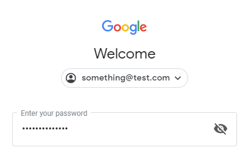
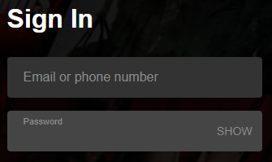
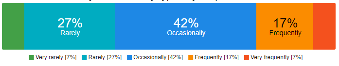
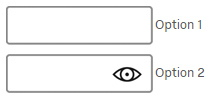
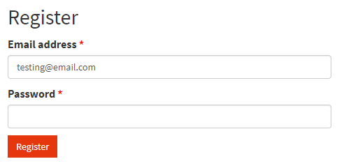

# Password reveal: an explainer

**Authors:** Bo Cupp, Alex Keng, Greg Whitworth

## Motivation:

Passwords have long been a pain point for users on the web. Newer standards and extensions have been introduced in hopes of resolving some of the problems to varying degrees of success.

EdgeHTML offered a unique feature in the platform - a button, the user could use to reveal their passwords. This is not a paradigm that was invented by Microsoft, but it is a common functionality seen across the web on top sites such as Google and Netflix as well as many apps on modern platforms.

|                              |               |
| :-------------------------------------------------------- | :------------------------------------------ |
| Google's login screen with eye toggle to reveal passwords | Netflix's "Show" toggle to reveal password  |

Our motivation to bring that to Chromium came from a preference test with end users of varying technical capabilities. We tried to understand their password input use patterns and perceived value of revealing the password. We wanted to understand how common they felt the problem of incorrectly typing in their password was, then discussed the options with them. The specific question we used: “How often do you incorrectly type in your password?”. Below are the results:

<center></center>

Of the respondents, 2 out of 3 users stated that they incorrectly type in their passwords Occasionally, Frequently, or Very Frequently.

Realizing that many users are still impacted by this, despite evolution of standards and extensions we did a usability study to discuss our proposed reveal solution. We asked them which option they preferred when logging into an email account or their favorite social media network:

<center></center>

Overwhelmingly, 4 out of 5 users chose Option 2, with the reveal capability. Then when looking at the verbatim feedback of why they chose Option 2 over Option 1, it verified the correlation between users incorrectly typing in their passwords and their desire to check it before hitting submit, here are a few verbatim quotes:

* "because if it's giving me an error with incorrect password I can check it"
* "I chose this option because I have a password that is easy to mistype and is long so I like the feature of being able to see my password inputted into the pw box to see if I made a spelling error."
* "Sometimes I have to view what I type since I use the same letters a lot. like 3 s's in the same place."
* "I'm able to see what I typed, in case of a typo it's helpful"

There is evidence that suggests that top web sites or apps may offer this functionality, and also that most smaller properties might not do the work required. Users would prefer a universal approach that would work on all of the sites they use.

Finally, we uncovered a scenario that we didn't consider originally – (likely one of many) a site that presents just one password input field during registration - hopefully you typed it right on the first try!

 <center></center>

These qualitive factors encouraged us to propose a standardized solution. Additionally we've instrumented the reveal pseudo-element to check how often it appeared and how often it was clicked, and we found that unique users clicked the button on average on up to 10% of the sessions where the pseudo-element appeared.

## Proposal:

The goal of our below proposal is to enable two key aspects:

* Allow user agents to include this functionality if they wish
* Enable web developers an ability to style it beyond color modifications

This proposal is to include this as part of CSS Selectors Level 4 with the addition of the following specification text:

### The ::reveal pseudo-element

User agents may implement the reveal pseudo-element on inputs that have `type=password`. If the user agent does implement this pseudo-element the following rules must be followed:

#### Toggling between revealed and obscured

* Activating the pseudo-element reveals the obscured password in plain text.
* Activating the pseudo-element again returns the password to being obscured.

#### Allowing for ease of author adjustment

* The graphic, text or other visual represenation the user agent utilizes to inform the user that they can interact with it must be set as a background image to allow authors to easily utilize the functionality but adjust this representation to meet their design needs if necessary.

#### Showing, hiding password reveal element, obscuring the password

Following events would show a password reveal element:

* User is typing password into an initially empty password input

Following events would prevent password reveal element from appearing:

  * An empty password input has been focused
  * Password input is pre-filled programmatically
  * User has typed the password, and then the password input has lost focus

Following events would obscure password and hide a reveal element:

 * Password input has lost focus

 This is important because even though the user may find value in being able to see their password, they may only desire for it to be visible for a short amount of time and doing this allows for keeping the password private even if the user forgets to invoke the `::reveal` psuedo-element. Additionally, when the browser itself loses focus the password is obscured as well.

#### Supported styles

Only the following CSS properties can be applied:

* background-clip
* background-color
* background-image
* background-origin
* background-repeat
* background-size
* border-bottom-color
* border-bottom-left-radius
* border-bottom-right-radius
* border-bottom-style
* border-bottom-width
* border-left-color
* border-left-style
* border-left-width
* border-right-color
* border-right-style
* border-right-width
* border-top-color
* border-top-left-radius
* border-top-right-radius
* border-top-style
* border-top-width
* box-shadow
* box-sizing
* cursor
* display (values block, none)
* font-size
* height
* margin-bottom
* margin-left
* margin-right
* margin-top
* opacity
* outline-color
* outline-style
* outline-width
* padding-bottom
* padding-left
* padding-right
* padding-top
* transform
* transform-origin
* width

### The :revealed pseudo-class

User agents that implement the `::reveal` pseudo-element must also implement the `:revealed` pseudo-class on the password input. When a user invokes the `::reveal` pseudo-element the pseudo-class should be applied to the password element.
This will allow authors to provide different styles when the password is either revealed or not.

**Example**

Here is an example of an author that wants to show an eye image to reveal and a closed eye image to hide the password again.

```HTML
<input type="password">
<style>
input[type=password]::reveal {
    background-image: url(my-eye-image.png);
}
input[type=password]:revealed::reveal {
    background-image: url(my-eye-image-revealed.png);
}
</style>
```

---
[Related issues](https://github.com/MicrosoftEdge/MSEdgeExplainers/labels/Password%20Reveal) | [Open a new issue](https://github.com/MicrosoftEdge/MSEdgeExplainers/issues/new?title=%5BPassword%20Reveal%5D)