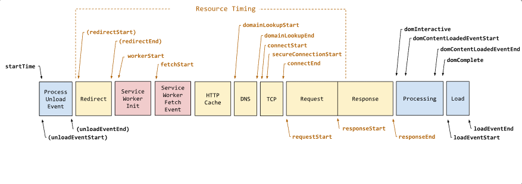

# Enabling Web Applications to understand bimodal performance timings 

The purpose of this document is to propose changes to the [Performance Navigation Timing API](https://w3c.github.io/navigation-timing/#dom-performancenavigationtiming) which will enable website owners to understand how the performance of their applications are affected by user agent launch scenarios. 

Authors:
* [Heming Zhang](https://github.com/hemingzh) - Engineer at Microsoft Edge
* [Dylan Kelly](https://github.com/dylank) - Engineer at Microsoft Edge
* [Ben Mathwig](https://github.com/bmathwig) - Product Manager at Microsoft Edge
* [Mike Jackson](https://github.com/mwjacksonmsft) - Engineer at Microsoft Edge

## Status of this Document
This document is a starting point for engaging the community and standards bodies in developing collaborative solutions fit for standardization. As the solutions to problems described in this document progress along the standards-track, we will retain this document as an archive and use this section to keep the community up-to-date with the most current standards venue and content location of future work and discussions.
* This document status: **Active**
* Expected venue: [W3C Web Incubator Community Group](https://wicg.io/)
* **Current version: this document**

## Introduction
When a user agent first launches (a "cold start" scenario), it must perform many expensive initialization tasks that compete for resources on the system. Consequently, web applications may suffer from bimodal distribution in page load performance. 

Content they attempt to load will be in competition with other initialization work. This makes it difficult to detect if performance issues exist within web applications themselves, or because of a user-agent-generated condition of high resource contention. This is particularly a pain point for pinned PWAs (Progressive Web Apps) that will often require a cold start of the user agent, and teams we have worked with have been surprised by the tails in their dashboards. Without more information, it is challenging for developers to understand if (and when) their applications may be misbehaving or are simply being loaded in a contended period. To address this, we propose adding new information to existing Web Performance APIs. 

[Performance Navigation Timing](https://w3c.github.io/navigation-timing/#dom-performancenavigationtiming) provides a variety of performance measurements. A typical response for `performance.getEntriesByType("navigation")` will produce something like:

```javascript
connectEnd: 126.19999998807907
connectStart: 126.19999998807907
decodedBodySize: 0
domComplete: 2721.300000011921
domContentLoadedEventEnd: 302.30000001192093
domContentLoadedEventStart: 302.30000001192093
domInteractive: 302.30000001192093
domainLookupEnd: 126.19999998807907
domainLookupStart: 126.19999998807907
duration: 2721.400000035763
encodedBodySize: 0
entryType: "navigation"
fetchStart: 126.19999998807907
initiatorType: "navigation"
loadEventEnd: 2721.400000035763
loadEventStart: 2721.300000011921
name: "https://www.office.com/mail/inbox"
nextHopProtocol: "h2"
redirectCount: 1
redirectEnd: 122.40000003576279
redirectStart: 13.300000011920929
requestStart: 126.19999998807907
responseEnd: 138
responseStart: 132
secureConnectionStart: 126.19999998807907
serverTiming: []
startTime: 0
transferSize: 300
type: "navigate"  <== NavigationType
unloadEventEnd: 0
unloadEventStart: 0
workerStart: 125.90000003576279
```

It is difficult to discern from these metrics whether the measurements reflect those of a regular navigation under normal browsing, or of one where the browser is in a non-optimal performance state.  

Under normal browsing conditions, if fetchStart (or redirectStart) minus startTime is exceedingly high, one could assume there was a lot of browser load before getting to load the actual resource. However, when the browser is in a non-optimal performance state, performance spikes can appear at any point across the navigation timeline e.g., the delta between domainLookupEnd and domainLookupStart can be exceptionally large. 



## Goals
The proposed changes in this document aim to enable web application developers to pivot performance telemetry of their web application to eliminate outlier metrics due to user-agent resourcing contention. 

## Non-Goals
 * Distinguishing between various implementation-specific startup processes. 
 * Signaling browser launches which do not involve a full browser initialization (e.g., restoring a session from a suspended state on mobile platforms).

## Use Cases
 * A web application which typically runs as an installed PWA (progressive web apps) that might get launched without a user agent already running. E.g., PWA’s that run during OS (operating systems) login. 
 * A web application which runs as the user's homepage.

## Proposed Solution

### Add new systemEntropy field to PerformanceNavigationTiming 

To enable developers to discern if the page load occurs during a non-optimal performance state, we will add a new ‘systemEntropy’ field to the PerformanceNavigationTiming struct. This would be a new enum representing the state of the user agent at the time the navigation was started.  

```enum NavigationEntropy { 
    "high", 
    "low" 
}; 
```
The payload of a performance.getEntriesByType("navigation") call would look like: 

```connectEnd: 126.19999998807907 
connectStart: 126.19999998807907 
<snip> 
serverTiming: [] 
startTime: 0 
systemEntropy: "high" 
transferSize: 300 
type: "navigate" 
unloadEventEnd: 0 
unloadEventStart: 0
```
An example of how a web application might use this: 

```const navigationEntries = window.performance.getEntriesByType('navigation'); 
let navigationType = 'none';  
if (navigationEntries.length > 0) {  
    const navigationEntry = navigationEntries[0];  
    // If the systemEntropy is high, return navigationType 'none' 
    // to drop the event.  
    if (navigationEntry.systemEntropy !== 'high') { 
        navigationType = navigationEntry.type || 'UndefinedType';  
   } 
} 
```

This solution could also be easily extended to other performance structures if so desired. It also allows the user agent to decide what high vs low systemEntropy might mean, and potentially extend the enum later providing more granularity for consumers of the API (e.g., ‘medium’ or 'veryHigh’).  

## Alternative Considered Solutions 

### Add new NavigationType value for PerformanceNavigationTiming 

One considered proposal was to create a new value for the NavigationType enum to differentiate navigations during launch from others in measurements of web application performance. Launch was specifically selected as that is the most common use case. The new enum definition will appear as follows: 

```enum NavigationType { 
    "navigate", 
    "reload", 
    "back_forward", 
    "prerender", 
    "navigate_during_user_agent_launch", <== New 
}; 
```

The payload of a performance.getEntriesByType("navigation") call would look like: 

```connectEnd: 126.19999998807907 
connectStart: 126.19999998807907 
<snip> 
transferSize: 300 
type: "navigate_during_user_agent_launch" 
unloadEventEnd: 0 
unloadEventStart: 0 
workerStart: 125.90000003576279 
```

An example of how a web application might use this: 

```const navigationEntries = window.performance.getEntriesByType('navigation'); 
let navigationType; 
if (navigationEntries.length > 0) { 
    const navigationEntry = navigationEntries[0]; 
    navigationType = navigationEntry.type || 'UndefinedType'; 
} else { 
    navigationType = 'none'; 
} 
```

However, these other navigation types can also occur, albeit less frequently, during a non-optimal performance state. It seems impractical to introduce a new enum for each existing navigation type, especially as it complicates the mapping to the historyHandling type. Also consider that as other cases become more common, we would be expanding the potential test matrix. 
    
### Add new Type value for performance.getEntriesByType 

In this proposal, we would add a new type to performance.getEntriesByType, to highlight the browser’s performance during times when the browser was operating during a non-optimal performance state. These entries would also appear in their original category.  

For example, if navigation occurred during a cold launch of the browser, then a PerformanceNavigationTiming object would be returned by both calls: 

```const navigationEntries = window.performance.getEntriesByType('navigation'); 
const navigationUnderLoadEntries = window.performance.getEntriesByType('navigation_under_load'); 
```

However, there are two main drawbacks to this approach: 
 1. We would need to consider introducing similar concepts for each PerformanceEntry subclass. 
 2. Developers need to write additional code to match up this new entry type with the existing entry to ensure it was excluded from their measurements. 

A variation of this to avoid adding the item to both categories, which mitigates (2), but does not resolve (1). 
 
### Add new flags for PerformanceNavigationTiming 

These are primarily naming variations of the proposed solution.  

 1. Add new ‘underLoad’ or ‘reliable’ boolean to indicate in the navigation occurred while the browser is operating under non-optimal performance conditions. While this approach does address the problem outlined in this explainer, it does not easily allow future expansion as needed.  
2. Add a new ‘confidence’ enum and field. The name here could be confusing for developers consuming this API.  

## Privacy and Security Considerations

### Privacy

Tagging a PerformanceNavigationTiming with `systemEntropy` exposes a new means for sites to infer whether the site was launched while the user agent was running under non-optimal performance conditions. Sites could infer that their site is set as the user’s home page. However, since this is the only information that `example.com` can figure out about itself, and not information that other applications can find out, we do not consider this a significant concern given the benefit this change will provide. Additionally, such inference suffers from false positives, as the user may have invoked the URL and launched the browser from the OS shell or another non-browser application. 

An analysis of fingerprinting capability provided by this surface suggests fairly limited impact.

- **Detectability**: The user agent is aware that it is emitting this signal whenever it decides that high system entropy is a suitable return value. However, it is of course not possible for the user agent to know how this signal is handled by the origin once it has already been received. In our experience, teams that understand this behavior can already detect such conditions with moderate accuracy, and we do not feel, therefore, that this adds new information, so much as it helps confirm an existing understanding. 

- **Persistence**: This signal is not directly associated with any user state or data that persists throughout a browsing session. A site could choose to persist this signal in a cookie or similar storage. 

- **Availability**: The signal is not available during any other browsing activity. 

- **Scope**: This surface would be made available as a modification to the PerformanceNavigationTiming interface, which can be requested by any scripts running on the page. However, we can enforce a same-origin policy for returning this value in our implementation to limit the scope of the signal to the same origin which requests it.

No other meaningful privacy concerns are expected, but we welcome community feedback.

### Security

This proposal supplies more evidence for sites to infer that a machine might be under heavy load. However, this information is indicative of the past state of the browser, and does not reflect, nor provide a way to query for the current performance state of the browser. 


## Open Questions

## Conclusion

As outlined, it can be frustrating for application developers to identify and root-cause performance issues when load times are influenced by other environmental factors like resource contention during a user agent launch. By modifying the `PerformanceNavigationTiming` API, web applications developers can have better insight into the conditions of their application's performance and remove noise in diagnosing performance metrics which will benefit the web apps ecosystem. 

---
[Related issues](https://github.com/MicrosoftEdge/MSEdgeExplainers/labels/Performance) | [Open a new issue](https://github.com/MicrosoftEdge/MSEdgeExplainers/issues/new?assignees=dylank%2C+hemingzh&labels=Perf+timing+during+browser+start&template=performance-timing-during-browser-start.md&title=%5BPerf+Timing+during+launch%5D+%3CTITLE+HERE%3E)
