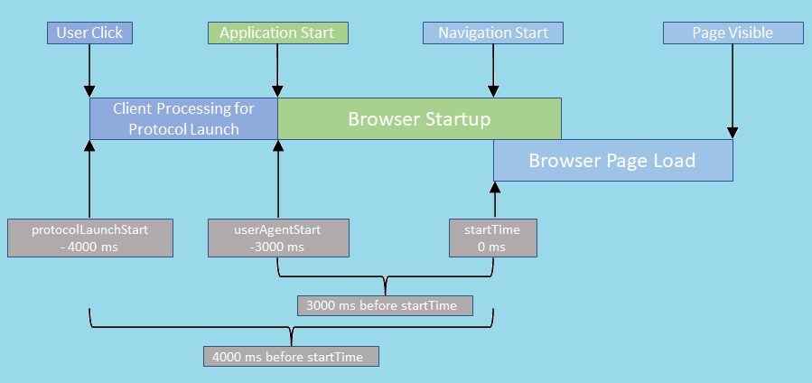

# Enabling Web applications to understand performance navigation timings during protocol launches.

Authors: 
* [Atul Katti](https://github.com/atulkatti) - Engineer at Microsoft Edge 
* [Todd Reifsteck](https://github.com/toddreifsteck) - Engineer at Microsoft Edge
* [Sam Fortiner](https://github.com/SamFort-MSFT) - Engineer at Microsoft Edge

## Status of this Document
This document is a starting point for engaging the community and standards bodies in developing collaborative solutions fit for standardization. As the solutions to problems described in this document progress along the standards-track, we will retain this document as an archive and use this section to keep the community up to date with the most current standards venue and content location of future work and discussions.
* This document status: **Active**
* Expected venue: [W3C Web Incubator Community Group](https://wicg.io/)
* **Current version: this document**
    
## Introduction

* This feature intends to help understand the performance characteristics of protocol launches better. A protocol launch can be described as a user agent being launched in response to user actions (such as clicking a link) in other applications (e.g., an email client). A protocol launch may either start a new instance of the user agent (cold start) or initiate a new navigation in an already running user agent (warm start). Depending on whether it is a cold start or a warm start, the user agent may perform many expensive initialization tasks that compete for resources on the system.
*  To understand the end-to-end performance of a given protocol launch user scenario it will be crucial to accurately measure the end-to-end time from a particular user action (such as click on a link) to when the navigation scenario is considered completed. In addition to identifying any performance bottlenecks to the end-to-end metrics, this will also help evaluate the impact of any performance improvement features (e.g., prerender, startup boost) on the end-to-end user experience. 
* This could be beneficial in optimizing end-to-end scenarios in applications like email clients or native apps that present links to web content.

## Goals
The proposed changes in this document aim to enable the web applications to:
* Understand the end-to-end performance characteristics of protocol launches.
* Design end-to-end metrics to evaluate impact of performance improvement features.

## Non-Goals

## Use Cases
* A user clicking on a link in a non-web email client that leads to launching a new instance of the user agent.
* A user clicking on a link in a non-web email client that leads to starting a new navigation in an existing instance of the user agent.

## Proposed Solution
As part of the proposed solution, a client application initiating the protocol launch will need to capture and provide the timestamp for the user action as a command line parameter. This timestamp will need to be based on a monotonic increasing clock that is not subject to system clock adjustments or system clock skew. This timestamp will also need to be in a format that can be correlated with other timestamps collected in the browser processes. For example, on Windows we propose using something akin to [QueryPerformanceCounter](https://learn.microsoft.com/windows/win32/sysinfo/acquiring-high-resolution-time-stamps). Both these timestamps; the user action timestamp captured in the client application and the application start timestamp captured in the browser process; are then converted to a [DOMHighResTimeStamp](https://www.w3.org/TR/hr-time-2/#dom-domhighrestimestamp). The conversion to [DOMHighResTimeStamp](https://www.w3.org/TR/hr-time-2/#dom-domhighrestimestamp) reduces the possibility of timing attacks by setting the resolution to 5 microseconds.

This strategy to collect timestamps in different processes and converting to [DOMHighResTimeStamp](https://www.w3.org/TR/hr-time-2/#dom-domhighrestimestamp) is not new and has been the motivation for introduction of the [DOMHighResTimeStamp](https://www.w3.org/TR/hr-time-2/#dom-domhighrestimestamp). This mechanism is part of the [High Resolution Time Level 2](https://www.w3.org/TR/hr-time-2/#introduction) specification that addresses many such scenarios for browser developers and web application developers where they need to obtain high resolution timing information including but not limited to evaluating performance of various parts of their applications.

### PerformanceNavigationTiming
To help web applications compute end-to-end telemetry for protocol launches we propose adding 2 new fields userAgentStart and protocolLaunchStart to the [PerformanceNavigationTiming](https://developer.mozilla.org/docs/Web/API/PerformanceNavigationTiming) object. The parameter userAgentStart corresponds to a timestamp captured early in the startup of the browser application. The parameter protocolLaunchStart corresponds to the user action that initiated the protocol launch in the non-browser client application. For cold starts; when no browser process has yet been created; the protocolLaunchStart value will be lesser than the userAgentStart value. For warm starts; where one or more browser processes are already running; the protocolLaunchStart value may be higher than the userAgentStart value. These new fields are only populated for protocol launches. It could be further restricted to specific domains through origin trial.

A typical response for `performance.getEntriesByType("navigation")` will produce something like:
```javascript
connectEnd: 24.700000047683716
connectStart: 24.700000047683716
decodedBodySize: 485753
domComplete: 1957.1000000238419
domContentLoadedEventEnd: 1117.2000000476837
domContentLoadedEventStart: 1116.8000000715256
domInteractive: 1116.6000000238419
domainLookupEnd: 24.700000047683716
domainLookupStart: 24.700000047683716
duration: 1962
encodedBodySize: 96314
entryType: "navigation"
fetchStart: 24.700000047683716
initiatorType: "navigation"
loadEventEnd: 1962
loadEventStart: 1957.1000000238419
name: "https://www.msn.com/"
nextHopProtocol: "h2"
protocolLaunchStart: -4000
redirectCount: 0
redirectEnd: 0
redirectStart: 0
requestStart: 26.100000023841858
responseEnd: 648.8000000715256
responseStart: 645.3999999761581
secureConnectionStart: 24.700000047683716
serverTiming: []
startTime: 0
transferSize: 96614
type: "navigate"
unloadEventEnd: 0
unloadEventStart: 0
userAgentStart: -3000
workerStart: 0
```


* Adding additional timing information to the PerformanceNavigationTiming that identifies different time points in different processes starting from the original user action that kick started this navigation and any user agent startup activities that may have followed will allow the web applications to evaluate the existing timing information for these specific protocol launch scenarios. The initiating user action timestamp will be recorded in the external application where the protocol launch was triggered and passed into the user agent as a command line parameter and this timestamp along with the application start time will then be passed through to the PerformanceNavigationTiming object so that it can be exposed to the web applications.

* An example of how a web application might use this:

```javascript
const navigationEntries = window.performance.getEntriesByType('navigation');

let userAgentStart = 0.0;
let protocolLaunchStart = 0.0;
if (navigationEntries.length > 0) {
    const navigationEntry = navigationEntries[0] as PerformanceNavigationTiming;
    userAgentStart = navigationEntry.userAgentStart;
    protocolLaunchStart = navigationEntry.protocolLaunchStart;
}

// Calculate end-to-end metrics using the new protocolLaunchStart and userAgentStart values for your scenario.
```
Additional guidance:

* The new timing fields added by this change protocolLaunchStart and userAgentStart have the same format as other timing fields such as [loadEventStart](https://developer.mozilla.org/docs/Web/API/PerformanceTiming/loadEventStart) and represents a [DOMHighResTimeStamp](https://developer.mozilla.org/docs/Web/API/DOMHighResTimeStamp). 

## Privacy and Security Considerations

### Privacy
Adding additional timing fields to PerformanceNavigationTiming does add new attributes to an existing fingerprinting surface as these are high resolution timestamps. However, this does not significantly change the timing related fingerprinting risk as there are other multiple such timing fields exposed through this API. The conversion to [DOMHighResTimeStamp](https://www.w3.org/TR/hr-time-2/#dom-domhighrestimestamp) reduces the possibility of timing attacks by setting the resolution to 5 microseconds. As with the other such fields this also makes it possible to determine device performance characteristics. In addition, the web application can interpret the values for these new timing fields to determine if the user agent was launched anew (cold start) or was already running (warm start). However, this information is already available to applications through other mechanisms and is considered low risk. For example, this could be done using certain [Win32 APIs](https://learn.microsoft.com/windows/win32/toolhelp/taking-a-snapshot-and-viewing-processes)

An analysis of fingerprinting capability provided by this surface suggests some impact.

- **Entropy Introduced**: The 2 timing fields added by this change could be considered as 2 additional bits of entropy. These new fields can contribute to the timing related fingerprinting risks. The conversion to [DOMHighResTimeStamp](https://www.w3.org/TR/hr-time-2/#dom-domhighrestimestamp) reduces the possibility of timing attacks by setting the resolution to 5 microseconds.

- **Detectability**: The user agent is aware that it is emitting this timing data. However, it is not possible for the user agent to know how this signal is handled by the web page.

- **Persistence**: These new fields are only populated for protocol launches. A site could choose to persist this signal in a cookie or similar storage.

- **Availability**: These new fields are only populated for protocol launches. It could be restricted to specific domains through origin trial.

- **Scope**: This surface would be made available as a modification to the `PerformanceNavigationTiming` interface, which can be requested by any scripts running on the page. However, we can enforce a same-origin policy for returning this value in our implementation to limit the scope of the signal to the same origin which requests it.

No other meaningful privacy concerns are anticipated, but we welcome community feedback.

### Security
The 2 new timing fields add more timing related fingerprinting area but does not introduce the possibility of any new kind of attacks. The conversion to [DOMHighResTimeStamp](https://www.w3.org/TR/hr-time-2/#dom-domhighrestimestamp) reduces the possibility of timing attacks by setting the resolution to 5 microseconds.

## Alternatives considered
### URL parameters
We could pass this additional timing information as URL parameters for the page to consume. However, we abandonded this idea early as it may not work well with other features such as prerender.
### Exposed an entirely new object
Instead of extending the existing `PerformanceNavigationTiming` object we could add an entirely new object specific to protocol launch timings. This approach seemed like an overkill as we are adding only 2 new timing fields and we don't anticipate adding more related fields. In addition, these values may be used in conjunction with existing fields in the `PerformanceNavigationTiming`, so it will be easier for the consuming code if these are part of the same object.
