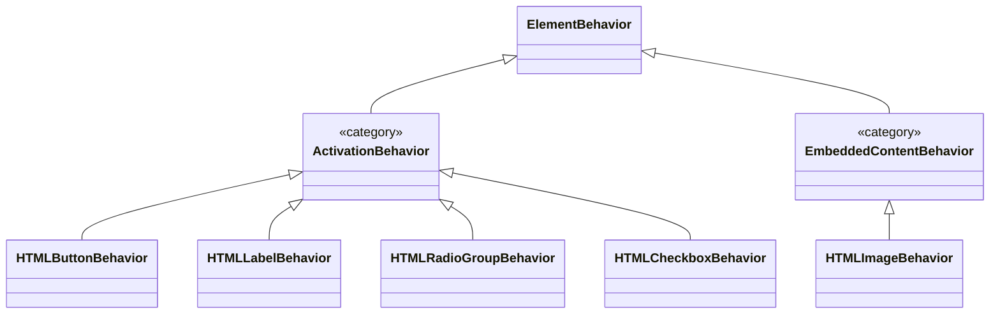

# Platform-Provided Behaviors for Custom Elements

## Authors:

- [Ana Sollano Kim](https://github.com/anaskim)

## Participate

- [WHATWG tracking issue](https://github.com/whatwg/html/issues/12150)

## Introduction

Custom element authors frequently need their elements to use platform behaviors that are currently exclusive to native HTML elements, such as [form submission](https://github.com/WICG/webcomponents/issues/814), [popover invocation](https://github.com/whatwg/html/issues/9110), [label behaviors](https://github.com/whatwg/html/issues/5423#issuecomment-1517653183), [form semantics](https://github.com/whatwg/html/issues/10220), and [radio button grouping](https://github.com/whatwg/html/issues/11061#issuecomment-3250415103). The motivation of this proposal is to give custom element authors visibility into the same protocols, lifecycle hooks, and internal state that native elements use. Platform-provided behaviors name the platform-internal logic HTML already runs for native elements and expose it for reuse, rather than asking authors to reimplement that logic in Javascript.

## User-facing problem

Custom element authors can't access native behaviors that are built into native HTML elements. This forces them to either:

1. Use customized built-ins (`is/extends` syntax), which have [Shadow DOM limitations](https://developer.mozilla.org/en-US/docs/Web/API/Element/attachShadow#elements_you_can_attach_a_shadow_to) and [can't use the ElementInternals API](https://github.com/whatwg/html/issues/5166).
2. Try to reimplement native logic in JavaScript, which is error-prone, often less performant, and cannot replicate certain platform-internal behaviors (notably the form-control pseudo-class set such as `:default` and the native focusability algorithm).
3. Accept that their custom elements simply can't do what native elements can do.

This creates a gap between what's possible with native elements and custom elements, limiting web components and forcing developers into suboptimal patterns.

### Goals

- Establish an extensible framework for custom elements to adopt native behaviors for built in elements.
- Enable autonomous custom elements to adopt native `<button>` behavior (submit, reset, and generic button) as the initial capability of this framework.

### Non-goals

- Recreating all native element behaviors in this initial proposal.
- Making updates to customized built-ins.

## User research

This proposal is informed by:

1. Issue discussions:

   - [WICG/webcomponents#814](https://github.com/WICG/webcomponents/issues/814) - Form submission
   - [whatwg/html#11061](https://github.com/whatwg/html/issues/11061) - ElementInternals.type proposal
   - [whatwg/html#9110](https://github.com/whatwg/html/issues/9110) - Popover invocation from custom elements (via the [popover API](https://developer.mozilla.org/en-US/docs/Web/API/Popover_API) or the [invoker commands API](https://developer.mozilla.org/en-US/docs/Web/API/Invoker_Commands_API))
   - [whatwg/html#5423](https://github.com/whatwg/html/issues/5423) and [whatwg/html#11584](https://github.com/whatwg/html/issues/11584) - Label behaviors
   - [whatwg/html#10220](https://github.com/whatwg/html/issues/10220) - Custom elements as forms
   - [MicrosoftEdge/MSEdgeExplainers#1353](https://github.com/MicrosoftEdge/MSEdgeExplainers/issues/1353) - Discrete behavior categories and composition

2. TPAC discussions in [2023](https://www.w3.org/2023/09/tpac-breakouts/44-minutes.pdf) and [2025](https://www.w3.org/2025/11/12-custom-attrs-minutes.html) exploring alternatives to customized built-ins.

3. Real-world use cases from frameworks that work around these limitations.

  Frameworks rebuild `<button>` rather than use the native one for two main reasons. First, style encapsulation: a design system wants its button to be styled and slotted entirely within the component's shadow DOM. Second, internal structure: design systems frequently ship complex button variants like split buttons, buttons with internal grids, or buttons that surface a secondary action, none of which the native element accommodates. The cost is that form submission, implicit submission, focusability, the implicit role, and pseudo-classes all have to be reimplemented or partially worked around.

   - [Shoelace](https://github.com/shoelace-style/shoelace/blob/next/src/components/button/button.component.ts#L180): Uses `ElementInternals` but still requires manual wiring to intercept the click event on its internal shadow button (as shown below) and can't support implicit submission ("Enter to submit").

   ```javascript
   // button.component.ts
   handleClick(event) {
     if (this.type === 'submit') {
       this._internals.form.requestSubmit(this);
     }
   }
   ```

   - [Material Web](https://github.com/material-components/material-web/blob/main/button/internal/button.ts): Renders a `<button>` inside the Shadow DOM for accessibility/clicks. They created a [dedicated class](https://github.com/material-components/material-web/blob/main/internal/controller/form-submitter.ts) to handle form submission and intercept the click event to call `form.requestSubmit(this)`.

   - Older method (used by earlier design systems): To enable implicit submission, the component injects a hidden `<button type="submit">` into its own light DOM. This approach breaks encapsulation, risks unintended layout effects by participating in the parent’s flow or the surrounding container, and can pollute the accessibility tree.

   ```html
   <ds-button>
     #shadow-root
     <button>Click Me</button>
     <button type="submit" style="display: none;"></button> 
   </ds-button>
   ```

These frameworks mirror a native `<button>` by having one custom element class whose form activation is selected by the `type` attribute. The same pattern appears across other design systems including [Adobe Spectrum Web Components](https://github.com/adobe/spectrum-web-components/blob/main/1st-gen/packages/button/src/ButtonBase.ts) (`<sp-button>` with `type` attribute, hidden `<button type="submit">` proxy) and [Microsoft Fluent UI Web Components](https://github.com/microsoft/fluentui/blob/master/packages/web-components/src/button/button.base.ts) (`<fluent-button>` with `type` attribute, built on the FAST web component foundation).

## Proposed approach

A platform-provided behavior is a set of methods, values, and platform-protocol hooks that a custom element can participate in, which today are reserved to native HTML elements. This proposal introduces a `behaviors` static class property that declares which behaviors the platform attaches to instances of the class.

The platform reads `static behaviors` at `customElements.define()` time and stores it on the custom element definition, the same way it reads `static formAssociated`. When an element is created (`new`, parser upgrade, or `customElements.upgrade()`), the platform instantiates one of each declared behavior per host and associates them with the element. This mirrors how a form-associated custom element participates in form submission and form-related lifecycle callbacks.

`attachInternals()` is the author's access route to those already-existing instances, exposed through a new `behaviors` collection on `ElementInternals`. The set of behaviors attached to a host is fixed at the class declaration; the behavior instances' own properties remain mutable post-attachment.

```javascript
class CustomButton extends HTMLElement {
  static formAssociated = true;
  // Declare which behaviors the platform attaches to each instance.
  static behaviors = [HTMLButtonBehavior];

  #internals;
  constructor() {
    super();
    // attachInternals() is the access route to the platform-created behaviors.
    this.#internals = this.attachInternals();

    // Access the behavior state directly.
    const buttonBehavior = this.#internals.behaviors.get(HTMLButtonBehavior);

    // Modify the behavior's properties.
    buttonBehavior.formAction = '/custom';
    buttonBehavior.type = 'reset';
  }
}
```

*Note: `new HTMLButtonBehavior()` throws an `"Illegal constructor"` `TypeError`, the same as `ElementInternals`, because a free-standing instance would have no host to act on. The instance is obtained only through `internals.behaviors.get(HTMLButtonBehavior)` after `attachInternals()` is called.*

Each behavior names the specific platform logic it engages:

- Event handling and activation
- ARIA defaults (implicit role and ARIA properties)
- Focusability
- CSS pseudo-classes
- Configurable data and state owned by the behavior
- Platform protocol hooks

### Behavior categories and composition

Behaviors are organized into a set of categories. Categories are conceptual groupings the platform uses to decide which behaviors can coexist on one element. They are not classes exposed to authors; authors only ever reference the concrete behaviors (the leaves below).



An element attaches at most one behavior per category. Two behaviors in the same category are mutually exclusive, and attaching both throws a `TypeError`:

```javascript
static behaviors = [HTMLButtonBehavior, HTMLLabelBehavior]; // throws!
// TypeError: HTMLButtonBehavior and HTMLLabelBehavior cannot be combined;
// an element can have only one activation behavior.
```

Behaviors in different categories compose. Combining an `HTMLButtonBehavior` (activation) with an `HTMLImageBehavior` (embedded content) produces a submit button that renders as an image, similar to [`<input type=image>`](https://developer.mozilla.org/en-US/docs/Web/HTML/Element/input/image):

```javascript
class ImageButton extends HTMLElement {
  static formAssociated = true;
  static observedAttributes = ['src', 'alt'];
  static behaviors = [HTMLButtonBehavior, HTMLImageBehavior];

  #internals;
  #image;

  constructor() {
    super();
    this.#internals = this.attachInternals();
    // HTMLButtonBehavior defaults to type 'submit'.
    this.#image = this.#internals.behaviors.get(HTMLImageBehavior);
  }

  attributeChangedCallback(name, _old, value) {
    if (name === 'src') {
      this.#image.src = value;
    }
    if (name === 'alt') {
      this.#image.alt = value;
    }
  }
}
customElements.define('image-button', ImageButton);
```

```html
<form action="/search">
  <image-button src="/go.png" alt="Search"></image-button>
</form>
```

On activation the host submits the form (from `HTMLButtonBehavior`) while rendering the image and exposing its `alt` text as the accessible name (from `HTMLImageBehavior`). The two behaviors are in different categories, so the platform allows the combination. Each behavior carries its category internally, so the platform checks compatibility with a membership test. Adding a new behavior requires assigning it a category; it does not require enumerating its compatibility with every existing behavior.

#### The activation category

The activation category corresponds to the DOM standard's [activation behavior](https://dom.spec.whatwg.org/#eventtarget-activation-behavior): the algorithm an `EventTarget` runs when a `click` is dispatched to it and not canceled. Behaviors in the activation category share participation in the activation dispatch path (click, keyboard activation, and `element.click()`) and they honor both `preventDefault()` and `stopPropagation()`. Each concrete behavior supplies:

- The activation algorithm.
- Its implicit ARIA role default.
- Its focusability default.
- Its keyboard-activation specifics.
- Its own state and the protocol surface it exposes.

Mapping a few native patterns onto categories helps validate the model:

| Native pattern | Behavior | Category | Notes |
|---|---|---|---|
| `<button>` | `HTMLButtonBehavior` | activation | submit/reset/button via `type`; invoker surface; form participation. |
| `<label>` | `HTMLLabelBehavior` | activation | `for`-attribute association and focus delegation, activation delegates a click to the labeled control, no implicit role, not focusable. |
| `<input type=radio>` | `HTMLRadioGroupBehavior` | activation | `name`-based mutual exclusion. |

The platform enforces the one-per-category rule without exposing the categories themselves. If [developer-defined behaviors](developer-defined-behaviors.md) are specified in the future, the categories could be promoted to real, subclassable base classes (for example, `class MyBehavior extends ActivationBehavior`) as an additive change.

### HTMLButtonBehavior

This proposal introduces `HTMLButtonBehavior`, a behavior in the activation category, that mirrors native `<button>`.

- User activation (click, Enter, Space, implicit submission) reaches the behavior through the same DOM [event dispatch](https://dom.spec.whatwg.org/#concept-event-dispatch) path as native elements. Author-added event listeners for those same modalities coexist with the behavior: they fire during normal dispatch, and calling `preventDefault()` cancels the behavior's [activation](https://dom.spec.whatwg.org/#eventtarget-activation-behavior).
- The behavior provides a default implicit `role="button"`. Authors can override the role through `internals.role`.
- The host is exposed to the accessibility tree with its `button` role and an accessible name computed from its contents, and disabled and default state are surfaced to assistive technologies, so AT users get the same information as for a native `<button>`.
- The custom element with HTMLButtonBehavior participates in sequential focus navigation, with `tabindex` and disabled state following established rules.
- The same logic that toggles `:default`, `:disabled`/`:enabled`, `:focus`, and `:focus-visible` on native elements applies to the behavior's host. The `:default` pseudo-class only matches when `type === 'submit'` and the host is the form's default submit button.
- Mirrored `HTMLButtonElement` properties are available on the behavior instance. They are configurable per-element and mutable for the life of the behavior.
- The behavior has a `type` property (`'submit'` (default), `'reset'`, or `'button'`) that selects the active button mode. The `type` is mutable for the life of the behavior.
- Form ownership applies whenever `type` is `'submit'` or `'reset'`. Activation behavior depends on `type`: `'submit'` triggers form submission and implicit submission; `'reset'` triggers form reset; `'button'` does generic activation.

`HTMLButtonBehavior` builds on top of [form-associated custom elements (FACEs)](https://html.spec.whatwg.org/multipage/custom-elements.html#form-associated-custom-elements). The custom element still has to opt in to form association with `static formAssociated = true` for submission to actually fire when `type` is `'submit'` or `'reset'`. Without it, `behavior.form` is always `null` and activation is a no-op even when the element is inside a form. This is a divergence from native `<button>`, which submits its form without any explicit opt-in. The platform could later imply form association, removing the extra opt-in.

| Scenario | Behavior |
|----------|----------|
| Form-associated element inside a form, `type === 'submit'` | Activation triggers submission, participates in implicit submission, matches `:default`. Invoker attributes on the host (`commandfor`, `popovertarget`) are ignored. |
| Form-associated element inside a form, `type === 'reset'` | Activation triggers form reset. Invoker attributes on the host are ignored. |
| Form-associated element inside a form, `type === 'button'` | Activation is a no-op for form behavior. Invoker attributes on the host (`commandfor`, `popovertarget`) fire as usual. |
| Form-associated element outside a form, or non-form-associated element | `behavior.form` is `null`. With no form owner, the host behaves like a native `<button>` without a form owner for all `type` values: there is no form to submit or reset, but invoker attributes on the host (`commandfor`, `popovertarget`) fire as usual and the element still gets `role="button"` and implicit focusability. |

### Behaviors are not opaque tokens

A recurring concern about consolidating form-control semantics into an opt-in is that web authors will not be able to figure out what a given opt-in actually does. This proposal addresses that concern:

- Each element behavior maps to a single native pattern (e.g., `HTMLButtonBehavior` provides exactly the semantics of `<button>`). Future element behaviors will need to follow the same naming convention.
- Each behavior is specified in terms of existing HTML algorithms. The behavior is the union of those algorithms, applied to a custom element.
- Web authors can override individual defaults. This already works today for role: `internals.role` overrides a behavior's default role without replacing the behavior. The same layering pattern can extend to other defaults (focusability, keyboard activation, and similar) if and when future proposals add the corresponding primitives on `ElementInternals`. The layering example in [Alternative 7](#alternative-7-low-level-primitives-on-elementinternals) walks through what that would look like.

### Accessing behavior state

Each behavior exposes properties from its corresponding native element. Behaviors can be accessed via `internals.behaviors`. For `HTMLButtonBehavior`, the following properties are available (mirroring [`HTMLButtonElement`](https://developer.mozilla.org/en-US/docs/Web/API/HTMLButtonElement)):

**Properties:**
- `type` - selects the active button mode (`'submit'`, `'reset'`, or `'button'`); defaults to `'submit'`.
- `disabled` - read-only. Reflects whether the element is disabled, which is determined by the standard form-control mechanism (the `disabled` attribute or a `<fieldset disabled>` ancestor, [spec](https://html.spec.whatwg.org/multipage/form-control-infrastructure.html#attr-fe-disabled)) and surfaced through `ElementInternals`. This proposal does not add a separately settable per-behavior disabled state.
- `form` - read-only, delegates to `ElementInternals.form`. Form ownership only affects activation when `type` is `'submit'` or `'reset'`.
- `name`, `value` - submitter name and value. Read on submission (`type === 'submit'`).
- `formAction`, `formEnctype`, `formMethod`, `formNoValidate`, `formTarget` - submission overrides. Read on submission (`type === 'submit'`).
- `labels` - read-only, delegates to `ElementInternals.labels`.

*Note: `HTMLButtonElement` adds the properties listed above on top of `HTMLElement`. Custom elements already inherit the global `HTMLElement` IDL surface (`title`, `tabIndex`, `hidden`, etc.). Web authors can use these properties on the host as they would on any element.*

To expose these properties to external code, authors define getters and setters on the host that delegate to the behavior. See [Use case: Design system button](#use-case-design-system-button) for a complete worked example.

### Behavior lifecycle

| Event | Event |
|-------|--------------|
| Element creation (`new`, parser upgrade, or `customElements.upgrade()`) | The platform instantiates each declared behavior with its defined defaults. The behavior's `type` selects the initial active button mode (`'submit'` by default). Role, focusability, and pseudo-class participation are active from this point. |
| `attachInternals()` | `internals.behaviors` is populated with the already-existing behavior instances. Authors have read/write access through `internals.behaviors.get(HTMLButtonBehavior)`. |
| Host connected | Form association runs if `formAssociated = true`. The behavior's `form` is resolved. |
| Host disconnected | Form association detaches. The behavior remains attached for when the host re-connects. |

### Mutating the `type` property

Setting `type` property to a new value toggles the activation path and which pseudo-classes match.

```javascript
const buttonBehavior = this.#internals.behaviors.get(HTMLButtonBehavior);
buttonBehavior.type = 'reset'; // Was 'submit', now 'reset'.
```

Each subsystem affected by `type` is recomputed through the same paths the platform already runs for native `<button>` when its `type` attribute changes.

| Subsystem | Recompute when `behavior.type` is set |
|-----------|--------------------------------------|
| Form ownership | Re-association runs. `type === 'button'` detaches the behavior from form ownership; `type === 'submit'` or `'reset'` attaches it. |
| Activation behavior | The next activation runs against the new `type`. |
| `:default` match | Re-evaluated. Only matches when `type === 'submit'` and the host is the form's default submit button. |
| Implicit ARIA role | Unchanged. The role is `"button"` for all `type` values, so no recompute is needed. |
| Focusability | Unchanged. Focusability is the same for all `type` values. |

Setting `type` to an unknown string does not throw. The behavior coerces the value to the default state (`'submit'`), and the getter returns the canonical keyword for the active state. This matches the [Auto state](https://html.spec.whatwg.org/multipage/form-elements.html#attr-button-type-auto-state) that `<button>`'s `type` content attribute uses as the missing-value and invalid-value default.

Changing the `type` between events of a single interaction (for example, between `mousedown` and `mouseup`, or between `keydown` and `keyup` on a key activation) queues the change. The change applies at end-of-interaction, between event tasks. This mirrors how the platform already handles `type` mutations on a native `<button>` during click dispatch.

### API design

Authors declare behaviors via a static class property; the platform creates and exposes the instances:

- `static behaviors` is an array of behavior classes (not instances).
- The platform instantiates each declared behavior with its defined defaults at element creation.
- `ElementInternals.behaviors` is a read-only collection keyed by behavior class. `internals.behaviors.get(HTMLButtonBehavior)` returns the instance for this host.
- Web authors can hold references to behavior instances by looking them up through `internals.behaviors` once and caching the reference.

#### Classes vs a string-based API

Behaviors are class references, not string tokens. An earlier proposal, [`elementInternals.type`](https://github.com/whatwg/html/issues/11061), took the string approach. A reason to prefer classes is extensibility for [developer-defined behaviors](developer-defined-behaviors.md); the `static behaviors` array could just take an author's own class. [A comment on the thread](https://github.com/whatwg/html/issues/11061#issuecomment-3146290495) raised this as the gap in the string design.

However, we must note that the [TAG endorses string constants](https://www.w3.org/TR/design-principles/#string-constants) for selecting from a fixed set, and we believe the objections raised against strings in the thread are either shared with the class approach or resolvable:

- Typos are not unique to strings. A misspelled identifier throws a `ReferenceError`, but a wrong-but-valid class (`static behaviors = [HTMLButtonElement]`) fails just as silently as a bad string; both can only be rejected when `customElements.define()` validates the array. A string token can be validated the same way, throwing on an unknown value.
- Discoverability is resolvable. A string is opaque on its own, but an author can inspect a behavior's surface at runtime through the instance from `internals.behaviors`, and the set of tokens can be documented and feature-detected.

#### Open question: declaring behaviors

There are a few shapes for declaring which behaviors the platform attaches:

a. Single array of behavior classes:
```javascript
static behaviors = [HTMLButtonBehavior, HTMLImageBehavior];
```

b. Static property per category, each holding a single behavior class:
```javascript
static activationBehavior = HTMLButtonBehavior;
static embeddedContentBehavior = HTMLImageBehavior;
```

c. Single object keyed by category, each holding a behavior class:
```javascript
static behaviors = { activationBehavior: HTMLButtonBehavior, embeddedContentBehavior: HTMLImageBehavior};
```

The three shapes have the following trade-offs:

| Consideration | `behaviors` array (a) | Per-category properties (b) | Category-keyed object (c) |
|---|---|---|---|
| Same-category collision | The platform rejects it at `customElements.define()` time (a runtime check). | Only one property per category. | Only one key per category. |
| Category visibility | An author writes the behavior class and never names its category. | An author has to know which property the behavior class belongs to. | An author has to name each behavior's category as its key. |
| Precedent | New pattern. | Matches how custom elements already opt into form association and observed attributes. | New pattern. |
| Extensibility | Absorbs new categories without changing shape. | Each new category adds a static property to the API surface. | Absorbs new categories by adding a new key. |
| (Future) [developer-defined behaviors](developer-defined-behaviors.md) | Would accept an author's own class directly. | Would need a separate category. | Would need a category key. |

*Note: This document uses the array form in its examples, but the choice is unresolved.*

### Feature detection

Web authors can detect whether behaviors are supported by checking for the existence of behavior classes on the global scope:

```javascript
if (typeof HTMLButtonBehavior !== 'undefined') {
  // Behaviors are supported.
  class MyButton extends HTMLElement {
    static formAssociated = true;
    static behaviors = [HTMLButtonBehavior];

    #internals;
    constructor() {
      super();
      this.#internals = this.attachInternals();
    }
  }
  customElements.define('my-button', MyButton);
} else {
  // Fall back to manual event handling.
  class MyButton extends HTMLElement {
    static formAssociated = true;

    #internals;
    constructor() {
      super();
      this.#internals = this.attachInternals();
      this.addEventListener('click', () => {
        this.#internals.form?.requestSubmit(this);
      });
    }
  }
  customElements.define('my-button', MyButton);
}
```

### Other considerations

This proposal supports common web component patterns:

- Because behaviors are pinned to existing algorithms, this framework also enables polyfilling: authors can approximate new behaviors in *userland* before native support ships, though some capabilities (CSS pseudo-classes in particular) can only be partially approximated, often at a performance cost.
- While this proposal uses an imperative API, the design supports a future declarative form. That declarative approach will be proposed separately once the imperative shape is agreed upon.

### Use case: Design system button

A design system can use a single class with one `HTMLButtonBehavior` and forward the host's `type` attribute to the behavior.

```javascript
class DesignSystemButton extends HTMLElement {
  static formAssociated = true;
  static behaviors = [HTMLButtonBehavior];
  static observedAttributes = ['type', 'formaction'];

  #internals;
  #buttonBehavior;

  constructor() {
    super();
    this.#internals = this.attachInternals();
    this.#buttonBehavior = this.#internals.behaviors.get(HTMLButtonBehavior);
    this.attachShadow({ mode: 'open' });
  }

  connectedCallback() {
    this.shadowRoot.innerHTML = '<slot></slot>';
  }

  attributeChangedCallback(name, _oldValue, newValue) {
    switch (name) {
      case 'type': {
        if (newValue === 'submit' || newValue === 'reset' || newValue === 'button') {
          this.#buttonBehavior.type = newValue;
        }
        break;
      }
      case 'formaction': {
        this.#buttonBehavior.formAction = newValue ?? '';
        break;
      }
    }
  }
}

customElements.define('ds-button', DesignSystemButton);
```

```html
<form action="/save">
  <ds-button type="submit">Save</ds-button>
  <ds-button type="reset">Reset</ds-button>
  <ds-button type="button" onclick="openHelp()">Help</ds-button>
</form>
```

Setting the `type` attribute at runtime flips the active mode through `attributeChangedCallback`, the way an author would expect:

```javascript
document.querySelector('ds-button').setAttribute('type', 'reset');
// The behavior's type is now 'reset'. The next activation triggers form reset.
```

## Future work

The near-term focus is to implement the other activation-category leaves surveyed in [the activation category](#the-activation-category): `HTMLLabelBehavior` and `HTMLRadioGroupBehavior`.

A future extension of this proposal could allow developers to define their own reusable behaviors by subclassing an `ElementBehavior` base class. This direction is explored in a separate document: [Developer-defined behaviors](developer-defined-behaviors.md). It is not part of the current proposal and should be treated as forward-looking exploration.

Although the behavior pattern could potentially be generalized to all HTML elements (e.g., a `<div>` element gains button behavior via behaviors), extending behaviors to native HTML elements would raise questions about correctness and accessibility.

## Open questions

### Is there a better name than "behavior" for this concept?

The American English spelling of behavior throughout this proposal follows the [WHATWG spec style guidelines](https://wiki.whatwg.org/wiki/Specs/style#:~:text=Use%20standard%20American%20English%20spelling). However, the word "behavior" has some drawbacks:

- "behaviour" vs "behavior" may cause some friction for contributors.
- Shorter names would improve ergonomics.
- "Behavior" is used in other contexts (such as CSS scroll-behavior), which could cause confusion.

Alternatives:

| Name | Example class | Example API | Notes |
|------|--------------|-------------|-------|
| **mixin** | `HTMLButtonMixin` | `static mixins = [...]` | Related term, familiar concept but implies class-level composition |
| **conduct** | `HTMLButtonConduct` | `static conducts = [...]` | Short |
| **action** | `HTMLButtonAction` | `static actions = [...]` | Intuitive but overloaded (form `action` attribute) |
| **trait** | `HTMLButtonTrait` | `static traits = [...]` | Related term and short |

## Alternatives considered

### Alternative 1: Static Class Mixins

Behaviors are exposed as functions that take a superclass and return a subclass.

```javascript
class CustomButton extends HTMLButtonMixin(HTMLElement) { ... }
```

**Pros:**
- Familiar JavaScript pattern.
- Prototype-based composition.

**Cons:**
- It strictly binds behavior to the JavaScript class hierarchy, making a future declarative syntax hard to implement.

Rejected because attaching a class mixin requires JavaScript, so it does not support a future declarative, JavaScript-less form (see [Other considerations](#other-considerations)).

### Alternative 2: ElementInternals.type ([Proposed](../ElementInternalsType/explainer.md))

Set a single "type" string that grants a predefined bundle of behaviors.

```javascript
class CustomButton extends HTMLElement {
  static formAssociated = true;

  constructor() {
    super();
    this.attachInternals().type = 'button';
  }
}
```

**Pros:**
- Simple API.
- Easy to understand for common cases.

**Cons:**
- No composability as one custom element can only have one type.
- Bundling behavior can get confusing as it isn't obvious what behaviors and attributes are added.

Too inflexible for the variety of use cases web developers need. While simpler, it doesn't solve the composability problem and it might be confusing for developers to use in practice.

### Alternative 3: Custom Attributes ([Proposed](https://github.com/WICG/webcomponents/issues/1029))

Define custom attributes with lifecycle callbacks that add behavior to elements.

```javascript
class SubmitButtonAttribute extends Attribute {
  connectedCallback() {
    this.ownerElement.addEventListener('click', () => {
      // Submit form logic.
    });
  }
}
HTMLElement.attributeRegistry.define('submit-button', SubmitButtonAttribute);
```

```html
<custom-element submit-button>Submit</custom-element>
```

**Pros:**
- Would work with both native and custom elements.
- Would have a declarative version.
- Would provide composability of multiple attributes.

**Cons:**
- Would still require authors to implement all behavior in JavaScript (no access to platform internals).
- Performance concerns with `Attr` node creation.
- Potential namespace conflicts.

Custom attributes are complementary but don't provide access to native behaviors. They're useful for *userland* behavior composition but can't trigger form submission, invoke popovers through platform code, etc.

### Alternative 4: Customized Built-ins

Extend native element classes directly.

```javascript
class FancyButton extends HTMLButtonElement {
  constructor() {
    super();
  }
}
customElements.define('fancy-button', FancyButton, { extends: 'button' });
```

```html
<button is="fancy-button">Click me</button>
```

**Pros:**
- Full access to all native behaviors.
- Natural inheritance model.

**Cons:**
- Interoperability issues across browsers.
- [Limited Shadow DOM support](https://developer.mozilla.org/en-US/docs/Web/API/Element/attachShadow#elements_you_can_attach_a_shadow_to) - only certain elements can be shadow hosts
- Can't use `ElementInternals` API.
- The `is=` syntax isn't considered developer-friendly to some.
- Doesn't support composing behaviors from different base elements.

While customized built-ins are useful where supported, the issues listed above makes them unsuitable as the primary solution.

### Alternative 5: Expose certain behavioral attributes via ElementInternals (Proposed)

Expose specific behavioral attributes (like `popover`, `draggable`, `focusgroup`) via `ElementInternals` so custom elements can adopt them without exposing the attribute to the user. See [issue #11752](https://github.com/whatwg/html/issues/11752).

**Pros:**
- Solves specific use cases like popovers and drag-and-drop.
- Hides implementation details from the consumer.

**Cons:**
- Doesn't currently address form submission behavior.
- Scoped to specific attributes rather than general behaviors.
- Difficult coflict resolution.

### Alternative 6: Fully Customizable Native Elements

Modify existing native HTML elements to be fully stylable and customizable, similar to [Customizable Select](https://developer.mozilla.org/en-US/docs/Learn_web_development/Extensions/Forms/Customizable_select).

**Pros:**
- Developers can use standard HTML elements (`<button>`, `<select>`, etc.) without needing custom elements.
- Accessibility and behavior are handled entirely by the browser.

**Cons:**
- Requires specification and implementation for every single HTML element.
- Does not help developers who need to create a custom element for semantic or architectural reasons (e.g., a specific design system component with custom API).
- Doesn't solve the problem of "autonomous custom elements" needing native capabilities.

This can be a parallel effort. Even if all native elements were customizable, there would still be valid use cases for autonomous custom elements that need to participate in native behaviors while maintaining their own identity and API.

### Alternative 7: Low-level primitives on ElementInternals

Expose individual primitives on `ElementInternals`. Authors compose every native capability piece by piece.

**Pros:**
- Maximum flexibility: authors compose exactly what they need.
- Each primitive is independently useful.

**Cons:**
- Common cases require boilerplate that wires several primitives together correctly. For example, a custom element with submission capabilities has to wire role, focusability, keyboard activation, submitter eligibility, implicit submission, the `:default` pseudo-class match, and disabled-state coordination on every state change. See [Platform-provided behaviors and low-level primitives](#platform-provided-behaviors-and-low-level-primitives) below.
- High-level capabilities like form submission carry accessibility constraints (focusability, keyboard activation, role) that are hard to separate without accessibility regressions. This is why `popovertarget` was scoped to buttons rather than allowing any element ([openui/open-ui#302](https://github.com/openui/open-ui/issues/302)). See the [design-principles tradeoff between high-level and low-level APIs](https://www.w3.org/TR/design-principles/#high-level-low-level). Further, the [ARIA Working Group discussion on 2025-09-25](https://www.w3.org/2025/09/25-aria-minutes.html#d0af) (tracking issue [w3c/aria#2637](https://github.com/w3c/aria/issues/2637)) reached agreement that role and focusability defaults are appropriate for element behaviors that imply activation.

#### Platform-provided behaviors and low-level primitives

Platform-provided behaviors does not reject primitives. The two approaches are complementary as behaviors provide the default experience for common cases, while low-level primitives let authors override individual defaults for custom elements that might just need certain functionalities that make sense to be on their own. This proposal follows that pattern with `role`:

- Native `<button>` has implicit role `"button"`, so `HTMLButtonBehavior` provides the same default for custom elements.
- `ElementInternals.role` overrides the default if the author needs different semantics.

The same model can be extended to other capabilities that aren't yet available in the ElementInternals API and the two layers can advance independently:

- Platform-provided behaviors target the common case: an autonomous custom element that wants the full native capabilities without reimplementing them.
- Low-level primitives target the special case: an element that wants one specific platform hook (e.g., focusability) without inheriting the rest.

Consider what a custom submit button would look like if primitives were available as standalone capabilities:

```javascript
class MyButton extends HTMLElement {
  static formAssociated = true;

  #internals = this.attachInternals();

  constructor() {
    super();

    // Imagined primitives, each set independently.
    this.#internals.role = "button";
    this.#internals.focusable = true;
    this.#internals.activatesOn = ["Enter", " "];
    this.#internals.submitter = true;
    this.#internals.implicitSubmitter = true;
    this.#internals.willValidate = true;

    this.addEventListener("click", (event) => {
      if (this.matches(":disabled")) {
        event.preventDefault();
        return;
      }
      this.#internals.form?.requestSubmit(this);
    });
  }

  formDisabledCallback(disabled) {
    // Author must manually keep every primitive in sync with disabled state.
    this.#internals.focusable = !disabled;
    this.#internals.submitter = !disabled;
    this.#internals.implicitSubmitter = !disabled;
    this.#internals.willValidate = !disabled;
    if (disabled) {
      this.#internals.states.add("--disabled");
    } else {
      this.#internals.states.delete("--disabled");
    }
  }
}
```

This approach has the following disadvantages:

- Disabled coordination: A disabled submit button must simultaneously drop out of the tab order, stop activating on Space/Enter, stop being an eligible submitter, stop participating in constraint validation, match `:disabled`, and announce as disabled in AT. A missed primitive is a silent accessibility or correctness bug.
- Implicit submission: When the user presses Enter in a sibling text input, the form picks the [default button](https://html.spec.whatwg.org/multipage/form-control-infrastructure.html#implicit-submission). This depends on submitter eligibility, activation behavior, and DOM order being consistent.
- `:default` pseudo-class. The first eligible submit button in a form matches [`:default`](https://html.spec.whatwg.org/multipage/semantics-other.html#selector-default). The match depends on submitter status, DOM order, and disabled state being consistent across primitives. Primitive composition can produce mismatches in accessibility and style.
- Activation ordering: Form submission runs as part of the [activation behavior](https://dom.spec.whatwg.org/#eventtarget-activation-behavior), which interacts with the `click` event in a specific order with respect to `preventDefault`. Authors hand-wiring a `click` listener get this ordering wrong in subtle ways.
- Future-proofing: When HTML adds a new requirement to submit buttons (a new IDL attribute, a new constraint-validation hook, a new accessibility computation), web authors have to discover and re-wire each addition.

Combining `HTMLButtonBehavior` with a primitive override:

```javascript
class ScriptedSubmitter extends HTMLElement {
  static formAssociated = true;
  static behaviors = [HTMLButtonBehavior];

  #internals = this.attachInternals();

  constructor() {
    super();

    // Assuming low-level primitives such as internals.focusable,
    // internals.keyboardActivation, and internals.role and
    // HTMLButtonBehavior are available on ElementInternals.
    // API shape for focusable discussed in
    // https://github.com/WICG/webcomponents/issues/762
    this.#internals.focusable = "programmatic";
    // Disabling default keyboard activation lets the component install
    // its own Space/Enter handler and decide when to run the behavior's
    // activation handler.
    this.#internals.keyboardActivation = "none";
    // Overriding the role exposes the element as a "link" to assistive
    // technologies even though it submits the form when activated.
    this.#internals.role = "link";
  }
}
```

### Alternative 8: TC39 Decorators

Use [TC39 decorators](https://github.com/tc39/proposal-decorators) to attach behaviors to custom element classes.

```javascript
@HTMLButtonBehavior
class CustomButton extends HTMLElement {
  // Decorator applies button behavior to the class.
}
```

**Pros:**
- Clean, declarative syntax at the class level.
- Familiar pattern for developers coming from other languages (Python, Java annotations) or TypeScript.
- Allows composition.

**Cons:**
- Decorators are a class-level construct, but behavior state (e.g., `disabled`, `formAction`) is per-instance, so instance-specific behavior configuration (e.g., setting `formAction` before attachment) isn't supported.
- A decorator can't easily access `ElementInternals` or instance state at application time, so it would need to coordinate with `attachInternals()` timing.
- Getting a reference to the behavior instance for property access (e.g., `behavior.formAction`) would require additional wiring.
- Decorators are inherently JavaScript syntax and don't support a future declarative, JavaScript-less approach to custom elements.

## Accessibility, security, and privacy considerations

### Accessibility

- Platform-provided behaviors must set appropriate default ARIA roles and states (e.g., `role="button"` for `HTMLButtonBehavior`).
- Custom elements using a platform-provided behavior must gain the same keyboard handling and focus management as their native counterparts (e.g., Space/Enter activation).
- Authors must be able to override default semantics using `ElementInternals.role` and `ElementInternals.aria*` properties if the default behavior does not match their specific use case.
- The ARIAWG reviewed an alternative to this proposal on [2025-09-25](https://www.w3.org/2025/09/25-aria-minutes.html#d0af) (tracking issue [w3c/aria#2637](https://github.com/w3c/aria/issues/2637)). The WG agreed that role and focusability defaults are appropriate when a custom element opts into an activation behavior, with form association left to per-behavior judgment. This proposal applies that guidance: `HTMLButtonBehavior` provides default `role="button"` and focusability, and the element opts into form association separately via `static formAssociated = true`.

### Security

- This proposal exposes existing platform capabilities to custom elements, rather than introducing new capabilities.
- Form submission triggered by behaviors must respect the same security policies as native form submission.
- All security checks that apply to native elements (e.g., form validation, submission restrictions) apply to custom elements using these behaviors.

### Privacy

- The presence of specific behaviors in the API surface can be used for fingerprinting or browser version detection. This is consistent with the introduction of any new Web Platform feature.
- This proposal does not introduce new mechanisms for collecting or transmitting user data beyond what is already possible with native HTML elements.

## Stakeholder feedback / opposition

### Browser vendors

- Chromium: Positive
- Gecko: No signal
- WebKit: No signal
- Web developers: [Positive](https://docs.google.com/document/d/1eU_c4_fQ1yVSm8mjjfuqd1wWN9T8z2N6dr4XIwMv9uM/edit?usp=sharing)

### Prior group and community feedback

#### Issue [WICG/webcomponents#814](https://github.com/WICG/webcomponents/issues/814)

- Comments over the years on this issue show clear demand from web developers for a way to make a custom element submit a form.
  - `requestSubmit()` throws on form-associated custom elements ([2022](https://github.com/WICG/webcomponents/issues/814#issuecomment-1218452137), [2025](https://github.com/WICG/webcomponents/issues/814#issuecomment-2773123949))
  - The `form=...` attribute path is not covered ([2023](https://github.com/WICG/webcomponents/issues/814#issuecomment-1429901740))
  - Current workarounds rely on wrapping a `<button>` and wiring it to `internals.form` by hand ([2025](https://github.com/WICG/webcomponents/issues/814#issuecomment-3382335174)).
- One recurring ask is that, once an element is designated as a submit button via `ElementInternals`, it should "behave as a native button out of the box" so authors do not have to re-wire submission, implicit submission, or label activation ([2022](https://github.com/WICG/webcomponents/issues/814#issuecomment-1161845917), [2023](https://github.com/WICG/webcomponents/issues/814#issuecomment-1429901740)).
- A 2023 [comment](https://github.com/WICG/webcomponents/issues/814#issuecomment-1448167731) enumerated the concrete semantics that a custom element with submit capabilities should have.
- [Comments](https://github.com/WICG/webcomponents/issues/814#issuecomment-3392480397) in 2025 pushed for a pluggable, list-shaped mechanism aligned with the way other UI platforms expose attachable behaviors.

How this proposal addresses these comments:

- ✅ `static behaviors = [HTMLButtonBehavior]` accessed through `attachInternals()` is a list-shaped `ElementInternals` opt-in.
- ✅ The API shape allows for composability.

#### Issue [whatwg/html#11061](https://github.com/whatwg/html/issues/11061)

In addition to similar comments stated above, a 2025 [historical-perspective comment](https://github.com/whatwg/html/issues/11061#issuecomment-3213526709):
  - Cautioned against the "behave like *tagName*" framing
  - Called for staying within the existing `ElementInternals` decomposition pattern used by form-associated custom elements and `ARIAMixin`
  - Encouraged remixing across behaviors
  - Warned against bundling popover invocation with form submission.

How this proposal addresses these comments:

- ✅ Element behaviors should be named for its capability (e.g., `HTMLButtonBehavior`).
- ✅ The proposal extends the `ElementInternals` decomposition pattern in form-associated custom elements and `ARIAMixin`. It does not introduce a sugar layer that bypasses `attachInternals()`, and it does not automatically mirror native-element APIs onto custom elements.
- ✅ `behaviors` is a list, not a singular `type` string. A custom element can attach multiple behaviors across categories at once, and future low-level primitives can override individual pieces of any behavior. See [Behavior categories and composition](#behavior-categories-and-composition) and [Alternative 7: Low-level primitives on `ElementInternals`](#alternative-7-low-level-primitives-on-elementinternals).
- ✅ Behaviors are declared as a static class member (`static behaviors`), mirroring `static formAssociated`, so a base class can carry them to subclasses.
- ✅ Form submission and invoker behavior are not bundled: `HTMLButtonBehavior` with `type='submit'` or `'reset'` participates in forms and ignores invoker attributes, while `type='button'` handles `commandfor`/`popovertarget` and does not submit. The active mode is selected by `type`, matching native `<button>`.

## References & acknowledgements

Many thanks for valuable feedback and advice from:

- [Alex Russell](https://github.com/slightlyoff)
- [Andy Luhrs](https://github.com/aluhrs13)
- [Daniel Clark](https://github.com/dandclark)
- [Greg Whitworth](https://github.com/gregwhitworth)
- [Hoch Hochkeppel](https://github.com/mhochk)
- [Justin Fagnani](https://github.com/justinfagnani)
- [Keith Cirkel](https://github.com/keithamus)
- [Kevin Babbitt](https://github.com/kbabbitt)
- [Kurt Catti-Schmidt](https://github.com/KurtCattiSchmidt)
- [Mason Freed](https://github.com/mfreed7)
- [Noam Rosenthal](https://github.com/noamr)
- [Rob Eisenberg](https://github.com/EisenbergEffect)
- [Steve Orvell](https://github.com/sorvell)

Thanks to the following proposals, articles, frameworks, and languages for their work on similar problems that influenced this proposal.

- [A "story" about `<input>`](https://meowni.ca/posts/a-story-about-input/) by [Monica Dinculescu](https://meowni.ca) — analysis of `<input>` element design problems that informed our decision to use static behaviors.
- [Real Mixins with JavaScript Classes](https://justinfagnani.com/2015/12/21/real-mixins-with-javascript-classes/) by [Justin Fagnani](https://github.com/justinfagnani).
- [ElementInternals.type proposal](https://github.com/whatwg/html/issues/11061).
- [Custom Attributes proposal](https://github.com/WICG/webcomponents/issues/1029).
- [TC39 Maximally Minimal Mixins proposal](https://github.com/tc39/proposal-mixins).
- [TC39 Decorators proposal](https://github.com/tc39/proposal-decorators).
- Lit framework's [reactive controllers pattern](https://lit.dev/docs/composition/controllers/).
- [Expose certain behavioural attributes via ElementInternals proposal](https://github.com/whatwg/html/issues/11752).

### Related issues and discussions

- [WICG/webcomponents#814](https://github.com/WICG/webcomponents/issues/814) - Form submission from custom elements
- [whatwg/html#9110](https://github.com/whatwg/html/issues/9110) - Popover invocation
- [whatwg/html#5423](https://github.com/whatwg/html/issues/5423), [whatwg/html#11584](https://github.com/whatwg/html/issues/11584) - Label behaviors
- [whatwg/html#10220](https://github.com/whatwg/html/issues/10220) - Custom elements as forms
- [w3c/tpac2023-breakouts#44](https://github.com/w3c/tpac2023-breakouts/issues/44) - TPAC 2023 discussion
- [WebKit/standards-positions#97](https://github.com/WebKit/standards-positions/issues/97) - WebKit position on customized built-ins
- [MicrosoftEdge/MSEdgeExplainers#1353](https://github.com/MicrosoftEdge/MSEdgeExplainers/issues/1353) - Discrete behavior categories and composition
