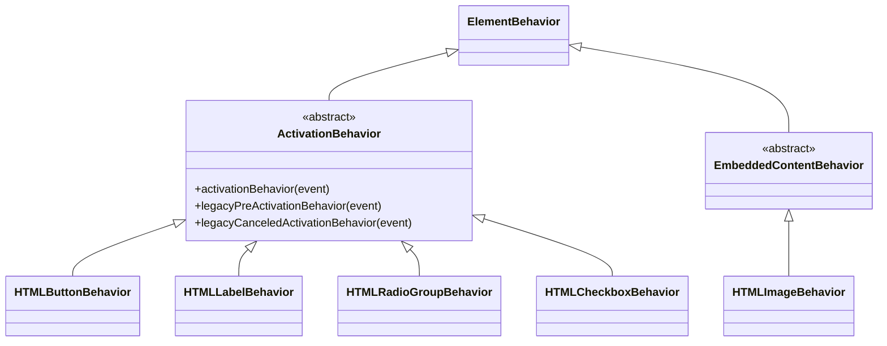

# Alternative: HTMLButtonBehavior

This document explores an alternative direction for [platform-provided behaviors](explainer.md). This alternative differs in two ways:

1. It collapses the three button modes into a single `HTMLButtonBehavior` whose `type` property mirrors the `type` attribute of native `<button>`. The behavior's `type` toggles which button mode the host participates in. Everything else (focusability, role, pseudo-classes, the activation path) is constant across types.
2. It declares behaviors via a `static behaviors` class property, letting the platform own behavior instantiation. Authors access the platform-created instances through a new `behaviors` collection on `ElementInternals`.

Four things motivate this alternative:

1. Modeling the button types as three separate behaviors duplicates most of the surface to express activation differences.
2. Web authors who want a single custom element class that can switch between submit, reset, and generic-button at runtime also want one element with one mutable property. A single `HTMLButtonBehavior` with a mutable `type` avoids having to define what happens when two button-shaped behaviors are attached at once and one is toggled off.
3. It matches native `<button>` and frameworks also use this shape.
4. The platform owns instantiation; authors look up state through `ElementInternals`.

## Proposed approach

A platform-provided behavior is a set of methods, values, and platform-protocol hooks that a custom element can participate in, which today are reserved to native HTML elements. This alternative introduces a `behaviors` static class property that declares which behaviors the platform attaches to instances of the class.

The platform reads `static behaviors` at `customElements.define()` time and stores it on the custom element definition, the same way it reads `static formAssociated`. When an element is created (`new`, parser upgrade, or `customElements.upgrade()`), the platform instantiates one of each declared behavior per host and associates them with the element. This mirrors how a form-associated custom element participates in form submission and form-related lifecycle callbacks.

`attachInternals()` is the author's access route to those already-existing instances, exposed through a new `behaviors` collection on `ElementInternals`. The set of behaviors attached to a host is fixed at the class declaration; the behavior instances themselves remain mutable post-attachment.

```javascript
class CustomButton extends HTMLElement {
  static formAssociated = true;
  // Declare which behaviors the platform attaches to each instance.
  static behaviors = [HTMLButtonBehavior];

  #internals;
  constructor() {
    super();
    // attachInternals() is the access route to the platform-created behaviors.
    this.#internals = this.attachInternals();

    // Access the behavior state directly.
    const buttonBehavior = this.#internals.behaviors.get(HTMLButtonBehavior);

    // Modify the behavior's properties.
    buttonBehavior.formAction = '/custom';
    buttonBehavior.type = 'reset';
  }
}
```

In this model authors never construct behaviors. `new HTMLButtonBehavior()` throws an `"Illegal constructor"` `TypeError`, the same as `ElementInternals`, because a free-standing instance would have no host to act on. The instance is obtained only through `internals.behaviors.get(HTMLButtonBehavior)` after `attachInternals()`.

Each behavior names the specific platform logic it engages:

- Event handling and activation.
- ARIA defaults (implicit role and ARIA properties).
- Focusability
- CSS pseudo-classes.
- Configurable data and state owned by the behavior.
- Platform protocol hooks.

### Behavior categories and composition

Behaviors are organized into a set of categories, expressed as abstract base classes.



`ActivationBehavior` and `EmbeddedContentBehavior` are abstract category bases; the concrete leaves (`HTMLButtonBehavior`, `HTMLLabelBehavior`, `HTMLRadioGroupBehavior`, `HTMLCheckboxBehavior`, `HTMLImageBehavior`) are what an author attaches.

An element attaches at most one behavior per category. Two behaviors in the same category are mutually exclusive, and attaching both throws a `TypeError`:

```javascript
static behaviors = [HTMLButtonBehavior, HTMLLabelBehavior]; // throws!
// TypeError: an element can have at most one ActivationBehavior;
// HTMLButtonBehavior and HTMLLabelBehavior cannot be combined.
```

Behaviors in different categories compose. Combining an `HTMLButtonBehavior` (activation) with an `HTMLImageBehavior` (embedded content) produces a submit button that renders as an image, similar to [`<input type=image>`](https://developer.mozilla.org/en-US/docs/Web/HTML/Element/input/image):

```javascript
class ImageButton extends HTMLElement {
  static formAssociated = true;
  static observedAttributes = ['src', 'alt'];
  static behaviors = [HTMLButtonBehavior, HTMLImageBehavior];

  #internals;
  #image;

  constructor() {
    super();
    this.#internals = this.attachInternals();
    // HTMLButtonBehavior defaults to type 'submit'.
    this.#image = this.#internals.behaviors.get(HTMLImageBehavior);
  }

  attributeChangedCallback(name, _old, value) {
    if (name === 'src') {
      this.#image.src = value;
    }
    if (name === 'alt') {
      this.#image.alt = value;
    }
  }
}
customElements.define('image-button', ImageButton);
```

```html
<form action="/search">
  <image-button src="/go.png" alt="Search"></image-button>
</form>
```

On activation the host submits the form (from `HTMLButtonBehavior`) while rendering the image and exposing its `alt` text as the accessible name (from `HTMLImageBehavior`). The two behaviors are in different categories, so the platform allows the combination. Because the category is the base class, the platform decides compatibility with a membership test. Adding a new behavior only requires placing it under the right base; it does not require enumerating its compatibility with every existing behavior.

#### `ActivationBehavior`

`ActivationBehavior` corresponds to the DOM standard's [activation behavior](https://dom.spec.whatwg.org/#eventtarget-activation-behavior): the algorithm an `EventTarget` runs when a `click` is dispatched to it and not canceled. The DOM standard pairs it with two optional hooks, [legacy-pre-activation behavior](https://dom.spec.whatwg.org/#eventtarget-legacy-pre-activation-behavior) and [legacy-canceled-activation behavior](https://dom.spec.whatwg.org/#eventtarget-legacy-canceled-activation-behavior), which native checkbox and radio use to set checkedness before listeners run and restore it if the event is canceled.

`ActivationBehavior` provides:

- Participation in the activation dispatch path (click, keyboard activation, and `element.click()`), honoring `preventDefault()` and `stopPropagation()`.
- The `legacy-pre-activation behavior` and `legacy-canceled-activation behavior` hooks (no-ops unless overridden).

Each concrete behavior supplies the rest:

- What the element does when activated (the activation algorithm).
- Its implicit ARIA role default.
- Its focusability default.
- Its keyboard-activation specifics.
- Its own state and the protocol surface it exposes.

Mapping a few native patterns onto categories helps validate the model:

| Native pattern | Behavior | Category | Notes |
|---|---|---|---|
| `<button>` | `HTMLButtonBehavior` | activation | submit/reset/button via `type`; invoker surface; form participation. |
| `<label>` | `HTMLLabelBehavior` | activation | `for`-attribute association and focus delegation, activation delegates a click to the labeled control, no implicit role, not focusable. |
| `<input type=radio>` | `HTMLRadioGroupBehavior` | activation | `name`-based mutual exclusion; needs the `legacy-pre-activation`/`legacy-canceled-activation` hooks for the check-then-restore dance. This is the concrete reason the base exposes those hooks. |
| `<input type=checkbox>` | `HTMLCheckboxBehavior` | activation | An independent on/off toggle, using the same `legacy-pre-activation`/`legacy-canceled-activation` hooks. |

Of these, `HTMLButtonBehavior`, `HTMLLabelBehavior`, and `HTMLRadioGroupBehavior` are the near-term candidates for future work.

The embedded-content category corresponds to the HTML spec's [embedded content](https://html.spec.whatwg.org/multipage/dom.html#embedded-content-2).

### HTMLButtonBehavior

This alternative introduces `HTMLButtonBehavior`, a behavior in the activation category (`class HTMLButtonBehavior extends ActivationBehavior`) that mirrors native `<button>`.

- The behavior has a `type` property (`'submit'` (default), `'reset'`, or `'button'`) that selects the active button mode. The `type` is mutable for the life of the behavior.
- User activation (click, Enter, Space, implicit submission) reaches the behavior through the same DOM event-dispatch path as native elements.
- The behavior provides a default implicit `role="button"`. Authors can override the role through `internals.role`.
- The custom element with HTMLButtonBehavior participates in sequential focus navigation, with `tabindex` and disabled state following established rules.
- The same logic that toggles `:default`, `:disabled`/`:enabled`, `:focus`, and `:focus-visible` on native elements applies to the behavior's host. The `:default` pseudo-class only matches when `type === 'submit'` and the host is the form's default submit button.
- Mirrored `HTMLButtonElement` properties are available on the behavior instance. They are configurable per-element and mutable for the life of the behavior.
- Form ownership applies whenever `type` is `'submit'` or `'reset'`. Activation behavior depends on `type`: `'submit'` triggers form submission and implicit submission; `'reset'` triggers form reset; `'button'` does generic activation.

`HTMLButtonBehavior` builds on top of [form-associated custom elements (FACEs)](https://html.spec.whatwg.org/multipage/custom-elements.html#form-associated-custom-elements). The custom element still has to opt in to form association with `static formAssociated = true` for submission to actually fire when `type` is `'submit'` or `'reset'`. Without it, `behavior.form` is always `null` and activation is a no-op even when the element is inside a form. This is a divergence from native `<button>`, which submits its form without any explicit opt-in.

| Scenario | Behavior |
|----------|----------|
| Form-associated element inside a form, `type === 'submit'` | Activation triggers submission, participates in implicit submission, matches `:default`. Invoker attributes on the host (`commandfor`, `popovertarget`) are ignored, matching native `<button type="submit">`. |
| Form-associated element inside a form, `type === 'reset'` | Activation triggers form reset. Invoker attributes on the host are ignored, matching native `<button type="reset">`. |
| Form-associated element inside a form, `type === 'button'` | Activation is a no-op for form behavior. Invoker attributes on the host (`commandfor`, `popovertarget`) fire as usual. |
| Form-associated element outside a form, or non-form-associated element | `behavior.form` is `null`. With no form owner, the host behaves like a native `<button>` without a form owner for all `type` values: there is no form to submit or reset, but invoker attributes on the host (`commandfor`, `popovertarget`) fire as usual and the element still gets `role="button"` and implicit focusability. |

### Behaviors are not opaque tokens

A recurring concern about consolidating form-control semantics into an opt-in is that web authors will not be able to figure out what a given opt-in actually does. This proposal addresses that concern:

- Each element behavior maps to a single native pattern (e.g., `HTMLButtonBehavior` provides exactly the semantics of `<button>`). Future element behaviors will need to follow the same naming convention.
- Each behavior is specified in terms of existing HTML algorithms. The behavior is the union of those algorithms, applied to a custom element.
- Web authors can override individual defaults. This already works today for role: `internals.role` overrides a behavior's default role without replacing the behavior. The same layering pattern can extend to other defaults (focusability, keyboard activation, and similar) if and when future proposals add the corresponding primitives on `ElementInternals`.

### Accessing behavior state

Each behavior exposes properties from its corresponding native element. Behaviors can be accessed via `internals.behaviors`. For `HTMLButtonBehavior`, the following properties are available (mirroring [`HTMLButtonElement`](https://developer.mozilla.org/en-US/docs/Web/API/HTMLButtonElement)):

**Properties:**
- `type` - selects the active button mode (`'submit'`, `'reset'`, or `'button'`); defaults to `'submit'`.
- `disabled` - read-only. Reflects whether the element is disabled, which is determined by the standard form-control mechanism (the `disabled` attribute or a `<fieldset disabled>` ancestor, [spec](https://html.spec.whatwg.org/multipage/form-control-infrastructure.html#attr-fe-disabled)) and surfaced through `ElementInternals`. This proposal does not add a separately settable per-behavior disabled state.
- `form` - read-only, delegates to `ElementInternals.form`. Form ownership only affects activation when `type` is `'submit'` or `'reset'`.
- `name`, `value` - submitter name and value. Read on submission (`type === 'submit'`).
- `formAction`, `formEnctype`, `formMethod`, `formNoValidate`, `formTarget` - submission overrides. Read on submission (`type === 'submit'`).
- `labels` - read-only, delegates to `ElementInternals.labels`.

*Note: `HTMLButtonElement` adds the properties listed above on top of `HTMLElement`. Custom elements already inherit the global `HTMLElement` IDL surface (`title`, `tabIndex`, `hidden`, etc.). Web authors can use these properties on the host as they would on any element.*

To expose these properties to external code, authors define getters and setters on the host that delegate to the behavior. See [Use case: Design system button](#use-case-design-system-button) for a complete worked example.

### Behavior lifecycle

| Event | What happens |
|-------|--------------|
| Element creation (`new`, parser upgrade, or `customElements.upgrade()`) | The platform instantiates each declared behavior with its defined defaults. The behavior's `type` selects the initial active button mode (`'submit'` by default). Role, focusability, and pseudo-class participation are active from this point. |
| `attachInternals()` | `internals.behaviors` is populated with the already-existing behavior instances. Authors now have read/write access through `internals.behaviors.get(ElementBehavior)`. |
| Host connected | Form association runs if `formAssociated = true`. The behavior's `form` is resolved. |
| `behavior.type` set to a new value | Form ownership, role, focusability, and pseudo-class state are recomputed. See [Mutating the `type` property](#mutating-the-type-property). |
| Host disconnected | Form association detaches. The behavior remains attached for when the host re-connects. |

### Mutating the `type` property

Setting `behavior.type` to a new value toggles the activation path and which pseudo-classes match.

```javascript
const buttonBehavior = this.#internals.behaviors.get(HTMLButtonBehavior);
buttonBehavior.type = 'reset'; // Was 'submit', now 'reset'.
```

Each subsystem affected by `type` is recomputed through the same paths the platform already runs for native `<button>` when its `type` attribute changes.

| Subsystem | Recompute when `behavior.type` is set |
|-----------|--------------------------------------|
| Form ownership | Re-association runs. `type === 'button'` detaches the behavior from form ownership; `type === 'submit'` or `'reset'` attaches it. |
| Activation behavior | The next activation runs against the new `type`. |
| `:default` match | Re-evaluated. Only matches when `type === 'submit'` and the host is the form's default submit button. |
| Implicit ARIA role | Unchanged. The role is `"button"` for all `type` values, so no recompute is needed. |
| Focusability | Unchanged. Focusability is the same for all `type` values. |

Setting `behavior.type` to an unknown string does not throw. The behavior coerces the value to the default state (`'submit'`), and the getter returns the canonical keyword for the active state. This matches the [Auto state](https://html.spec.whatwg.org/multipage/form-elements.html#attr-button-type-auto-state) that `<button>`'s `type` content attribute uses as the missing-value and invalid-value default.

Changing `behavior.type` between events of a single interaction (for example, between `mousedown` and `mouseup`, or between `keydown` and `keyup` on a key activation) queues the change. The change applies at end-of-interaction, between event tasks. This mirrors how the platform already handles `type` mutations on a native `<button>` during click dispatch.

### API design

Authors declare behaviors via a static class property; the platform creates and exposes the instances:

- `static behaviors` is an array of behavior classes (not instances).
- The platform instantiates each declared behavior with its defined defaults at element creation.
- `ElementInternals.behaviors` is a read-only, Map-like collection keyed by behavior class. `internals.behaviors.get(HTMLButtonBehavior)` returns the instance for this host. Entries can't be added or removed at runtime.
- Web authors hold references to behavior instances by looking them up through `internals.behaviors` once and caching the reference.

#### Classes vs a string-based API

Behaviors are class references, not string tokens. An earlier proposal, [`elementInternals.type`](https://github.com/whatwg/html/issues/11061), collected consistent feedback that a string opt-in is the wrong shape for this problem. That feedback motivates the class-based design used here.

- A misspelled token has no good failure mode. [As noted in the discussion](https://github.com/whatwg/html/issues/11061#issuecomment-3146290495), `static activationBehavior = 'buton'` "likely [...] can't throw," so the typo silently does nothing. A class reference is resolved by the JavaScript engine, so a misspelled `HTMLButtnBehavior` is a `ReferenceError` at parse time instead of a no-op.
- String tokens are not discoverable. The [same comment](https://github.com/whatwg/html/issues/11061#issuecomment-3146290495) adds that string tokens are "not super discoverable [...] there is no additional API surface to discover." A behavior class carries its own surface (properties, methods, and an `instanceof` relationship) that authors and tooling can inspect. See [Behaviors are not opaque tokens](#behaviors-are-not-opaque-tokens).

#### One `behaviors` array vs per-category slots

Even with classes instead of strings, the declaration could be split into one named opt-in per category. [Issue #1353](https://github.com/MicrosoftEdge/MSEdgeExplainers/issues/1353) proposes a `static activationBehavior` next to a `static replacedContent`, each set to a cluster keyword, so conflicts resolve at the WebIDL level: one slot per category.

```javascript
// Per-category string clusters (issue #1353)
static activationBehavior = 'button';
static replacedContent = 'image';
```

The keywords carry the [same problems](#classes-vs-a-string-based-api). Substituting classes keeps the per-slot shape while repeating what the class already encodes:

```javascript
// Per-category slots, with classes
static activationBehavior = HTMLButtonBehavior;
static replacedContent = HTMLImageBehavior;

// Or one object keyed by category
static behaviors = {
  activationBehavior: HTMLButtonBehavior,
  replacedContent: HTMLImageBehavior,
};
```

`HTMLButtonBehavior extends ActivationBehavior`, so its category is intrinsic. Naming the slot (`activationBehavior:`) restates that. It also forces the author to know the right key for every behavior, and a wrong key (`replacedContent: HTMLButtonBehavior`) becomes a new failure mode. A single flat array avoids all of it:

```javascript
static behaviors = [HTMLButtonBehavior, HTMLImageBehavior];
```

The platform reads each behavior's category from its base class, so it enforces one behavior per category on its own (see [Behavior categories and composition](#behavior-categories-and-composition)). The declaration stays short as categories are added, and each behavior is named once.

### Feature detection

Web authors can detect whether behaviors are supported by checking for the existence of behavior classes on the global scope:

```javascript
if (typeof HTMLButtonBehavior !== 'undefined') {
  // Behaviors are supported.
  class MyButton extends HTMLElement {
    static formAssociated = true;
    static behaviors = [HTMLButtonBehavior];

    #internals;
    constructor() {
      super();
      this.#internals = this.attachInternals();
    }
  }
  customElements.define('my-button', MyButton);
} else {
  // Fall back to manual event handling.
  class MyButton extends HTMLElement {
    static formAssociated = true;

    #internals;
    constructor() {
      super();
      this.#internals = this.attachInternals();
      this.addEventListener('click', () => {
        this.#internals.form?.requestSubmit(this);
      });
    }
  }
  customElements.define('my-button', MyButton);
}
```

### Other considerations

This proposal supports common web component patterns:

- Custom elements using behaviors can follow progressive enhancement patterns: use `<slot>` to render fallback content, provide `<noscript>` alternatives, and design markup to be readable without JavaScript. If script fails to load, the element receives no behavior, which is true for any autonomous custom element with or without this proposal.
- Because behaviors are pinned to existing algorithms, this framework also enables polyfilling: authors can approximate new behaviors in *userland* before native support ships.
- While this proposal uses an imperative API, the design supports future declarative custom elements. A declarative form would attach behaviors by a registered string name rather than a class reference. Each built-in behavior would have a canonical token (for example, `HTMLButtonBehavior` registered as `"button"`).

```html
<my-button behaviors="button">Help</my-button>
```

### Use case: Design system button

A design system can use a single class with one `HTMLButtonBehavior` and forward the host's `type` attribute to the behavior.

```javascript
class DesignSystemButton extends HTMLElement {
  static formAssociated = true;
  static behaviors = [HTMLButtonBehavior];
  static observedAttributes = ['type', 'formaction'];

  #internals;
  #buttonBehavior;

  constructor() {
    super();
    this.#internals = this.attachInternals();
    this.#buttonBehavior = this.#internals.behaviors.get(HTMLButtonBehavior);
    this.attachShadow({ mode: 'open' });
  }

  connectedCallback() {
    this.shadowRoot.innerHTML = '<slot></slot>';
  }

  attributeChangedCallback(name, _oldValue, newValue) {
    switch (name) {
      case 'type': {
        if (newValue === 'submit' || newValue === 'reset' || newValue === 'button') {
          this.#buttonBehavior.type = newValue;
        }
        break;
      }
      case 'formaction': {
        this.#buttonBehavior.formAction = newValue ?? '';
        break;
      }
    }
  }
}

customElements.define('ds-button', DesignSystemButton);
```

```html
<form action="/save">
  <ds-button type="submit">Save</ds-button>
  <ds-button type="reset">Reset</ds-button>
  <ds-button type="button" onclick="openHelp()">Help</ds-button>
</form>
```

Setting the `type` attribute at runtime flips the active mode through `attributeChangedCallback`, the way an author would expect:

```javascript
document.querySelector('ds-button').setAttribute('type', 'reset');
// The behavior's type is now 'reset'. The next activation triggers form reset.
```
