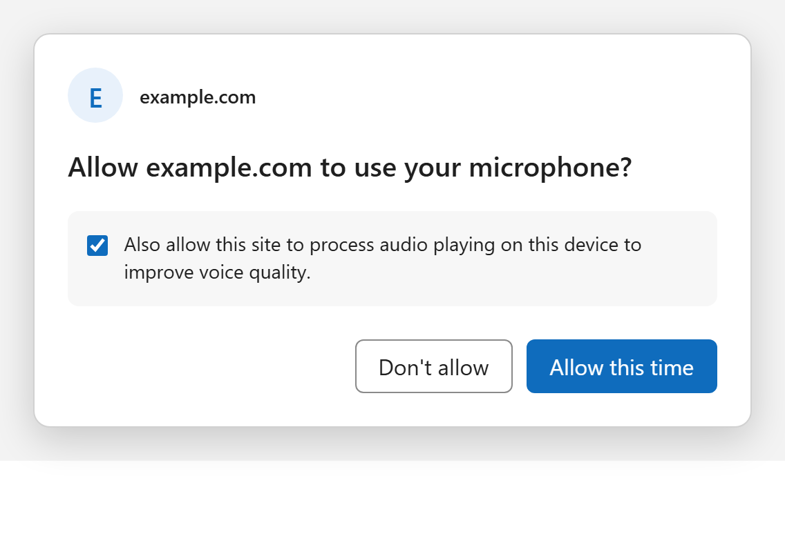

# Playback Reference Audio Capture

## Authors

- [Huseyin Ozcan](https://github.com/huozcan-ms)
- Max Solodovnikov
- Hong Sodoma
- Vinod Prakash
- [Nishitha Dey](https://github.com/nishitha-burman)

## Participate

- [Proposal issue and discussion](https://github.com/w3c/mediacapture-screen-share-extensions/issues/12)
- [MSEdgeExplainers issue tracker](https://github.com/MicrosoftEdge/MSEdgeExplainers/issues)

## Introduction

Web applications increasingly depend on advanced, real-time audio processing:
conversational AI and voice agents, accessibility experiences, meeting and
calling clients, transcription, and custom machine-learning (ML) audio
enhancement. All of these need to separate what the user is saying from what
the device is playing back.

Browsers today expose microphone input through `getUserMedia()`, but they do
not expose an independent, application-consumable signal of what the browser
or system is playing out of the speakers. That signal is called a **playback
reference**. This document proposes a constrained playback reference: a
purpose-scoped primitive that lets an application obtain a time-aligned
reference of playback audio so it can run deterministic or ML-based processing
on the raw microphone signal.

Two API shapes remain under consideration:

1. A purpose-built `navigator.mediaDevices.getPlaybackReference()` method that
   returns microphone and playback-reference tracks.
2. An extension to `getUserMedia()` that requests an optional playback
   reference alongside microphone capture.

Both options use a coordinated request, a shared permission model, and the
same microphone-only fallback.

## User-facing problem

People using browser-based calls, voice agents, transcription, and
accessibility tools can have audio played by their device leak back through
their microphone. Other participants may hear echo, transcription may treat a
screen reader or narrator as the user's speech, and voice agents may act on
played-back audio instead of the user's words. These failures are especially
harmful during simultaneous speech, when a person tries to interrupt an agent,
or when assistive audio is active.

Without a playback reference:

- Applications cannot perform their own deterministic echo cancellation. They
  are limited to the browser's built-in echo canceller, which they cannot
  inspect, tune, or replace.
- Applications cannot reliably distinguish near-end user speech from
  system-generated audio such as media, other participants, a screen reader,
  or a narrator.

The browser's built-in WebRTC echo cancellation is helpful for the common
human-to-human calling case, but it is insufficient for these newer scenarios:

- It does not expose the underlying microphone or reference signals.
- It does not allow an application to implement its own deterministic,
  model-based cancellation.
- It is not designed as a full-duplex canceller and has known quality limits
  under difficult conditions.
- Its behavior is bundled: echo cancellation is coupled with automatic gain
  control (AGC) and noise suppression (NS), and these cannot be enabled or
  disabled independently.

## Goals

- Provide applications with a **time-aligned playback reference** suitable for
  echo cancellation and related signal processing.
- Enable **deterministic, application-defined** echo cancellation and speech
  separation on top of the raw microphone signal.
- Improve speech quality, transcription accuracy, interruption handling, and
  overall user experience for browser and WebView-hosted real-time
  communication (RTC) and voice-agent applications.
- Give applications access to the playback reference **without** requiring
  screen sharing.
- Keep the capability **narrowly scoped**, mediated by the browser, and aligned
  with user expectations.

## Non-goals

- This is **not** unrestricted system-audio capture. The capability is scoped
  to a reference for processing, not a general recording tap.
- This is **not** a replacement for the browser's built-in echo cancellation.
  Applications that do not need custom processing can continue to rely on the
  built-in path.
- This does **not** bypass user awareness or browser mediation. The user
  remains in control, and the browser remains the arbiter of access.

## Motivating use cases

### Browser-based real-time communication

A user is on a browser-based call. Local playback, including far-end
participants, shared media, and notification sounds, leaks into the microphone
capture and is heard as echo by the other side. Application-level cancellation
cannot reliably remove this leakage without a reference for exactly what was
played out.

With either API option, an application can request raw microphone capture and
a synchronized playback-reference track in one coordinated operation. It can
then feed the two tracks into its own cancellation pipeline.

### Accessibility: screen readers and narrators

A user relies on a screen reader or operating-system narrator while using a
voice experience. The narrator audio plays out of the device and is picked up
by the microphone. Because the narrator is a system-level source, the
application has no reference for it and cannot cancel it. Assistive audio can
then contaminate captured speech and, in agent scenarios, be transcribed and
acted on as if it were the user. This is a real accessibility regression, not
a theoretical one.

A system-scoped playback reference, if the user grants it, gives the
application the second signal needed to distinguish this played-back audio
from the user's speech.

### Advanced application-level and ML-based processing

Modern voice agents and communication clients run their own ML audio pipelines,
including custom echo cancellation, voice isolation, speaker separation, and
noise suppression. These models require two inputs: the **raw microphone
signal** and a **clean playback reference**. Today the application can obtain
neither in a form that is deterministic and time-aligned, so it is forced to
run on top of browser-processed audio, which degrades the model's input and
output.

The proposed synchronized tracks provide those two inputs while allowing the
application to turn browser-provided processing back on if the optional
playback reference is unavailable.

## Why existing APIs are insufficient

- **`getUserMedia()`** provides microphone input, optionally with browser echo
  cancellation, but provides no playback reference. When echo cancellation is
  enabled, the signal is already altered; when it is disabled, echo is present
  but there is still no reference with which to remove it.
- **`getDisplayMedia()`** can expose system audio, but only as a side effect of
  screen sharing. It couples audio access to visual capture, adds a prominent
  capture-sharing experience, and is not suitable for audio-only, always-on
  communication scenarios.

Neither API gives an application a purpose-built, time-aligned playback
reference for signal processing.

## Why cascading browser processing with an application pipeline is not a solution

A natural objection is: "Let the browser or system cancel the loopback first,
and let the application run its ML processing on top. Why is a reference
needed?" This section answers that objection directly.

The short version is that cascading two adaptive, nonlinear audio pipelines
violates the assumptions each pipeline was designed under. The browser stage
transforms the signal in ways the application stage cannot see, invert, or
compensate for, and the application stage can no longer model the echo it is
supposed to remove. The problems below are structural, not tuning issues.

### The browser cannot provide "loopback cancellation only"

In Chromium, echo cancellation is bundled with automatic gain control and
noise suppression, and these cannot be toggled independently. "Let the browser
cancel the loopback, then let the application process on top" is therefore not
available. In practice, the application inherits acoustic echo cancellation
(AEC), AGC, and NS rather than a clean loopback cancellation stage.

### Signal-domain corruption

- **Nonlinear, time-varying echo removal breaks the application's echo model.**
  The browser echo canceller is nonlinear and adapts over time. It removes most
  of the linear echo and leaves a nonlinearly distorted residual. An
  application canceller that assumes a linear echo path can no longer model
  that residual, and without a reference signal it cannot recover it.
- **Unknown gain from AGC cannot be inverted.** The bundled AGC applies
  time-varying gain to the microphone signal before the application receives
  it. Any reference the application has no longer matches the scaled near-end
  signal, and the applied gain is neither exposed nor logged.
- **Noise suppression pushes ML models out of distribution.** The bundled NS
  reshapes spectral content and the noise floor. ML models trained on natural
  microphone input then receive out-of-distribution audio, which degrades
  separation, voice isolation, and transcription accuracy even when each stage
  performs acceptably in isolation.

### Adaptation and timing failures

- **Double convergence at call start.** Two adaptive filters converge at the
  same time when a call begins. This lengthens the window in which echo leaks
  through, which directly harms first-audio-response latency.
- **Delay-estimation breakage.** The browser stage introduces variable
  processing and buffering delay. The application canceller's delay estimator
  sees a shifting offset between reference and capture, causing misalignment
  and intermittent echo bursts. A first-class reference needs a timing and
  clock contract to avoid this.
- **Playback glitches appear to be echo-path changes.** Buffer underruns or
  dropped playback frames create discontinuities that the application
  canceller interprets as changes in the echo path, forcing costly
  re-convergence and audible artifacts.

### Double-talk and duplex behavior

- **Compounded half-duplex behavior.** The browser canceller is not designed as
  a full-duplex canceller. Placing a second suppressor on top compounds the
  tendency toward half-duplex behavior, which breaks barge-in and interruption.
  Interruption failures prevent users from correcting or stopping voice agents
  during simultaneous speech, so this is not a corner case.
- **Double-talk detector failure.** The browser stage alters the energy and
  spectral statistics of the signal. The application's double-talk detector,
  tuned on raw microphone input, can then misfire and clip near-end speech
  during simultaneous talk.

### System integrity and testability

- **Compounded compute and thermal cost.** Running two full audio-processing
  stacks compounds overhead and risks dropouts and glitches on lower-end
  devices.
- **Multi-source attribution is impossible with a single mixed capture.** When
  several sources play at once, such as other call participants, media, and a
  narrator, a single mixed capture path gives neither stage a correct
  per-source reference. This is a plausible root cause for cases where audio
  from a separate application leaks into a voice agent even with system-wide
  cancellation enabled. A labeled or per-source reference resolves it;
  cascading cannot.
- **Non-reproducibility and evaluation gaps.** A double-processed configuration
  cannot be evaluated deterministically unless tests reproduce both adaptive
  processing stages. Otherwise, test results do not represent the audio
  configuration users receive.

### Summary

Cascading fails because the browser stage is nonlinear, time-varying, bundled
(AEC plus AGC plus NS), and opaque. The application stage cannot see what was
done, cannot invert it, and can no longer model the echo it must remove. The
needed primitive is a deterministic, time-aligned playback reference that the
application can use itself, not a second pipeline stacked on an uncontrollable
first stage.

## Proposed approach

Introduce browser-mediated access to two separate audio tracks:

- A microphone track containing audio captured from the user's microphone.
- An optional playback-reference track containing audio rendered by the device.

Both are `MediaStreamTrack` objects whose `kind` is `"audio"`, but they carry
audio from different sources. The browser creates them through one coordinated
request and guarantees that their timestamps can be aligned. The application
can then use both tracks for its own audio-processing pipeline.

The microphone remains available if the user declines playback-reference
access. This lets the voice experience continue with microphone-only capture
and, where appropriate, browser-provided audio processing.

Two API shapes are considered:

1. Add a purpose-built `getPlaybackReference()` method.
2. Extend `getUserMedia()` to request an optional playback reference.

Both options can use the same permission UI and provide the same microphone-only fallback. The main difference is the developer-facing API and return shape.

### Option 1: Add `getPlaybackReference()`

Add a new `MediaDevices` method that requests microphone capture and
an optional playback reference together.

```js
const result =
    await navigator.mediaDevices.getPlaybackReference({
      microphone: {
        echoCancellation: false,
        noiseSuppression: false,
        autoGainControl: false,
      },
      playback: {
        scope: "system",
        optional: true,
      },
    });

const microphoneTrack = result.microphoneTrack;
const playbackReferenceTrack = result.playbackReferenceTrack;

if (playbackReferenceTrack) {
  // Application-defined processing; this is not a proposed web-platform API.
  await processWithApplicationAudioPipeline(
      microphoneTrack, playbackReferenceTrack);
}
```

`microphoneTrack` is available when microphone permission succeeds.
`playbackReferenceTrack` is either a synchronized `MediaStreamTrack` or `null`,
depending on the user's playback-reference choice.

If the reference is unavailable, the application can continue with the
microphone and request browser-provided audio processing:

```js
if (!playbackReferenceTrack) {
  await microphoneTrack.applyConstraints({
    echoCancellation: true,
    noiseSuppression: true,
    autoGainControl: true,
  });
}
```

Possible playback scopes include:

- `"origin"`: audio produced by the requesting origin.
- `"browser"`: audio produced by the browser.
- `"system"`: audio rendered by the device.

This option entails adding:

- `MediaDevices.getPlaybackReference()`.
- An options dictionary that reuses `MediaTrackConstraints` for microphone
  configuration and adds playback-reference request options.
- A playback scope that identifies the requested source category.
- A result object with `microphoneTrack` and nullable
  `playbackReferenceTrack` members.
- Audio-only access to system playback without display capture.
- A synchronization contract when both tracks are returned.
- Permission UI and an active-capture indicator for playback-reference access.

| Pros | Cons |
| --- | --- |
| Clearly communicates that the API provides a playback reference. | Adds a new web-platform API. |
| Returns explicitly named microphone and playback-reference tracks. | Substantially overlaps with `getUserMedia()` when playback access is declined. |
| Keeps playback-reference behavior separate from existing `getUserMedia()` behavior. | Requires a new options dictionary and result type. |
| Can support additional playback scopes in the future. | Applications must adopt a new microphone-capture entry point for this use case. |

### Option 2: Extend `getUserMedia()`

Extend `getUserMedia()` so an application can request an optional playback
reference alongside microphone capture.

```js
const stream =
    await navigator.mediaDevices.getUserMedia({
      audio: {
        echoCancellation: false,
        noiseSuppression: false,
        autoGainControl: false,
      },
      playbackReference: {
        scope: "system",
        optional: true,
      },
    });

const microphoneTrack =
    stream.getAudioTracks().find(track =>
      track.getSettings().sourceType === "microphone");

const playbackReferenceTrack =
    stream.getAudioTracks().find(track =>
      track.getSettings().sourceType === "playback-reference") ?? null;

if (playbackReferenceTrack) {
  // Application-defined processing; this is not a proposed web-platform API.
  await processWithApplicationAudioPipeline(
      microphoneTrack, playbackReferenceTrack);
}
```

The stream always contains the microphone track when microphone permission
succeeds. It contains a synchronized playback-reference track only when the
user grants that access.

This example uses a proposed `sourceType` setting to distinguish the two audio
tracks.

This option entails adding:

- A `playbackReference` member to the `getUserMedia()` request.
- Playback-reference request options, including the requested scope.
- The ability for `getUserMedia()` to return a playback-reference track.
- A `sourceType` setting, or another mechanism for distinguishing microphone
  and playback-reference tracks.
- Audio-only access to system playback without display capture.
- A synchronization contract when both tracks are returned.
- Permission UI and an active-capture indicator for playback-reference access.

| Pros | Cons |
| --- | --- |
| Reuses the established microphone-capture entry point. | Expands `getUserMedia()` beyond user-input devices. |
| Naturally supports microphone-only fallback when playback access is declined. | Changes the expectation that `getUserMedia()` returns only microphone audio. |
| Can build on existing constraints and permission-processing patterns. | Requires a new way to distinguish two kinds of audio track. |
| Avoids adding another method to `MediaDevices`. | Makes the returned `MediaStream` and track-selection logic more complex. |

### Permission model shared by both options

Both API shapes can present the same permission UI because they request the
same capabilities. The microphone is required. Playback-reference access is
optional and can be shown as a preselected checkbox:



If the user clears the checkbox:

- Microphone capture still succeeds.
- Option 1 returns `playbackReferenceTrack` as `null`.
- Option 2 returns a microphone-only `MediaStream`.
- The application can fall back to browser-provided audio processing.

If the user leaves the checkbox selected, the browser returns synchronized
microphone and playback-reference tracks.

The permission flow can adapt to existing grants:

- If neither permission exists, show the combined prompt.
- If microphone permission already exists, prompt only for playback-reference
  access.
- If both permissions are active for the session, do not prompt again.


## Detailed design considerations

### Reference fidelity and tap point

The specification must define where in the audio path the reference is taken. A
post-mix, resampled, or post-volume signal models a different signal than what
reached the speaker and undermines cancellation. The reference should be
defined relative to the rendered output, with sample rate, channel layout, and
pre- or post-volume state specified.

### Clock domain, timestamps, and discontinuities

Reference and capture must share a clock, or the reference must carry
timestamps convertible to the capture clock, so the application can align them
without drift. Playback gaps, underruns, and device changes should be signaled
so the application can handle them rather than misinterpret them as echo-path
changes.

### Source scope

The considered source scopes are origin audio, browser audio, and system audio.
An initial version may expose a single mixed same-origin or same-instance
playback reference. Whether per-source or labeled references are required
remains open.

### Synchronization and lifecycle

When both tracks are returned, the browser guarantees that their timestamps can
be aligned. Playback-reference access is associated with microphone capture.
The user can stop the reference while preserving the microphone, and the
reference ends when the associated microphone capture ends. Muting the
microphone immediately terminates the reference signal.

### Interaction with built-in processing

The specification must define how the reference behaves when the application
also requests browser echo cancellation. The intended primary mode is for the
application to request raw capture with built-in processing off, request the
reference, and perform its own cancellation. When the optional reference is
not granted or is unavailable, the application can fall back to
browser-provided echo cancellation, noise suppression, and automatic gain
control.

## Security and privacy considerations

This capability exposes information about what the device is playing back, so
it must be scoped and mediated carefully.

- **What information is exposed?** A playback audio reference intended for
  local signal processing. The proposal is not intended to provide an
  unrestricted recording tap, but audio samples exposed to JavaScript can be
  processed, stored, or transmitted.
- **Is it scoped to the minimum necessary?** The considered scopes distinguish
  requesting-origin, browser, and system playback. The selected scope is
  permission-bearing and cannot be changed later through track constraints.
- **How does the user stay aware and in control?** Access requires a
  user-initiated request, distinct playback-reference permission, a persistent
  active-capture indicator, and a way to stop reference access while preserving
  microphone capture.
- **What is the lifecycle guarantee?** Access is associated with active
  microphone capture. Ending the associated microphone capture ends the
  playback reference.
- **Does it create a new exposure surface beyond what exists today?**
  Microphone access without echo cancellation already indirectly exposes
  played-back audio through acoustic coupling. This proposal seeks a
  programmatic, controlled, and higher-quality version of a capability that
  acoustically already leaks, while keeping the user and browser in control.
- **What origin boundaries apply?** Protected media and cross-origin media need
  defined handling. Permissions Policy should control access by embedded
  documents.
- **What abuse and fingerprinting risks apply?** The reference should not
  become a side channel for cross-origin content or silent, always-on system
  capture. Source scope, permission, user initiation, indicators, and lifecycle
  constraints are intended to limit this risk. Further design and standards
  input are needed.
- **How does permission compose with microphone access?** The microphone is
  required and playback-reference access is optional. The two permissions are
  separate even when presented in a combined prompt. The right level of
  permission friction for real-time, always-on use cases remains an open
  question.

## Accessibility considerations

The proposal directly addresses an accessibility failure mode: screen-reader
or narrator audio can leak into microphone capture and be transcribed or acted
on as if it were the user's speech. A playback reference can let an application
separate that assistive audio from near-end speech.

The permission experience and active-capture indicator must remain
understandable and operable for people using assistive technology. The
permission mockup is conceptual; final user-interface accessibility is part of
the unresolved permission and user-awareness design.

## Internationalization considerations

The proposed API carries audio tracks and does not define text processing,
locale-dependent behavior, language negotiation, or text direction. The
proposal therefore identifies no direct internationalization-specific API
requirements. Transcription and speech-model language handling remain the
responsibility of the application's downstream processing and are not changed
by this proposal.

## Considered alternatives

### Continue relying on built-in browser echo cancellation

Built-in cancellation helps the common case, but does not expose reference
signals and does not enable application-defined deterministic processing. It
cannot serve the accessibility and ML scenarios above.

### Use `getDisplayMedia()` with system audio

This can expose system audio in screen-sharing scenarios, but couples audio to
visual capture, adds capture-sharing friction, and is unsuitable for
audio-only, always-on communication.

### Cascade browser processing with an application pipeline

This is structurally unsound: the application stage cannot see, invert, or
compensate for the bundled, nonlinear, time-varying browser stage and cannot
model the echo it must remove. The detailed failure modes are described in
[Why cascading browser processing with an application pipeline is not a
solution](#why-cascading-browser-processing-with-an-application-pipeline-is-not-a-solution).

### Choose one API shape now

The purpose-built `getPlaybackReference()` method provides clearer naming and
an explicit result containing the two possible tracks. Extending
`getUserMedia()` avoids a second microphone-capture API and makes
microphone-only fallback a natural extension of existing behavior. Both remain
open pending broader standards and implementer feedback.

### Do nothing

Browser-based communication and conversational-AI experiences remain
constrained relative to native platforms whenever playback and microphone
capture interact.

## Dependencies on non-stable features

Both options build on the existing `MediaDevices`, `MediaStream`, and
`MediaStreamTrack` models. The source proposal identifies no dependency on a
separate non-stable web-platform feature. New playback-reference permission,
scope, synchronization, and lifecycle contracts are part of this proposal
rather than external dependencies.

## Stakeholder feedback

No implementer or standards stakeholder positions are documented yet.

## Open questions and future work

- Should the capability use the purpose-built `getPlaybackReference()` method
  or extend `getUserMedia()`?
- For the `getUserMedia()` option, should a `sourceType` setting distinguish
  tracks, or should the platform provide a dedicated track-selection method?
- What permission and user-awareness model is appropriate, and how does it
  compose with microphone permission?
- Which playback scopes should an initial version support: origin, browser, or
  system?
- Is a single mixed playback reference sufficient for a first version, or is a
  per-source or labeled reference needed early?
- How should protected and cross-origin media be handled?
- What Permissions Policy should control access by embedded documents?
- How should playback gaps, device changes, and other discontinuities be
  signaled?
- At what point in the output pipeline should the reference be tapped, and
  should it reflect pre- or post-volume audio?
- Should browsers restrict use of the reference to processing scenarios, and
  if so, how can that be enforced after samples are exposed to JavaScript?
- How should the capability interact with the built-in browser audio-processing
  chain, including the bundling of AEC with AGC and NS?
- Should there be an independent path to decouple AEC from AGC and NS in the
  built-in chain?

## References and acknowledgements

- [Proposal and discussion](https://github.com/MicrosoftEdge/MSEdgeExplainers/issues/1372)
- [`MediaDevices.getUserMedia()`](https://developer.mozilla.org/docs/Web/API/MediaDevices/getUserMedia)
- [`MediaDevices.getDisplayMedia()`](https://developer.mozilla.org/docs/Web/API/MediaDevices/getDisplayMedia)
- [`MediaStreamTrack`](https://developer.mozilla.org/docs/Web/API/MediaStreamTrack)
