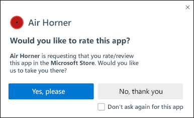
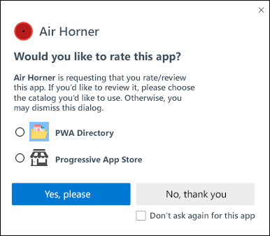

# Prompt for Rating/Review Explainer

Consider all sections required unless otherwise noted.

Author: [Aaron Gustafson](https://github.com/aarongustafson), [Diego Gonzalez](https://github.com/diekus)

## Status of this Document

This document is a starting point for engaging the community and standards bodies in developing collaborative solutions fit for standardization. As the solutions to problems described in this document progress along the standards-track, we will retain this document as an archive and use this section to keep the community up-to-date with the most current standards venue and content location of future work and discussions.

* This document status: **Active**
* Expected venue: [W3C Web Incubator Community Group](https://wicg.io/)
* **Current version: this document**

## Introduction

In the context of app catalogs (e.g., Apple’s App Store, Google’s Play Store, and Microsoft’s Store), reviews are a critical component of app discovery. There is currently no means of enabling a progressive web app (PWAs) to participate in these catalogs’ ratings and reviews features without

1. creating a native wrapper
2. invoking proprietary, native code to connect to the catalog, and
3. being installed from that catalog.

For PWAs to become an equal participant in these catalogs, it will be critical that they have a means integrating with these rating and review systems.

## Goals

* Establish a browser/platform agnostic approach to prompting a user to review an “installed” PWA.
* Provide a mechanism by which developers can associate their PWA with a listing within an app catalog.
* Establish limits for prompting that govern 1) how frequently a prompt can be made and 2) how many total times a PWA may prompt the user.

## Non-goals

* Enable users to review a website outside of the “installed PWA” context.

## Use Case

When a user has shown significant engagement with a piece of software, the software developers might request that the user rate their experience with the offering or even write a review of it for the app catalog associated with the user’s operating system or a third-party. In the context of the prompt, the user can

* choose to accept the prompt, in which case they will be taken to the appropriate app catalog to complete the review;
* choose to dismiss the prompt, but allow the PWA to make the request again; or
* choose to dismiss the prompt and not allow the PWA to make the request again.

## Prior Art

Each app catalog provides its own API for triggering an app review flow within the context of that store:

* [Apple’s Store Kit](https://developer.apple.com/app-store/ratings-and-reviews/) provides `SKStoreReviewController.requestReview()`
* Google’s Play Store provides this functionality in multiple languages: [C++](https://developer.android.com/guide/playcore/in-app-review/native) (`ReviewManager_requestReviewFlow`), [Java and Kotlin](https://developer.android.com/guide/playcore/in-app-review/kotlin-java) (`ReviewManager.requestReviewFlow()`), and [Unity](https://developer.android.com/guide/playcore/in-app-review/unity) (`ReviewManager.RequestReviewFlow()`).
* Microsoft’s Store provides this functionality in multiple languages using [`RequestRateAndReviewAppAsync` and the proprietary URL protocol `ms-windows-store`](https://docs.microsoft.com/en-us/windows/uwp/monetize/request-ratings-and-reviews).


## API Proposal

To request a review, a PWA developer would use the Promise-based method `navigator.requestReview()`. This method will:

* resolve when a rating or review has been [successfully handed off](#the-handoff-to-a-catalog)—the `success` value will be equal to the origin of the catalog chosen (e.g., [play.google.com](https://play.google.com), www.microsoft.com, www.pwastore.com); or
* be rejected if the user declines to leave a review/rating at this time.

```js
if ( 'requestReview' in navigator )
{
  navigator.requestReview()
    .then( catalog => console.log( `Handed off to ${catalog}` ) );
}
```

Resolution of the Promise does not indicate that a review was completed, it is only an indication that the user was [successfully handed off to the app catalog](#the-handoff-to-a-catalog). Once [the handoff](#the-handoff-to-a-catalog) is complete, the UA must track that and reject any future calls to `navigator.requestReview()` with a "completed" value and not display the prompt.

When the Promise is rejected, the following `reason` values are allowed:

* "completed" - `String` indicating the user has already been handed off to the app catalog to review/rate the app.
* "deferred" - `String` indicating the user has declined to review/rate the app. If the UA allows the prompt to be closed without a choice being made, this should be the rejection value.
* "disallowed" - `String` indicating the user has declined to review/rate the app and has explicitly denied this site access to this feature in future.
* <var>error</var> - Instance of `Error` providing details about an error that happened.

To account for the different potential interactions, developers are encouraged to track the user’s status with regard to reviews. For example, they might update this code to include additional logic specific to their PWA:

```js
if ( 'requestReview' in navigator &&
     ! app.review.declined &&
     ! app.review.completed &&
     app.review.okToRequest() )
{
  navigator.requestReview()
    .then( catalog => {
      // User was handed off to `catalog` to
      // complete their review
      app.reviews.completed = true;
      app.reviews.catalog = catalog;
    })
    .catch( rejection => {
      // User declined to review now,
      // but did not take away our ability to ask again
      if ( rejection === "deferred" )
      {
        app.reviews.askLater();
      }
      // User declined to review
      else if ( rejection === "disallowed" )
      {
        app.reviews.userDeclined = true;
      }
      // something went wrong
      else
      {
        console.log( rejection );
      }
    });
}
```

If a user disallows the PWA to prompt again, the user agent must track that and reject any future calls to `navigator.requestReview()` with a "disallowed" value without displaying the prompt to the user again.

## User Interface

When a user is prompted to rate or review a PWA, they should be presented with a dialog confirming their interest in doing so. It must state where they will be taken to complete the review (e.g., Microsoft Store) and provide them with the following options:

* Accept the request and go to the named catalog;
* Defer the request; or
* Decline the request and disallow the PWA from making further requests.

This prompt could look something like the following:

<figure id="prompt">



</figure>

If the UA supports multiple catalogs, the prompt could look something like this:

<figure id="prompt">



</figure>

### Choosing which App Catalog(s) to Offer

UAs are encouraged to choose a single, relevant catalog, but UAs may choose to provide a small selection of catalog options the user can choose from. The following algorithm should be used to determine the correct catalog(s):

* *Was the PWA installed from a catalog?*
  * **Yes:** Use that
  * **No:** Continue
* *Does the browser have a catalog associated with it?*
  * **Yes:** Use that
  * **No:** Continue
* *Does the current platform have a specific catalog?*
  * **Yes:** Use that
  * **No:** Continue
* Enumerate catalogs that are not tied to a specific platform (e.g. PWA Store, PWA Directory)

## The Handoff to a Catalog

In order to simplify the implementation for UAs and provide each catalog with full control over UI, form fields, user account, etc., the UA is instructed to open a new `display: standalone` window navigated to the chosen catalog’s ratings/reviews URL. The PWA’s [unique ID](https://github.com/w3c/manifest/issues/586) will be provided as the value of the query string parameter `id`. A PWA’s unique ID will be calculated as follows:

> <var>origin</var> + ( `manifest.id` || <var>manifest_url</var> )

It will be up to the catalog to resolve this unique ID against their own internal catalog system to ensure the correct PWA is chosen to associate with the rating/review.

Catalogs should make note of the following when it comes to tracking/resolving a unique ID:

* Inclusion of the <var>origin</var> in the unique ID will reduce the possibility for a bad actor to prompt for reviews of a different PWA or app. Its inclusion, however, does complicate things if the PWA moves to a new domain. Catalogs are encouraged to provide some mechanism for PWAs to migrate their existing origin to a new one in order to ensure continuity in their catalog listing.
* Catalogs will need to pay attention to updates to an PWA’s Manifest in order to observe whether an `id` value has added, modified, or removed as this will affect the calculation of the unique ID on the UA side and may cause issues when it comes to resolving that unique ID against their own internal catalog.

UAs may choose to include a unique string in the `Referer` header in order to enable the app catalog to know where the request originated. For instance, in the case of Microsoft Edge, it might use "edge://apps":

```
Referer: edge://apps
User-Agent: Mozilla/5.0 (Macintosh; Intel Mac OS X 10_15_7) AppleWebKit/537.36 (KHTML, like Gecko) Chrome/89.0.4325.0 Safari/537.36 Edg/89.0.711.0
```

## Privacy and Security Considerations

### Privacy

As the user controls whether to open the rating/review UI for a catalog is opened and given that no user-identifiable information is provided to that UI, no considerable privacy concerns are expected. But we welcome community feedback.

### Security

No considerable security concerns are expected, but we welcome community feedback.

## Open Questions

1. Instead of drawing a hard line with "disallowed," should there instead be a cooling off period? Apple, for instance, [only allows 3 prompts in a 365-day period](https://developer.apple.com/documentation/storekit/skstorereviewcontroller/requesting_app_store_reviews).
2. If the app uses a federated identity login and knows the user's association with a catalog, should the app be able to suggest a specific catalog for the review prompt?
3. What happens if the installed Web app has no entry in the app catalog?  
4. Should we enable developers to prompt for a specific catalog by supplying the catalog origin as an argument to the method? *The challenge here would be knowing where to hand off for the rating/review to take place. It might require that the argument be the full URL necessary to render the rating UI, but that could become an abuse vector.*
5. How should independent app catalogs advertise their ability to participate in the prompt?
