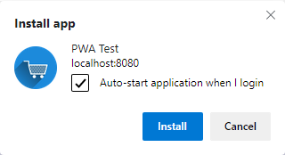
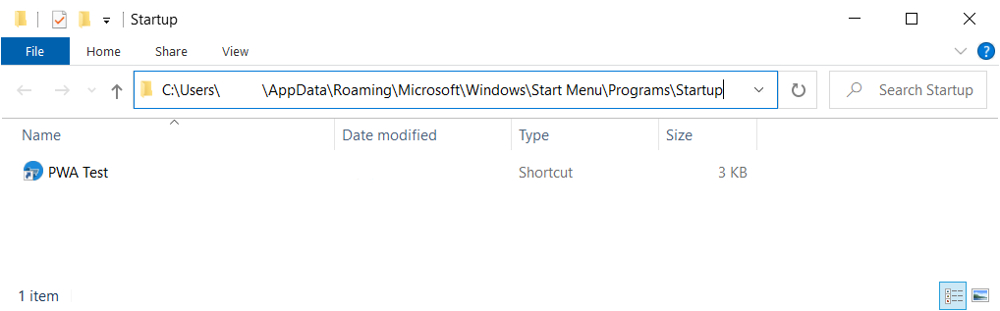

# Allow installed PWA to run on OS login
Authors: [Carlos Frias](https://github.com/carlosfriasand), [Jungkee Song](https://github.com/jungkees)

## Status of this Document
This document is intended as a starting point for engaging the community and standards bodies in developing collaborative solutions fit for standardization. As the solutions to problems described in this document progress along the standards-track, we will retain this document as an archive and use this section to keep the community up-to-date with the most current standards venue and content location of future work and discussions.
* This document status: **Active**
* Expected venue: [W3C Web Incubator Community Group](https://wicg.io/) 
* Current version: this document

## Introduction

This document proposes a mechanism for a *Progressive Web Application* (PWA) to be configured at install time with the option to be launched automatically when a user logs in to its OS session.

## Why is the *Run on OS Login* capability needed?
Native application users have an expectation of having certain applications automatically run during initial OS login. Users expect high-engagement applications like Email clients, Chat, Monitoring Dashboards and Real-time data display apps, to name a few, to start running as part of their OS session start process. This  situation (auto-starting applications) seamlessly enhances the user experience on the device, allowing the user to engage with the application(s) right away after login. 

Currently, this  capability is not available for PWAs. In contrast, native applications across different OSes, can be configured to be launched automatically, usually as part of the installer wizard setup by registering the application for auto-start with user login. To further advance the effort to make PWAs more native a mechanism that enables an installed PWA to auto-start is necessary.

Terminology clarification note: When this document refers to _"Run on OS login"_ it is meant to be _automatically execute a PWA on the start of the user session_. Given that in some OSes the terms _startup_ and _login_ could mean different scopes as OS startup could also refer to programs being run before a user logs in. The intention of this document is to happen at the user session intial login event and only once per session.

## Goals
 - Provide users with a way to opt-in for the ability of automatically starting the app when they login to their OS session.
 - When the user opted-in, automatically start the installed PWA when the OS user logs in.
 - Provide users with the option to opt-out of having the PWA auto-starting with OS login.

## Proposal 
The proposal has three main parts:
 1. Adding a new member, e.g. `request_on_install` and an enum value, `"runonstartup"` to the [WebAppManifest dictionary](https://www.w3.org/TR/appmanifest/#dom-webappmanifest) to indicate the PWA is to be auto-started with the OS user login when installed. This entails for the user to acknowledge this behavior and grant permission.
 2. Launching the installed opted-in PWA when the OS session starts.
 3. Provide a mechanism for the user to opt-out of the feature once the PWA is installed, stop the PWA from auto-starting with each OS login.

### Extending WebAppManifest dictionary
The mechanism explained in this proposal starts with the developer indicating the intention of the PWA to be auto-started in the [Web App Manifest](https://w3c.github.io/manifest/) `manifest.json`.

To support this, we propose to use the member, _request_on_install_, and add a new enum value, "runonstartup" to the standards manifest dictionary. 

Developers could use _request_on_install_ and specify the enum value, `"runonstartup"` to add this auto-start with user login capability for the PWA, considering the user grants the permission on install.

Example:

    request_on_install: ["runonstartup", ...]

We think that this approach is potentially more forward-compatible when we encounter requirements for additional permissions in the manifest. But an alternative that we can think of is using a dedicated key-value member for the run on startup behavior:

Example:

    run_on_startup: true

**Note:** While adding a `request_on_install` member is not the scope of this work, it is shown here as an example placeholder for a permission-friendly member. Early research indicates that users may be interested in reviewing requested permissions during the PWA installation process. We are open to discussing alternate member verbiage or solutions to providing PWAs the ability to request running on startup.  We defer to this future effort for this part regarding the permission signaling.

### User acknowledge
Giving any PWA the freedom to automatically starting with every OS login could potentially be undesired unless the user consents and acknowledges to want this behavior. Therefore, the proposal intends to have a mechanism to obtain the user's consent. 

One suggestion to achieve this could be a checkbox present (potentially unchecked by default) in the PWA install dialog when the developer has included the manifest information for this desired behavior.

The following figure shows an example of this user acknowledge checkbox at install dialog:

It is imperative for this feature to give the user the final decision on whether to auto-start or not the application, even when the developer has called for such behavior.

The actual UX for obtaining the user permission is left to the implementation of the UA and is only shown as an example here.

### Auto-start PWA with OS login
While all Desktop OSes provide the capability to register an application to be automatically executed with OS login, the specific implementation varies across each, the following is a summary of our current research. 

On **macOS**, it is possible to get the auto-start behavior by registering application at *Login Items* on current user profile to run on user login.

On **Linux** auto-starting an application on login greatly depends on the graphical environment used, additional research is required to determine the options available by environment, suggestions from the community are more than welcome!

On **Windows**, there are multiple ways to register a native application to be executed with every login, these are:
1. Register a new key in the Windows Registry with the application to launch.
2. Use scheduled tasks.
3. Add a shortcut to the Startup folder in the Start menu.

`%APPDATA%\Microsoft\Windows\Start Menu\Programs\Startup`

Of these options we have prototyped the scenario using the existing code in Chromium to create the PWA shortcuts during the PWA installation and add the additional location for the Startup folder under the current user.

The final result then is having the same shortcut that is added to the Start Menu added also into the Startup folder, effectively launching the PWA on every Windows login.

Example of an installed app with its shortcut added to the Startup folder:

### User opt-out of auto-starting a PWA on OS login
The ability for a user to cancel or opt-out of having a PWA is necessary to complete the feature usability. Once the user has installed a PWA and wishes to stop the PWA from auto-starting the UA should provide a way to easily cancel this behavior without having to uninstall and reinstall. The exact mechanism to achieve this will be up to the UA to implement, but the proposal explicitly suggests having a way to easily opt-out the feature by the user.

## Open questions
- Is `request_on_install` member name the appropiate name for the new Manifest member? Would other names e.g. `permissions`, `permission_requests` or similar be a better as a more generalized container?
- What would the best default state for the user consent/acknowledge be: checked or unchecked by default?
