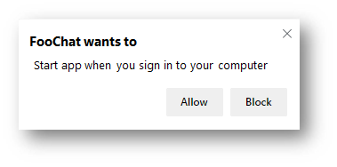

# Run on OS Login
Authors: [Carlos Frias](https://github.com/carlosfriasand), [Jungkee Song](https://github.com/jungkees)

## Status of this Document
This document is intended as a starting point for engaging the community and standards bodies in developing collaborative solutions fit for standardization. As the solutions to problems described in this document progress along the standards-track, we will retain this document as an archive and use this section to keep the community up-to-date with the most current standards venue and content location of future work and discussions.
* This document status: **Active**
* Expected venue: [W3C Web Incubator Community Group](https://wicg.io/) 
* Current version: this document

## Introduction
Many operating systems offer the ability to configure an application to launch automatically when the user logs into their OS session. Certain class of native applications, including email, chat, monitoring dashboards and real-time data display apps have been using this capability. Users can engage with those applications as soon as they log into the OS. We aim to add this capability to the web platform to empower web developers to provide the same first-class experience to their users with their [installed web apps](https://www.w3.org/TR/appmanifest/#installable-web-applications).

Importantly, however, there is a performance and user-experience cost to every application that launches at login, so this capability must require user permission and must allow users to change their minds later.

## Goals
- Provide ways for developers to enable and disable this capability.
- Provide ways for users to acknowledge this capability and make a choice.
- Provide ways for users to opt-out of this capability whenever they choose to do. 
- Allow this capability only for [installed web apps](https://www.w3.org/TR/appmanifest/#installable-web-applications).

## Non-Goals
- Specify generic UX requirements which may vary across different OSes.

## Use Cases
In most of the OSes, users can configure native apps as auto-start apps of the OS by either manually adding them or accepting permission requests made by the applications. We envision enabling the same class of experiences for installable web apps.

- A video chat service asks for a user consent during its first run experience so the user can always be ready to get incoming calls as soon as they log into the OS.
- A user chose to install a web app from the browser's UI and noticed that they can choose to turn the auto-start on. The user then decides to install a set of their favorite web apps with the auto-start option on so they will be available each time they log in.
- A user, noticing they do not want the installed web app to auto-start with the OS session anymore, uses the browser’s UI to disables the auto-start.
- A user chooses to enable/disable auto-starting the web app from within the web app's own settings UI page.

## Proposed Solution
Run on OS Login is a [powerful feature](https://w3c.github.io/permissions/#powerful-feature). Users should decide whether to enable the capability for the [installed web app](https://www.w3.org/TR/appmanifest/#installable-web-applications). The web platform APIs presented are intended to be used only from within an installed web app and not by a regular website.

### Querying Permission
The web platform provides a standard way of querying the permission status of powerful features in the user agent. We propose to extend the standard [permission registry](https://w3c.github.io/permissions/#permission-registry) with the `"run-on-os-login"` enum value.

Developers can check if the user has granted permission for this feature with the following code:

```javascript
const permission = await navigator.permissions.query({ name: 'run-on-os-login' });

// Update the settings UI with permission.state

permission.addEventListener('change', () => {
    // Update the settings UI with this.state
});
```

The `permissionDesc.name` value `"run-on-os-login"` given to the `query(permissionDesc)` method is expected to work only for installed web apps. If the method is called without the app being installed, the promise should always resolve with the `"denied"` state.

### Run on OS Login Modes
The `mode` parameter for the following APIs proposal specifies the mode of operation:
- **Windowed**: Default mode, the web app will be launched as regular with its window shown. (Same as when the user manually opens the web app).
- **Minimized**: Web app will open minimized, but still present in taskbar or equivalent place in other platforms.

    Note: *Minimized mode* does not mean a background task without a window or a task running in the system tray of Windows, the menu bar of macOS, or some equivalent components in other platforms.
- **None**: Disables the app from auto start.

```
enum RunOnOsLoginState { “none”, “minimized”, “windowed” };
```

### Enabling the Capability: Using API
To enable the capability, the web app can use the following method with a `mode` value of either `"windowed"` or `"minimized"`:
```javascript
let promise = navigator.runOnOsLogin.set({
  mode: "windowed"
});

promise.then(function() {
    // Run on OS Login permission was approved and operation was successful.
  },
  function(reason) {
    // Permission was either denied or the operation failed.
    // Use reason to determine failure.
  });
```
When this API is called, the user agent should present a permission prompt to get the user’s choice. If the user granted permission, the user agent should configure the installed web app as an auto-start app of the underlying OS. If the user denied it, nothing is done, and promise is rejected. 

Calling this API from a context other than from an installed web app should result in the promise being rejected immediately and do not prompt for user permission. As this capability is intended to be available to installed web apps only.

We deliberately do not specify the UX requirements, given various different behaviors that the existing OSes provide. Here are a few possible examples.

Using a user agent's permission prompt:



Using a dialog provided by underlying OS. The example below shows a dialog that Windows 10 provides for Microsoft Store apps:

![Dialog showing the Windows permission prompt saying: Let this app run its [name] task when you log in? Enable or Disable](windows-app-run.png)

### Disabling the Capability: Using API
To disable the Run on OS Login capability the web app can use the same API `navigator.runOnOsLogin.set()`, and use the `"none"` mode, example:
```javascript
let promise = navigator.runOnOsLogin.set({
  mode: "none"
});

promise.then(function() {
    // Run on OS Login permission is granted.
    // Disable operation was successful.
  },
  function(reason) {
    // Permission was either denied or the operation failed.
    // Use reason to determine failure.
  });
```
The `navigator.runOnOsLogin.set()` API will prompt the permission if needed (if not granted already). Rejecting the promise if permission was denied or failed to execute the operation. 

### Getting the Status of Run on OS Login: Using API
We propose the following API to query the status of the Run on OS Login capability for the web app:
```javascript
let promise = navigator.runOnOsLogin.get();

promise.then(function(status) {
    // status is the current mode for web app, could be any of these:
    // status == "windowed", feature is enabled for windowed (default) mode.
    // status == "minimized", feature is enabled for minimized mode.
    // status == "none", permission could be denied, or feature is disabled.
    // Note: Use navigator.permissions.query() to verify permission state.
  });
```
The `navigator.runOnOsLogin.get()` API will not prompt the permission but rather resolve with the status as `"none"` if the permission has not been granted yet or is denied. 

### Enabling it During Install
We propose an additional way to enable the capability during the installation process of an installable web app. This option is designed based on a separate work called the [Install Time Permissions Prompt](https://github.com/MicrosoftEdge/MSEdgeExplainers/blob/master/InstallTimePermissionsPrompt/Explainer.md) which uses the Web App Manifest to declare a set of permissions to ask for user consent during the installation of an installable web app.

The *Install Time Permissions Prompt* defines a new member of the Web App Manifest, `request_on_install`. Developers can request a user permission with the following directive in the Web App Manifest:

```
request_on_install: ["run-on-os-login", ...]
```

An implementer could choose to present this permission within the installation prompt like this:


Adding the `request_on_install` member to the Web App Manifest is not the scope of this work. However, early research indicates that users may be interested in reviewing requested permissions during the installation process. We think that this approach is potentially forward compatible if we encounter requirements for additional permissions in the manifest.


### Disabling it from Browser UI
Once an installed web app is set up to auto-start, it must be disabled when the app is uninstalled. This should be conducted as part of the installed web app lifecycle management i.e. as part of uninstalling the web app by the browser.

Also, to provide the user with ultimate control, if the user wants to disable the feature, they should be able to do it without need to uninstall the web app: Either from the web app itself (using the web platform API) and also from a browser UI setting available for the user to disable that web app from running on OS login. We expect the settings provided by browsers or installed web apps themselves to provide ways for users to disable the capability.

## Privacy and Security Considerations
### Privacy
An installed web app that was configured to be auto started on OS login could be used to track the user by using available web platform services e.g. geolocation and ping remote services using an unique instance id, every time the user logs in to its computer. 

Auto starting a web app is a powerful capability, while it does not add a new vector, as it is already possible for native applications to be auto started, it does add the possibility of increasing the frequency for this scenario happening at OS login. That is why we propose gating the capability on the user granting its permission and allowing the user to also disable the web app from auto running in the future from within the browser or by using the OS specific way of managing auto starting applications.

### Security
We will post a separate markdown document for [W3C TAG's Security and Privacy self-review questionnaire](https://www.w3.org/TR/security-privacy-questionnaire/).

## OS Primitives
While all desktop OSes provide the capability to register an application to be automatically executed with OS login, the specific implementation varies across each, the following is a summary of our current research.

On **macOS**, it is possible to get the auto-start behavior by registering application at *Login Items* on current user profile to run on user login.

On **Linux**, auto-starting an application on login greatly depends on the graphical environment used, additional research is required to determine the options available by environment, suggestions from the community are more than welcome!

One possible option to explore is using the `~/.config/autostart/` directory as specified by the [freedesktop.org/XDG Desktop Application Autostart Specification](https://specifications.freedesktop.org/autostart-spec/autostart-spec-latest.html).

On **Windows**, there are multiple ways to register a native application to be executed on user login, these are:
1.	Register a new key in the Windows Registry with the application to launch.
2.	Use scheduled tasks.
3.	Add a shortcut to the Startup folder in the Start menu.

## Open Questions
- Is asking for permissions at install time a good choice?
    - We are working on using the PWA installation prompt to ask for a batch of permissions based on our user study. However, there is a question whether this approach would have any negative impact on the PWA installation funnel.
- Should the web app be provided with some indicator to signal it was launched via the Run on OS Login capability?
- Limiting the API usage to only installed web apps results in a rather uncommon permission flow: Going from denied (not an installed web app), to prompt (web app is now installed) then granted (user accepts the prompt). Should there be a change to this uncommon flow while still restricting the API usage to installed web apps only?
