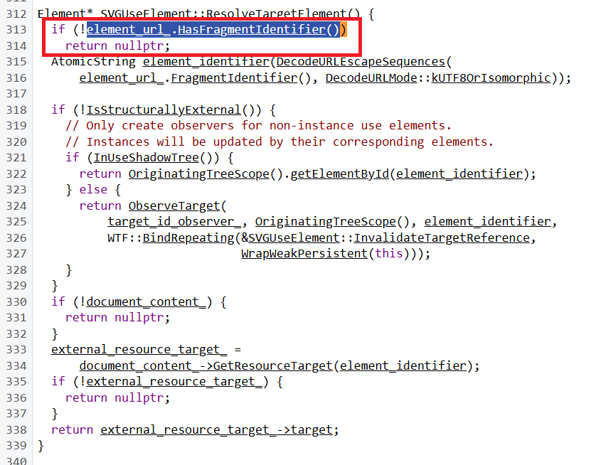
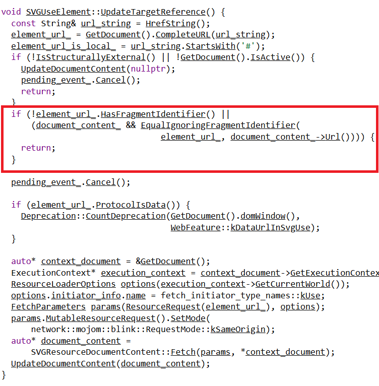

# Allow `use` to reference an external document's root element by omitting the fragment. 

## Authors:
- Divyansh Mangal (dmangal@microsoft.com)

## Participate
Feature request: [[SVG2] Allow <use> to reference entire files.](https://issues.chromium.org/issues/40362369)

Spec: [https://svgwg.org/svg2-draft/struct.html#UseElement](https://svgwg.org/svg2-draft/struct.html#UseElement)


## Table of Contents


- [1. Introduction](#1-introduction)
- [2. Problem Statement](#2-problem-statement)
- [3. Current Limitation](#3-current-limitation)
- [4. Motivation](#4-motivation)
  - [4.1 Manual Editing:](#41-manual-editing)
  - [4.2 Downsides of Using id#](#42-downsides-of-using-id)
- [5. Proposed Approach](#5-proposed-approach)
  - [5.1 Relax the condition element_url_.HasFragmentIdentifier()](#51-relax-the-condition-element_url_hasfragmentidentifier)
      - [5.1.1 ResolveTargetElement()](#511-resolvetargetelement)
      - [5.1.2 UpdateTargetReference()](#512-updatetargetreference)
  - [5.2 Retrieve svg root element from the external document](#52-retrieve-svg-root-element-from-the-external-document)
- [6. Importance of this feature](#6-importance-of-this-feature)
  - [6.1 Benefits to Users](#61-benefits-to-users)
- [7. Customer/Developer Feedback: Pain Points](#7-customerdeveloper-feedback-pain-points)
- [8. Appendix](#8-appendix)
- [9. References & acknowledgements](#9-references--acknowledgements)

## 1. Introduction
The `use` element in SVG allows for the reuse of existing SVG elements by referencing them. This helps reduce the amount of code and makes it easier to manage and update SVG graphics. 

## 2. Problem Statement 
The `use` element does not support referencing entire SVG files directly. It only allows referencing specific elements within an SVG file using an id attribute/fragment identifier. This limitation creates significant friction for developers, as it requires manual modification of the source SVG files — adding id attributes or defining fragment identifiers — in order to use it. This manual process not only increases development and maintenance overhead but is also error-prone and can lead to inconsistencies, particularly in scenarios where SVG assets are frequently updated or sourced externally. This limitation breaks the common developer expectation of being able to reuse SVG assets out-of-the-box — especially when sourcing icons or illustrations from design systems, marketplaces, or third-party libraries. 

Ultimately, the lack of support for referencing entire external SVG files using `use` reduces developer productivity, increases the risk of inconsistencies, and makes scalable asset management more challenging — particularly for complex graphics and large icon sets. ( Refer Section [Customer/Developer Feedback: Pain Points](#7-customerdeveloper-feedback-pain-points))  

## 3. Current Limitation

To use the whole SVG with a `use` tag, you typically need to reference a specific element within the SVG file using a fragment identifier (an id with a hash #): 

```html
<svg> 

  <use xlink:href="myshape.svg#icon"></use> 

</svg> 
```

In this example, `#icon` is the fragment identifier pointing to an element with id="icon" within myshape.svg, which might look like: 

_myshape.svg_

```html
<svg id="icon" version="1.1" xmlns="http://www.w3.org/2000/svg" viewBox="0,0,512,512"> 

 <circle cx="256" cy="256" r="200" fill="red" /> 

</svg> 
```

## 4. Motivation and User Use Case

The above [limitation](#3-current-limitation) introduces the below issues while using #id:

### 4.1 Manual Editing: 

- **Adding id:** You need to manually add an id to the root element of every SVG file you want to reference. This can be time-consuming and error prone. 

- **Re-editing:** If the designer updates the SVG file, you must re-edit the file to add the id again, which is repetitive and inefficient. 

**Example:** Consider an SVG file without an id: 

```html
<svg version="1.1" xmlns="http://www.w3.org/2000/svg" viewBox="0,0,512,512"> 

 <circle cx="256" cy="256" r="200" fill="red" /> 

</svg> 
```

To use this SVG with a <use> tag, you need to add an id: 

```html
<svg id="icon" version="1.1" xmlns="http://www.w3.org/2000/svg" viewBox="0,0,512,512"> 

  <circle cx="256" cy="256" r="200" fill="red" /> 

</svg> 
```

Then reference it: 

```html
<svg> 

  <use xlink:href="myshape.svg#icon"></use> 

</svg> 
```

### 4.2 Downsides of Using id# 

- **Increased Workload:** Manually adding id attributes to each SVG file increases the workload, especially if you have many SVG files. 

- **Error-Prone:** Manual editing can lead to errors, such as typos or missing id attributes. 

- **Inconsistent Updates:** If the SVG files are updated frequently, ensuring that each file has the correct id can be challenging and lead to inconsistencies. 

- **Maintenance Overhead:** Keeping track of id attributes and ensuring they are correctly referenced adds to the maintenance overhead. 

## 5. Proposed Approach
Allow the `use` element to reference entire SVG files without needing an id. This means we can reuse the whole SVG file like this: 

```html
<svg width="100" height="100"> 

  <use href="icon.svg" /> 

</svg>
``` 

Note that in the current code base if we use the above svg as is nothing will be rendered. As the `use` element is unable to resolve the target to render without the fragment identifier. 
 
To implement this, we propose the below changes:  

### 5.1 Relax the condition `element_url_.HasFragmentIdentifier()`: 
Currently the condition`element_url_.HasFragmentIdentifier()` is used to check if the url passed in `use` element’s href has fragment or not. This check is done to early exit during `use` element target resolution and `use` element update phase. This check is done in two places namely:

#### 5.1.1 [ResolveTargetElement()](https://source.chromium.org/chromium/chromium/src/+/main:third_party/blink/renderer/core/svg/svg_use_element.cc;drc=87cfb22bc51efbac8aea65e91aafc0ffe57ee050;l=312)


Here instead of returning the nullptr we will be returning the svg root element of the external document. (see next section for details on how)

#### 5.1.2 [UpdateTargetReference()](https://source.chromium.org/chromium/chromium/src/+/main:third_party/blink/renderer/core/svg/svg_use_element.cc;drc=87cfb22bc51efbac8aea65e91aafc0ffe57ee050;l=205) 


Here we will be bypassing the condition `element_url_.HasFragmentIdentifier() ` by means of feature flag so that `use` element is still able to fetch the external document succesfully.

### 5.2 Retrieve svg root element from the external document: 
Once the external document is successfully fetched. We get the fetched resource in the form of `document_content_`

[Member< SVGResourceDocumentContent > document_content_](https://source.chromium.org/chromium/chromium/src/+/main:third_party/blink/renderer/core/svg/svg_use_element.h;drc=7334424b6359af19a92dee7da024b6cffc486bb7;l=117)

We will introduce a public function in `SVGResourceDocumentContent` to get the svg root of the external file programmatically from the dom. The function will look like: 

```cpp
SVGResourceTarget* SVGResourceDocumentContent::GetResourceTargetForRoot() const { 

  Document* document = GetDocument(); 

  if (!document) { 
    return nullptr; 
  } 

  auto* svg_target = DynamicTo<SVGSVGElement>(document->documentElement()); 

  if (!svg_target) { 
    return nullptr; 
  } 

  return &svg_target->EnsureResourceTarget(); 
} 
```

## 6. Importance of this feature

- **Eliminates Manual Fragment Identifiers:** Removes the necessity of adding id attributes or fragment identifiers, reducing manual editing and potential errors. This allows the developers to use the readily available SVG files (from web, repositories, marketplaces etc) as it is without making any changes to it. 

- **Simplifies Code Management:** By allowing the reuse of entire SVG files, developers can manage their SVG assets more efficiently. This reduces the need to duplicate code and makes it easier to update graphics. 

- **Enhances Reusability:** This feature enhances the reusability of SVG files, making it easier to create and maintain libraries of reusable graphics and icons. 

### 6.1. Benefits to Users 

- **Easier Updates:** When an SVG file is updated, all instances of that file will automatically reflect the changes, ensuring consistency across the application. 

- **Better Organization:** Developers can organize their SVG assets more effectively, making it easier to manage and maintain large projects. 


## 7. Customer/Developer Feedback: Pain Points  

*Whenever I import an SVG with <use> element it won't work unless I specify the id of that SVG even though it's the only SVG in the document!* [Link](https://stackoverflow.com/questions/68746095/why-cant-i-import-an-svg-by-using-use-without-using-the-id)  

https://stackoverflow.com/q/47595422/8583692 
*SVG external reference without id*

https://stackoverflow.com/q/50896563/8583692
*Why do SVG fragment identifiers without hash not work?* 

https://stackoverflow.com/q/41809208/8583692
*Why the <use> element in SVG doesn't work?* 

https://stackoverflow.com/q/7215009/8583692  
*How to reference external SVG file in SVG correctly?* 

https://stackoverflow.com/q/55452106/8583692
*How to use the whole SVG with a <use> tag?*

https://stackoverflow.com/q/53794292/8583692
*Display external SVG with <use> tag and href or xlink:href attribute?* 

https://stackoverflow.com/q/68746095/8583692
*Why can't I import an SVG by using <use> without using the id?* 

## 8. Appendix 

### Appendix 1: Current Situation (As-Is) vs Future (To-Be) 

#### As-Is  

- **Manual Editing:** The user has to manually add an id fragment identifier to every SVG icon they use. 

- **Repetitive Work:** If the designer updates the icon, the user must re-edit the SVG code to add the id again. 

- **Time-Consuming:** This process is time-consuming and prone to errors, leading to inefficiencies. 

#### To-Be 

- **Direct Reference:** The user can reference entire external SVG files directly using the `use` element without needing an id fragment identifier. 

- **Automatic Updates:** Any changes made by the designer to the external SVG file will automatically reflect wherever it is used, without additional manual edits. 

- **Efficiency:** This reduces the time and effort required to manage SVG icons, making the workflow more efficient and less error prone. 

## 9. References & acknowledgements 

Many thanks for valuable feedback and advice from: 

- Fredrik Söderquist (fs@opera.com)
- Abhishek Singh (abhisheksing@microsoft.com)