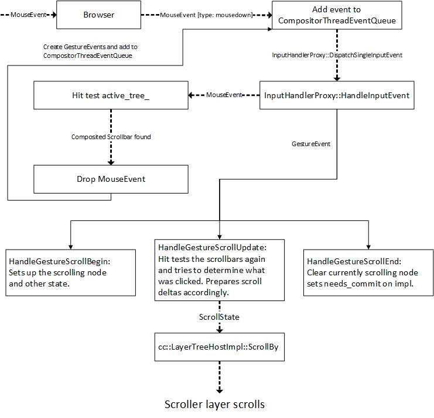

# Impl threaded scrollbar scrolling

Authors: [Rahul Arakeri](https://github.com/rahul8805)

- Browser proc forwards the MouseEvent to the renderer. This gets added to the CompositorThreadEventQueue (CTEQ) and it stays there until the next rAF.

- The MouseEvent from the CTEQ gets dispatched (DispatchSingleInputEvent) to HandleInputEvent. Here, we perform a hit test (based on event.PositionInWidget()). If the layer that got hit was a composited scrollbar, we drop the event. Otherwise, it flows through the renderer as a regular MouseEvent. 

- If the MouseEvent was dropped, we create (one or more) WebGestureEvent(s) that have the same characteristics (eg: LatencyInfo, PositionInWidget etc) as that of the dropped event.

- On mousedown, we queue a GestureScrollBegin and a GestureScrollUpdate. Additionally, if the mousedown occurred on the thumb, we set a “grab_capture” flag. If we get mousemoves when grab_capture is true, we drop them and queue GestureScrollUpdates instead. On mouseup, we queue a GestureScrollEnd. So if a mousedown and a mouseup occur on the arrows, we get only 3 GestureEvents (i.e GSB, GSU, GSE).

- The WebGestureEvents are then wrapped up in EventWithCallback and added to the CTEQ. This means, processing the synthesized GestureScroll is rAF aligned

- GestureScrollBegin is handled by the renderer first. This is where we set up the scroll_node and other state needed to initiate impl threaded scrolling.

- GestureScrollUpdate(s) are what gets handled next. At this point, we still don’t know the scroll delta. Finding the deltas depends on several things like, which part of the scrollbar was hit, the orientation of the scrollbar, the scale etc. The scroll_delta is then passed on to “LayerTreeHostImpl::ScrollBy”. ScrollBy does its usual thing where it finds the scroll_node, applies deltas, ticks scroll animations etc.

- Finally, the GSE comes through and clears the scrolling state (like the CurrentlyScrollingNode) and calls SetNeedsCommitOnImplThread().

- On subsequent MouseEvents, everything above gets repeated.
