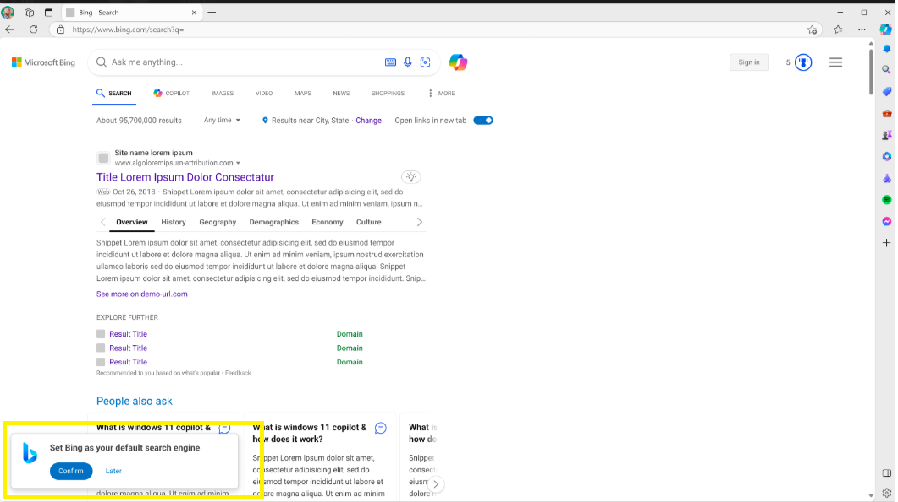

# Search Provider --- Set Default Search Engine

## Authors:

- [Wei Gu](mailto:guw@microsoft.com)

## Status of this Document

This document is a starting point for engaging the community and standards
bodies in developing collaborative solutions fit for the Web. As the solutions
to problems described in this document progress along the standards-track, we
will retain this document as an archive and use this section to keep the
community up-to-date with the most current standards venue and content location
of future work and discussions.

* This document status: **Active**
* Expected venue: [W3C Web Incubator Community Group](https://wicg.io/)
* **Current version: this document**

## Introduction

Browsers have a list of search engines and user can set default search engine from settings.
This proposal aims to standardize the API that could be leveraged by search providers to upsell to ask user
to set their search engine as default.

## Goals

The goals of the API are:

- Provide an API to detect whether a search engine is default search engine.
- Privide an API to set search engine as deafault by name.

## Non-Goals

The API is not intended to be used for:

- Update a search engine.
- Delete a search engine.

## Use Cases

The feature is intended to be used by any search provider page that wants to do upsell asking users to set their search provider as default. Here are some scenarios in which this can be useful to users:
- On a search engine results page (SERP)
>>
- On a SERP page, serp page could show upsell to users.
- User could accept/ignore to set the search provider as default.
- After acception, browser should use the accepeted search provider as default.

## Proposed Solution

### Detect whether search engine is default by name

```js
chrome.searchProvider.canSetDefault(name:string, (success: boolean) => void);
```
> #### NOTE
> This API will return false if a search provider is already the default one or not existing in the search engine list.

### Set search engine as default by name

```js
chrome.searchProvider.setDefault(name:string, (success: boolean) => void)
```
> #### NOTE
> This API will return false if a search provider is already the default one or not existing in the search engine list.

## Security and Privacy Considerations

The API does not introduce any new security or privacy
considerations.