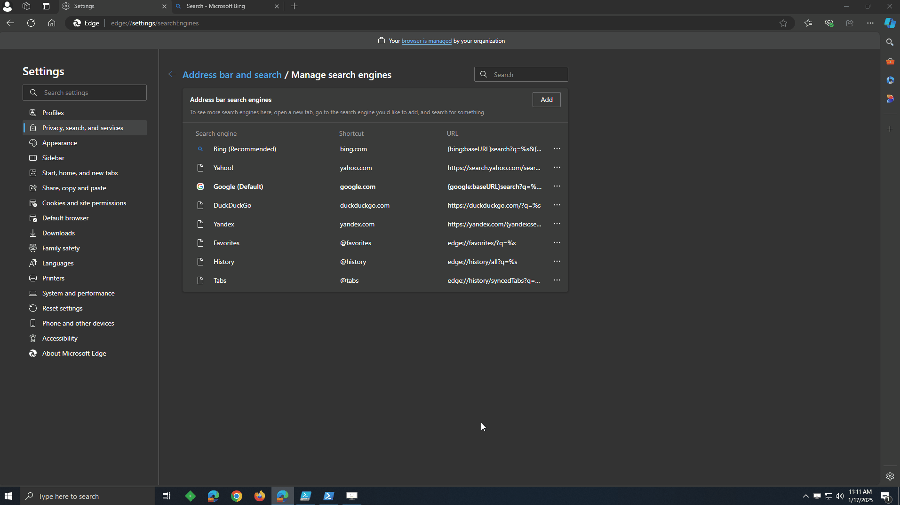

# Search Providers --- Reset Search Provier to brand's recommended.

## Authors:

- [Wei Gu](mailto:guw@microsoft.com)

## Status of this Document

This document is a starting point for engaging the community and standards
bodies in developing collaborative solutions fit for the Web. As the solutions
to problems described in this document progress along the standards-track, we
will retain this document as an archive and use this section to keep the
community up-to-date with the most current standards venue and content location
of future work and discussions.

* This document status: **Active**
* Expected venue: [W3C Web Incubator Community Group](https://wicg.io/)
* **Current version: this document**

## Introduction

Browsers have a list of search providers and each browser brand implementation has a recommended search provider. This proposal aims to standardize the API that could be leveraged by webpages to detect whether current default search provider is the brand recommended search provider and reset the current default search provider to brand's recommended one.

## Goals

The goals of the API are:

- Provide an API to detect whether current search provider is brand's recommended search provier.
- Privide an API to reset current search provider to brand's recommended search provier.

## Non-Goals

The API is not intended to be used for:

- Add new search provider.
- Update a search provider.
- Delete a search provider.

## Use Cases

The feature is intended to be used by any web page that wants to restore the current default search provider to brand's recommended search provider. Here is scenario in which this can be useful to users: **Microsoft Edge** as example

- User opens a web page (Bing SERP).
- JaveScript calls the API to detect whether current default search provider is **Microsoft** recommended search provider.
- Page popups UI for user to reset the current default search provider to **Microsoft** recommended search provider.
>>

## Proposed Solution

### Detect whether current search provider is brand's recommended.

```js
chrome.searchProviders.isRecommendedDSE((success: boolean) => void);
```
> #### NOTE
> This API will return **true** if a search provider is already the brand's recommended one, otherwise **false**.

### Reset current search provider to brand's recommended.

```js
chrome.searchProviders.resetToRecommendedDSE((success: boolean) => void)
```
> #### NOTE
> This API will return **true** if a search provider is set to the recommended one, otherwise **false**.

## Security and Privacy Considerations

Please refer [security-privacy](./security-privacy.md)
