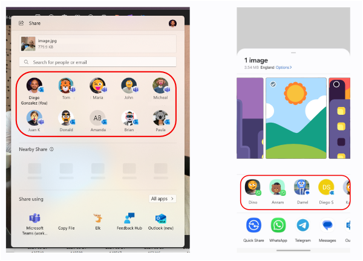

# Share Contacts for Installed Web Apps

Authors: [Diego Gonzalez](https://github.com/diekus)

## Status of this Document
This document is a starting point for engaging the community and standards bodies in developing collaborative solutions fit for standardization. As the solutions to problems described in this document progress along the standards-track, we will retain this document as an archive and use this section to keep the community up-to-date with the most current standards venue and content location of future work and discussions.
* This document status: **Active**
* Expected venue: [W3C Web Incubator Community Group](https://wicg.io/)
* **Current version: this document**

## Introduction

For modern web applications like social networks and instant messaging, contacts are a fundamental part of the app itself. These contacts are specfic to the application, but the platform/OS can benefit from exposing them in different people related surfaces. Contact Sharing for installed web applications allows web apps to surface contacts in relevant UX on the underlying OS. One example can be sharing. Different platforms have different share UX, and some of these UXs include a list of frequent contacts that make sharing content faster with people the user interacts with frequently.

## Goals

* Allow installed web applications to participate in contacts/people UX across different platforms.

## Non-goals

*

## Use Cases

### Integrating with platform's Share UX

A user decides to share content and opens the Share UX on the platform. They are presented with their frequent contacts on several apps. They can click on a contact to share the content with that contact. Overall, this represents a faster an easier way to share content. This is also behaviour that is present in several desktop and mobile platforms already. It saves the steps of having to open the app and look for the contact you will be sharing with. The following image shows how the share UX shows contacts on Windows and Android. Notice that each contact is associated to a specific application, as represented by a small app-icon on the bottom-right corner of the displayed contact.



## Proposed solution

The proposed solution is a promise-based method that works in scope of an installed web application to share a list of contacts with the underlying platform. This gets the contacts-per-app into the OS. The other part of the feature is akin to Web Share Target, except it is targeted directly at a specific contact.

### Providing Contacts to the platform

`navigator.shareContacts(<contacts>);`

The method receives contacts as a list of JSON objects. Each object must have at least an `id`, `firstName` and `displayPicture`. Optionally, the contact can have a `lastName`, `rank` and a list of `phones` and `emails`.

#### Contact detailed fields

* `id`: unique id for the contact.
* `firstName`: Contact's first name(s).
* `displayPicture`: url to the display picture of the contact.
* `lastName`: Contact's last name(s).
* `rank`: integer that defines the rank or precedence that a contact has in the list. This could be used by the platform to display top contacts first.
* `phones`: list of strings that represent phone numbers.
* `emails`: list of strings that represent email addresses.

```json
{
    "id" : "contact_id_1",
    "firstName" : "John",
    "lastName" : "Doe",
    "displayPicture" : "https://app.com/imgs/usrs/contactPic.jpg",
    "rank" : 1,
    "phones" : ["(+44)7123456789"],
    "emails" : ["j.doe@home.com", "j.doe@work.com"]
}

```

### Registering the Contact as a share target for the installed app

TODO: investigate how this works on the native side

## Considered Alternatives

### Extending the Web Share API

The [Web Share API](https://w3c.github.io/web-share/) allows a web site to share content to an arbitrary destination of the user's choice. At first it was considered extending the API to include sharing contacts, but the scope of sharing contacts to the platform's contact repository is inherently a different one from the one Web Share solves. Additionally, this API does not resolve the second part of the feature, regarding how the web app acts when a contact is invoked from the OS surface it appears.

### Extending the Web Share Target API

The [Web Share Target API](https://w3c.github.io/web-share-target/) allows an installed web app to register itself as a Share Target on the platform. The main use case for this feature is related to exposing contacts in the Share UX of the OS. This API does not have an imperative counterpart, and is specififed through the manifest file. Additionally, this does not cover the case of sharing contacts to the platform, only registering a share target.

### Extending the Contact Picker API

The `contacts` interface seems like a correct location for the `share` method, but this interface is already in use by the Contact Picker API to expose the platform's `ContactsManager`. The scope of the feature also is opposite to the one of the Contact Picker API, since this is the web app sharing to the platform and not the platform sharing to a web app. Due to scope and ergonomics, the Contact Picker API is not the right home for the feature.

## Privacy and Security Considerations

* **Contacts are private to the installed app that shared them only:** Contacts shared by installed apps should be private to that app only. Other applications may not see other app's contacts and these should only appear on relevant platform managed UX (such as the Share Sheet present in multiple OSs).
* **Contacts are dependent on the installed app:** If the web application is uninstalled, the contacts must be deleted from the platform.

## Open Questions

* Should we align the content of the contacts with the information provided in the Contact Picker API?

## Acknowledgements