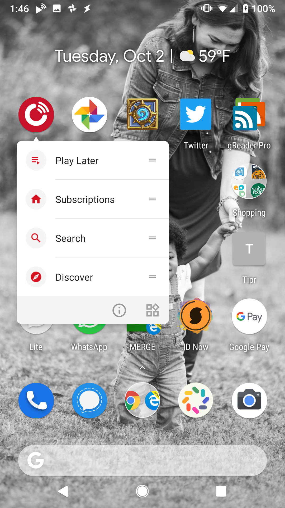
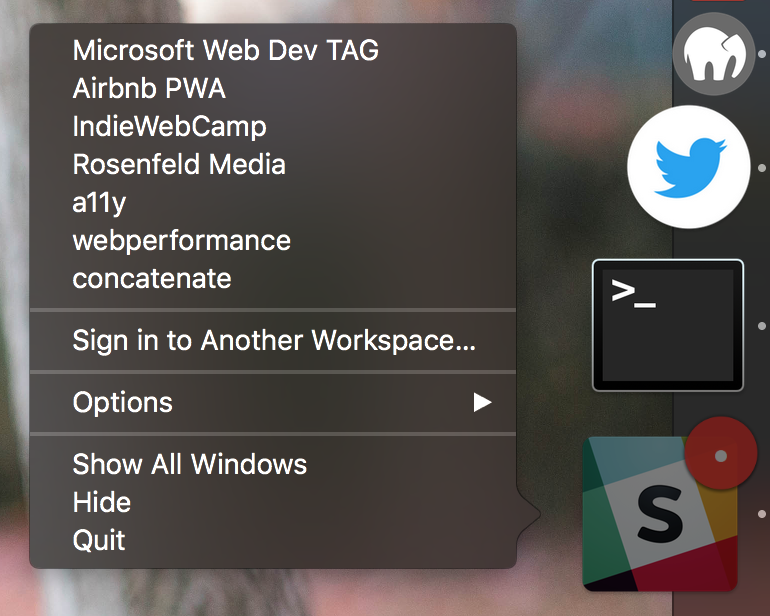
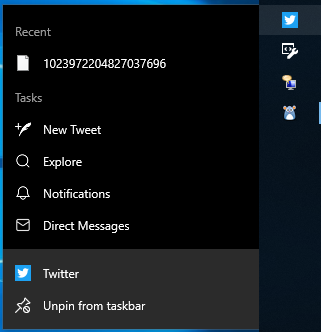

# Shortcuts Explainer

Authors: [Aaron Gustafson](https://github.com/aarongustafson)

## Introduction

A number of operating systems offer a means by which authors can provide quick access to key tasks for an app. Typically these are exposed via the app’s icon and number around 4-5.

## Why are Shortcuts needed?

Shortcuts will provide another mechanism for websites (especially progressive web apps) to facilitate re-engagement with key tasks.

## Goals

* Enable authors to provide a list of shortcuts to specific URLs within their website in a standardized fashion
* Enable users to access key tasks easily

## Non-goals

* Enable authors to access or mutate Shortcuts via JavaScript
* Enable authors to directly trigger JavaScript events from Shortcuts

## Use Cases

Most websites (and, by extension, progressive web apps) have a handful of key tasks that users need to do with relative frequency. Providing quick access to those tasks from anywhere the app icon is displayed will improve users’ productivity as well as increase their engagement with the app. It will also reduce the number of clicks needed to access numerous locations and features including:

* Top-level navigation items (e.g., home, timeline, orders)
* Search
* Data entry tasks (e.g., compose a tweet, add a receipt)

## Examples

### PlayerFM "Shortcuts" in Android

<figure id="playerfm">



</figure>

This menu provides access to the following app functionality:

* Play Later - a list of podcasts the user flagged for later listening;
* Subscriptions - the user’s entire subscription catalog;
* Search; and
* Discover - browse available & promoted podcasts.

### Slack’s "Dock Menu" in macOS

<figure id="slack">



</figure>

This menu provides a list of Slack “workspaces” the user is signed into, followed by a link to “Sign into another workspace” and some standard macOS system-level options.

### Twitter’s "Jump List" in Windows 10

<figure id="twitter">



</figure>

This menu provides direct access to:

* Compose a new tweet;
* Search (a.k.a. Explore);
* Access the user’s notifications; and
* Access the user’s direct messages

## Customer validation

* **Twitter** is actively using [Windows’ "Jump Lists" feature](https://docs.microsoft.com/en-us/uwp/api/Windows.UI.StartScreen.JumpList) in their PWA via WinRT (see [the above example](#twitter)).
* **Starbucks** has also expressed interest in increasing re-engagement with their PWA by providing quick access to options like:
  * Pay with your Starbucks card,
  * Place an order, and
  * Find the closest store.

## API Proposal

We are proposing that a new member be added to the [Web App Manifest](https://w3c.github.io/manifest/): `shortcuts`. This member would take an array of Shortcut objects. For example, to replicate [the shortcut menu from PlayerFM](#playerfm), an author could do the following:

```json
"shortcuts": [
  {
    "title": "Play Later",
    "description": "View the list of podcasts you saved for later",
    "uri": "/play-later",
    "icons": [
      {
        "src": "/icons/play-later.svg",
        "type": "image/svg+xml",
        "purpose": "any"
      }
    ]
  },
  {
    "title": "Subscriptions",
    "description": "View the list of podcasts you listen to",
    "uri": "/subscriptions",
    "icons": [
      {
        "src": "/icons/subscriptions.svg",
        "type": "image/svg+xml",
        "purpose": "any"
      }
    ]
  },
  
  {
    "title": "Search",
    "description": "Search for new podcasts to listen to",
    "uri": "/search",
    "icons": [
      {
        "src": "/icons/search.svg",
        "type": "image/svg+xml",
        "purpose": "any"
      }
    ]
  },
  
  {
    "title": "Discover",
    "description": "Browse for new podcasts to listen to",
    "uri": "/discover",
    "icons": [
      {
        "src": "/icons/discover.svg",
        "type": "image/svg+xml",
        "purpose": "any"
      }
    ]
  }  
]
```

Each Shortcut object would comprise the following:

### `title`

Provides a human-readable label for the shortcut when displayed to the user.

### `description`

Optional. Provides a general description of what the shortcut does.

### `uri`

The URL that loads when a user activates the shortcut. This URL must exist within [the navigation scope (`scope`) defined in the manifest](https://w3c.github.io/manifest/#scope-member). If the `uri` is a relative URL, the base URL will be the URL of the manifest.

### `icons`

The path to one or more [ImageResource](https://w3c.github.io/manifest/#dom-imageresource)s. If the ImageResource’s `src` is a relative URL, the base URL will be the URL of the manifest.

## Existing Implementations

This section describes a possible treatment on each major OS. User agents are free to implement however they like, but this should give an idea of what the API will look like in practice. In all cases, the menu items consist of text, a destination, and an icon.

### Android

In Android, shortcut activation is triggered via a long press.  Android allows the static shortcut list to be supplemented at runtime via Dynamic Shortcuts and allows users to rearrange and "pin" shortcut items. ([Documentation](https://developer.android.com/guide/topics/ui/shortcuts/creating-shortcuts))

### iOS

In iOS, a hard press (3D Touch) exposes the application shortcuts (iOS 9.0+ on 3D touch-capable devices). iOS also enables a subtitle and has a hard limit of 4 items. ([Documentation](https://developer.apple.com/library/archive/samplecode/ApplicationShortcuts/Introduction/Intro.html#//apple_ref/doc/uid/TP40016545))

### macOS/Windows/Linux GUI/etc.

In most OSes, this context menu is triggered by right clicking (or two finger tapping) on the icon.  Windows calls these "Jump Lists" and allows each shortcut item to have a description ([Documentation](https://docs.microsoft.com/en-us/uwp/api/windows.ui.startscreen.jumplist)). In macOS these shortcuts are referred to as the "Dock Menu" ([Documentation](https://developer.apple.com/design/human-interface-guidelines/macos/menus/dock-menus/)).

### Electron

Electron enables shortcuts for macOS and Windows app icons as well.

## Open Questions

1. Should the `icons` member in the Shortcut object be optional?
2. Given that [color schemes are becoming a thing in CSS](https://github.com/w3c/csswg-drafts/issues/3299), it seems like the icon options should somehow support an indication of whether the icon itself is intended for use in a dark or light theme. <del>Assuming there is interest in that, would it make sense to piggyback on the existing [`purpose` member of an ImageResource](https://w3c.github.io/manifest/#dom-imageresource-purpose) or should there be a new member (e.g., `color_scheme`) added to it?</del> <ins>We’ve drafted an [addition to the ImageResource dictionary for this purpose](../../ImageResource-color_scheme/explainer.md).</ins>
3. For more advanced use cases like minimal media player controls (e.g., Spotify, Netflix, etc.), should we provide options for custom shortcut layouts or control groups and JavaScript interaction with the Shortcuts menu? Should that be part of this spec or defined separately?
4. Should we include a hard limit on Shortcuts? If no, should we allow for collections?
5. Does the recommendation for per-language manifest files still stand? Should we look to enable multi-lingual supprot within a manifest as more text keys get added?