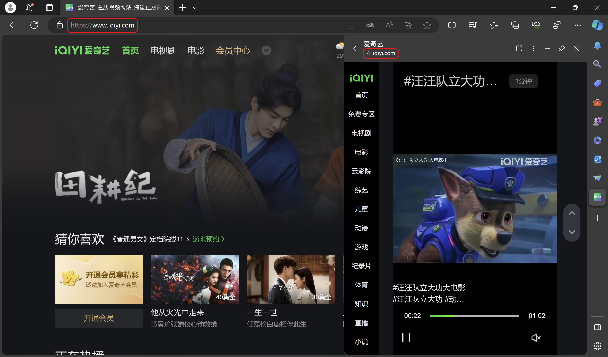
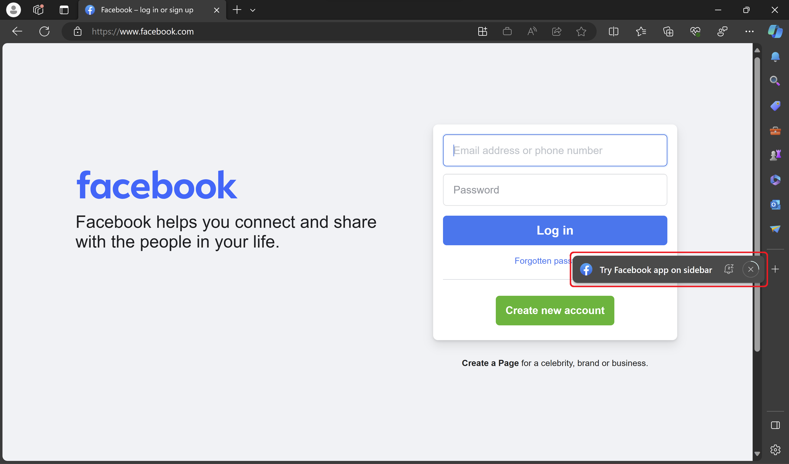

# Side Panel

## Authors:

- [Adolf Daniel](https://github.com/adolfdaniel)
- [Hoch Hochkeppel](https://github.com/mhochk)
- [Min Ren](https://github.com/renmin)
- [Sohum Chatterjee](https://github.com/sohchatt)
- [Xiaobin Cui](https://github.com/benjycui)

## Status of this Document

This document is a starting point for engaging the community and standards
bodies in developing collaborative solutions fit for the Web. As the solutions
to problems described in this document progress along the standards-track, we
will retain this document as an archive and use this section to keep the
community up-to-date with the most current standards venue and content location
of future work and discussions.

- This document status: _Active_
- Expected venue: [W3C Web Applications Working
  Group](https://www.w3.org/2019/webapps/) |
  [w3c/manifest](https://github.com/w3c/manifest/) 
- Current version: this document

## Introduction

Modern browsers have a side panel that can be used to display additional
information about the current page or provides a way to browse side-by-side.
This proposal aims to standardize the side panel and its API. The new side panel
API will allow developers to declare support for the side panel and to control
their web content in the side panel.

## Motivation

The side panel is a new feature in Microsoft Edge that allows the user to view
additional information about the current page or browse side-by-side. The side
panel is a new way for the user to interact with the web. The side panel
currently does not allow developers to control the appearance and behavior of their web
content in the side panel. The side panel API will allow developers to control
their web content in the side panel.


## Goals

The goals of the side panel API are:

- To provide a way for developers to allow their web application to be promoted
  as a side-by-side web application.
- To provide a way for developers to detect whether their web application is rendered in side panel, so that they can optimize appearance and behavior of  web application
  in the side panel.

## Non-Goals

The side panel API is not intended to be used for:

- Allowing a site to declare a side panel app of a different origin (e.g. contoso.com cannot declare a side panel app for fabrikam.com).
- Installing a web application to side panel.
  - Browser should provide a way to allow users to install web applications to side panel.
  - If a developer wants to install a web application to side panel, they may consider using [Web Install API](https://github.com/MicrosoftEdge/MSEdgeExplainers/blob/main/WebInstall/explainer.md).
- Granting additional capabilities to a web application.
  - If a developer wants to render in a side panel with additional capabilities, they may consider using an Extension. See [chrome.sidePanel](https://developer.chrome.com/docs/extensions/reference/sidePanel/) and [Extensions in the Microsoft Edge sidebar](https://learn.microsoft.com/en-us/microsoft-edge/extensions-chromium/developer-guide/sidebar).

## Use Cases

The side panel API is intended to be used by web applications that want to
provide a side-by-side experience.
Here are several use cases that the side panel API enables:

### Providing side-panel-only experience

By letting web applications detect being rendered and set side panel width, they can provide optimized user experiences in side panel, e.g., side panel might not provide omnibox and back/forward button, so web applications need to provide other way to navigate around.

Users visit the same domain in tab and side panel, but the side-panel-only experience is provided for better experience in side panel.



### Promoting the web application

The browser can promote the web application
that supports the side panel API as a side-by-side web application.



### Pinning the web application

The browser
can also provide a way for the user to pin the web application to the side panel
so that the user can easily access the web application as a side-by-side web
application.

## Proposed Solution

### Display Mode

Add a new `side-panel` display override option which a developer can include in their
`display_override` to indicate support for the side panel.

```json
"display_override": ["side-panel"]
```

As a display mode, the developer can easily detect being rendered in this fashion
via CSS or JavaScript.

```css
@media all and (display-mode: side-panel) {
  /* Styling for when in the side panel only. */
}
```

```js
if (window.matchMedia('(display-mode: side-panel)').matches) {
  // The web application is being specifically displayed in the side panel.
}
```

And when display mode is surfaced generically via request headers, it will
be detectable there as well (see [crbug.com/1174843](https://crbug.com/1174843),
[Display Mode Client Hint](https://github.com/WICG/manifest-incubations/blob/gh-pages/display_mode-client-hint.md)). This means servers can redirect users to other sites then.

> #### NOTE
> Developers can set the default width of side panel with `side_panel.preferred_width`, this means that the width of side panel is arbitrary. But under most circumstances, side panel might be a narrow-width window. It is recommended to detect windows' width if these styles or behaviors are not side panel only.
> 
> ```css
> @media all and (max-width: 380px) {
>   /* Styling for when in narrow-width window. */
> }
> ```
> 
> ```js
> if (window.matchMedia('(max-width: 380px)').matches) {
>   // The web application is being displayed in narrow-width window.
> }
> ```

#### Independent Declarations for Side Panel and OS Installation

Much like the [WCO proposal](https://github.com/WICG/window-controls-overlay/blob/main/explainer.md) and the [Tabbed Mode proposal](https://github.com/WICG/manifest-incubations/blob/gh-pages/tabbed-mode-explainer.md), this proposal does not include any modification to the 'display' member of the manifest, so developers will
still declare support for being hosted in an application window by setting 'display' to something other than 'browser'.

```json
/* Supports OS installation AND side panel */
{
  "display": "standalone",
  "display_override": ["side-panel"]
}

/* Supports only side panel */
{
  "display": "browser",
  "display_override": ["side-panel"]
}

/* Supports only side panel (default value for 'display' is 'browser') */
{
  "display_override": ["side-panel"]
}
```

#### Preference Between Display Modes

The 'display_override' member will continue to allow a web developer to declare an arbitrary order of preferred display modes. Though it is anticipated that the decision of where to add a site (side panel vs app window) will be influenced primarily by declared support and user choice, the web developer may still declare preference between the two and the UA may use this as desired.

```json
/* Side panel preferred over an application window */
"display_override": ["side-panel", "standalone"]
"display_override": ["side-panel"]

/* Side panel supported, but application window preferred */
"display_override": ["standalone", "side-panel"]

/* Side panel supported, but not desired */
"display_override": ["browser", "side-panel"]
```

### Additional Configuration

Add a new `side_panel` manifest member which allows additional customization
specific to the side panel. The value of this property is an object with a single
optional `preferred_width` property, used to declaring the width in CSS pixels
that the developer would like the web application to be rendered. In the future,
additional optional properties may be added.

```json
{
  "name": "Side Panel Web App",
  "short_name": "Side Panel",
  "icons": [
    {
      "src": "icon/lowres.png",
      "sizes": "64x64",
      "type": "image/png"
    },
    {
      "src": "icon/hd_hi.png",
      "sizes": "128x128 256x256",
      "type": "image/png"
    }
  ],
  "start_url": "/",
  "display": "standalone",
  "display_override": ["side_panel"],
  "side_panel": {
    "preferred_width": 600
  }
}
```

## Security and Privacy Considerations

The side panel API does not introduce any new security or privacy
considerations.
