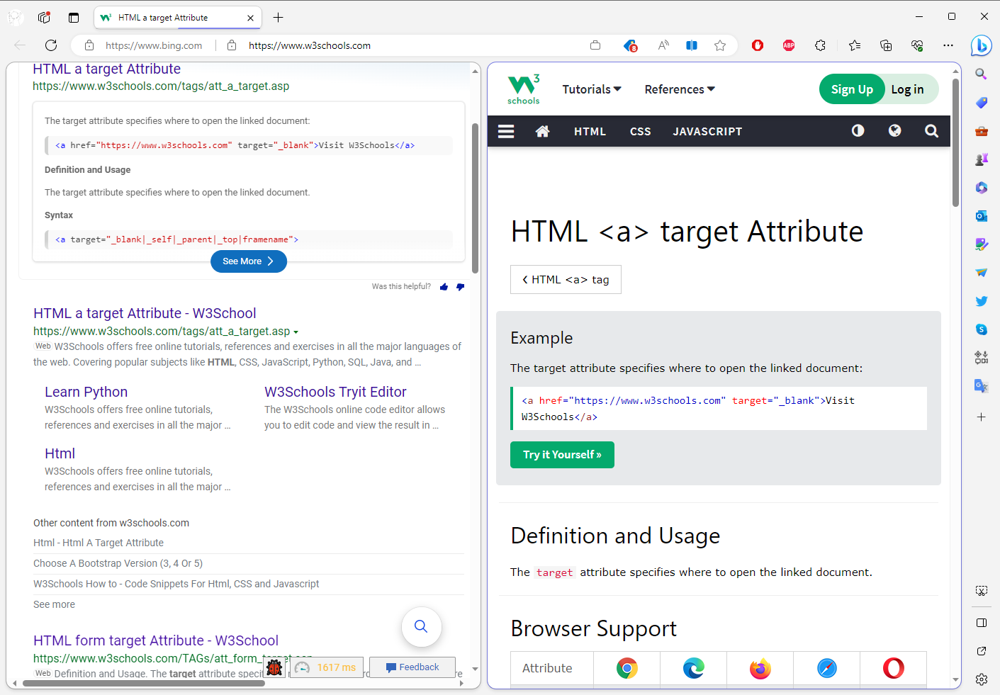

# Allow target navigation at split tab
Authors: [XU Zhengyi](mailto:zhengyixu@microsoft.com)

## Status of this Document
This document is a starting point for engaging the community and standards bodies in developing collaborative solutions fit for standardization. As the solutions to problems described in this document progress along the standards-track, we will retain this document as an archive and use this section to keep the community up-to-date with the most current standards venue and content location of future work and discussions.
* This document status: **Active**
* Expected venue: [W3C Web Incubator Community Group](https://wicg.io/)
* **Current version: this document**
    
## Introduction
Split screen scenarios are becoming more and more prevalent in today's world. In addition to dual screen devices (ie. physical split screen), browsers such as Edge, Whale and Arc ship split tab (ie. virtual split screen) features. When using virtual split screen in a browser, there are multiple cases in which users want to open links and view them side-by-side with the source page (see the [Use Cases](#use-cases) section for examples). Currently, there is no option for web authors to target a link to open directly into a split tab. The current navigation targets, such as `_blank`, `_self`, `_parent`, `_top`, are insufficient to solve this problem.

This explainer proposes a solution to allow web authors to open links into a split tab.

## Goals
- Provide an API that allows websites to target navigations at a split tab.

## Non-Goals
- Provide an API that also handles physical split screen targets. That said, the current proposal should be easily extendable to support dual screen scenarios in the future.

## Use Cases
The feature is intended to be used by any website that wants to open a link into a split tab. Here are some scenarios in which this can be useful to users:
- On a search engine results page (SERP), the user can open links and explore results in a split tab without navigating away from the SERP.

- On a video site, the user can watch a video in a split tab while still being able to preview other results in the source page.
- On a news feed site, the user can open a news article in a split tab and continue to browse the news feed.
- On a social media site, the user can open a link in a split tab and continue to browse the feed.
- On a shopping site, the user can open a product page in a split tab and continue to browse the product list.
- On an office automation (OA) system or email site, the user can preview external document links in split tab.

## Proposed Solution
This proposal supports opening links in a split tab by:
 - Adding a new value called `_split` to the [`target` attribute on the anchor element](https://html.spec.whatwg.org/multipage/links.html#attr-hyperlink-target) and the `target` parameter of the [window.open](https://html.spec.whatwg.org/multipage/nav-history-apis.html#dom-open-dev) API. (The name `_split` is not final; suggestions are welcome!)
    - On supported browsers:
        - Browsers should apply `noopener`-like behavior for links opened with target `_split`. In other words, `window.opener` for links opened in a split tab should be `null`.
        - When `navigator.splitTabSupported` returns `false`, `_split` should fallback to behaving like target `_blank`. UAs may apply their own criteria (ex. screen size, user settings) to decide whether split tab is available or not.
    - Examples:
        - HTML Anchor element
            ```html
            <a target="_split" href="https://www.example.com">Open in split tab</a>
            ```
        - window.open API
            ```js
            // Open url in split tab.
            window.open("https://www.example.com", "_split");
            ```

    - Update the [7.3.1.7 Navigable target names](https://html.spec.whatwg.org/multipage/document-sequences.html#navigable-target-names) spec as follows: 
    
        <table>
            <thead>
                <tr>
                    <th rowspan="2">Keyword</th>
                    <th rowspan="2">Ordinary effect</th>
                    <th colspan="2">
                        Effect in an <code>iframe</code> with...
                    </th>
                </tr>
                <tr>
                    <th><code>sandbox=""</code></th>
                    <th><code>sandbox="allow-top-navigation"</code></th>
                </tr>
            </thead>
            <tbody>
                <tr>
                    <td><code>_split</code></td>
                    <td>split tab or new</td>
                    <td>split tab or maybe new</td>
                    <td>split tab or maybe new</td>
                </tr>
            </tbody>
        </table>

    - Update [The rules for choosing a navigable](https://html.spec.whatwg.org/multipage/document-sequences.html#the-rules-for-choosing-a-navigable) spec as follows:
        - ...
        7. Otherwise, if _name_ is not an ASCII case-insensitive match for "`_blank`" __or "`_split`"__...
        - ...
        - If the user agent has been configured such that in this instance it will create a new top-level traversable
            - ...
            3. ...
                1. Set _noopener_ to true.
                2. **If _name_ is not an ASCII case-insensitive match for "`_split`",** set _name_ to "`_blank`".
                3. Set _windowType_ to "`new with no opener`".
            - **If _name_ is an ASCII case-insensitive match for "`_split`", then:**
                - **Set _noopener_ to true.**
                - **If the user agent doesn't support the split tab feature, then set _name_ to "`_blank`".**
                - **If the user agent support the split tab feature, set _windowType_ to "`split tab with no opener`".**
            4. ...
            5. ...
            6. If _name_ is not an ASCII case-insensitive match for "`_blank`" **or "`_split`"**, then set _targetName_ to _name_.
            - ...

 - Adding a `splitTabSupported` property to the `Navigator` object. `navigator.splitTabSupported` returns a Boolean value indicating whether the browser supports a virtual split screen configuration or not.
    - Example:
        ```js
        if (navigator.splitTabSupported) {
            // The browser does support split tab feature.
        }
        ```

### Pros
- This proposal is a natural extension of the `target` attribute on anchor elements and the `target` parameter on `window.open`, therefore should be easy for web developers to understand.

### Cons
- `navigator.splitTabSupported` could only be accessed by JS, this means the authors of the website have to set the target via JS and not via HTML. One possible mitigation is setting a cookie when user first opened the website and then the server could know the client support this feature and could set it via HTML on next visit.
- On unsupported browsers, if a website uses `_split` without setting `noopener`, an opener will be set. 
    - This can be mitigated if web authors always set `noopener` when using `_split`. A note could be added to the spec for this. 
    - Web authors could also check for `navigator.splitTabSupported` before setting the target.
- On unsupported browsers, if we already opened a frame named `_split`, the navigation will be done in that frame.
    - It is valid for a `target` value to be the name of a sub-frame ([See the reference here](https://html.spec.whatwg.org/multipage/document-sequences.html#valid-navigable-target-name-or-keyword)). Any existing sites that have a frame named `_split` would expect that frame to be navigated when a link with that target is clicked. Even though the spec mentions that [names starting with an underscore are reserved for special keywords](https://html.spec.whatwg.org/multipage/document-sequences.html#valid-navigable-target-name), if a site is using `_split` in this way, it would be broken once `_split` is used for split tab navigations. Implementors can add a use counter to identify whether such sites exists, and if they do, a different name instead of `_split` could be used.

## Privacy and Security Considerations
### Privacy
- `navigator.splitTabSupported` exposes the information that user's browser supports split screen.

### Security
- As mentioned in the [Cons](#cons) section, web authors should set noopener with `_split`.

## Alternative Considered
To avoid issues with fallback on unsupported browsers, an alternative solution is adding a new attribute like `split-tab` to the anchor element and `params` of `window.open()`. The `split-tab` attribute will have no effect on unsupported browsers.

### Pros
- No side effects on unsupported browsers.

### Cons
- Not as idiomatic as adding a new value to the `target` attribute.
- If a web author specifies both `target` and `split-tab`, it is unclear which should take priority and may be tricky to specify.

## Open Questions
- Should web authors be able to customize the fallback behavior of `_split`? It is unclear if fallback to `_blank` is always desirable.
- Should the `_split` target behave differently inside sandboxed iframes? If so, should we add a new value to the `sandbox` attribute to allow this, ex. `allow-split-tab-navigation`?