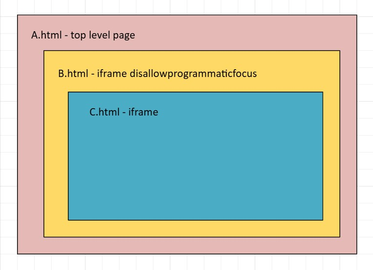

# Prevent iframe to take programmatic focus from itself

Authors: [Siye Liu](https://github.com/siliu1)

## Status of this Document
This document is a starting point for engaging the community and standards bodies in developing collaborative solutions fit for standardization. As the solutions to problems described in this document progress along the standards-track, we will retain this document as an archive and use this section to keep the community up-to-date with the most current standards venue and content location of future work and discussions.
* This document status: **`ACTIVE`**
* Expected venue: [Web Hypertext Application Technology Working Group (WHATWG)](https://whatwg.org/)
* Current version: **https://github.com/MicrosoftEdge/MSEdgeExplainers/blob/main/StealFocus/steal-focus-explainer.md**

## Introduction
Web applications can host embedded apps via iframes in the web. The embedded apps may take keyboard focus through script. At the same time, the host application may not want to lose keyboard focus when rendering the content in one embedded iframe as the user could have a negative experience when navigating through multiple embedded apps via keyboard. This proposal aims to provided web applications with the ability to control embedded iframes in such a way that guarantees their users to have a good experience when rendering iframe's content (without giving focus to the embedded iframe).

## Goals
Propose a mechanism to prevent iframe from being able to take programmatic focus unless:
- When its parent window set the focus on iframe element explicitly. Or,
- A user moves focus to the iframe by clicking/tabbing into the iframe.

## Non-Goals
It is not a goal of this proposal to prevent non-programmatic focus in iframes.

## Use Cases
Some web apps such as Microsoft Teams apps are often run inside an iFrame in the web. This has resulted in some poor user experience issues for keyboard users. For example: in Teams it’s possible to view notifications of apps in the ‘Activity’ section. When a user navigates to a notification from an app (such as Viva Engage) that app can ‘steal focus’ from the user and place it in their app. This prevents the user from using their keyboard to navigate through their notifications because an app can ‘steal’ focus at any time. Keyboard users' expectations are that their keyboard focus doesn’t jump around unexpectedly.

I have created a [minimal repro page](./steal-focus-demo.html) to demonstrate the issue.

## Proposed solution: "disallowprogrammaticfocus" attribute
We propose a new "disallowprogrammaticfocus" boolean attribute on the [HTMLIFrameElement](https://html.spec.whatwg.org/multipage/iframe-embed-object.html#htmliframeelement). Whenever it is set, all the nested iframes can no longer take input focus through script.

```html
<!DOCTYPE html>
<html>
  <head>
    <meta charset="utf-8">
    <title>iframe steal focus prevention</title>
  </head>
  <body>
    <iframe src=""
            disallowprogrammaticfocus>
    </iframe>
  </body>
</html>
```

### Nested iframes

1. If focus is in A.html, then neither B.html or C.html can steal focus.
2. If focus is in B.html, then C.html can steal focus because there is no `disallowprogrammaticfocus` attribute set on C.html.

## Alternative Solutions
This section exposes some of the alternative solutions that we came across before coming up with the chosen proposal.

### Add "programmaticfocus" option to "allow" or "sandbox" attribute.
Similar to the "media-playback-while-not-rendered" [Permission Policy](https://www.w3.org/TR/permissions-policy/) on the [HTMLIFrameElement](https://html.spec.whatwg.org/multipage/iframe-embed-object.html#htmliframeelement). We chould have a new policy "programmatic-focus". When set, the nest iframes could take input focus through script.

```html
<!DOCTYPE html>
<html>
  <head>
    <meta charset="utf-8">
    <title>iframe steal focus prevention</title>
  </head>
  <body>
    <iframe src=""
            sandbox="allow-programmatic-focus"
            allow="programmatic-focus *;">
    </iframe>
  </body>
</html>
```

This alternative was not selected as the preferred one, because we think that the default option (policy not set) is against current behavior and may have compatibility risk.
