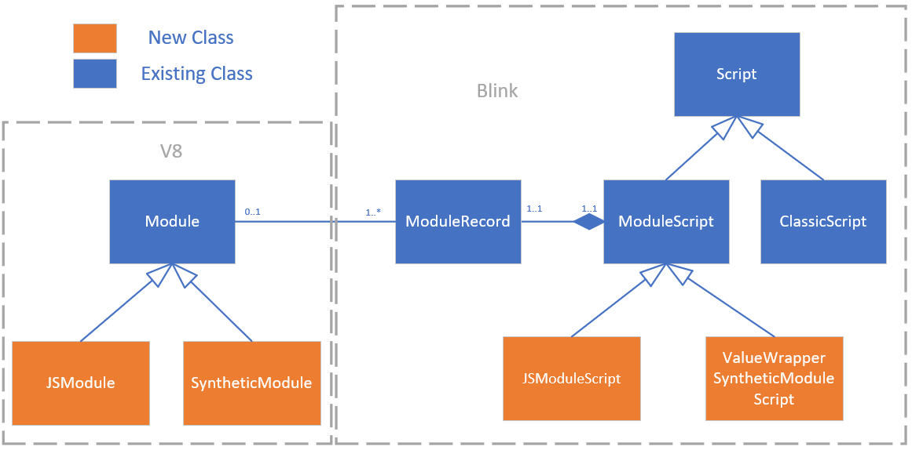

# Synthetic Modules Design Document

## Contact emails

daniec@microsoft.com, sasebree@microsoft.com, travil@microsoft.com, pcupp@microsoft.com, gwhit@microsoft.com 

## Introduction

The following document proposes an implementation of [Synthetic Module Records](https://heycam.github.io/webidl/#synthetic-module-records) (originally propsed by [here](https://github.com/tc39/proposal-javascript-standard-library/pull/44) by Domenic) in Chromium.  Also proposed is an implementation of [CSS Modules](https://github.com/w3c/webcomponents/issues/759) and [JSON Modules](https://github.com/whatwg/html/pull/4407) using Synthetic Module Records.  It is expected that Synthetic Module Record will be used to support additional future module types as well, e.g. [WebIDL Modules](https://github.com/heycam/webidl/pull/675).

At a high level, the changes are:
- Introduce a `SyntheticModule` type in V8 to implement Synthetic Module Records in the ES module graph.
- Introduce the `ValueWrapperSyntheticModuleScript` type in Blink to support the creation of a Synthetic Module record that wraps a single value as the module's default export.
- Enable `ModuleScriptLoader` to create CSS and JSON modules using `ValueWrapperSyntheticModuleScript`.

## V8 changes

Currently the [v8::internal::Module](https://cs.chromium.org/chromium/src/v8/src/objects/module.h) class is V8's representation of a [Source Text Module Record](https://tc39.github.io/ecma262/#sec-source-text-module-records), which represents information about a Script Module such as its RequestedModules, its status ("uninstantiated", "instantiating", etc), and its imports/exports.
We will introduce two subclasses, `JSModule` and `SyntheticModule`.  `JSModule` will contain the functionality specific to JavaScript Modules that currently resides in `Module`, and `SyntheticModule` will contain the new Synthetic Module code.  Common functionality will remain in `Module`, which can now be considered as roughly equivalent to the spec's [Abstract Module Record](https://tc39.github.io/ecma262/#sec-abstract-module-records) base type.

Since `Struct`s in V8 don't allow VTables for performance reasons, `Module` will contain the following new field to distinguish whether it is a `JSModule` or `SyntheticModule`:

``` C++
  DECL_INT_ACCESSORS(type)
  enum Type {
    kJS,
    kSynthetic
  };
```

All existing fields on `Module` that are specific to JS or other Cyclic Module types will be pushed down to `JSModule`.  The following fields will be used for all module types and will therefore remain on `Module`:

```C++
  // The complete export table, mapping an export name to its cell.
  // TODO(neis): We may want to remove the regular exports from the table.
  DECL_ACCESSORS(exports, ObjectHashTable)

  // Hash for this object (a random non-zero Smi).
  DECL_INT_ACCESSORS(hash)
  
  // Status.
  DECL_INT_ACCESSORS(status)

  // The namespace object (or undefined).
  DECL_ACCESSORS(module_namespace, HeapObject)
```

`SyntheticModule` will contain the following new fields in addition to those inherited from `Module`:

```C++
  // A list of all names exported by the module
  DECL_ACCESSORS(export_names, FixedArray)

  // A callback defined by the embedder that is executed upon evaluation of the module.
  // QUESTION: evaluation_steps is just a function pointer to a Blink function.  Is
  // it optimal to store it as a Foreign or should we just stash the function pointer
  // directly as a uintptr_t?  Looking around the codebase I see some business about
  // V8_COMPRESS_POINTERS that I'd rather not have to handle in the module code, and
  // Foreign takes care of this for us.
  DECL_ACCESSORS(evaluation_steps, Foreign)
```

### `SyntheticModule` methods

`SyntheticModule` will implement the following methods:

```C++
  static void SetExport(
      Isolate* isolate, Handle<SyntheticModule> module,
      Handle<String> export_name,
      Handle<Object> export_value);

  static V8_WARN_UNUSED_RESULT MaybeHandle<Cell> ResolveExport(
      Isolate* isolate, Handle<SyntheticModule> module,
      Handle<String> module_specifier, Handle<String> export_name,
      MessageLocation loc, bool must_resolve, ResolveSet* resolve_set);

  static V8_WARN_UNUSED_RESULT bool PrepareInstantiate(
      Isolate* isolate, Handle<SyntheticModule> module,
      v8::Local<v8::Context> context, v8::Module::ResolveCallback callback);
  static V8_WARN_UNUSED_RESULT bool FinishInstantiate(
      Isolate* isolate, Handle<SyntheticModule> module, unsigned* dfs_index);

  static V8_WARN_UNUSED_RESULT MaybeHandle<Object> Evaluate(
      Isolate* isolate, Handle<SyntheticModule> module,
      ZoneForwardList<Handle<Module>>* stack, unsigned* dfs_index);

  static void Reset(Isolate* isolate, Handle<SyntheticModule> module);
```

### V8 Synthetic Module Record API

The v8::Module export class in [v8\src\include\v8.h](https://cs.chromium.org/chromium/src/v8/include/v8.h?q=v8.h&l=1242) will have the following additional items:

```C++
  // Callback defined in the embedder
  typedef v8::MaybeLocal<v8::Value> (*SyntheticModuleEvaluationSteps)(
      Local<Context> context, Local<Module> module);

  static Local<Module> CreateSyntheticModule(
      Isolate* isolate, const std::vector<Local<v8::String>>& export_names,
      SyntheticModuleEvaluationSteps evaluation_steps);

  void SetSyntheticModuleExport(Local<String> export_name,
                                Local<v8::Value> export_value);
```

`v8::Module::GetModuleRequestsLength()` will be updated to return 0 for a `SyntheticModule`.

### `SyntheticModule` Construction:

`v8::Module::CreateSyntheticModule` will be implemented with a call to the following new factory method:

```C++
Handle<SyntheticModule> Factory::NewSyntheticModule(
    i::Handle<i::FixedArray> export_names,
    v8::Module::SyntheticModuleEvaluationSteps evaluation_steps);
```

### `SyntheticModule` Instantiation:

`SyntheticModule::PrepareInstantiate()` and `SyntheticModule::FinishInstantiate()` together implement the corresponding Synthetic Module Record concrete method [Instantiate()](https://heycam.github.io/webidl/#smr-instantiate).  `PrepareInstantiate` will loop over the module's `export_names`, calling `Module::CreateExport` on each to create a binding of the name to undefined.  `FinishInstantiate` simply changes the module's state to kInstantiated.

### `SyntheticModule` Execution:

`SyntheticModule::Evaluate()` implements the corresponding Synthetic Module Record concrete method [Evaluate()](https://heycam.github.io/webidl/#smr-evaluate).  The implementation will call the `evaluation_steps` callback, which is itself expected to make calls back into `v8::Module::SetSyntheticModuleExport()` to set the synthetic module's export bindings to non-undefined values.

### `SyntheticModule` Export Resolution:

`SyntheticModule::ResolveExport()` implements the corresponding Synthetic Module Record concrete method [ResolveExport()](https://heycam.github.io/webidl/#smr-resolveexport).  The implementation will do the following:
1. Look up the cell for the export name in the `Module::exports` `ObjectHashTable` and return it if it exists.
1. If no such entry exists and `must_resolve` is true, call `Factory::NewSyntaxError()`.

Resolution of namespace imports (`import * from "./my-synthetic-module"`), will work the same as for `JSModule`s with the the exception that `FetchStarExports` will now early-return if its `module` parameter is a `SyntheticModule`, as these have no requested modules and no star exports.

### Open question: should each SyntheticModule have a corresponding Context object?

Should each instance of the new SyntheticModule class have a v8::internal::Context of its own?
Each instance of the existing Module class (which will end up being called JSModule) has a corresponding Context (of MODULE_CONTEXT_TYPE), since each JavaScript module needs a script context where its module-local variables etc. are stored.  Similarly, in the [Synthetic Modules Specification](https://heycam.github.io/webidl/#synthetic-module-records), the Instantiate step calls NewModuleEnvironment to create a new Lexical Environment and a new module Environment Record for the Synthetic Module.  This is necessary because the Synthetic MR needs a place to set the bindings for its `[[ExportNames]]`.
In my understanding so far, V8’s `Context` roughly corresponds to a combination of the spec’s `Lexical Environment` and `Environment Record`.  But, I am thinking that Synthetic Modules when implemented in V8 can operate without being paired with a `Context`.  This is based on the following two observations:

1.  The consumers of Synthetic MR currently being discussed (JSON and CSS modules) do not run any JavaScript of their own.
1.  In V8’s implementation of `FinishInstantiate`/`ResolveImport`/`ResolveExport`, any JS modules importing values from a Synthetic module will lift each imported value’s `Cell` into the JS module’s own `regular_imports` `FixedArray` during `PrepareInstantiate`/`FinishInstantiate`, where they will then be directly accessible from the JS module’s `Context` when the JS module executes.  At no time does the Synthetic Module need to store the `Cells` for its exports anywhere but in its `exports` `ObjectHashTable` (where they would be placed during calls to `SetSyntheticModuleExport` and then accessed during `ResolveExport` calls triggered by JS modules).

Implementing Synthetic modules without a `Context` would significantly simplify their design in various ways; for example they wouldn’t need to manage their own `regular_exports` array, which comes with additional baggage for mapping a single local name to multiple export names – something that is not needed by Synthetic modules.
On the other hand, if future consumers of Synthetic Modules wanted to run JavaScript code aside from just calling `SetSyntheticModuleExport`, then a need for Synthetic Modules to have their own execution `Context` might arise.  However I’m not currently aware of any concrete proposals that would require this.  My tendency is towards simplicity, rather than introducing anticipatory codepaths that won’t yet have anything to exercise them.  So unless there are objections we’ll move forward with the design that does not create a new `Context` for each SyntheticModule.

## Blink Changes

We will introduce the new classes `blink::JSModuleScript` and `blink::ValueWrapperSyntheticModuleScript`, both deriving from the existing `blink::ModuleScript`.



The JavaScript-specific bits of `ModuleScript` will be pushed down to the derived `JSModuleScript`, but `ModuleScript` will otherwise remain the same, containing data and functionality common to both module types.  We anticipate that as other module types are introduced, further corresponding derivations of `ModuleScript` will be added.

Existing code in `Modulator`, `ModuleMap`, and `ModuleTreeLinker` will continue to work with `ModuleScript` with minimal-to-no modification.

### `ValueWrapperSyntheticModuleScript`

The new `ValueWrapperSyntheticModuleScript` class is a `ModuleScript` that exports a single `v8::Value` as the default export via a V8 Synthetic Module.

It is worth noting that Synthetic Module Record is capable of supporting more sophisticated kinds of behavior, but current module proposals (JSON and CSS) only require this relatively simple functionality.  Additional types of `ModuleScript` with more varied and complex uses of Synthetic Modules could be introduced in the future. 

`ValueWrapperSyntheticModuleScript` has the following members in addition to those inherited from `ModuleScript`:

```C++
public:
ValueWrapperSyntheticModuleScript::ValueWrapperSyntheticModuleScript(
    Modulator* modulator,
    v8::Local<v8::Value> value,
    const KURL& source_url,
    const KURL& base_url,
    const ScriptFetchOptions& options,
    const TextPosition& start_position);

private:
static v8::MaybeLocal<v8::Value> EvaluationSteps(v8::Local<v8::Context> context, v8::Local<v8::Module> module);

TraceWrapperV8Reference<v8::Value> export_value;
```

The `ValueWrapperSyntheticModuleScript` constructor will do the following:
1. Stash the `value` parameter in `this->export_value`.
1. Call `v8::Module::CreateSyntheticModule()` with a List containing the single name "default" as the `export_names` and `ValueWrapperSyntheticModuleScript::EvaluationSteps` as the `evaluation_steps` callback.
1. Create a `blink::ModuleRecord` using the result of `CreateSyntheticModule()` and stash it in `this->record_`.

`EvaluationSteps` will call `v8::Module::SetSyntheticModuleExport("default", this->export_value)` and return an empty `MaybeLocal<Value>`.

### `ModuleScriptLoader`

`ModuleScriptLoader` and related classes will be modified to support CSS and JSON modules via `ValueWrapperSyntheticModuleScript`.

- `DocumentModuleScriptFetcher::NotifyFinished()` and  `ModuleScriptFetcher::WasModuleLoadSuccessful()` will be modified to let CSS and JSON MIME types through in addition to JavaScript.

- A MIME type field will be added to `ModuleScriptCreationParams` for use in `ModuleScriptLoader`.

- `ModuleScriptLoader::NotifyFetchFinished` will key off of the MIME type in `ModuleScriptCreationParams` to determine what type of module to create:
  - For a JavaScript MIME type, a `JSModuleScript` will be created as before.
  - For a CSS MIME type, the CSS parser will be applied to `params->GetSourceText()` and the resulting `CSSStyleSheet` will be used to construct a `ValueWrapperSyntheticModuleScript` with the `CSSStyleSheet` as the wrapped value.
  - For a JSON MIME type, the JSON parser will be applied to `params->GetSourceText()` and the resulting JSON `v8::Value` will be used to construct a `ValueWrapperSyntheticModuleScript` with the JSON value as the wrapped value.
