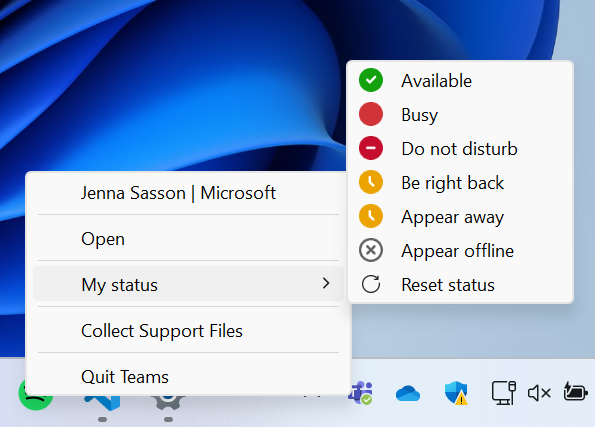
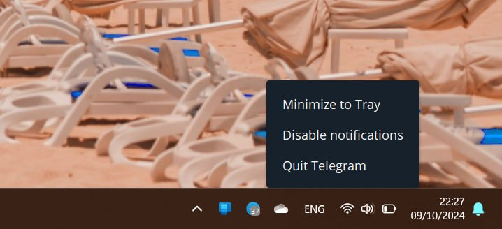
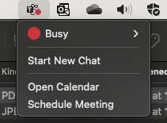

# **System Tray Icons for Installed desktop Web Apps**

Authors: [Diego Gonzalez](https://github.com/diekus), [Jenna Sasson](https://github.com/jennasasson_microsoft)

## Status of this Document
This document is a starting point for engaging the community and standards bodies in developing collaborative solutions fit for standardization. As the solutions to problems described in this document progress along the standards-track, we will retain this document as an archive and use this section to keep the community up-to-date with the most current standards venue and content location of future work and discussions.
* This document status: **Active**
* Expected venue: [W3C Web Applications Working Group](https://www.w3.org/groups/wg/webapps/)
* **Current version: this document**

##  Introduction
Desktop platform-specific applications have several ways of indicating that they are open. On platforms like Windows and macOS, the corresponding app icon on the taskbar/dock displays a little dot indicating that the app is open (or has an open window) and running. Additionally, *open applications may also have an icon on the system tray area*. This is very useful for end users because these icons can be used as a re-entry point to the app and can also convey different information.

At the very minimum, in every desktop platform, an application can have a system tray icon that can show a badge and have a menu that allows for entering, deep-linking into, or quitting the app. A notable characteristic of icons on the system tray on all platforms is that the app's tray icon ONLY shows if the application is open, as opposed to the icons on the taskbar or dock, that are always present.

Web applications currently do not have a way of participating in the system tray area. This leads to a worse user experience for end users on desktop environments. If a user closes the installed web application's window, this causes the web app to quit, and users may, for example, stop receiving status updates or miss that the application is running.

### System Tray area

We're referring here to the concept of the "System Tray" area. We use this term to refer to the OS surface where the platform displays information like network, time, battery, etc. Every major platform has a similar surface, and every major platform has mechanisms that allow apps to participate in this surface. Applications may have a presence in the "system tray" area, and present certain functionality to end users. 

For example, on Windows, this is the area in the bottom-right corner of the desktop. The screenshot below shows a file backup app, a videoplayer, an email client and an instant messaging program running and having presence in the system tray area.


In macOS, this is the area in the top-right corner of the desktop. In the screenshot below we can see a messaging app, an email client, a VPN client, a videoplayer and a file backup program running and having an icon in the system tray area.


In both cases, these apps are giving the user an entry point into the application, potentially displaying additional useful information at a glance or providing menus to deep-link into the app. Some of the benefits for the user in the previous screenshots are:
* Quick re-entry into every app.
* Knowing if an app has notifications, or the online state of a instant messagaging client.
* Knowing at a glance if the VPN is active or not.
* Quitting the app through the menu.
* Adapting to the expected paradigm of running desktop apps that have these icons.


## Goals
* Enable an installed Web App to have an icon on the "System Tray" area.
* Enable Web Applications to have a menu associated with the icon in the System Tray area.
* Enable badging for System Tray Icons.

## Non-goals
* Allow a Web Application to have a custom UX in the System Tray menu.
    * The minimum common UX that major platforms offer is a menu. It is not the scope of this API to enable elaborate menus that different platforms may offer.
* Allow the app to run on the background.
    * This API is to allow an installed web app to have an icon on the system tray area when the app is open/running.

## Use Cases
### Instant Messaging apps


The screenshot shows how in the menu the user can open, quit, or change the user's "status" in a messaging app. (The menu shown has several levels, which is not in scope of the API, but does show the usefulness of providing different options to the end user).


The previous screenshot shows a different instant messaging app that displays a badge with the number of unread messages and a menu that allows you to disable notifications for itself.  

### Collaboration Suites
A user can directly access their calendar or schedule a meeting right from the app's system tray icon. Notice as well in this case the actions offered in the menu are different from the ones specified in the icon in the dock. 



## Proposed Solution

The scope of this feature is to allow an installed Web app to have an icon on the system's tray area if the application is open and running.

There feature consists of several parts, namely, a way for the app to indicate that it wants to have a icon on the tray area and a way to specify menu options for when the user right-clicks on the icon. 

### Opting into the System Tray icon

For an app to opt into having an icon on the platform's system tray area, it can use the `tray_icon` entry in the manifest field.

```json
{
  "short_name": "webapp",
  "name": "Awesome Web App",
  ...,
  "tray_icon": [{
      "src": "/trayicon.png",
      "sizes": "256x256",
      "type": "image/png"
    }]
}

```

This icon will be present ONLY if the application is open and running. This icon can also be different from the one used in the platforms app launcher. Clicking on the icon will open/focus the app's window. Right-clicking on the icon will bring up the app's system tray menu.


### System Tray Menu
As stated before, the icon on the system tray for an installed web app will open/focus the app's window when clicked and will have a menu when the user double clicks. This menu can be specified in the manifest file, and uses the same format as the one for shortcuts.

```json
"tray_menu": [
  {
    "name": "Today's agenda",
    "short_name": "Agenda",
    "description": "View your agenda for today",
    "url": "/today",
    "icons": [
      {
        "src": "today.png",
        "sizes": "192x192"
        }
    ]
  }
]
```

Giving the developer the option to have different menu options in the shortcuts and system tray menu allows them to provide a better UX for users that doesn't repeat unnecessary options. By default, the system tray menu should have options to open and to quit the app.

## Privacy and Security Considerations

There are no new privacy or security considerations. The feature only enables a UX affordance on supporting platforms.


## Open Questions
* **Do we need a permission for this feature?**
No, this is a UX affordance for supporting platforms, same as the capability of an app having shortcuts or supporting Window Controls Overlay.

* **Can the Badging API interact with this feature?** Ideally yes, the [Badging API](https://w3c.github.io/badging/) would be able to set badges on the system tray icon. This could be the default `setAppBadge` method that sets the badge on both app launcher icon and system tray icon, or a new signature in for the method that specifies the tray icon as the recipient.

* **Does this API mean that the app is allowed to run in the background?**
No. The feature in this explainer only allows for isntalled web apps to have an icon on the system tray area while the app is open/running.

## Glossary

**System Tray area:** OS surface where the platform displays information like network, time, battery, etc.

## Acknowledgements

