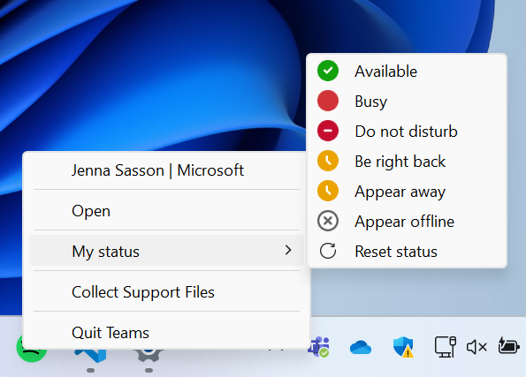
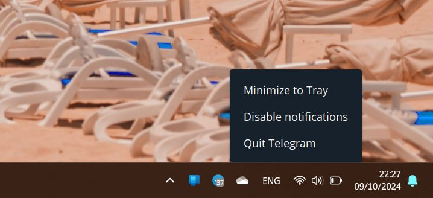
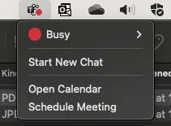
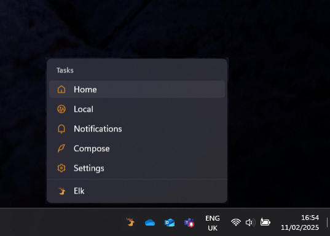

# **System Status Icons for Installed desktop Web Apps**

Authors: [Diego Gonzalez](https://github.com/diekus), [Jenna Sasson](https://github.com/jennasasson_microsoft)

## Status of this Document
This document is a starting point for engaging the community and standards bodies in developing collaborative solutions fit for standardization. As the solutions to problems described in this document progress along the standards-track, we will retain this document as an archive and use this section to keep the community up-to-date with the most current standards venue and content location of future work and discussions.
* This document status: **Active**
* Expected venue: [W3C Web Applications Working Group](https://www.w3.org/groups/wg/webapps/)
* **Current version: this document**

##  Introduction
Desktop platform-specific applications have several ways of indicating that they are running. On platforms like Windows and macOS, the corresponding app icon on the taskbar/dock displays a little dot indicating that the app is open (or has an open window) and running. Additionally, *open applications may also have an icon on a specific part of the OS where users glance at notifications or system status (settings/shortcuts)*. This is very useful for end users because these icons can be used as a re-entry point to the app and can also convey additional information and options to them.

This specific area varies in names depending on the platform, but the functionality for this icon across platforms is the same. Taken from the Apple's Human Interface Guidelines, [this feature](https://developer.apple.com/design/human-interface-guidelines/the-menu-bar#Menu-bar-extras) "exposes app-specific functionality using an icon that appears in the menu bar when your app is running, even when it’s not the frontmost app". This is called a menu extra in macOS, and sits next to the OS's *status menus*. On Windows, it is called a [notification icon](https://learn.microsoft.com/en-us/windows/win32/shell/notification-area#add-a-notification-icon), and sits in the notification area (aka system tray). We will call this area the ***system status area***. 

As stated previously on macOS and Windows, an application can have a system status icon that can show a badge and have a menu that allows for entering, deep-linking into, or quitting the app. A notable characteristic of icons on the system status area on all platforms is that the app's system status icon ONLY shows if the application is running, as opposed to the icons on the taskbar or dock, that are always present.

Web applications currently do not have a way of participating in the system status area. This leads to a degraded user experience for end users on desktop environments for certain classes of applications. If a user closes the installed web application's window, this causes the web app to quit, and users may, for example, stop receiving status updates or miss that the application is running.

### System *Status* area

Instead of menu bar extra or system tray area, we use the term "*System Status area*" to refer to the OS surface where the platform displays information like network, time, battery, etc. Most major platforms have a similar surface, and they can also have mechanisms that allow apps to participate in this surface. The goal is to allow web apps to have a presence in the "system status" area, and present certain functionality to end users. 

For example, on Windows, this is the area in the bottom-right corner of the desktop. The screenshot below shows a file backup app, a videoplayer, an email client and an instant messaging program running and having presence in the *system tray* area.


In macOS, this is the area in the top-right corner of the desktop. In the screenshot below we can see a messaging app, an email client, a VPN client, a videoplayer and a file backup program running and having an icon in their menu bar area. This is called "[menu bar extras](https://developer.apple.com/design/human-interface-guidelines/the-menu-bar#Menu-bar-extras)".


Other platforms like Ubuntu, that use the GNOME GUI can be tweaked to display apps on the "GNOME shell top bar", although this requires the use of [GNOME extensions](https://extensions.gnome.org/extension/1160/dash-to-panel/). Ubuntu does not support this functionality out of the box, so it is out of the scope of this feature to cover this platform.

Having icons on the system status area for apps is giving the user an entry point into the application, potentially displaying additional useful information at a glance or providing menus to deep-link into the app. Some of the benefits for the user in the previous screenshots are:
* Quick re-entry into every app.
* Knowing if an app has notifications, or the online state of an instant messaging client.
* Knowing at a glance if the VPN is active or not.
* Quitting the app through the menu.
* Adapting to the expected paradigm of running desktop apps that have these icons.

## Goals
* Enable an installed Web App to have an icon on the "System Status" area.
* Enable Web Applications to have a menu associated with the icon in the System Status area.
* Enable badging for System Status Icons.

## Non-goals
* Allow a Web Application to have a custom UX in the System Status menu.
    * The minimum common UX that major platforms offer is a menu. It is not the scope of this API to enable elaborate menus that different platforms may offer.
* Allow the app to run on the background.
    * This API is to allow an installed web app to have an icon on the system status area when the app is open/running.
* Create dynamic menus that change options.
* Enable this feature on platforms that are not desktop or that do not support this natively, like Linux.

## Use Cases

Different applications will use the status icon differently. There are cases where the options in the menus are the same, other apps vary content. This feature aims to give this flexibility to the developer. Independently of this, there is a user expectation that certain apps can be accessed from the status area. Also, in different platforms this icon will show in the status area even if the corresponding task/dock entry doesn't show as open, for example, if the user is in a secondary (virtual) desktop. The following are illustrative cases of how system status icons for apps are used today.

### Instant Messaging apps



The screenshot shows how in the menu the user can open, quit, or change the user's "status" in a messaging app. (The menu shown has several levels, which is not in scope of the API, but does show the usefulness of providing different options to the end user).



The previous screenshot shows a different instant messaging app that displays a badge with the number of unread messages and a menu that allows you to disable notifications for itself.

With the new UX affordance for web apps, these applications could choose to deeplink to create a new message in the `shortcuts` and leave the status icon menu to change the user's online/activity status for example.

### Collaboration Suites
A user can directly access their calendar or schedule a meeting right from the app's system status icon. Notice as well in this case the actions offered in the menu are different from the ones specified in the icon in the dock. 



### Multimedia Content control

On macOS the VLC media player adds an icon to the system status area to put playback controls. In general, an app can expose any functionality that it deems useful for the end user. 

As an example, a multimedia content control might use the `shorcuts` to deeplink into sections of the media library, and use the status icon menu for media controls or advanced menus relatd to the content that is reproducing, like subtitle selection.

## Proposed Solution

The scope of this feature is to allow an installed Web app to have an icon on the system's status area if the application is open and running.

The feature consists of several parts, namely, a way for the app to indicate that it wants to have an icon on the status area and a way to specify menu options for when the user right-clicks on the icon. 

### Opting into the System Status icon

For an app to opt into having an icon on the platform's system status area, it can include an icon in the `icons` of the manifest file with a `purpose` of `system_status`.

```json
{
  "short_name": "webapp",
  "name": "Awesome Web App",
  ...,
  "icons": [
    ...,
    {
      "src": "icon/statusIcon.png",
      "purpose" : "status_icon"
    }
  ]
}
```

This icon will be present ONLY if the application is running. This icon can also be different from the one used in the platform's app launcher. Interacting with the icon will open/focus the app's window. Secondary interaction (usually right-clicking) on the icon will bring up the app's system status menu.

### System Status Menu
As stated before, the icon on the system status for an installed web app will open/focus the app's window when clicked and will have a menu when the user uses the secondary click action. This menu can be specified in the manifest file, and uses the same format as the one for shortcuts. To define it, you add the `status_shortcuts` field in the manifest file. 

```json
"status_shortcuts": [
  {
    "name": "Today's agenda",
    "short_name": "Agenda",
    "description": "View your agenda for today",
    "url": "/today",
    "icons": [
      {
        "src": "today.png",
        "sizes": "192x192"
        }
    ]
  }
]
```

The following is a mockup of how this menu could look.



> **Note:** The menu follows the same structure as the one for the `shortcuts` field in the manifest file. Icon support is platform dependent, and it is a one level list of items that can deeplink into the application. As stated in the [non-goals](#non-goals), elaborate or dynamic menus are out of scope of this feature.

Giving the developer the option to have different menu options in the shortcuts and system status menu allows them to provide a better UX for users that doesn't repeat unnecessary options. The system status menu could have options to open and to quit the app.

## Privacy and Security Considerations

There are no new privacy or security considerations. The feature only enables a UX affordance on supporting platforms.

Similar to other UX features enabled through the manifest like shortcuts, protocol_handling and Window Controls Overlay, this feature is relevant for installed web applications only. 

## Open Questions
* **Do we need a permission for this feature?**
No, this is a UX affordance for supporting platforms, same as the capability of an app having shortcuts or supporting Window Controls Overlay.

* **Can we use the `icons` array to specify the icon for this OS area?**
Initially the separate field of `status_icon` was defined. We've defaulted to using existing manifest constructs for icons to specify this new one. The existing `icons` field in the manifest file will be used to add the system status icon. Each icon object has a [`purpose`](https://developer.mozilla.org/en-US/docs/Web/Manifest/Reference/icons#purpose) optional field that could be used to specify that this is meant to be used as the "status" icon. 

* **Can the Badging API interact with this feature?** Ideally yes, the [Badging API](https://w3c.github.io/badging/) would be able to set badges on the system status icon. This could be the default `setAppBadge` method that sets the badge on both app launcher icon and system status icon, or a new signature in for the method that specifies the status icon as the recipient.

* **Does this API mean that the app is allowed to run in the background?**
No. The feature in this explainer only allows for isntalled web apps to have an icon on the system status area while the app is open/running.

## Glossary

**System Status area:** OS surface where the platform displays information like network, time, battery, etc.

## Acknowledgements

We would like to acknowledge critical input to this feature by Tess Hober. 