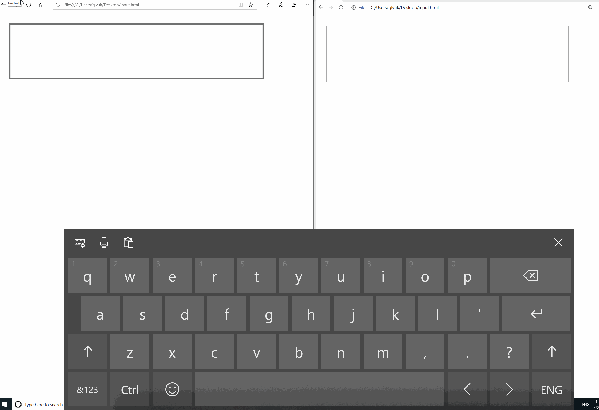

# Streamlining Text Input for Touch Keyboards & IMEs with TSF 1.0

## Motivation:

Windows Text Services Framework (TSF) enables a TSF-enabled app to receive text input from a number of devices or sources including IMEs (Input Method Editors) and on-screen keyboards.

TSF makes it possible for apps to leverage new text intelligence services, such as autocorrection, text suggestions as you type, shapewriting that lets you swipe over keys without releasing your finger to type, IME reconversion after composition has ended, and other input modalities. Many customers have come to expect these features on mobile devices. This work will help bring similar capabilities to touch enabled Windows devices.

Not all apps on Windows get these services by default. Apps built on top of legacy IMM32 (Input Method Manager) framework must do additional work to enable text intelligence services to light-up the new streamlined text input. This currently includes Chromium-based browsers.

As it stands today, users of Chromium-based browsers are not able to take advantage of the text intelligence services that TSF provides today. The sample below showcases just one example where suggestions and shapewriting features are available in the existing version of Microsoft Edge (left) and not available to Chrome (right).



## Proposal:

The proposal targets the following use-cases:
* Enable text intelligence services - allows user to select text suggestions as they type;
* Swipe keyboard – allow user to use shapewriting for text input;
* Enable reconversion after commit – for languages that support reconversion, allow user to select committed text and reconvert it.

### Non-Goals:

This proposal will not completely replace support for IMM32 on Windows as it is still used by some third party plugins (Flash). We're planning to follow up with the Chromium input team and define long-term IMM32 plans once we land TSF 1.0.
This proposal is not planning on addressing on-screen keyboard issues on platforms that don't have TSF 1.0 or don't have text intelligence services enabled.

## Solution:

We would like to improve Chromium text input on Windows by adding support for TSF 1.0. This would enable text intelligence services and enable input methods, already supported on Windows to Chromium. We identified a work in progress [crbug.com/657623](https://bugs.chromium.org/p/chromium/issues/detail?id=657623) and we beleive that the work there is aligned with our proposal.
TSF 1.0 is available starting with Windows 7 and should cover most current Windows releases that are still in use.

## Alternatives considered:

TSF 1.0 was made available more than a decade ago and since then the Windows input stack has advanced into TSF 3.0.
We considered TSF 3.0 as an alternative and determined the following key differences over TSF 1.0:

* TSF 3.0 is a subset of TSF 1.0 that unifies mobile (TSF 2.0) and Desktop input services;
* TSF 3.0 provides simpler API programming model with support for multiple languages;
* TSF 3.0 exposes ```InputPanelDisplayPolicy``` that provides more precise on-screen keyboard policy (Manual or Automatic);
* TSF 3.0 requires Windows Runtime (WinRT) API, that is not available on Windows 7;

Based on those factors we've settled on TSF 1.0 as the currently proposed solution for enabling text intelligence services on Windows platform.

We welcome your feedback and opinion on ways we can help improve Chromium text input in the future!

## Links:

* Issue 657623: Using TSF instead of IMM32 in the IMF on Windows: https://crbug.com/657623
* About Text Services Framework: https://docs.microsoft.com/en-us/windows/desktop/TSF/about-text-services-framework
* Text Services Framework Reference: https://docs.microsoft.com/en-us/windows/desktop/TSF/text-services-framework-reference

---
[Related issues](https://github.com/MicrosoftEdge/MSEdgeExplainers/labels/TSF%201.0) | [Open a new issue](https://github.com/MicrosoftEdge/MSEdgeExplainers/issues/new?title=%5BTSF%201.0%5D)
