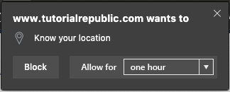

# Time-limited Permissions Explainer

Authors: [Aaron Gustafson](https://github.com/aarongustafson)

## Status of this Document
This document is intended as a starting point for engaging the community and standards bodies in developing collaborative solutions fit for standardization. As the solutions to problems described in this document progress along the standards-track, we will retain this document as an archive and use this section to keep the community up-to-date with the most current standards venue and content location of future work and discussions.
* This document status: **Active**
* Expected venue: [W3C Web Incubator Community Group](https://wicg.io/) 
* Current version: this document

## Introduction

At present, permissions on the web are binary. A user either grants you permission to their sensitive data (e.g., location, clipboard) or they don’t. When a user does grant a site permission to access that information, that permission persists until the user revokes it. This creates an imbalance of power. Users forget who they’ve granted permission to and seldom audit site permissions.

If we were to allow users to control the duration of a permission grant at the same time as they are granting it, we put them back in control and reduce/remove the need for them to audit permissions.

## Goals

* Enable authors to indicate a preferred duration for a permission to persist when making a request for permission.
* Enable users to grant the requested permission for the duration requested by the author *or* for a duration they specify.

## Use Cases

A user is shopping on an e-commerce site that also has brick-and-mortar locations. They are looking to see if a particular item is in stock and, in order to help them find the closest store, the site asks for permission to access their location. In this scenario, the author could request access to the user’s geolocation for an hour and the user may see that request and, instead, opt to only persist the permission for the duration of their current browsing session.

A user has installed a web-based productivity app. In the course of completing a task, the user is prompted to grant the site clipboard access. The site author has requested this permission in perpetuity. The user agrees to grant that request as they use this app frequently and clipboard access is a key feature.

## API Proposal

The most scalable approach to enabling permissions to be time-limited would be to add this feature to the [Permission API](https://w3c.github.io/permissions/), via [`request()`](https://wicg.github.io/permissions-request/). This method takes a [Permission Descriptor](https://w3c.github.io/permissions/#dictdef-permissiondescriptor) indicating both the name of the platform feature desired (already [enumerated in the Permissions API spec](https://w3c.github.io/permissions/#permission-registry)) and proposed duration for the permission:

```js
navigator.permissions.request({
  name: "geolocation",
  duration: 3600
}).then(function(){
  navigator.geolocation.getCurrentPosition(function(position) {
    console.log('Geolocation permissions granted for an hour');
  });
});
```

The value of the `duration` key would be either a number or a string value of "*":

* **0** – permission requested for the current browsing session only
* **1–31556952** – permission requested for this number of seconds (one second to one year)
* **"*"** – permission requested until revoked

User Agents may decide to downgrade the maximum allowed duration for specific APIs, but should document that to make authors aware. User Agents may also consider gating the "in perpetuity" option to installed web apps and/or sites which have high engagement from a user.

It would be up to each user agent to choose how to present this request to the user, but they would be expected to present the requested duration in a human readable manner, with the option to round to commonly understood durations. For example:

* 3600 = "one hour"
* 604800 = "one week"
* 31556952 = "one year"

This API introduces a new permission `state`, "expired," which would be returned as part of the `permissions.query()` method:

```js
navigator.permissions.query({
  name:"geolocation"
}).then(function(result) {
  if ( result.state == "expired" ||
       result.state == "prompt" )
  {
    // If the permission has expired
    // ask for another week
    navigator.permissions.request({
      name: "geolocation",
      duration: 604800
    });
  }
});
```

The "expired" permission `state` would be functionally equivalent to "prompt," but provides authors with knowledge of whether the user has granted this permission previously.

## User Interface

With this system in place, a user agent would prompt a user to choose the duration for which a permission should be granted. If no preference is submitted by the author, the user agent should choose a default time limit to the permission (suggested: [session](#session-defined)). If the author does suggest a time limit, that should be the default option provided, but the user agent should suggest alternatives. By default, "session" and "in perpetuity" (or similar labels) should be provided. The other options should be provided at the discretion of the user agent.

### Example

Given the following JavaScript

```js
navigator.permissions.request({
  name: "geolocation",
  duration: 3600
}).then(function(){
  navigator.geolocation.getCurrentPosition(function(position) {
    console.log('Geolocation permissions granted for an hour');
  });
});
```

The user agent might choose to present a permission prompt with the duration chooser.

<figure id="prompt-concept">

</figure>

The options presented by the user agent would be something like this:

* until this tab is closed
* one hour (selected)
* one week
* forever

The number of options presented should be left to the discretion of the user agent, but should number no less than two (the equivalent of "this session" and "in perpetuity" if the author provides no explicit request) and no more than four.

It should be noted that a user agent MUST present the time-limiting permissions prompt for all associated permissions requests regardless of whether `permissions.request()` is used.

## Session, defined

For the purposes of time-limiting permissions, a session is a top-level browsing context (inclusive of all current browsing context that share an origin). When a new `Document` is created in a browsing context which has a top-level browsing context, the user agent must validate any permission usage against the top-level browsing context for that document's origin. Any permissions granted in that top-level browsing context are inherited by the new Document.

A session ends when the top-level browsing context is destroyed. To account for crashes and similar events that may artificially cause a top-level browsing context to be destroyed, user agents should persist any permissions granted for a session for no less than 5 minutes. At the conclusion of that time period, all permissions granted for that session should be revoked by setting the permission `state` to "expired".

## Abiding by the time limit

In order to help user agents understand the implications of the various duration options, here’s a rundown:

* If a user grants a permission in perpetuity ("*"), the permission persists until the user explicitly revokes it via the user agent.
* If a user grants a permission for the duration of the session ("0"), the permission persists only until [the session ends](#session-defined).
* If a user grants permission for a specific duration, the user agent will timestamp the permission grant and periodically compare that against the duration. Once the time limit runs out, the permission would persist until the current [session ends](#session-defined), at which point the `state` would be set to "expired". This persistence will ensure any ongoing permission-dependent activity (e.g., RTC session) is not interrupted. This is consistent with how user agents currently treat explicit permission revocation via the user agent’s interface.
* If a user does not grant permission, the user agent will set the permission `state` to "denied".


## What to do with existing permissions

Any permissions granted or denied prior to implementation of this API would remain as-is. A User Agent may choose to prompt users to audit their permissions if they know permissions have been granted by a user prior to this API becoming available.

## Open Questions

1. Do we even need an explicit "expired" state? Would it be more sensible (and less of a privacy risk) to reset the permission `state` to "prompt" instead?
2. Would there be value in enabling authors to get information about the amount of time remaining in a permissions grant via `permission.query()`?
3. Are up to four options too many? Would three options be enough? Maybe "Block", "Allow Once" (effectively for the session), and "Always Allow"?

---
[Related issues](https://github.com/MicrosoftEdge/MSEdgeExplainers/labels/Time-limited%20Permissions) | [Open a new issue](https://github.com/MicrosoftEdge/MSEdgeExplainers/issues/new?title=%5BTime-limited%20Permissions%5D)
