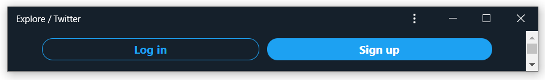
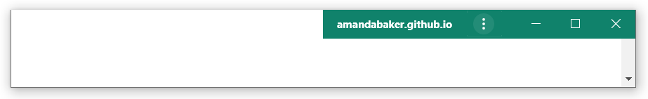
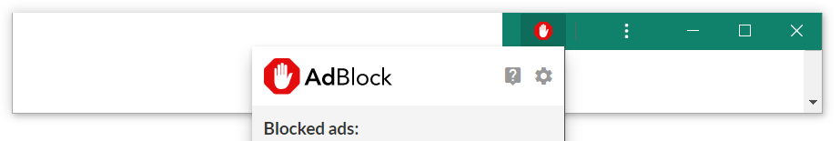
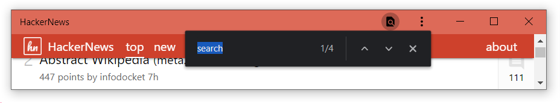
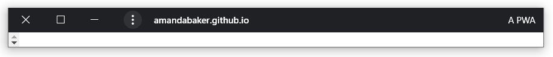
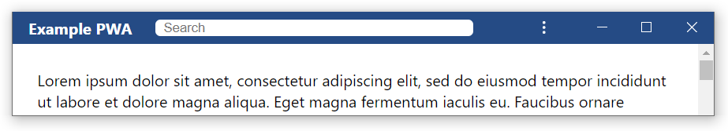

# Window Controls Overlay for Installed Desktop Web Apps

## Status of this Document
This document is intended as a starting point for engaging the community and standards bodies in developing collaborative solutions fit for standardization. As the solutions to problems described in this document progress along the standards-track, we will retain this document as an archive and use this section to keep the community up-to-date with the most current standards venue and content location of future work and discussions.
* This document status: **ARCHIVED**
* Current venue: [W3C Web Incubator Community Group](https://wicg.io/) 
* Current version: **https://github.com/WICG/window-controls-overlay/blob/master/explainer.md**
    * See also: [w3c/manifest#847](https://github.com/w3c/manifest/issues/847)
    * See also: [w3c/csswg-drafts#4721](https://github.com/w3c/csswg-drafts/issues/4721)
    * See also: [WICG discourse thread](https://discourse.wicg.io/t/proposal-title-bar-customization-for-web-apps/4278)

## Table of Contents
 - [Introduction](#introduction)
 - [Examples of desktop apps customizing the title bar area](#examples-of-desktop-apps-customizing-the-title-bar-area)
 - [Problem to solve: Installed desktop web apps title bar area is system reserved](#problem-to-solve-installed-desktop-web-apps-title-bar-area-is-system-reserved)
 - [Goals](#goals)
 - [Proposal](#proposal)
   - [Overlaying Window Controls](#overlaying-window-controls-on-a-frameless-window)
   - [Working Around the Window Controls Overlay](#working-around-the-window-controls-overlay)
     - [JavaScript APIs](#javascript-apis)
     - [CSS Environment Variables](#css-environment-variables) 
   - [Defining Draggable Regions in Web Content](#defining-draggable-regions-in-web-content)
 - [Example](#example)
 - [Security Considerations](#security-considerations)
   - [Spoofing risks](#spoofing-risks)
   - [Out-of-scope Navigation](#out-of-scope-navigation)
 - [Privacy Considerations](#privacy-considerations)
 - [Open Questions](#open-questions)

## Introduction 

Installed web apps hosted within a user agent (UA) frame are able to declare which browser display mode best meets the needs of the application via the manifest file's [`display` member](https://developer.mozilla.org/en-US/docs/Web/Manifest/display). Currently, there are 4 supported values and their behaviors on Chromium browsers are described below:
- `fullscreen`: All of the available display is used and no UA chrome is shown. This is implemented only for mobile devices running Android or iOS.
- `standalone`: The web app looks like a standalone application. The title bar includes the title of the application, a web app menu button, and window control buttons (minimize, maximize/restore, close). 
- `minimal-ui`: Similar to `standalone`, except it also contains a back and refresh button. 
- `browser`: Currently, the same as `minimal-ui`

Developers targeting non-mobile devices will find that none of the display modes above offer the ability to create an immersive, native-like title bar for their installed application. Instead, the client areas begins immediately below the reserved title bar area, which can create a cramped application space especially on portable devices with smaller screens.

This explainer will examine different techniques that could be developed to provide more control of the title bar area to developers while still protecting the rights of users to manage the app window.

## Examples of desktop apps customizing the title bar area 

The title bar area of desktop applications is customized in many popular applications. The title bar area refers to the space to the left or right of the window controls (minimize, maximize, close etc.) and often contains the title of the application. On Windows, this area can be customized by the developer and apps based on Electron often reclaim this title bar space for frequently used UI like a search box, profile icon, new message icon etc.

### Visual Studio Code
Visual Studio Code is a popular code editor built on Electron that ships on multiple desktop platforms.

This screen shot shows how VS Code uses the title bar to maximize available screen real estate. They include the file name of the currently opened file and the top-level menu structure within the title bar space.


### Spotify
Popular streaming music service Spotify is also built on Electron and they use the title bar space to maximize screen real estate to show the currently signed in user account, a search box and forward/back buttons designed specifically for the Spotify experience.


### Microsoft Teams
Workplace collaboration and communication tool Microsoft Teams, also based on Electron for portability, customize the title bar in a similar fashion to Spotify, providing user information, a search and command bar and their own back/forward in-app navigation controls. 


## Problem to solve: Installed desktop web apps title bar area is system reserved

Contrast the above examples of popular desktop applications with the current limitation in the `standalone` display mode in Chromium based desktop web apps.



- The UA supplied title bar is styled by the browser (with input from the developer via the manifest's [`"display"`](https://developer.mozilla.org/en-US/docs/Web/Manifest/display) and [`"theme_color"`](https://developer.mozilla.org/en-US/docs/Web/Manifest/theme_color))
- The 3-dot menu is displayed beside the window controls

None of this area is available to application developers. This is a problem where 
- screen real estate is at a premium when windowed apps have reduced viewport
- the developer is forced to make another area underneath the title bar for the application controls they'd like most prominently displayed
- UA supplied controls cannot be styled or hidden which takes away a developer's ability to fully control the app experience 

## Goals

- Provide a declarative way for developers to have the UA host their installed web app with the title bar area available for their content  
- Ensure accessible user control of the app window is maintained (at minimum - UA supplied minimize, close and drag window controls)
- The UA respects the window controls design of the host operating system while adapting to the applications color/theme 


## Proposal

The solution proposed in this explainer is in multiple parts
1. A new display modifier option for the web app manifest - `"window-controls-overlay"`
2. New APIs for developers to query the bounding rects and other states of the UA provided window controls overlay which will overlay into the web content area through a new object on the `window.navigator` property called `windowControlsOverlay`
3. New CSS environment variables to define the left and right insets from the edges of the window: `unsafe-area-top-inset-left` and `unsafe-area-top-inset-right`
4. A standards-based way for developers to define system drag regions on their content

### Overlaying Window Controls on a Frameless Window
To provide the maximum addressable area for web content, the User Agent (UA) will create a frameless window removing all UA provided chrome except for a window controls overlay.

The window controls overlay ensures users can minimize, maximize or restore, and close the application, and also provides access to relevant browser controls via the web app menu. For Chromium browsers displayed in left-to-right (LTR) languages, the content will flow as follows, starting from the left/inner edge of the overlay:
- A draggable region that is the same width and height of each of the window control buttons
- The "Settings and more" three-dot button which gives users access to extensions, security information about the page, access to cookies, etc.
- The window control buttons minimize, maximize/restore, and close. On operating systems that only support full screen windows, the maximize/restore button will be omitted.


Additionally, there are two scenarios where other content will appear in the window controls overlay. When these show or hide, the overlay will resize to fit, and a `geometrychange` event will be fired on the `navigator.windowControlsOverlay` object. 
- When an installed web app is launched, the origin of the page will display to the left of the three-dot button for a few seconds, then disappear.
- If a user interacts with an extension via the "Settings and more" menu, the icon of the extension will appear in the overlay to the left of the three-dot button. After clicking out of the modal dialog, the icon is removed from the overlay.





For Chromium browsers displayed in right-to-left (RTL) languages, the order within the window controls overlay will be flipped, and the overlay will appear in the upper-left corner of the client area. 

The window controls overlay will always be on top of the web content's Z order and will accept all user input without flowing it through to the web content. See [Coordinate System](#coordinate-system).

If the OS and browser support a colored title bar, the window controls overlay would use the `"theme_color"` from the manifest as the background color. When hovered over and clicked, the controls should honor the operating system design behavior. If a colored title bar is not supported, the window controls overlay will be drawn in the theme supported by the OS and browser.

The desire to place content into the title bar area and use an overlay for the window controls will be declared within the web app manifest by adding the `window-controls-overlay` display modifier and setting display mode to `standalone`. This display modifier will be ignored on Android and iOS or when used in conjunction with any other `display` modes.

```json
{
  "display": "standalone",
  "display_modifiers": ["window-controls-overlay"]
}
```

### Working Around the Window Controls Overlay
Web content will need to be aware of the UA reserved area of the window controls overlay and ensure those areas aren't expecting user interaction. This overlay can be worked around similar to the way developers work around notches in a phone screen.

In the example of Windows operating systems, window controls are either drawn on the upper right or upper left of the frame depending on which system language is in use:
- Left to right languages - close button shown on the upper right of the frame
- Right to left languages - close button shown on the upper left of the frame

The bounding rectangle and the visibility of the window controls overlay will need to be made available to the web content. This information is provided to the developer through JavaScript APIs and CSS environment variables.

#### JavaScript APIs
To provide the visibility and bounding rectangle of the overlay, this explainer proposes a new object on the `window.navigator` property called `windowControlsOverlay`.

`windowControlsOverlay` would make available the following objects:
* `getBoundingClientRect()` which would return a [`DOMRect`](https://developer.mozilla.org/en-US/docs/Web/API/DOMRect) that represents the area under the window controls overlay. Interactive web content should not be displayed beneath the overlay.
* `visible` a boolean to determine if the window controls overlay has been rendered

For privacy, the `windowControlsOverlay` will not be accessible to iframes inside of a webpage. See [Privacy Considerations](#privacy-considerations) below

Whenever the overlay is resized, a `geometrychange` event will be fired on the `navigator.windowControlsOverlay` object to notify the client that it should recalculate the layout based on the new bounding rect of the overlay. 

#### CSS Environment Variables
Although it's possible to layout the content of the title bar and web page with just the JavaScript APIs provided above, they are not as responsive as a CSS solution. This is problematic either when the overlay resizes to accommodate the origin text or a new extension icon populates the overlay, or when the window resizes.

The solution is to treat the overlay like a notch in a phone screen and layout the title bar area next to the window controls overlay "notch". The position of the overlay can be defined using the existing [`safe-area-inset-top`](https://developer.mozilla.org/en-US/docs/Web/CSS/env) CSS environment variable to determine the height, and two new CSS environment variables describing the left and right insets of the overlay: [`unsafe-area-top-inset-left/right`](https://github.com/w3c/csswg-drafts/issues/4721). See the [sample code](#example) below on one method of laying out the title bar using these CSS environment variables. 

We explored and rejected an alternative approach which instead uses CSS environment variables to describe the safe area of the title bar, `title-bar-area-[top/left/bottom/right]`. Although this "safe area" approach would be easier for developers to use than the "unsafe area" approach, it would be difficult to standardize given that it is such a niche use case (only available on installed desktop web apps). 

### Defining Draggable Regions in Web Content
Web developers will need a standards-based way of defining which areas of their content within the general area of the title bar should be treated as draggable. The proposed solution is to standardize the existing CSS property: `-webkit-app-region`. 

Chromium based browsers have a prefixed, non-standard CSS property `-webkit-app-region: drag` and `-webkit-app-region: no-drag` that allows developers to markup rectangular regions of their content as draggable. This property is used for full customization of the title bar for Electron based applications [referenced here](https://electronjs.org/docs/api/frameless-window#draggable-region).

Per the Electron documentation, text selection can accidentally occur within draggable regions, so it's recommended to also use the CSS property `user-select: none` on the element to avoid accidental text selection. 

Both of these webkit prefixed properties have been shipping in Chromium for some years and could be leveraged by the UA to provide a solution to this problem. This would require standardizing the app-region property through the CSS working group. 

### Resulting Changes in Browser

#### Coordinate System
The coordinate system will not be affected by the overlay, although content my be covered by the overlay.
- The point (0,0) will be the top left corner of the viewport. This point will fall _under_ the overlay if the overlay is in the top-left corner.
- `window.innerHeight` will return the full height of the client area including the area under the overlay. On operating systems which do not include borders around the window, `window.innerHeight === window.outerHeight`
- `vh` and `vw` units would be unaffected. They would still represent 1/100th of the height/width of the viewport which is also not affected by the overlay.

#### Omnibox-anchored Dialogs
Dialogs like print `[Ctrl+P]` and find in page `[Ctrl + F]` are typically anchored to the omnibox. 


With the omnibox hidden, installed web apps anchor these elements to an icon to the left of the three-dot "Settings and more" button. To maintain consistency across all installed web apps, the window controls overlay will use this pattern as well.



## Example

Below is an example of how these new features could be used to create a web application with a custom title bar. 


### manifest.webmanifest
In the manifest, set `"display": "standalone"` and `"display_modifiers": ["window-controls-overlay"]`. Set the `theme_color` to be the desired color of the title bar.
```JSON
{
  "name": "Example PWA",
  "display": "standalone",
  "display_modifiers": [ 
    "window-controls-overlay" 
  ],
  "theme_color": "#254B85"
}
```

### index.html
There are two main regions below: the `titleBarContainer` and the `mainContent`. The `titleBar` is set to be `draggable` and the search box inside is set to be `nonDraggable`. 

Inside of the `titleBarContainer`, there is a `titleBar` element representing the visible portion of the title bar area.

```html
<!DOCTYPE html>
<html lang="en">
  <head>
    <meta charset="utf-8">
    <meta name="viewport" content="width=device-width">
    <title>Example PWA</title>
    <link rel="stylesheet" href="style.css">
    <link rel="manifest" href="./manifest.webmanifest">
  </head>
  <body>
    <div id="titleBarContainer">
      <div id="titleBar" class=" draggable">
        <span class="draggable">Example PWA</span>
        <input class="nonDraggable" type="text" placeholder="Search"></input>
      </div>
    </div>
    <div id="mainContent"><!-- The rest of the webpage --></div>
  </body>
</html>
```

### style.css
The draggable regions are set using `app-region: drag` and `app-region: no-drag`. 

On the `body`, margins are set to 0 to ensure the title bar reaches to the edges of the window.

The `titleBarContainer` uses `position: absolute` and `top: 0` to fix itself to the top of the page. The height is set to `safe-area-inset-top` or to fall back to `--fallback-title-bar-height` if the window controls overlay is not visible. The background color of the `titleBarContainer` is the same as the `theme_color`. 

The visible `titleBar` also uses `position: absolute` and `top: 0` to pin it to the top of the window. By default, it consumes the full width of the window. It also sets `user-select: none` to prevent any attempts at dragging the window to be consumed instead by highlighting text inside of the div.

If the window controls overlay is on the right, then the `rightOverlay` class is added to the `titleBar`. This fixes the `titleBar` to the left side of the window and sets the `width` to be equal to the inset of the overlay from the left side of the window, `env(unsafe-area-top-inset-left)`. 

If the window controls overlay is on the left, then the `leftOverlay` class is added to the `titleBar`. This fixes the `titleBar` to the right side of the window and sets the `width` to be equal to the inset of the overlay from the right side of the window, `env(unsafe-area-top-inset-right)`. 

The container for the `mainContent` of the webpage is also fixed in place with `position: absolute`. It sets `overflow-y: scroll` to allow its contents to scroll vertically within the container.

For cases where the browser does not support the window controls overlay, a CSS variable is added to set a fallback title bar height. The bounds of the `titleBarContainer` and `mainContent` are initially set to fill the entire client area, and do not need to be changed if the overlay is not supported.
```css
:root {
  --fallback-title-bar-height: 40px;
}

.draggable {
  app-region: drag;
}

.nonDraggable {
  app-region: no-drag;
}

body {
  font-family: 'Segoe UI', Tahoma, Geneva, Verdana, sans-serif;
  margin: 0;
}

#titleBarContainer {
  position: absolute;
  top: 0;
  height: var(--safe-area-inset-top, var(--fallback-title-bar-height));
  width: 100%;
  background-color:#254B85;
}

#titleBar {
  position: absolute;
  top: 0;
  display: flex;
  user-select: none;
  height: 100%;
  width: 100%;

  color: #FFFFFF;
  font-weight: bold;
  text-align: center;
}

#titleBar.rightOverlay {
  left: 0;
  width: var(--unsafe-area-top-inset-left);
}

#titleBar.leftOverlay {
  right: 0;
  width: var(--unsafe-area-top-inset-right);
}

#titleBar > span {
  margin: auto;
  padding: 0px 16px 0px 16px;
}

#titleBar > input {
  flex: 1;
  margin: 8px;
  border-radius: 5px;
  border: none;
  padding: 8px;
}

#mainContent {
  position: absolute;
  left: 0;
  right: 0;
  bottom: 0;
  top: env(safe-area-inset-top, var(--fallback-title-bar-height));
  overflow-y: scroll;
}
```

### app.js
We assume this web app will be launched in `browser` or `standalone` mode, so by default the title bar consumes the full width of the window. To accommodate the window controls overlay, we will need to first check if the overlay is visible, then, if it is visible, determine if it is in the upper-left or upper-right corner of the window. In `app.js`, check if `navigator.windowControlsOverlay.visible` is `true`, and if so, proceed to layout the custom title bar area. The overlay could either be in the upper-left corner or upper-right corner, depending on the operating system (Mac uses top left, Windows uses top right) and the browser language direction (if the browser is in an RTL language then the title bar is inverted horizontally). If the bounding rect of the overlay has an `x` value of `0`, then that implies that the overlay is on the left . If value of `rect.x` is greater than `0`, then the overlay is on the right. Set either the `leftOverlay` or `rightOverlay` class appropriately.

```javascript
// initialize the title bar to avoid the window controls overlay which
// could be in either the top right or top left corner
const initializeTitleBar = () => {
  const titleBar = document.getElementById("titleBar");
  const rect = window.navigator.windowControlsOverlay.getBoundingClientRect();

  // rect.x will be 0 if the overlay is on the left
  if (rect.x === 0) {
    titleBar.classList.add("leftOverlay");
  } else {
    titleBar.classList.add("rightOverlay");
  }
};

if (window.navigator.windowControlsOverlay && window.navigator.windowControlsOverlay.visible) {
  initializeTitleBar();
}
```

## Security Considerations


### Spoofing risks
Displaying installed web apps in a frameless window leaves room for developers to spoof content in what was previously a trusted, UA-controlled region. 

Currently in Chromium browsers, `standalone` mode includes a title bar which on initial launch displays the `title` of the webpage on the left, and the origin of the page on the right (followed by the "settings and more" button and the window controls). After a few seconds, the origin text disappears. 

In RTL configured browsers, this layout is flipped such that the origin text is on the left. This open the window controls overlay to spoofing the origin if there is insufficient padding between the origin and the right edge of the overlay. For example, the origin "evil.ltd" could be appended with a trusted site "google.com", leading users to believe that the source is trustworthy.  

 

### Out-of-scope Navigation

Another existing security feature for installed web apps is an indicator of when a user has left the declared scope of the app. When a user navigates out of scope, a black bar appears between the title bar and the web content, and it includes the following information:
- A close button to allow users to easily navigate back into scope
- A security icon which opens the security info popup when clicked
- The origin and title of the site

With the window controls overlay enabled, if a user navigates out-of-scope the overlay will be temporarily replaced with a `standalone` title bar. When the user navigates back to into scope, the `standalone` title bar will be hidden again and the overlay displayed. 

_In-scope: using the window controls overlay_



_Out-of-scope: reverting to the `standalone` title bar_


## Privacy Considerations

Enabling the window controls overlay and draggable regions do not pose considerable privacy concerns other than feature detection. However, due to differing sizes and positions of the window control buttons across operating systems, the JavaScript API for `window.navigator.windowControlsOverlay.getBoundingClientRect()` will return a rect whose position and dimensions will reveal information about the operating system upon which the browser is running. Currently, developers can already discover the OS from the user agent string, but due to fingerprinting concerns there is discussion about [freezing the UA string and unifying OS versions](https://groups.google.com/a/chromium.org/forum/m/#!msg/blink-dev/-2JIRNMWJ7s/yHe4tQNLCgAJ). We would like to work with the community to understand how frequently the size of the window controls overlay changes across platforms, as we believe that these are fairly stable across OS versions and thus would not be useful for observing minor OS versions.

Although this is a potential fingerprinting issue, it only applies to installed desktop web apps that use the window controls overlay feature and does not apply to general browser usage. Additionally, the `windowControlsOverlay` API will not be available to iframes embedded inside of an installed web app.

## Open Questions

### Open Questions: Overlaying Window Controls
- Should the height of the title bar be customizable?
- If so, a fixed set of sizes (small, medium, large) or a pixel value that is constrained by the UA?

### Open Questions: Working Around the Window Controls Overlay
- Would it be valuable to an additional member,`window.navigator.windowControlsOverlay.controls` which has boolean member properties to provide information on which of the window controls are currently being rendered? This would include `maximize`, `minimize`, `restore`, `close` among other values that are implementation specific, for example a small `dragRegion` area and `settings` menu.  

### Open Questions: Defining Draggable Regions in Web Content
- Different operating systems could have requirements for draggable regions. One approach could be to have a drag region that runs 100% width but only comes down a small number of pixels from the top of the frame. This could provide a consistent area for end users to grab and drag at the cost of reducing the addressable real estate for web content. Is this desirable?
- Could a DOM property on an element be used to identify drag regions on the content?
