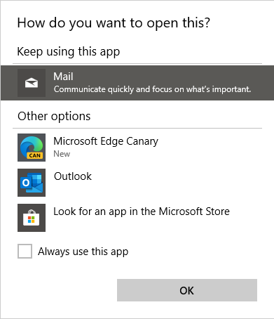

# URL Protocol Handler Registration for PWAs

## **Authors**

Fabio Rocha (<farocha@microsoft.com>)
Connor Moody (<comoody@microsoft.com>)
Samuel Tang (<samtan@microsoft.com>)

Former authors (no longer involved):
Jose Leal (<joselea@microsoft.com>)
Eric Lawrence (<ericlaw@microsoft.com>)

## Status of this Document

This document is intended as a starting point for engaging the community and standards bodies in developing collaborative solutions fit for standardization. As the solutions to problems described in this document progress along the standards-track, we will retain this document as an archive and use this section to keep the community up-to-date with the most current standards venue and content location of future work and discussions.

* This document status: **Active**
* Expected venue: [Web Applications Working Group](https://www.w3.org/2019/webapps/) 
* Current version: this document

## Motivation

Developers can create a more engaging native-like experience if we allow Progressive Web Apps to be registered as handlers for URL protocols (aka schemes). Today, native applications can register themselves as protocol handlers, and HTML5 exposes a JavaScript API `registerProtocolHandler` for web sites to do the same, but it is desirable to offer registration as part of a PWA installation through its manifest.

After registering a PWA as a protocol handler, when a user clicks on a hyperlink with a specific scheme such as `mailto://` , `ms-word://` or `web+music://` from a browser or a native app, the registered PWA would open and receive the URL.

It is important to note that both the manifest-based registration proposed in this explainer and `registerProtocolHandler` play very similar roles in practice, while still allowing the possibility for subtle but complementary user-experiences.

Similarities include requirements around the list of schemes allowed to be registered (as discussed in the security section below), format of the parameters, same-origin policy and etc.

There are subtle differences in the manifest-based registration, however, that might be useful to enhance the experience for PWA users. For example, manifest-based registrations could loosen some requirements that currently apply to `registerProtocolHandler`. For instance, the need of user interaction for a website to register to handle a certain protocol might not apply to manifest-based PWA registration, as when a user intentionally installs a PWA there's an implicit level of trust involved that installation-related things will occur, including the registration of protocol handlers. This could also mean that the user doesn't need to be notified that a new protocol handler has been registered, as currently happens when `registerProtocolHandler` is used, and instead we could rely on solutions that let the user know what will happen before installation, such as an install time permissions prompt, to convey that protocols handlers will be registered.

## Use Cases

- Cross app integration. A user opens a document using a PWA. The document contains a link to a presentation (`ms-powerpoint://deck2378465`). When the user clicks on it, the presentation PWA automatically opens in the correct scope and shows the slide deck.

- In a native chat app, the user receives a link to some `magnet://` URL. When she clicks the link, an installed torrent PWA is launched.

- A user has installed a PWA for a music app. When a friend shares a link to a song and she clicks on it (`web+music://songid=1234&time=0:13`) the PWA will automatically launch instead of opening a new tab in the browser.

## Manifest Example

In this example, a Web App Manifest declares that the app should be registered to handle the protocols `web+jngl` and `web+jnglstore`.

```json
{
  "name": "Jungle",
  "description": "A plant encyclopedia",
  "protocol_handlers": [
    {
      "protocol": "web+jngl",
      "url": "/lookup?type=%s"
    },
    {
      "protocol": "web+jnglstore",
      "url": "/shop?for=%s"
    }
  ],
  "icons": [
    {
      "src": "images/icons-44.png",
      "type": "image/png",
      "sizes": "44x44"
    },
    {
      "src": "images/icons-144.png",
      "type": "image/png",
      "sizes": "144x144"
    },
    {
      "src": "images/icons-192.png",
      "type": "image/png",
      "sizes": "192x192"
    },
  ],
  "background_color": "#007f87",
  "display": "standalone",
  "start_url": "/",
}
```

A developer can add a field in the manifest.json to declare which protocols the web app can handle. As seen in the example above, the key is named `protocol_handlers` and it contains an array of protocol handler declaration objects.

These are the fields for each protocol handler:

| Field     | Required / Optional | Description                                                                         | Default                                                           |
|:----------|:--------------------|:------------------------------------------------------------------------------------|:------------------------------------------------------------------|
| `protocol` | Required            | Protocol to be handled. E.g.: `mailto`, `ms-word`, `web+jngl`.                         | N/A                                                               |
| `url` | Required            | HTTPS URL within the application that will handle the protocol. The `%s` token will be replaced by the URL starting with the protocol handler's scheme.                      | N/A                                       |

## How Other Applications Register for URL Handling

All URLs begin with a scheme name followed by a colon (e.g.: `https:`). Custom URL schemes let the user open apps by clicking hyperlinks. URLs can be invoked by a browser, PWA, or native application.

Registering applications to handle URL schemes is operating system dependent. This association is usually done during application installation but it can also be done afterwards for an app that has already been installed. Chromium already contains code to register protocol handlers with the operating system as a part of its installer and its handling of the HTML5 `registerProtocolHandler` API. See `DefaultProtocolClientWorker::SetAsDefaultImpl` for details.

### Windows

- **Desktop applications** can be registered to handle URL schemes by modifying registry key values. See more [here](https://docs.microsoft.com/en-us/previous-versions/windows/internet-explorer/ie-developer/platform-apis/aa767914(v=vs.85)?redirectedfrom=MSDN).

- **UWP apps** can specify a supported schemes in their package manifest. The OS registers these associations during installation. Read more [here](https://docs.microsoft.com/en-us/windows/uwp/launch-resume/handle-uri-activation).

### Linux

On Linux, Chromium's `SetAsDefaultProtocolClient` function relies upon the utility `xdg-settings`.

### Mac

On Mac, Chromium's `SetAsDefaultProtocolClient` function calls the API `LSSetDefaultHandlerForURLScheme`.

## Handling Multiple Registrations

### Different apps registering the same protocol

  Multiple applications might register themselves as handlers for the same scheme. For example, a user might install multiple mail clients that register for the `mailto://` protocol. In such cases, it is up to the OS to allow the user decide which app they want to open.

  On Windows, a prompt is shown with all the installed programs that can handle that protocol.

  

### Same app registering multiple protocols

  A developer might wish to register for multiple protocols with unique (or common) launch URLs.

- The UWP app for Office is registered to handle both `ms-officeapp` and `ms-getoffice`.
- The Microsoft News UWP app is registered to handle `msnews` and `msnnews`.
- The Xbox Console Companion app is registered to handle `xbox`, `xbox-captures`, `xbox-friendfinder`, `xbox-settings`, etc.

## PWA Launch and Context Passing

Opening the selected app is the first step. In the common case, the target URL will be supplied as a query param in the app's HTTPS URL. For example, the hyperlink `web+jngl:cacao-tree` would open the Jungle PWA to `jungleapp.com/lookup?type=web%2Bjngl%3Acacao-tree`.

Alternatively, it may be desirable to supply the URL as part of the [Launch Events](https://github.com/WICG/sw-launch/blob/master/explainer.md).

## Related APIs

As mentioned before, the Navigator interface from WebAPI has the method `registerProtocolHandler` that allows web sites register as handlers of particular URL schemes.

<https://html.spec.whatwg.org/multipage/system-state.html#custom-handlers>

<https://developer.mozilla.org/en-US/docs/Web/API/Navigator/registerProtocolHandler>

## Security Considerations

Registering a protocol handler represents an important state change in the user's operating environment, and we must work to ensure that it is not abused.

The `registerProtocolHandler` API implements an allow list of schemes that may be registered; we should start with that same restriction and evaluate whether it meets the needs, but possibly adding a few schemes to the list.

URLs may contain sensitive user data; because PWAs require a secure context (HTTPS), invocation of a protocol handler will take place in a secure context. However, PWAs that implement protocol handlers must still take care to avoid sending potentially-sensitive URL data over insecure channels.

Whenever there is ambiguity between which app must handle a protocol invocation, it is up to the OS to show the app resolver and let the user decide which one to use.

We may want to cap the number of allowed protocols to a number N per manifest.

## Privacy Considerations

A common concern for protocol handling APIs is that bad actors could try to enumerate which apps are registered as protocol handlers as a fingerprinting technique. One can imagine that a lot about a user can be revealed from which apps are installed to handle certain protocols (e.g. a ConservativeNews App or a SomeReligion App might register protocol handlers).

To prevent fingerprinting, we plan to follow the footsteps of the `registerProtocolHandler` by not exposing the list of protocol handlers to the web.

## Open Questions

> What ensures that registration through manifest will never conflict with a `registerProtocolHandler()` call from the PWA?

Just like when a protocol is registered to be handled by two different sites or apps, the current intent is that the user would have a way to indicate who should ultimately handle a protocol, the browser (via a website registered by `registerProtocolHandler`) or a PWA registered via a manifest `protocol_handlers` property. This functionality is currently exposed in `chrome://settings/content/handlers` and in similar OS interfaces that handle protocol registration.

This might not be the desired behavior, though, and needs to be thought about more carefully. One can imagine a scenario where a developer wants to control the experience and uses both registration mechanisms to indicate that if the user is currently navigating the web on the browser, the protocol is to be handled by the website, and if the user is outside the browser, the protocol is to be handled by the app.
