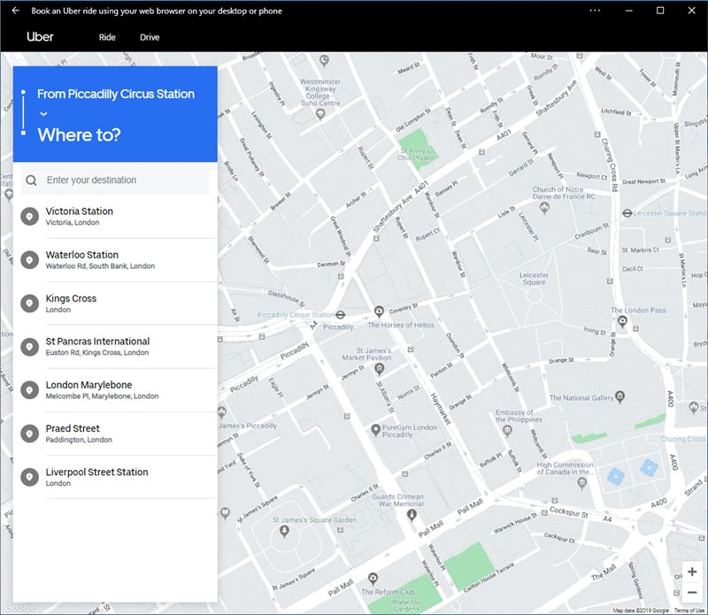
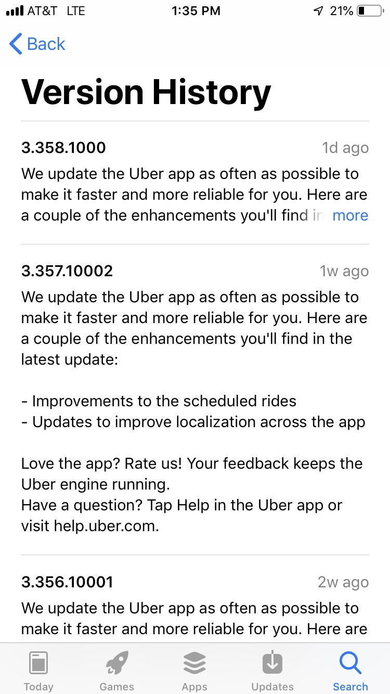
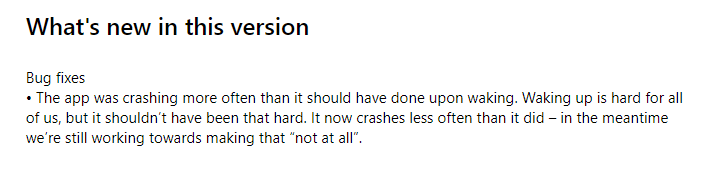

# Version History Explainer

## Authors

Megan Dymerski, Pooja Patel, Samantha Sappenfield, Aaron Gustafson and Stanley Hon.

## Introduction

When a new version of a piece of native software rolls out users are typically made aware through a notification in their operating system or the app store they use. The web—in contrast—is evergreen, meaning that software built atop it is always up to date. Because of this, there is no formal "moment" in which developers of web-based software can inform their users of what’s changed with their software from release to release (e.g., new features that have been added, which bugs have been fixed). Providing a standardized means of surfacing version history would enable developers to surface this useful—and sometimes crucial—information.

## Update behavior

Manifest.json changes are not reflected in an already installed PWA until the user agent deems an update necessary. We intend for this feature to update via the same mechanism. When a PWA developer updates the section of the manifest.json related to version history, the user agent should deem an update neccesary. After the update is complete, the user agent can choose to publcize that there are new updates.

## Publicizing changes

User agents should have some mechanism to indicate that a new changelog version has been pushed since the user has last looked at changes.

## Goals for v1

- Enable developers to display their PWA’s changelog in a standardized fashion
- Enable users to access PWA change logs easily

## Use Cases

Most PWAs are regularly updated. By providing end-users with access to information concerning these updates, their understanding of the app would improve. Other benefits may include:

- Building awareness of UI changes before they experience them;
- Enabling users to discover new features;
- Providing an opportunity for user re-engagement; and
- Making user support easier.

A User Agent might choose to expose a version history in a manner similar to how certificate and cookie information is exposed.

<figure>



<figcaption>
In this animated GIF, the user selects the browser’s triple dot (…) menu, then chooses "App Info," and finally "Version History." This results in the version history for the app being rendered in a new window.
</figcaption>

</figure>

## Version History Proposal

The solution proposed in this explainer is the addition of an optional member to the Web App Manifest: `changelog`.

```idl
dictionary WebAppManifest {
  …
  dictionary changelog;
}
```

### `changelog`

The `changelog` member would be a dictionary with two keys: the current version (`version`) and a sequence of one or more resource URLs that define the version history (`history`):

```idl
dictionary changelog {
  USVString version;
  Required sequence<Resource> history;
}
```

#### `version`

Optional. A human-readable label for current version name. This version is used to represent the version of the content served by the remote website. If provided it will be used by the user agent to publicize updates when this number changes.

#### `history`

The path to one or more Resources. Implementors should choose the first resource they can render, based on the MIME type information provided.

Note: history is intended to show different formats of changelog, not different changelogs for different versions.

In most cases, we suspect that only one `history` resource would be provided, but we also recognize that there are many formats for recording version history and we want to be respectful of that. We propose that the acceptable formats include HTML, RSS/Atom, and JSONFeed. Additional formats (Markdown, etc.) may be supported at the User Agent’s discretion. This list of acceptable formats may grow over time.

### Resource Definition
Resources are intended as a way to enumerate different formats of the same changelog information.

```idl
dictionary Resource {
  USVString url;
  USVString type;
}
```

#### `url`

The url that should be loaded when users select "Version History." This URL must exist within the `scope` of the manifest. If the manifest-url is a relative URL, the base URL will be the URL of the manifest (e.g., [Twitter’s Release Notes](https://twitter.com/i/release_notes)).

#### `type`

Provides the MIME type of file found at `url`. At a minimum, acceptable MIME types include `text/html`, `application/rss+xml`, `application/atom+xml`, and `application/json`.

## Example

```json
"changelog": {
  "version": "1.0.1",
  "history": [{
    "url": "https://foo.com/history",
    "type": "text/html"
  }]
}
```

This `changelog` information would define a current version string of "1.0.1" and a single HTML-formatted history resource, available at "https://foo.com/history".

## Rendering version history

The rendering of version history should take place within a browser window. If the format of the version history resource is something other than HTML, the implementor is encouraged to [coerce the version history data into semantic HTML](parsing-version-data.md) and render it using its default browser styles.

If the implementor is coercing a data feed into HTML, it should take care to sort the history such that the most recent item is at the top.

Implementors are free to experiment with progressive disclosure of version information (e.g., accordion widgets, sensible truncation), provided the most recent item in the history is displayed in full.

## Existing Solutions

The **iOS App Store** currently displays the version name, a release date, and a brief description of changes made for each version:



The **Microsoft Store** currently displays an overview of changes that came with the latest version:



[GitHub releases](https://developer.github.com/v3/repos/releases/): can display to users important releases on GitHub developers

## Open Questions

1. Should history be stored as a dictionary instead of a collection?
2. Alternative formats for storing version data?
3. Are there titles other than "Version History" that would be preferrable?

## Privacy Considerations

No considerable privacy concerns are expected. Fingerprinting via Feature detection is a low risk as a webpage cannot tell if a user agent does not support changelogs, or the user simply did not trigger it. In the case a user does trigger it, we may reveal we are a browser that supports this changelog feature.

## Security Considerations

The main security concern is that user agents need to process untrusted data feeds from the web. Putting aside that users need to install the PWA itself from the website - user agents need to be careful how they process the data feeds in case they are malicious. User agents need to take care not to try to process these untrusted data sets in privileged code.

Done correctly the risk is the same as running arbitrary javascript on an relatively trusted site (since the user already installed the PWA).

HTML changelogs are not a particular security concern, as this would be no riskier than a standard navigation.