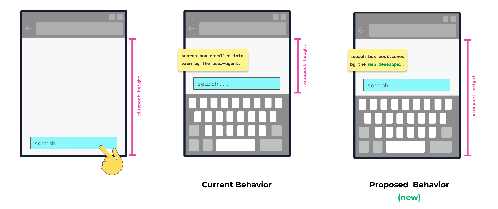
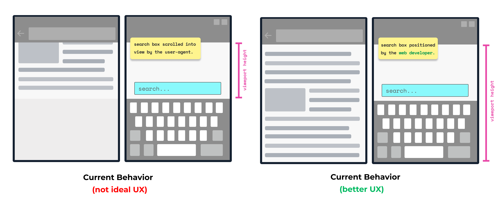
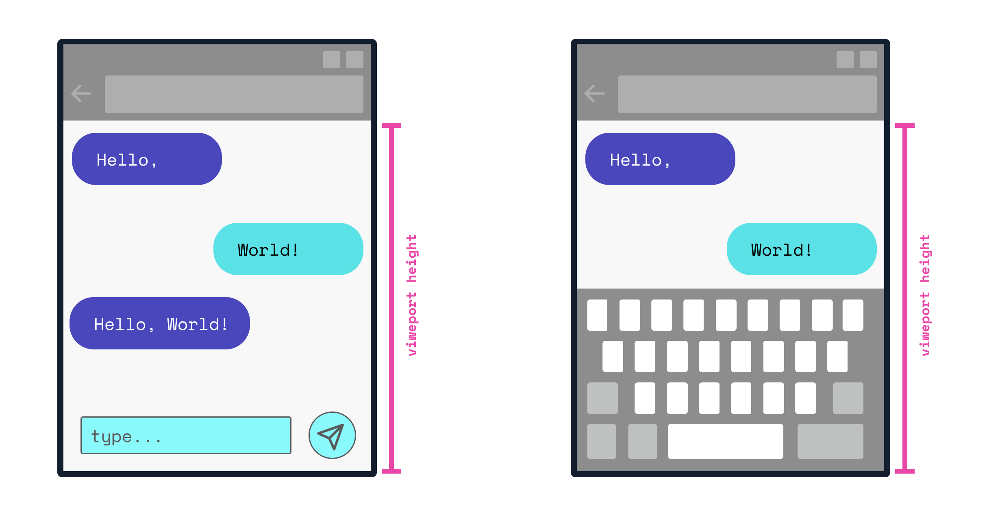
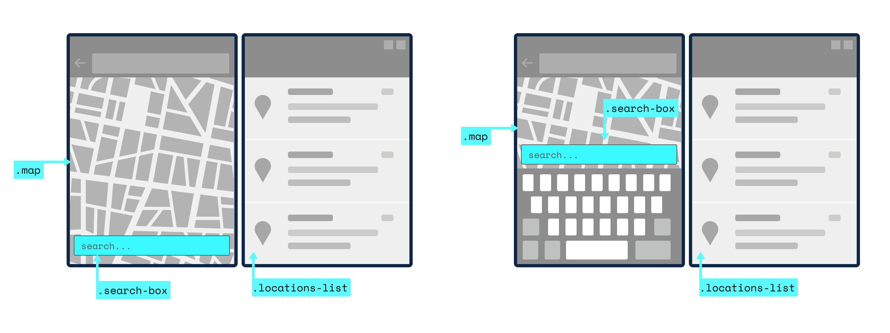

# Virtual Keyboard API

Authors: [Daniel Libby](https://github.com/dlibby-), [Zouhir Chahoud](https://github.com/Zouhir)

## Status of this Document
This document is intended as a starting point for engaging the community and standards bodies in developing collaborative solutions fit for standardization. As the solutions to problems described in this document progress along the standards-track, we will retain this document as an archive and use this section to keep the community up-to-date with the most current standards venue and content location of future work and discussions.
* This document status: **Active**
* Expected venue: [W3C Web Incubator Community Group](https://wicg.io/) 
* Current version: this document

## Introduction

Today on the web, User Agents respond to the presence of the virtual (software) keyboard, without any exposure of this information to the web page. This document proposes a new web API surface for virtual keyboards that developers can use to enable better customization of their webpage's content and experiences.

## Motivation

Virtual keyboards are typically invoked when a user interacts with an editable area via touch input. In order for users to effectively use the virtual keyboard to input text, the editable area must be remain visible. To try to ensure this happens across the web today, there are two User Agent behaviors associated with the appearance of a docked virtual keyboard:

- The entire application is resized, which ends up affecting the layout of the page. Once the resize is completed, the focused element is scrolled into view.

- A visual viewport is applied to the web contents, as an inset that matches the size of the virtual keyboard. Once the visual viewport is applied, the focused element is scrolled into view.



Rich editing applications have no way to determine what behavior they will get today, and in fact may not want any action taken by the user agent, but instead desire to only reposition certain aspects of their view. This becomes increasingly important with dual screen devices where the virtual keyboard does not necessarily need to occupy the entire width of the viewport. Native applications have the ability to listen for events from the underlying OS and we believe web developers also can use this information to bring enhanced experiences to the web.



## Non Goals

This proposal is currently scoped to exposing information about *docked* virtual keyboards. Floating virtual keyboards are typically put into that configuration explicitly by users, and therefore the user is able to adjust the keyboard and/or window layout as appropriate to unblock themselves. With that in mind, we decided to not extend `geometrychange` event to the floating keyboards because we believe it is not practical or useful for the app to process and reflow continually as the keyboard is dragged around.

## Proposal

To enable these scenarios and ensure backward site compatibility, we propose a mechanism for developers to opt-into a different behavior when the virtual keyboard appears: a docked virtual keyboard will occlude content along with providing JavaScript events when the virtual keyboard overlay geometry changes.

### Allowing Virtual Keyboard to Occlude Content

The first new feature is an additional `virtualKeyboard` attribute on `Navigator` that exposes a new object. This object (via the `VirtualKeyboard` interface) will contain a boolean attribute `overlaysContent` which enables developers to enable the new behavior of the virtual keyboard overlaying page content, instead of performing the UA default action of resizing viewport, as described in the Motivation section.

```javascript
if ("virtualKeyboard" in navigator) {
    window.navigator.virtualKeyboard.overlaysContent = true;
}
```



### Virtual Keyboard Visibility Change CSS environment variables 

We propose the addition of six CSS environment variables: `keyboard-inset-top`, `keyboard-inset-right`, `keyboard-inset-bottom`, `keyboard-inset-left`, `keyboard-inset-width`, `keyboard-inset-height`. Web developers can utilize these variables to calculate the virtual keyboard size and position and adjust layout accordingly.

### Example
```html
<!DOCTYPE html>
<meta name="viewport" content="width=device-width, initial-scale=1">
<style>
body {
    display: grid;
    margin: 8px;
    height: calc(100vh - 16px);
    grid-template: 
        "content"  1fr
        "search"   auto
        "keyboard" env(keyboard-inset-height, 0px);
}
input[type=search]::placeholder {
    color: #444;
}
input[type=search] {
    padding: 10px;
    font-size: 24px;
    border: 4px solid black;
    border-radius: 4px;
    background-color: #86DBF6;
    justify-self: center;
}
</style>
<div id="content">...</div>
<input type="search" placeholder="search...">
<script>
    if ("virtualKeyboard" in navigator) {
        navigator.virtualKeyboard.overlaysContent = true
    }
</script>
```

### Listening and Responding to Virtual Keyboard Visibility Change

Additionally, the `VirtualKeyboard` interface is an `EventTarget` from which the user agent will dispatch `geometrychange` events when the virtual keyboard is shown, hidden or otherwise changes its intersection with the layout viewport.

The `geometrychange` event provides a `boundingRect` object with six read-only properties `top`, `left`, `bottom`, `right`, `width`, and `height` for web developers to use in adjusting the layout of their document. These values are in CSS pixels and are in the client coordinate system. This `boundingRect` is also available through the `virtualKeyboard` object on `navigator`.

## Example

### A map application that presents a map on one window segment and search results on another



```css
.map {
  position: relative;
  ...
}

.search-box {
  position: absolute;
  bottom:  15px;
}
```

```javascript
navigator.virtualKeyboard.overlaysContent = true

navigator.virtualKeyboard.addEventListener("geometrychange", adjustSearchBoxPosition)

function adjustSearchBoxPosition() {
    let { width, height } = navigator.virtualKeyboard.boundingRect
    if( width !== 0 && height !== 0 ) {
      console.log('virtual keyboard is visible!')
    }
    document.querySelector(".search-box").style.bottom = `${height + 15}px`
}

adjustSearchBoxPosition()
```

### API Availability in iframe Context

iframes will not be able to set or change the virtual keyboard behaviour via `navigator.virtualKeyboard.overlaysContent`, the root page is responsible for setting this policy. However, the `geometrychange` event will fire in the focus chain of the element that triggered the virtual keyboard visibility (i.e. the frame in which the focused element lives, along with its ancestor frames).

Note that the geometry exposed to the iframe via the `navigator.virtualKeyboard.boundingRect` property are relative to the iframe's client coordinates and not the root page; in other words, the `boundingRect` exposed represents the intersection between the virtual keyboard and the iframe element.
