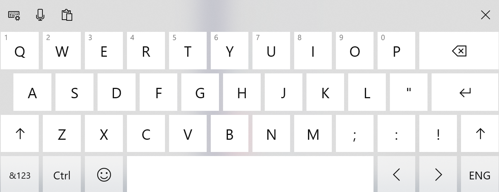
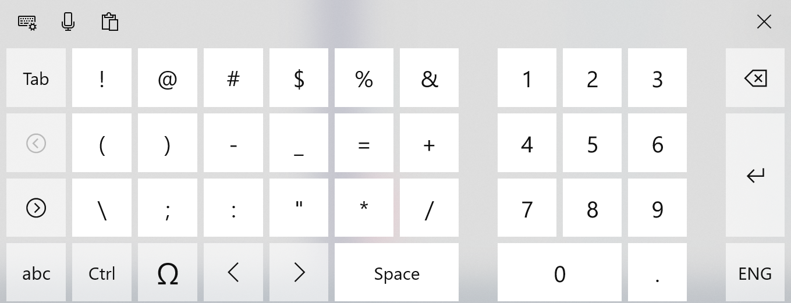
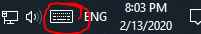
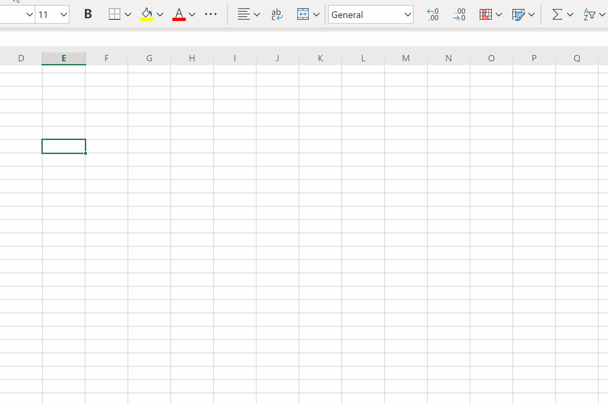
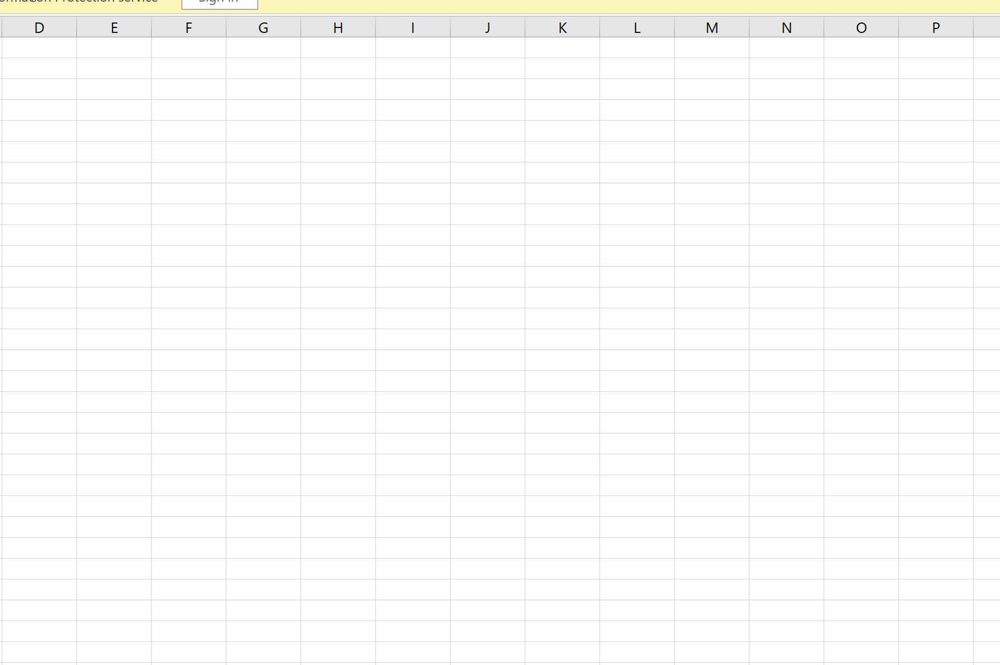

# Virtual Keyboard Control

**Note - this proposal extends the scope of [VirtualKeyboard Interface](https://github.com/MicrosoftEdge/MSEdgeExplainers/blob/main/VirtualKeyboardAPI/explainer.md)**

## Status of this Document
This document is intended as a starting point for engaging the community and standards bodies in developing collaborative solutions fit for standardization. As the solutions to problems described in this document progress along the standards-track, we will retain this document as an archive and use this section to keep the community up-to-date with the most current standards venue and content location of future work and discussions.
* This document status: **Active**
* Expected venue: [W3C Editing Task Force](https://w3c.github.io/editing/) 
* Current version: this document

## Introduction
The Virtual Keyboard (VK) is the on-screen keyboard used for input in scenarios where a hardware keyboard may not be available. Unlike a hardware keyboard, a VK can adapt its shape to optimize for the expected type of input.  

|    |   |
|---|---|

Authors have control over the displayed shape of the VK through the `inputmode` attribute, but have limited control over when the VK is shown or hidden.

This document proposes a new API surface to provide authors with more control over when the VK is shown or hidden.


## Background and Motivating Scenarios

**Inputmode conflates two aspects of the VK that should be separated: its visibility and its layout.**

To control the shape of the VK, authors can use the [inputmode](https://html.spec.whatwg.org/multipage/interaction.html#input-modalities:-the-inputmode-attribute) attribute.  ```inputmode``` accepts the following keywords:

| Keyword | Purpose                                             |
|---------|-----------------------------------------------------|
| none    | Hide the keyboard if it is currently showing.       |
| text    | Display a keyboard layout specialized for text input. |
| tel     | Display a keyboard layout specialized for telephone number input                          |
| url     | Display a keyboard layout specialized for url input                          |
| email   | Display a keyboard layout specialized for email input                          |
| numeric | Display a keyboard layout specialized for number input                          |
| decimal | Display a keyboard layout specialized for fractional numeric input                          |
| search  | Display a keyboard layout specialized for search                          |


The value of none is special in that it controls not the appearance but the behavior of the virtual keyboard (hide if currently shown).  On the Windows platform, however, the user has the ability to reveal the keyboard manually using a button in the UI of the task bar. 

If an author doesn’t want to show the VK when an editable element is focused, but wants to ensure that the keyboard appears with its numeric layout if manually revealed by the user, this cannot be accomplished; ```inputmode``` can only be one of none or numeric at any moment in time.


**A mode should exist that allows an editable element to be focused while the VK remains as it was.**

Additionally, there is no mechanism for an app to simply leave the VK in its current state when an editable element is focused.  The values of ```inputmode``` only allow: none - which will hide the VK when focused, and all other values - which show the VK when focused.

| Previous Focused Element | Next Focused Element     | Behavior of Virtual Keyboard         |
|--------------------------|--------------------------|--------------------------------------|
| editable, `inputmode="text"` | editable, `inputmode="none"` | A VK was showing, but then is hidden |
| editable, `inputmode="none"` | editable, `inputmode="text"` | A VK was hidden, but then is shown   |
| read-only                | editable, `inputmode="text"` | A VK was hidden, but then is shown   |
| editable, `inputmode="text"` | read-only                | A VK was shown, but then is hidden   |


**An explicit API should exist which allows sites to show or hide the keyboard independent of when an editable element was focused.**

Lastly, some app scenarios have complicated heuristics for when the keyboard should be hidden or shown to optimize for viewing content or allowing input at different times.  Consider sites like Microsoft Excel and Google Sheets which have cells that display computed values that are backed by formulas.  When first tapping on a cell, the cell becomes selected.  The site must be ready for input and must focus an editable element (to enable OS text input services) or risk dropping a character for the purposes of composition and text suggestions. 

|Excel Online scenario - dropped character during Japanese composition|Excel Desktop scenario - working case of Japanese composition|
|-|-|
||

Tapping on a cell to initiate selection, however, should not change the state of the VK, and potentially move the selection out from under the user’s finger.  The VK should remain in its current state and only be revealed after a second tap which places the cell into a formula editing mode.
|Broken Case - VK shows up as soon as user lifts a finger from range picker|Working Case - VK retains its state when user lifts a finger from the range picker|
|-|-|
||


## Proposal
To address the issues above, a new attribute, `virtualkeyboardpolicy`, will be introduced for elements, and is applicable to all editable elements. `virtualkeyboardpolicy` accepts two values: ```auto``` and ```manual```.  ```auto``` causes the corresponding editable element to automatically show the VK when it is focused or tapped (current behavior); ```manual``` decouples focus and taps on the editable element from changes in the VK’s current state - the VK remains as it was.

Revisiting the earlier table:

| Previous Focused Element                             | Next Focused Element                                   | Behavior of Virtual Keyboard                                                                           |
|------------------------------------------------------|--------------------------------------------------------|--------------------------------------------------------------------------------------------------------|
| editable, `inputmode="text", virtualkeyboardpolicy="auto"` | editable, `inputmode="none", virtualkeyboardpolicy="manual"` | A VK was showing, the VK remains showing                                                               |
| editable, `inputmode="none", virtualkeyboardpolicy="auto"` | editable, `inputmode="text", virtualkeyboardpolicy="manual"` | A VK was hidden, the VK remains hidden                                                                 |
| read-only                                            | editable, `inputmode="text", virtualkeyboardpolicy="manual"` | A VK was hidden, the VK remains hidden                                                                 |
| editable, `inputmode="text", virtualkeyboardpolicy="auto"` | read-only, `virtualkeyboardpolicy="manual"`                | A VK was shown, but then is hidden (the `virtualkeyboardpolicy` is only applicable to editable elements) |


Additionally, two new methods will be added to the VirtualKeyboard interface: ```show``` and ```hide``` (the ```VirtualKeyboard``` interface is introduced in this [separate explainer](https://github.com/MicrosoftEdge/MSEdgeExplainers/blob/main/VirtualKeyboardAPI/explainer.md)). ```show``` will request that the OS show the VK, while ```hide``` requests that the VK be hidden.  Note that the OS has its own heuristics and may not honor the request.

## Examples

```javascript
<!DOCTYPE html>
<html>
<div contenteditable virtualkeyboardpolicy="manual" inputmode="text" 
        style="height:50px;width:300px;border:1px solid black;"
        data-formula="12+30">42</div>
<script type="module">
    let div = document.querySelector("div")
    div.addEventListener("focusout", handleFocusOut)
    div.addEventListener("dblclick", handleDblClick)

    function handleFocusOut() {
        let formula = parseIntoFormula(div.firstChild.data)
        div.setAttribute("data-formula", formula)
        div.firstChild.data = evaluateFormula(formula)
    }

    function handleDblClick(e) {
        div.firstChild.data = div.getAttribute("data-formula")

        // TODO: add pointerType property to MouseEvent
        if (e.pointerType == "touch") {
            navigator.virtualKeyboard.show()
        }
    }

    function parseIntoFormula(text) {
        // TODO: formula parsing
        return "12+30"
    }

    function evaluateFormula(formula) {
        // TODO: formula evaluation
        return "42"
    }
</script>
```

## WebIDL
```C#
[Exposed=Window, HTMLConstructor] 
interface HTMLElement : Element {

[CEReactions, Reflect, ReflectOnly=("auto","manual")] 
attribute DOMString virtualKeyboardPolicy;

partial interface Navigator {
    [SameObject] readonly attribute VirtualKeyboard virtualKeyboard;
};
[Exposed=Window]
interface VirtualKeyboard : EventTarget {
   void show();
   void hide()
};
```

## Alternatives Considered
As an alternative, new attribute values for `virtualkeyboardpolicy` could be introduced for hiding and showing the VK, i.e. `virtualkeyboardpolicy` could support auto, manual, hide, show as its valid values.

The reason this wasn’t pursued is that showing and hiding the VK through an attribute requires greater consideration over exactly when the value of the attribute should be evaluated.  If its every time the associated editable element is focused or tapped then the author must take care to ensure those subsequent user interactions will result in the correct experience.  It seems more ergonomic to just let the developer call a method when the VK should be shown or hidden.

## Privacy Considerations
No considerable privacy concerns are expected for the following reasons:

* No information about an user is being shared with web authors. The API only controls what should happen to the virtual keyboard followed by the user action.

## Security/Quality/Abuse/Experience Considerations
* Authors can already manipulate whether the keyboard is hiding or showing through focusing and blurring editable elements. No new authority is granted with this API, we are only separating virtual keyboard layout from visibility to enable new scenarios.
* Additionally, API calls requiring user interaction before showing the keyboard are limited to the active document.
* There is a virtual keyboard flickering concern when users would tap between two or more editable fields. This will be addressed by the debounce timer implemented in the browser, similar to how it is implemented for the default policy today.
