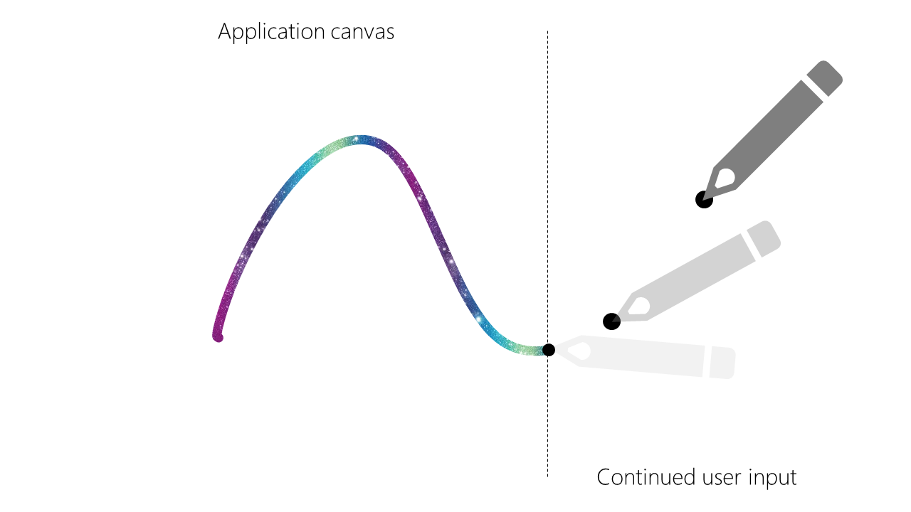
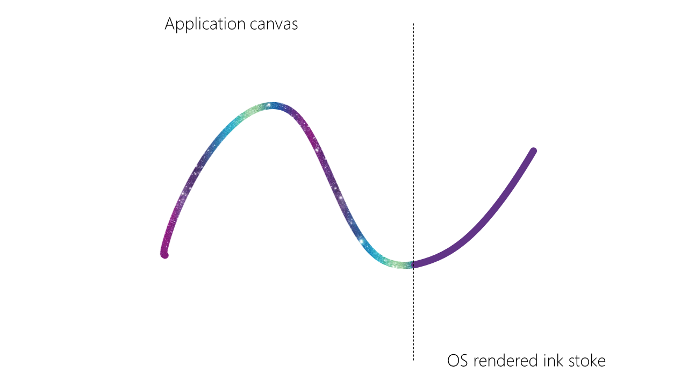
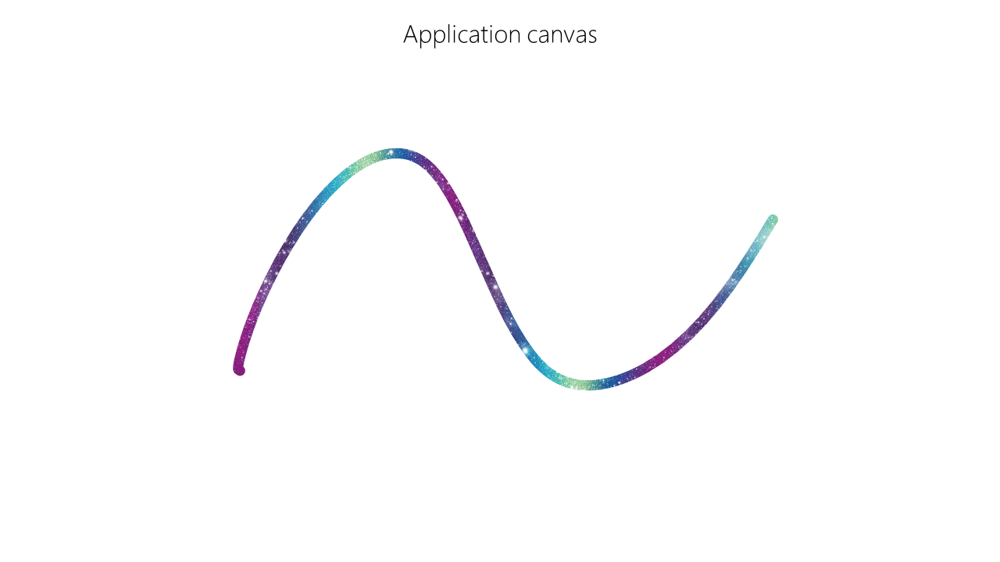

# Web Ink Enhancement: Pen Stroke Tip Presentation Aided By The OS

Author: [Daniel Libby](https://github.com/dlibby-)

## Introduction
Achieving low latency is critical for delivering great inking experiences on the Web. Ink on the Web is generally produced by consuming PointerEvents and rendering strokes to the application view, whether that be 2D or WebGL canvas, or less commonly, SVG or even HTML.

There are a number of progressive enhancements to this programming model that are aimed at reducing latency.

- [Offscreen canvas](https://developer.mozilla.org/en-US/docs/Web/API/OffscreenCanvas) and [Input for Workers](https://github.com/WICG/input-for-workers/blob/gh-pages/README.md)

  This helps web developers separate their pointer handling from other main thread logic and execution, which allows for more timely and consistent delivery of these input events.

- [PointerEvent getPredictedPoints()](https://w3c.github.io/pointerevents/extension.html#extensions-to-the-pointerevent-interface)

  This API returns some number of points that are predicted to occur in the future. Rendering accurately predicted points reduces the user-perceived latency. This comes with some tradeoffs in determining when and how far to predict, as inaccurate prediction may lead to artifacts.

- [Desynchronized canvas](https://html.spec.whatwg.org/multipage/canvas.html#concept-canvas-desynchronized)

  This allows canvas views to be decoupled from the composition of the rest of the HTML content. Additionally, this allows User Agents to reduce latency by bypassing the operating system's compositor. This is achieved by using a hardware overlay in order to present the contents of the canvas.

- [pointerrawmove events](https://w3c.github.io/pointerevents/extension.html#the-pointerrawupdate-event)

  Given a desynchronized canvas, rendering multiple pointermove events per frame can result in an input event dispatched in the middle of a frame to show up on the screen one frame earlier than it otherwise would have. Without this pointer updates are aligned to the beginning of the frame (see [Aligning Input Events](https://developers.google.com/web/updates/2017/06/aligning-input-events)).

## Problem
Desynchronized canvas is subject to hardware limitations that may not consistently provide latency improvements that applications are depending on for great inking experiences.

- No alpha blending of hardware overlays. On Windows (and ChromeOS according to [this document](https://tinyurl.com/lowlatency-canvas-on-chromeos)) a hardware overlay is not able to blend with other composed content beneath it. Due to this, scenarios like inking on top of a document will not benefit from the latency improvements associated with hardware overlays.

- Orientation matching requirements. If the device is not in the default/primary orientation the backing buffer must be created with the same orientation in order to be eligible for an hardware overlay. Doing so for 90 degree rotation means the width and height of the buffer must be swapped and the rendered content must be transformed at some layer (either app or User Agent) before it reaches the screen.

There are typically two types of representation of an ink stroke: 'wet ink', rendered while the pen is in contact with the screen, and 'dry ink', which is rendered once the pen is lifted. For applications such as annotating documents, wet ink is generally rendered segment-by-segment via canvas, but it is desirable for dry ink to become part of the document's view.

Desynchronized canvas is inherently unable to synchronize with other HTML content which makes the process of drying ink difficult to impossible to implement without some visual artifacts. When the pen is lifted the application will stop drawing the stroke from the canvas and 'dry' the stroke into the document view (e.g. as SVG in HTML). When desynchronized canvas is used in this scenario, there is no guarantee that the dried content shows up in the same frame as the wet stoke is erased. This may end up producing one frame with no ink content, or one frame where both wet and dry ink are visible, which results in a visual artifact of a flash of darker for non-opaque strokes.

## Solution
Operating system compositors typically introduce a frame of latency in order to compose all of the windows together. During this frame of latency, input may be delivered to an application, but that input has no chance of being displayed to the user until the next frame that the system composes, due to this pipelining. System compositors may have the capability to provide an earlier rendering of this input on behalf of the application. We propose exposing this functionality to the Web so that web applications can achieve latency parity with native applications on supported systems. This would also be a progressive enhancement in the same vein as others covered previously.

In order for the system to be able to draw the subsequent points with enough fidelity that the user does not see the difference, the application needs to describe the last rendered point with sufficient details. If the system knows the last rendered point, it can produce the tip segments for input that has been delievered, but not yet rendered (or at least has not hit the end of the rendering pipenline).

### Sample app flow



An app renders complex ink using delivered Pointer events, while user continues interaction and OS is working on delivering input to an app.



OS can render ink stroke based on incoming user input using last rendered point information and stroke styles set by an app, at the same time as delivering input to an app.



As Pointer events gets delivered to an app, application continues rendering ink, seamlessly replacing OS ink with application rendered strokes.

## Goals
- Provide a progressive enhancement over other latency improvements.
- Allow web applications to improve latency without delegating full input / output stack to the OS.
- Provide a compact API surface to connect the last few stroke segments with the OS rendering of the incoming input.

## Non-goals
- Co-exist with desynchronized canvas &mdash; one of the purposes of desynchronized canvas is to bypass the system compositor.
- Co-exist with input prediction &mdash; since the operating system will be rendering points before the application sees them, the application should no longer perform prediction, as doing so may result in a visual 'fork' between the application's rendering and the system's rendering.
- Take over all ink rendering on top of the application &mdash; this is a progressive enhancement for the "last few pixels" ink rendering, it is not a replacement for a full I/O stack used to present ink in web applications.
- Provide rich presentation and styling options &mdash; in order to improve latency this proposal suggests to limit presentation option for the "last few pixels" to the bare minimum - color, (stroke) radius, opacity. Applications like Microsoft Office support complex brushes (e.g. Galaxy brush) that should be rendered using existing code - and this proposal will be used in additive manner to add solid color "fluid" ink, that "dries" into complex presentation as input gets to the application.

## Code example
```javascript
const renderer = new InkRenderer();

try {
    let presenter = await navigator.ink.requestPresenter('pen-stroke-tip');
    let ctx = canvas.getContext('2d');
    renderer.setPresenter(presenter);
    renderer.setCanvasContext(ctx);
    window.addEventListener("pointermove", evt => {
        renderer.renderInkPoint(evt);
    });
} catch(e) {
    // Ink presenter not available, use desynchronized canvas, prediction,
    // and pointerrawmove instead
    renderer.usePrediction = true;
    renderer.desynchronized = true;
    window.addEventListener("pointerrawmove", evt => {
        renderer.renderInkPoint(evt);
    });
}

class InkRenderer {
    constructor() {}

    renderInkPoint(evt) {
        let events = evt.getCoalescedEvents();
        events.push(evt);
        events.forEach(event => {
            this.renderStrokeSegment(event.x, event.y);
        });

        if (this.presenter) {
            this.presenterStyle = { color: "rgba(0, 0, 255, 0.5)", radius: 4 * evt.pressure };
            this.presenter.setLastRenderedPoint(evt, this.presenterStyle);
        }
    }

    void setPresenter(presenter) {
        this.presenter = presenter;
    }
    
    void setCanvasContext(canvasContext) {
        this.presenter.setPresentationArea(canvasContext);
    }

    renderStrokeSegment(x, y) {
        // application specific code to draw
        // the stroke on 2d canvas for example
    }
}
```
Proposed WebIDL
```webidl
partial interface Navigator {
    [SameObject] readonly attribute Ink ink;
};

interface Ink {
    Promise<InkPresenter> requestPresenter(DOMString type);
}

dictionary PenStrokeStyle {
    DOMString color;
    unsigned long radius;
}

interface InkPresenter {
}

interface PenStrokeTipPresenter : InkPresenter {
    void setLastRenderedPoint(PointerEvent evt, PenStrokeStyle style);
    void setPresentationArea(Element area);
}
```

## Other options
We considered a few different locations for where the method `setLastRenderedPoint` should live, but each had drawbacks:

- On PointerEvent itself

  This felt a bit too specific, as PointerEvent is not scoped to pen, and is not associated with ink today.
- On a canvas rendering context

  This could be sufficient, as a lot of ink is rendered on the Web via canvas, but it would exclude SVG renderers.
- Put it somewhere on Element

  This seemed a bit too generic and scoping to a new namespace seemed appropriate.

Due to uncertainty around the correct execution when `setLastRenderedPoint` is called before setting the stroke style, and it being likely that the radius could change frequently, we decided it may be best to require all relevant properties of rendering the ink stroke in every call to `setLastRenderedPoint`.

Instead of providing `setLastRenderedPoint` with a PointerEvent, just providing x and y values is also an option. It was decided that a trusted pointer event would likely be the better option though, as then we can have easier access to the pointer ID and the web developer doesn't have to put extra thought into the position of the ink.

Providing the presenter with the canvas context allows the boundaries of the drawing area to be determined. This is necessary so that points and ink outside of the desired area aren't drawn when points are being forwarded.

---
[Related issues](https://github.com/MicrosoftEdge/MSEdgeExplainers/labels/WebInkEnhancement) | [Open a new issue](https://github.com/MicrosoftEdge/MSEdgeExplainers/issues/new?title=%5BWebInkEnhancement%5D)
