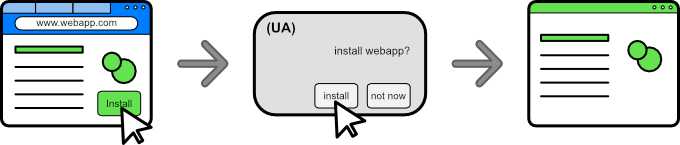
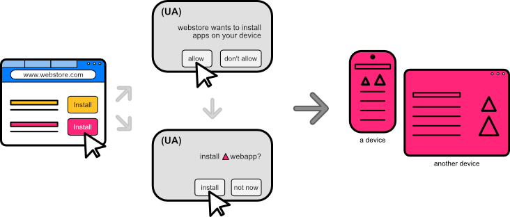

# **Web Install API**

## Authors:

- [Diego Gonzalez](https://github.com/diekus), [Microsoft](https://microsoft.com)
- Lia Hiscock, Microsoft

## Participate
- [Issue tracker](https://github.com/MicrosoftEdge/MSEdgeExplainers/issues?q=is%3Aissue%20state%3Aopen%20label%3A%22Web%20Install%20API%22)

> **Here for Origin Trials?**
> The Web Install API is currently available as an [Origin Trial](https://developer.chrome.com/docs/web-platform/origin-trials/) in Chrome and Microsoft Edge versions 143-150. See [Origin Trial Instructions](https://github.com/MicrosoftEdge/Demos/blob/main/pwa-web-install-api/README.md) to learn more.
>
> The Origin Trial exposes the earlier `install_url`-based shape of the API, which is being replaced. For background on that earlier design, see the archived [install-url-version/](./install-url-version/) explainers.

## Status of this Document

This document is a starting point for engaging the community and standards bodies in developing collaborative solutions fit for standardization. As the solutions to problems described in this document progress along the standards-track, we will retain this document as an archive and use this section to keep the community up-to-date with the most current standards venue and content location of future work and discussions.

- This document status: **Active**
- Expected venue: [W3C Web Incubator Community Group](https://github.com/WICG)
- **Current version: this document**

## Table of contents

- [Introduction](#introduction)
- [Relationship to other proposals](#relationship-to-other-proposals)
- [User-Facing Problem](#user-facing-problem)
  - [Use cases](#use-cases)
  - [Goals](#goals)
  - [Non-goals](#non-goals)
- [Proposed Approach](#proposed-approach)
  - [Sample code](#sample-code)
- [Alternatives considered](#alternatives-considered)
- [Accessibility, Privacy, and Security Considerations](#accessibility-privacy-and-security-considerations)
- [Stakeholder Feedback / Opposition](#stakeholder-feedback--opposition)
- [Security and Privacy Self-Review](#security-and-privacy-self-review)
- [Additional Links](#additional-links)

## Introduction

The **Web Install API provides a way to democratise and decentralise web
application acquisition**, by enabling
["do-it-yourself" end users and developers](https://www.w3.org/TR/ethical-web-principles/#control)
to have control over the application discovery and distribution process.
It provides the tools needed to allow a web site to install a web app.
_This means end users have the option to more easily discover new
applications and experiences that they can acquire with reduced friction_.

## Relationship to other proposals

This document is the **main** specification for web app installation initiated
by a website. It defines:

- The `navigator.install()` JavaScript entry point.
- The shared install algorithm used by every entry point: manifest fetching,
  parsing, and validation; user activation, sandbox, and cross-origin gates;
  the consent UI contract; the error taxonomy returned to callers.

A second, **declarative** entry point is incubating in parallel:

- [`<install>` element](https://github.com/WICG/install-element) (WICG) -- a
  user-agent-styled button that invokes the same install algorithm defined
  here. It is a [permission element](https://wicg.github.io/PEPC/permission-elements.html)
  and adds element-specific surfaces (PEPC validity gating, `promptaction` /
  `promptdismiss` events, fallback content, launch-when-installed UI).


To avoid duplication, the topic split is:

| Topic | Defined here | Defined in `<install>` |
|---|---|---|
| `navigator.install()` shape and IDL | Yes | -- |
| `<install>` element shape and IDL | -- | Yes |
| Manifest fetch / parse / validate pipeline | Yes (normative) | References this doc |
| Consent UI contract | Yes (normative) | References this doc, adds element flow |
| Cross-origin, sandbox, activation gates | Yes (normative) | References this doc, adds PEPC visibility overlay |
| Error taxonomy | Yes (normative) | Maps backend errors to element events |
| `manifestId` privacy contract | Yes | References this doc |

Readers working on the `<install>` element should treat this document as the
normative source for backend behavior. Readers working on `navigator.install()`
do not need to read the element explainers.

## User-Facing Problem

End users don't have a standard, cross-platform way to acquire web
applications. The process of distributing and installing web apps is
both fragmented and limited:

- Each browser has different, often hidden, entry points for
  installation (address bar icons, menu items, prompts). Users may not
  understand what the
  [icon/prompt in the browser's address bar](https://learn.microsoft.com/en-us/microsoft-edge/progressive-web-apps/ux#installing-a-pwa)
  does, or how to
  [deep search several layers](https://support.google.com/chrome/answer/9658361?hl=en-GG&co=GENIE.Platform%3DDesktop&oco=1)
  of [browser UX to add the app](https://support.apple.com/en-us/104996#create)
  to their devices.
- Users may not know that a web app exists for the site they're
  visiting, for a related origin they're reading about, or that
  "installation" is even possible on the web -- and many users don't
  use app stores to discover new app experiences.
- Developers have no standard declarative mechanism to present an
  install action to users.
- Cross-origin installation (e.g. an app catalog installing apps from
  other sites) has no built-in web platform support.

### Use cases

**Install me!** A site can ergonomically trigger the user agent's
installation flow, eliminating the need to subscribe to events, or try
and direct users through potentially several layers of browser UX to
discover the installation entry point on their own.



**Suite of web apps.** A family of software applications -- a
productivity or photography suite, for example -- where each application
is a separate web app. The developer can offer installation of any
sibling app from the suite's home page, without redirecting users to
platform-specific stores.

**Search and discovery surfaces.** A search engine or content site can
offer a frictionless way to install an app that a user is searching
for, surfacing app candidates the user might not otherwise have known
existed.

**App directories and online catalogs.** A site whose purpose is to
list and recommend web apps can offer one-click install for the apps
it catalogs, enabling cross-device, cross-platform app directories
that don't depend on any single store.



### Goals

- Enable a site to install a web app identified by its manifest URL,
  subject to user consent.
- Extend the functionality of beforeinstallprompt that cannot install
  content other than the current loaded web application.
- Keep the consent UI clearly attributable: the user sees which site
  is asking and which app is being installed.
- Avoid creating a cross-origin probing surface: the calling site should learn
  as little as possible about install state, manifest contents, or app identity.
- Enable user agents to suppress installation-prompt spam.

### Non-goals

- **Discovering an app's manifest from an arbitrary page URL.** The
  caller must supply the manifest URL directly. (This is the capability
  the prior `install_url` design offered; see
  [Alternatives considered](#alternatives-considered).)
- **Silent or unattended installation.** User consent is always
  required.
- **Installing arbitrary web content that is not an app.** The target
  must have a manifest file. See [historical context](https://docs.google.com/document/d/19dad0LnqdvEhK-3GmSaffSGHYLeM0kHQ_v4ZRNBFgWM/edit?tab=t.0#heading=h.koe6r7c5fhdg)
- **Installing native apps, browser extensions, or other non-PWA
  artifacts.**
- **Reporting install state of arbitrary apps back to the caller.**
- **Changing the way the user agent currently allows installation of a
  web app**, or defining what "installation" means on a given platform.

## Proposed Approach

<!--
TODO: This is the "how" section. Recommended sub-structure:

1. The shape of the API at the call site (one short code sample, in
   prose form: "A page calls navigator.install({manifest, id?}). The
   browser fetches the manifest, parses it, and prompts the user.")
2. What the browser does (manifest fetch, validation, consent UI).
3. What the caller gets back (the promise resolution shape, and
   importantly what is NOT returned -- no manifest_id on success, to
   avoid cross-origin probing).
4. How this composes with the existing manifest pipeline.

Note for the writer: the legacy install_url overloads still ship behind
the Origin Trial. Decide whether to describe the new shape only, or to
contrast against the legacy shape. The migration explainer does the
former and is cleaner for it.
-->

The solution is a promise-based extension of the navigator interface. A developer
calls `navigator.install({ manifest: 'https://foo.com/manifest.json', [id: 'https://foo.com/home'] })`.

**The developer may omit the `id` parameter, if and only if the json at `manifest`
contains an `id`.**

As an added convenience, the developer may omit the dictionary object entirely,
in which case the currently loaded page's manifest will be targeted for install.

The API's promise will:

* Resolve if the installation was completed.
* Be rejected if the installation did not complete. It will reject with a
[`DOMException`](https://developer.mozilla.org/en-US/docs/Web/API/DOMException)
value of:
    * `AbortError`: The user cancelled/quit the installation flow.
    * `DataError`: There was a problem with the data provided. Notable failures include:
       - invalid manifest URL, failure to fetch the manifest, malformed manifest file, etc.
       - the developer omitted the `id` parameter when there was none declared
       in the manifest file
       - the developer provided an `id` parameter, but it did not match the `id`
       computed by the browser

### Sample code

<!--
TODO: One small example per scenario from User-Facing Problem.
Keep examples to ~10 lines. Show the happy path first, then one
error-handling example.

Skeleton:

```js
// App directory installing a third-party PWA by manifest URL.
const button = document.querySelector('#install');
button.addEventListener('click', async () => {
  try {
    await navigator.install({
      manifest: 'https://app.example.com/manifest.webmanifest',
    });
  } catch (err) {
    // AbortError: user dismissed the prompt.
    // DataError: manifest could not be fetched or parsed.
    // TypeError: arguments were invalid.
  }
});
```

Also show the optional `id` form, with a note that it must be an
absolute URL when supplied.
-->

**1. Install me! (No argument signature)**

The developer can offer installation of their own site (provided their manifest
contains an `id` field):

```js
const button = document.querySelector('#install');
button.addEventListener('click', async () => {
  try {
    await navigator.install();
  }
});
```

**2. Suite of web apps. (Dictionary signature)**

The developer can offer installation of a *different* site:

```js
const button = document.querySelector('#install');
button.addEventListener('click', async () => {
  try {
    await navigator.install({
      manifest: 'https://foo.com/manifest.json',
      // Must be an absolute URL.
      id: 'https://foo.com/home',
    });
  } catch (err) {
    // AbortError: user dismissed the prompt.
    // DataError: manifest could not be fetched or parsed.
    // TypeError: arguments were invalid.
  }
});
```

### A note on manifest ids

According to the manifest spec, if there is no `id` member present, the computed
string resolves to that of the `start_url`.

We acknowledge that only around 4% (as of 2024) of web apps have defined `id`s
in their manifest. We also know that `id`s are a crucial part to support to avoid
situations of multiple *same* applications with no path to being updated. For
apps that have an `id` defined in their manifest, the `id` may be omitted from
the API call. For apps that do **not** define the `id` field, the API caller
must include the expected, computed id.

### Steps to install the app - No-argument API signature

1. User gesture activates code that calls `install()`.
2. If the currently loaded document links to a manifest file, continue. Else
reject with `DataError`.
3. If the manifest file has an `id` field defined, continue. Else reject with
`DataError`.
4. UA presents confirmation UX with appropriate security sensitive fields. If
the user accepts, continue. Else reject with `AbortError`.
5. Promise resolves.

> Note: if the application is already installed, the UA can choose to display UX
to launch the application. The UA should follow the same error behavior, resolving
the promise if the user accepts the launch, and rejecting with `AbortError` otherwise.

### Steps to install the app - Dictionary API Signature

#### `manifest` only

1. User gesture activates code that calls `install({manifest: <url>})`.
2. If `<url`> is cross-origin with the current document, the UA asks for permission
to install apps from other origins (if not previously granted). Else reject.
3. UA tries to fetch the manifest file at `url`. If the fetch succeeds, continue.
Else reject with `DataError`.
4. If the fetched manifest contains an `id`, continue. Else reject with `DataError`.
5. UA presents confirmation UX with appropriate security sensitive fields. If
the user accepts, continue. Else reject with `AbortError`.
6. Promise resolves.

#### `manifest` and `id`

1. User gesture activates code that calls `install({manifest: <url>, id: <manifest_id>})`.
2. If `<url`> is cross-origin with the current document, the UA asks for permission
to install apps from other origins (if not previously granted). Else reject.
3. UA tries to fetch the manifest file at `url`. If the fetch succeeds, continue.
Else reject with `DataError`.
4. UA determines the computed/processed id of the manifest -- if it matches
`<manifest_id>`, continue. Else reject with `DataError`.
5. UA presents confirmation UX with appropriate security sensitive fields. If
the user accepts, continue. Else reject with `AbortError`.
6. Promise resolves.

## Alternatives considered

### Install by `install_url`

We publicly trialed a version of the API that accepted a document URL instead of
manifest URL. The target document was fetched and loaded in the background, and
its linked manifest was retrieved before proceeding with the same installation steps.

* Pros:
   * Leveraged the existing document-based trust path: starting from a loaded page let
  the browser rely on the page-to-manifest relationship the web platform already
  understands, including common deployments where the manifest is hosted
  separately from the app document.
   * Service worker registration - service workers are registered on page load.
   They provide offline resource caching and app-like functionality, such as
   online install, offline launch. 
* Cons:
  * Privacy leak - fetching the target document discloses cross-origin request
  context and credential state (including cookie-related signals).
  * Performance - loading a full document when we're ultimately interested in the
  manifest is a heavyweight operation that increases the potential attack surface.
  * Document urls are brittle - many sites utilize redirects for things such as
  authentication or localized URLs, making it difficult to provide one single
  install_url. (Direct feedback from public trials).

### Use `<a href>`


## Accessibility, Privacy, and Security Considerations

### Accessibility

The install consent UI is browser-rendered, using existing accessible PWA
install surfaces.

### Privacy

<!--
TODO: Walk through the privacy surfaces. Recommended structure:

- What the caller learns on success. (Resolution of the promise =
  "user accepted install". Nothing about the manifest contents,
  app identity, or pre-existing install state.)
- What the caller learns on rejection. (Distinguish error types that
  are safe to expose from ones that aren't. AbortError vs. DataError
  vs. TypeError vs. NotAllowedError.)
- Why manifest_id is intentionally NOT returned: it would let a caller
  probe cross-origin app identity by trying candidate ids and observing
  whether resolution succeeded.
- Why the API requires transient user activation.

This section will get scrutiny in TAG and security review -- be
explicit about what was traded off.
-->

> **Open question:** What result information should be exposed to the
> caller? See #1341.

The install flow's promise must settle in some way. The question is how
much the resolution or rejection reveals to the calling origin --
particularly in the cross-origin case, where origin A is installing
origin B's app.

**Side-channel considerations:** Regardless of which option is chosen,
the calling origin can partially infer outcomes through observable side
channels. Focus/blur events reveal whether a secondary dialog was
shown. These side channels exist independently of the promise result
and limit the privacy benefit of withholding explicit results.

**`AbortError` convention:** Per the [Web IDL specification][webidl-abort],
`AbortError` is the established convention for user-cancelled operations
across the web platform (Payment Request API, File Picker API, Web Share
API, Credential Management). If retained, it should be narrowed to mean
*only* "the user dismissed the prompt" -- the current implementation
also uses it as a catch-all for internal failures, which does not match
platform convention.

[webidl-abort]: https://webidl.spec.whatwg.org/#AbortError

### Security

#### Same-origin policy

The content installed using the navigator.install does not inherit or auto-grant
permissions from the installation origin. This API does not break the same-origin
security model of the web. Every different domain has its own set of independent
permissions bound to their specific origin.

#### Preventing installation prompt spamming

* Transient user activation is required to invoke this API.
* The API is blocked in all sandboxed contexts (documents and iframes).
* The API is blocked in cross-origin subframes.
* The cross-origin installation capabilities are gated behind a user-facing permission - 
e.g. if a user declines the permission for evil.com, evil.com will be blocked
from invoking navigator.install.

#### Cross-origin resource fetching

When fetching the manifest and any of its resources, UAs must ensure that n
cookies or identifiable information are leaked to the target server.

#### Private / Incognito contexts

This feature is not available in private browsing or off-the-record profiles,
as web apps are not generally installable there. UAs must ensure failure 
signaling does not create a reliable private-mode detection channel (for example,
failing immediately in private modes).

#### Further potential mitigations

* UAs may gate 

UAs may choose to 

Two pieces 

## Open Questions

### Service worker registration

When installation is initiated from a manifest URL, the target app's page
will not be loaded before install completes. That can delay service worker
registration and would prevent online install/offline launch scenarios.

**Current decision: Deferred. UAs can mitigate this in the meantime by
automatically launching the app after installation.**

### CDN-served manifests and origin trust

Some apps serve manifests from CDNs on a different origin than the app's
`start_url`. Should this API require the manifest URL to be same-origin
with `start_url`, or can cross-origin manifests be supported with
additional trust checks?

**Current decision: manifest URL must be same origin with `start_url`.**

### Relative URL resolution

Related to the above. Manifests may contain relative URLs, which are [specified](https://www.w3.org/TR/appmanifest/#start_url-member).
to resolve against the document's URL. However, this proposal does **not** load 
the target document, so how should relative manifest URLs be resolved?

**Current decision: resolve relative URLs using the `manifest` URL's origin, since
cross-origin manifest URLs are currently not supported.**

### Versioned manifest URLs and stale links

Apps that version manifest filenames (for example, `manifest-1.0.2.json`) can
leave previously published `navigator.install` calls pointing at stale URLs. Should
the platform define guidance or a stable convention (for example,
indirection via a fixed URL) to reduce breakage?\

**Current decision: Rely on DataError to inform callers of broken URLs and 
await developer feedback.**

## Stakeholder Feedback / Opposition

- Developers: Positive.
- W3C TAG Review: PENDING
- Browser Standards Positions:
  - Chrome: [Supportive/Implementing](https://chromestatus.com/feature/5183481574850560)
  - Mozilla: [mozilla/standards-positions#1179](https://github.com/mozilla/standards-positions/issues/1179)
  - WebKit: [WebKit/standards-positions#463](https://github.com/WebKit/standards-positions/issues/463)

## Security and Privacy Self-Review

<!--
TODO: Answer the 22 questions from
https://www.w3.org/TR/security-privacy-questionnaire/

The archived `install-url-version/web-install-security-privacy-review.md`
has answers for the prior design; many can be adapted but the privacy
answers in particular need to be rewritten for the new shape (especially
2.1, 2.5, and 2.13 -- the surfaces narrowed substantially).
-->

## Additional Links

- Archived earlier design: [install-url-version/explainer.md](./install-url-version/explainer.md)
- Origin Trial demo: [MicrosoftEdge/Demos](https://github.com/MicrosoftEdge/Demos/blob/main/pwa-web-install-api/README.md)
- [Chrome Status](https://chromestatus.com/feature/5183481574850560)
- [TAG review (prior design)](https://github.com/w3ctag/design-reviews/issues/1051)
