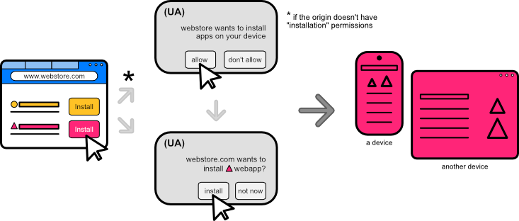

# Web Install API

Authors: [Diego Gonzalez](https://github.com/diekus)

## Status of this Document
This document is a starting point for engaging the community and standards bodies in developing collaborative solutions fit for standardization. As the solutions to problems described in this document progress along the standards-track, we will retain this document as an archive and use this section to keep the community up-to-date with the most current standards venue and content location of future work and discussions.
* This document status: **Active**
* Expected venue: [W3C Web Incubator Community Group](https://wicg.io/)
* **Current version: this document**

##  Introduction

Current paradigms of application discovery involve a user going to an application repository to search and install apps. These repositories are generally curated and have a level of trust associated by the user. They play a vital role in allowing a user to acquire high quality apps. Application repositories are valuable because they help developers acquire users, which incentivises developers to create better apps on the web platform.

While this is the general acquisition flow on many platforms, the web does not have the ability to replicate this scenario because it can not install applications. This makes it impossible for a web app (repository, catalog, store) to install and distribute other applications.

**The Web Install API** addresses this shortcoming in the platform. It **allows a web site to install a web app *(same or cross domain)*. This functionality allows the creation of web based catalogs that can install PWAs directly from the web and into multiple platforms.**

## Goals

* **Enable installation of web apps (same *and* cross-domain).**
* Replace `beforeinstallprompt` or associated behaviour (current way to install apps from the same-domain).
* Allow a ***vetted* installation origin** to know if the web app is installed (see *`install_sources` new manifest field*).
* Allow the web app to report to the installation origin the outcome of the installation.
* Enable UAs to supress potential installation-prompt spam.
* Track campaign IDs for marketing campaigns.

## Non-goals

* Change the way the UA currently prompts for installation of a PWA.
* Associate ratings and reviews with the installed app ([see Ratings and Reviews API explainer](https://github.com/MicrosoftEdge/MSEdgeExplainers/blob/main/RatingsAndReviewsPrompt/explainer.md)).
* Process payments for installation of PWAs ([see Payment Request API](https://developer.mozilla.org/en-US/docs/Web/API/Payment_Request_API)).
* List purchased/installed goods from a store ([see Digital Goods API](https://github.com/WICG/digital-goods/blob/main/explainer.md)).
* Installing non-PWAs or apps that do not pass the installability criteria (for security reasons).
* Enumerate if the app/related apps are installed ([see getInstalledRelatedApps](https://github.com/WICG/get-installed-related-apps/blob/main/EXPLAINER.md)).

## Use Cases

There are several use cases that the Web Install API enables:

### **Installing a web app from the current origin**
The site can trigger its own installation. The current way of doing this is with the `onbeforeinstallprompt`, and this would be phased out in favor of a unified `install` method for same and cross domains.

```javascript
/* tries to install the current domain */
const installApp = async () => {
    try{
        if ('install' in navigator) {
            const appInstalled = await navigator.install();
        }
    }
    catch(err) {
        console.error(err);
    }
};

/* tries to install the current domain in the side panel surface of the UA */
/* more advanced error handling */

const installAppInSidePanel = async () => {
    try{
        if ('install' in navigator) {
            const appInstalled = await navigator.install({mode: 'side_panel'});
        }
    }
    catch(err) {
        switch(err.message){
            case 'NotAllowedError':
                /* No installation origin permissions */
                break;
            case 'NotSupportedError':
                /* The website is not installable */
                break;
        }
    }
};

```

 

The **`navigator.install()` method will replace `onbeforeinstallprompt` for same domain installation**. When the method is called it will trigger the UA to prompt for the installation of an application. This is analogous to when the end user clicks on an affordance that the UA might have to inform the user of installing. On Edge, Chrome (desktop) and Samsung Internet (mobile), this would be then the user clicks on the 'app available' banner or related UX that appears on the omnibox of the browser.

The threshold for `navigator.install()` to resolve on same-domain installations uses the same checks that `onbeforeinstallprompt` currently has (if required by the UA). The promise doesn't resolve until:
1. Manifest and required fields are downloaded, parsed and checked.
2. Engagement thresholds are met. 
3. Service Worker checks pass.

When called on the same domain, the **`install()` method will trigger/open the prompt for installation the same way that using `onbeforeinstallprompt` does right now.** If the domain is not an installable PWA, then the promise returns a `DOMException` of type 'NotSupportedError'.

### **Web app installation from associated domain** 

An associated domain (out-of-scope of the PWA) could prompt for the installation of the web app (in a different domain). The typical use case for this is a website of a service that informs their customers about their (PWA) web app.

```javascript
/* Example that uses the Permissions API to check if the installation permission is set before calling the install method */
  const installApp = async () => {
    try{
        const { state } = await navigator.permissions.query({
            name: "installation"
          });
          switch (state) {
            case "granted":
                const value = await navigator.install('https://app.contoso.com');
              break;
            case "prompt":
              showInstallButton();
              break;
            case "denied":
              browseToAppStorePage();
              break;
          }
    }
    catch(err){console.error(err.message)}
};

```
Manifest file for the Contoso App, allowing installation *ONLY* from contoso.com :
```json
{
    "name": "Contoso App",
    "display": "standalone",
    "start_url": "/index.html",
    "install_sources": [ 
	    {"origin": "contoso.com", "inquire": true}   
    ]
}
```

 

### **Creation of online catalogs**

 A web app can list and install web apps. For example, `apprepo.com` would be able to distribute apps on multiple platforms and multiple devices.

```javascript
/* tries to install a cross-domain web app */

const installApp = async (url) => {
    try{
        const value = await navigator.install(url);
        return value;
    }
    catch(err){console.error(err.message)}
};

```

   

Additionally for developers, the feature also:
* provides a more fine-grained control of when/where to let an installation of a web app occur.
* allows cross-domain installation of PWAs.
* allows for better testing/debugging in comparison to installation prompts based on heuristics. 

## Proposed Solution

### The `navigator.install` method

To install a PWA, a PWA would use the promise-based method `navigator.install([<url>][, <params>]]);`. This method will:

* Resolve when an installation was completed.
    * The success value will be an object that contains:
     	*  `mode`: string with the surface-hint where the app was installed.
* Be rejected if the prompt is not shown or if the app installation did not complete. It'll reject with a [`DOMException`](https://developer.mozilla.org/en-US/docs/Web/API/DOMException) value of:
    * `NotAllowedError`: The `installation` [Permissions Policy](https://developer.mozilla.org/en-US/docs/Web/HTTP/Permissions_Policy) has been used to block the use of this feature.
    * `NotSupportedError`: the target website is not installable.
    * `InsufficientEngagementError`: the UA's required (if any) [engagement heuristics](https://web.dev/install-criteria/#criteria) have not been met.
    * `AbortError`: The installation (prompt) was closed/cancelled.
    * `TimeoutError`: The installation failed due to timeout.
    * `OperationError`: other error.
	
    
 ```javascript
/* simple example of using navigator.install */

const installApp = async () => {
    try{
        const value = await navigator.install();
    }
    catch(err){console.error(err.message)}
};

```

```javascript
/* Example of advanced error handling */

(...)
.catch(error => {
    if(error.name === 'NotSupportedError') {
        // target site is not installable
        console.log("Website is not an installable app.");
    }
    else if (error.name === 'NotAllowedError') {
        // origin cannot install other webapps.
        console.log("Origin does not have permissions to install web apps.");
    }
    else {
        console.log(error.message);
    }
});
```

 

Upon a successful installation there is **one** opportunity for the installation origin to get attribution for the install, parse any additional information like ad campaigns, or any other required processing in the origin after a successful installation. Once the promise resolves there is no other way for the origin to get access to the same information.* 

#### Signatures of the `install` method
The Web Install API consists of the extension to the navigator interface with the install method. The install method can be used in several different ways. There is no difference in behaviour when this is called from a standalone window or a tab.

1. `navigator.install()`: The method receives no parameters and tries to install the current domain as an app. This would replace `beforeinstallprompt` and the current way developers have been controlling the prompt to install apps.

2. `navigator.install(<params>)`: The method receives an object with parameters that it can use to customise a same domain installation. These paramters can be used to hint to the UA that the app should be installed in a surface like a side panel.

3. `navigator.install(<url>)`: The method receives a parameter which is a url to a web app to install. This can be a cross-domain app and will prompt for installation of the app if the requesting origin has installation permissions (see security section). This is the most common use of the API.

4. `navigator.install(<url, <params>)`: This signature of the method includes the optional parameters. These parameters alter how the app is installed and are defined in an object. More information about the parameters is found in the Params subsection of this specification.

#### Parameters

The `navigator.install` call can receive an object with a set of parameters that specify different installation behaviours for the app.

* **mode**: Due to the evolving nature of PWAs, there are different surfaces where these can be installed. The optional parameters that can be passed on to the `navigator.install` call can hint to the UA if the app should be installed as a standalone app or as a sidebar bar if supported. `mode` is an array of values that hint to the preferred way of installing the app. Among the values it can have are `default` and `side_panel`. These values will always fallback to a standalone installation.  

As an example, you could try to install the elk PWA in a browser that supports a sidebar with this code:

```javascript
navigator.install('https://elk.zone', {mode: ['side_panel']});
```
* **referral-info**: this parameter takes the form of an object that can have arbitrary information required by the calling installation domain. 

#### Installing the web app

To install the web app, the process is as follows:
1. Origin site that triggers the installation must have installation permissions if it tries to install a cross-domain app.
2. Check if the domain is in the list of allowed origins to install said PWA by checking the manifest file (see security section below for more details).
3. Prompt the user for install confirmation.
4. Install the app.
5. UA default action post-install (generally the app will open). 
   
### The `navigator.canInstall([<url>])` method

The `navigator.canInstall([<url>])` is an aysnc method that returns `true` if the equivalent call to `navigator.install()` would succeed. The method returns `false` if the install cannot be *validated* (if it is a *same domain check* there is no target url provided.). Reasons for this include:
* The target url is not an installable app.
* The target url is  badly formatted.
* The target url resolves to a client/server error response.

```javascript
/* example of using the canInstall method */

if('canInstall' in navigator) {
    if(navigator.canInstall("https://elk.zone")) {
        showAppInstallButton();
    }
    else {
        redirectToPlatformStorePage();
    }
}
```

#### Warning: Throttling of the `canInstall()` method

* **Cross-domain:** The `canInstall(<url>)` method should only be used in situations where an assessment of the installation needs to be performed. The method is expensive and UAs should throttle it by executing calls to this method sequentially rather than parallel for example.

*UAs may take actions to discourage or prohibit some calls to this method.*

## Relation with other web APIs 

* **`navigator.install` and Permissions API:** see [integrations with the Permissions API](https://github.com/edge-microsoft/MSEdgeExplainers-private/edit/luigonza/web-install/WebInstall/explainer.md#integration-with-the-permissions-api).

* **`navigator.install` and manifest file's `prefer_related_applications`:** When the `related_applications` and `prefer_related_applications` key/values are present in the manifest, the UA should try to handoff the install to the prefered catalog. If this is not possible then it fallback to a default UA install.

* **`navigator.install()` and getInstalledRelatedApps():** If a web app tries to install itself (same domain install) it can first use the `getInstalledRelatedApps()` to check if it is already install and hide the installation UI.

```javascript

const relatedApps = await navigator.getInstalledRelatedApps();
relatedApps.forEach((app) => {
    if(app.platform === 'webapp') {
        /* hides install button that calls `navigator.install method` */
    }
});

```
  
## Privacy and Security Considerations

### Avoiding Installation prompt spamming

* This API can only be invoked in a top-level [secure context](https://w3c.github.io/webappsec-secure-contexts/).

* The biggest risk for the API is installation spamming. To minimize this behaviour, installing a PWA using the Web Install API requires a [user gesture](https://html.spec.whatwg.org/multipage/interaction.html#activation-triggering-input-event).  

* A new permission type will be introduced for an origin, that would allow it to install web apps. The first time a website requests to install an app (use the API) the UA will prompt the user to confirm that the website can install other apps into the device. This prompt is similar to that of other permissions like geolocation or camera/microphone. The UA can decide how to implement this prompt.

A website that wants to install apps will require this new permission and will only be able to prompt the user for this in a period of time defined by the implementer. This will avoid spam from websites constantly asking for a permission to install apps, and will force websites to only prompt when there is a meaningful user intent to install apps.

The installation permission for an origin should be time-limited and expire after a period of time defined by the UA. After the permission expires the UA will prompt again for permission from the user.

####  Integration with the Permissions API
A new permission that can be associated with an origin means a new integration with the [Permissions API](https://www.w3.org/TR/permissions/). The install API will make available the "installation" [PermissionDescriptor](https://www.w3.org/TR/permissions/#dom-permissiondescriptor) as a new [*powerful feature*](https://www.w3.org/TR/permissions/#dfn-specifies-a-powerful-feature). This would make it possible to know programmatically if `install` would be blocked.

```javascript
/* example of querying for the state of an installation permission using the Permission API  */

const { state } = await navigator.permissions.query({
  name: "installation"
});
switch (state) {
  case "granted":
    navigator.install('https://elk.zone');
    break;
  case "prompt":
    //shows the install button in the web UI
    showInstallButton();
    break;
  case "denied":
    redirectToAppStore();
    break;
}
```

* A new field called `install_sources` will be added to the manifest file to have a control list of sites that can install the app. In its most restrictive case, the developer can specify to not allow installation from any other origin, in which case the PWA conforms to its usual behaviour of only being able to be installed from its same origin.

    * `inquire` field: If supported by the UA, the `inquire` field in the install sources hints at the UA that it can inform that installation origin if the app is installed. **If the browser has an active 'Do Not Track' setting, the `inquire` field is ignored and installation origins will not be allowed to know if that application is installed.**

```json

{
    "name": "Awesome PWA",
    "display": "standalone",
    "start_url": "/index.html",
    "install_sources": [ 
	    {"origin": "apps.microsoft.com", "inquire": true},
	    {"origin": "store.app", "inquire": false},
        {"origin": "untrustedRepository.com", "inquire": false}
    ]
}
```

This new manifest field will protect the app from being listed in undesirable repositories and give the developer absolute control about where do they want the PWA to be installed from. At best, the developer can allow the PWA to be installed from any site ("`*`"), at its most restrictive, it can only allow installing from the app's same scope. This field is only for the JS API and does not interfere with existing ways of installing PWAs through mechanisms like enterprise policies.

If no `install_sources` is present in the manifest file, the default should be to not allow an app to be installed from cross-domain sites. An open question is to reverse this default during dev/origin trial to experiment what is the best course of action while the feature gets traction among developers.  

**The user gesture, the new origin permission, the new manifest field and the final installation confirmation (current default behaviour in the browser before installing an app) work together to minimize the risk of origins spamming the user for unrequested installations**, give developers complete flexibility about where their apps will be installed from and provide the user with an implicit (double: one for the user gesture, the other one from the prompt before installing) confirmation before the app gets installed on their device.

## Alternative Solutions

* **HTML anchor tag target install
`<a href="https://airhorner.com" target="_install">honk</a>`:** An alternate solution to allow installation of web apps is by allowing a new target type of `_install` to the HTML anchor tag. This has the benefit of being able to work in environments that have JS disabled and can also be another entry point for installation. While this is an elegant solution, it limits the amount of information a developer can act upon that the promise does provide, such as if the prompt was shown or if the origin has permissions to install apps.

## Open Questions

* Should we enable a [try-before-you-buy](https://github.com/PEConn/web-install-explainer/blob/main/explainer.md#try-before-you-buy) flow scenario for web install?

* Should we provide feedback to the directory?

* Do we need to attribute the source of the installation?
On a successful promise resolution, the origin is returned so the originating web app can decide to use that information as it pleases.

* Should we allow an [`AbortController`](https://developer.mozilla.org/en-US/docs/Web/API/AbortController) to enable cancelling the installation if the process takes too long?

* Should the default for a PWA without `install_sources` in its manifest file be installable from anywhere or not installable from cross-domain sites? A transition period and experimentation is encouraged during dev/origin trial to establish the best solution for developers.

## Acknowledgements

This explainer takes on the work [previously published by PEConn](https://github.com/PEConn/web-install-explainer/blob/main/explainer.md).

Special thanks to Raunak Oberoi, Patrick Brosset, Alex Russell, Howard Wolosky, Lu Huang and the [PWA Builder](https://www.pwabuilder.com) team for their input.
