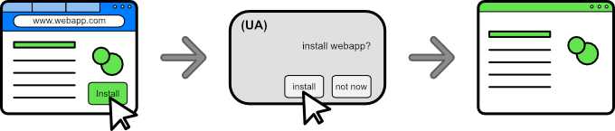

# Web Install API

Авторы: [Diego Gonzalez](https://github.com/diekus)

## Введение

Современные парадигмы поиска приложений подразумевают, что пользователь переходит в магазины приложений для поиска и установки приложений. Эти магазины, как правило, отбираются и имеют определенный уровень доверия со стороны пользователя. Они играют важную роль, позволяя пользователю получать приложения высокого качества. Магазины приложений ценны, потому что они помогают разработчикам привлекать пользователей, что стимулирует разработчиков создавать лучшие приложения на веб-платформе.

Хотя это общий процесс на многих платформах, веб не имеет возможности повторить этот сценарий, потому что не может устанавливать сторонние приложения. Это делает невозможным установку и распространение других приложений через веб-приложение (репозиторий, каталог, магазин).

**Web Install API** решает этот недостаток в платформе. Он **позволяет веб-приложениеу устанавливать веб-приложение (в том же или в другом домене)**. Эта функциональность позволяет создавать веб-каталоги или магазины, которые могут устанавливать PWA напрямую из веба и на различные платформы.

## Цели

* **Возможность установки веб-приложений (в том же *и* в другом домене).**
* Замена `beforeinstallprompt` или связанного с ним поведения (текущий способ установки приложений из того же домена).
* Позволить **проверенному источнику установки** узнать, установлено ли веб-приложение (см. новое поле манифеста *`install_sources`*).
* Позволить веб-приложению сообщать источнику установки о результате установки.
* Позволить UA подавлять возможный спам от установочных запросов.
* Отслеживать идентификаторы маркетинговых кампаний.

## Нецели

* Изменить способ, которым UA в настоящее время предлагает установить PWA.
* Ассоциировать оценки и отзывы с установленным приложением ([см. API Ratings and Reviews](https://github.com/MicrosoftEdge/MSEdgeExplainers/blob/main/RatingsAndReviewsPrompt/explainer.md)).
* Обрабатывать платежи в PWA ([см. Payment Request API](https://developer.mozilla.org/en-US/docs/Web/API/Payment_Request_API)).
* Обрабатывать купленные/установленные товары из ([см. Digital Goods API](https://github.com/WICG/digital-goods/blob/main/explainer.md)).
* Установка не-PWA или приложений, которые не проходят критерии установки (по соображениям безопасности).
* Определить, установлено ли приложение/связанные приложения ([см. getInstalledRelatedApps](https://github.com/WICG/get-installed-related-apps/blob/main/EXPLAINER.md)).

## Примеры использования

Web Install API позволяет реализовать несколько сценариев использования:

### **Установка веб-приложения из текущего источника**
Сайт может инициировать свою собственную установку. В настоящее время это делается с помощью `onbeforeinstallprompt`, и этот метод будет постепенно отменяться в пользу единого метода `install` для того же и других доменов.

```javascript
/* попытка установки под текущим доменом */
const installApp = async () => {
    try{
        if ('install' in navigator) {
            const appInstalled = await navigator.install();
        }
    }
    catch(err) {
        console.error(err);
    }
};

/* попытка установки под текущим доменом для Edge Side Panel */
/* более продвинутая обработка ошибок */

const installAppInSidePanel = async () => {
    try{
        if ('install' in navigator) {
            const appInstalled = await navigator.install({mode: 'side_panel'});
        }
    }
    catch(err) {
        switch(err.message){
            case 'NotAllowedError':
                /* Нет разрешений на установку источника */
                break;
            case 'NotSupportedError':
                /* Веб-приложение не поддерживает установку */
                break;
        }
    }
};

```

 

**Метод `navigator.install()` заменит `onbeforeinstallprompt` для установки в том же домене**. Когда метод вызывается, он вызывает UA для запроса установки приложения. Это аналогично тому, когда конечный пользователь нажимает на элемент управления, который может иметь UA, чтобы информировать пользователя об установке. В Edge, Chrome (десктоп) и Samsung Internet (мобильный) это происходит, когда пользователь нажимает на баннер "доступно приложение" или связанный с ним UX, который появляется на панели адреса браузера.

Порог для `navigator.install()` для выполнения проверки на установку в том же домене использует те же проверки, что и `onbeforeinstallprompt` (если это требуется UA). Permission не исполняется до тех пор, пока:
1. Манифест и требуемые поля доступны и проверены.
2. Достигнуты пороги взаимодействия.
3. Пройдены проверки службы обработки запросов.

При вызове в том же домене, **метод `install()` инициирует/открывает запрос на установку таким же образом, как это делается сейчас с помощью `onbeforeinstallprompt`**. Если домен не является устанавливаемым PWA, то permission возвращает `DOMException` типа 'NotSupportedError'.

### **Установка веб-приложения из связанного домена** 

Связанный домен (вне области видимости PWA) может запросить установку веб-приложения (в другом домене). Типичным примером использования является веб-приложение визитка, который информирует своих клиентов о своем веб-приложении (PWA).

```javascript
/* Пример использования API Permissions для проверки, установлено ли разрешение на установку, перед вызовом метода install */
  const installApp = async () => {
    try{
        const { state } = await navigator.permissions.query({
            name: "installation"
          });
          switch (state) {
            case "granted":
                const value = await navigator.install('https://myapp.org');
              break;
            case "prompt":
              showInstallButton();
              break;
            case "denied":
              browseToAppStorePage();
              break;
          }
    }
    catch(err){console.error(err.message)}
};

```
Файл манифеста для myapp.org (приложения), разрешающий установку *ТОЛЬКО* с myapp.com :
```json
{
    "name": "My App ORG",
    "display": "standalone",
    "start_url": "/index.html",
    "install_sources": [ 
	    {"origin": "myapp.com", "inquire": true}   
    ]
}
```

 

### **Создание онлайн-каталогов**

Веб-приложение может перечислять и устанавливать веб-приложения. Например, `apprepo.com` сможет распространять приложения на нескольких платформах и устройствах.

```javascript
/* попытка установить веб-приложение из другого домена */

const installApp = async (url) => {
    try{
        const value = await navigator.install(url);
        return value;
    }
    catch(err){console.error(err.message)}
};

```

   

Кроме того, для разработчиков эта функция:
* предоставляет более детализированный контроль над тем, когда и где может произойти установка веб-приложения.
* позволяет устанавливать PWA из других доменов.
* обеспечивает лучшее тестирование и отладку по сравнению с запросами на установку, основанными на эвристике. 

## Предлагаемое решение

### Метод `navigator.install`

Для установки PWA, будет использоваться метод `navigator.install([<url>[, <params>]]);` основанный на промисах. Этот метод будет:

* Выполняться, когда установка завершена.
    * Значение успешного выполнения будет объектом, который содержит:
     	*  `mode`: строка с подсказкой о месте, где было установлено приложение.
* Быть отклоненным, если запрос не показан или если установка приложения не была завершена. Он будет отклоняться с значением [`DOMException`](https://developer.mozilla.org/en-US/docs/Web/API/DOMException):
    * `NotAllowedError`: (новая) `installation` [Permissions Policy](https://developer.mozilla.org/en-US/docs/Web/HTTP/Permissions_Policy) заблокировала использование этой функции.

    * `NotSupportedError`: целевой веб-приложение не поддерживает установку.
    * `InsufficientEngagementError`: не выполнены требуемые UA (если таковые имеются) [эвристические критерии взаимодействия](https://web.dev/install-criteria/#criteria).
    * `AbortError`: Установка (запрос) была закрыта/отменена.
    * `TimeoutError`: Установка не удалась из-за тайм-аута.
    * `OperationError`: другая ошибка.
	
    
 ```javascript
/* простой пример использования navigator.install */

const installApp = async () => {
    try{
        const value = await navigator.install();
    }
    catch(err){console.error(err.message)}
};

```

```javascript
/* Пример продвинутой обработки ошибок */

(...)
.catch(error => {
    if(error.name === 'NotSupportedError') {
        // целевой сайт не поддерживает установку
        console.log("Веб-приложение не является устанавливаемым приложением.");
    }
    else if (error.name === 'NotAllowedError') {
        // источник не может устанавливать другие веб-приложения.
        console.log("Источник не имеет разрешений на установку веб-приложений.");
    }
    else {
        console.log(error.message);
    }
});
```

 

После успешной установки есть **одна** возможность для источника установки получить отклик об установке. После выполнения этого promise нет другого способа для источника получить доступ к той же информации.*

#### Подписи метода `install`
Web Install API состоит из расширения интерфейса навигатора с методом install. Метод install может использоваться несколькими разными способами. Поведение не отличается, когда его вызывают из отдельного окна или вкладки.

1. `navigator.install()`: Метод не получает параметров и пытается установить текущий домен в качестве приложения. Это заменит `beforeinstallprompt` и текущий способ, которым разработчики контролировали запрос на установку приложений.

2. `navigator.install(<params>)`: Метод получает объект с параметрами, которые он может использовать для настройки установки в пределах одного домена. Эти параметры можно использовать для подсказки UA, что приложение должно быть установлено например на боковой панели. Более подробную информацию о параметрах можно найти в подразделе [Параметры](#parameters) этой спецификации.

3. `navigator.install(<url>)`: Метод получает параметр, который является URL веб-приложения для установки. Это может быть приложение из другого домена и будет запрашивать установку приложения, если запрашивающий источник имеет права на установку (см. раздел безопасности). Это наиболее распространенное использование API.

4. `navigator.install(<url>, <params>)`: Эта подпись метода включает необязательные параметры. Эти параметры изменяют способ установки приложения и определяются в объекте. Более подробную информацию о параметрах можно найти в подразделе [Параметры](#parameters) этой спецификации.

#### Параметры

Вызов `navigator.install` может получить объект с набором параметров, которые определяют различное поведение установки для приложения.

* **mode**: Из-за эволюции PWAs существуют различные места, где они могут быть установлены. Необязательные параметры, которые могут быть переданы в вызов `navigator.install`, могут подсказать UA, должно ли приложение быть установлено как отдельное приложение или как приложение боковой панели, если это поддерживается. `mode` - это массив значений, которые подсказывают предпочтительный способ установки приложения. Среди значений, которые он может иметь, - `default` и `side_panel`. Если запрошенный режим не поддерживается UA, установка будет продолжена с откатом на отдельную установку.

В качестве примера вы можете попробовать установить elk PWA в браузере, который поддерживает боковую панель, с помощью этого кода:

```javascript
navigator.install('https://elk.zone', {mode: ['side_panel']});
```
* **referral-info**: этот параметр принимает форму объекта, который может иметь произвольную информацию, необходимую вызывающему домену установки.

#### Установка веб-приложения

Для установки веб-приложения процесс следующий:
1. Исходный сайт, который запускает установку, должен иметь права на установку, если он пытается установить приложение из другого домена.
2. Проверьте, находится ли домен в списке разрешенных источников для установки данного PWA, проверив файл манифеста (см. раздел безопасности ниже для получения более подробной информации).
3. Запросите у пользователя подтверждение установки.
4. Установите приложение.
5. Стандартное действие UA после установки (обычно приложение открывается).

### Метод `navigator.canInstall([<url>])`

`navigator.canInstall([<url>])` - это асинхронный метод, который возвращает `true`, если эквивалентный вызов `navigator.install()` будет успешным. Метод возвращает `false`, если установку нельзя *проверить* (если это *проверка в пределах одного домена*, целевой URL не предоставлен.). Причины для этого включают:
* Целевой URL не является устанавливаемым приложением.
* Целевой URL плохо отформатирован.
* Целевой URL приводит к ошибке клиента/сервера.

```javascript
/* пример использования метода canInstall */

if('canInstall' in navigator) {
    if(await navigator.canInstall("https://elk.zone")) {
        showAppInstallButton();
    }
    else {
        redirectToPlatformStorePage();
    }
}
```

#### Предупреждение: Ограничение метода `canInstall()`

* **Через домены:** Метод `canInstall(<url>)` должен использоваться только в ситуациях, когда необходимо оценить установку. Метод дорогой, и UAs должны ограничивать его, выполняя вызовы к этому методу последовательно, а не параллельно, например.

*UAs могут принимать меры для предотвращения или запрета некоторых вызовов к этому методу.*

## Связь с другими веб-API

* **`navigator.install` и Permissions API:** см. [интеграции с Permissions API](https://github.com/edge-microsoft/MSEdgeExplainers-private/edit/luigonza/web-install/WebInstall/explainer.md#integration-with-the-permissions-api).

* **`navigator.install` и `prefer_related_applications` в файле манифеста:** Когда ключи/значения `related_applications` и `prefer_related_applications` присутствуют в манифесте, UA должен попытаться передать установку предпочтительному каталогу. Если это невозможно, то он откатывается к стандартной установке UA.

* **`navigator.install()` и getInstalledRelatedApps():** Если веб-приложение пытается установить себя (установка в пределах одного домена), оно может сначала использовать `getInstalledRelatedApps()` для проверки, установлено ли оно уже, и скрыть пользовательский интерфейс установки.

```javascript

const relatedApps = await navigator.getInstalledRelatedApps();
relatedApps.forEach((app) => {
    if(app.platform === 'webapp') {
        /* скрывает кнопку установки, которая вызывает метод `navigator.install` */
    }
});

```
  
## Рассмотрение вопросов конфиденциальности и безопасности

### Избегание спама с запросами на установку

* Этот API может быть вызван только в [безопасном контексте](https://w3c.github.io/webappsec-secure-contexts/) верхнего уровня.

* Наибольшим риском для API является спам с запросами на установку. Чтобы минимизировать это поведение, установка PWA с использованием Web Install API требует [жеста пользователя](https://html.spec.whatwg.org/multipage/interaction.html#activation-triggering-input-event).

* Будет введен новый тип разрешения для источника, который позволит ему устанавливать веб-приложения. В первый раз, когда веб-приложение запрашивает установку приложения (использует API), UA будет запрашивать у пользователя подтверждение, что веб-приложение может устанавливать другие приложения на устройство. Этот запрос аналогичен запросам других разрешений, таких как геолокация или камера/микрофон. UA может решить, как реализовать этот запрос.

Веб-приложение, который хочет устанавливать приложения, потребует это новое разрешение и сможет запросить у пользователя это разрешение только в течение определенного периода времени, определенного разработчиком. Это предотвратит спам от веб-приложениеов, которые постоянно запрашивают разрешение на установку приложений, и заставит веб-приложениеы запрашивать разрешение только тогда, когда есть значимое намерение пользователя установить приложения.

Разрешение на установку для источника должно быть ограничено по времени и истекать через период времени, определенный UA. После истечения срока действия разрешения UA снова запросит разрешение у пользователя.

#### Интеграция с Permissions API
Новое разрешение, которое может быть связано с происхождением, означает новую интеграцию с [Permissions API](https://www.w3.org/TR/permissions/). Install API сделает доступным "installation" [PermissionDescriptor](https://www.w3.org/TR/permissions/#dom-permissiondescriptor) в качестве нового [*мощного функционала*](https://www.w3.org/TR/permissions/#dfn-specifies-a-powerful-feature). Это позволит узнать программно, будет ли `install` заблокирован.

```javascript
/* пример запроса состояния разрешения на установку с использованием Permission API  */

const { state } = await navigator.permissions.query({
  name: "installation"
});
switch (state) {
  case "granted":
    navigator.install('https://elk.zone');
    break;
  case "prompt":
    //показать кнопку установки в веб-интерфейсе
    showInstallButton();
    break;
  case "denied":
    redirectToAppStore();
    break;
}
```

* Новое поле под названием `install_sources` будет добавлено в файл манифеста, чтобы иметь контрольный список сайтов, которые могут установить приложение. В наиболее ограничительном случае разработчик может указать, чтобы не разрешать установку с любого другого источника, в таком случае PWA соответствует своему обычному поведению, позволяя устанавливать себя только с того же источника.

    * поле `inquire`: Если поддерживается UA, поле `inquire` в источниках установки намекает UA, что он может сообщить источнику установки, если приложение установлено. **Если в браузере активна настройка 'Do Not Track', поле `inquire` игнорируется и источникам установки не разрешается знать, установлено ли это приложение.**

```json

{
    "name": "Awesome PWA",
    "display": "standalone",
    "start_url": "/index.html",
    "install_sources": [ 
	    {"origin": "apps.microsoft.com", "inquire": true},
	    {"origin": "store.app", "inquire": false},
        {"origin": "untrustedRepository.com", "inquire": false}
    ]
}
```

Это новое поле манифеста защитит приложение от включения в нежелательные репозитории и даст разработчику абсолютный контроль над тем, откуда они хотят установить PWA. В лучшем случае разработчик может разрешить установку PWA с любого сайта ("`*`"), в наиболее ограничительном случае он может разрешить установку только из того же области приложения. Это поле предназначено только для JS API и не вмешивается в существующие способы установки PWA через такие механизмы, как корпоративные политики.

Если в файле манифеста нет `install_sources`, по умолчанию должно быть не разрешено устанавливать приложение с сайтов кросс-домена. Открытым вопросом является изменение этого значения по умолчанию во время dev/origin trial для экспериментов, чтобы определить лучший вариант действий, пока функция набирает популярность среди разработчиков.

**Жест пользователя, новое разрешение происхождения, новое поле манифеста и окончательное подтверждение установки (текущее поведение по умолчанию в браузере перед установкой приложения) работают вместе, чтобы минимизировать риск спама от источников с нежелательными запросами на установку**, дают разработчикам полную гибкость в выборе места, откуда будут устанавливаться их приложения, и предоставляют пользователю неявное (двойное: одно для жеста пользователя, другое - для подтверждения перед установкой) подтверждение перед установкой приложения на их устройство.

## Альтернативные решения

* **HTML якорный тег с целью установки
`<a href="https://airhorner.com" target="_install">honk</a>`:** Альтернативное решение для установки веб-приложений - это разрешение нового типа цели `_install` для HTML якорного тега. Это имеет преимущество в том, что может работать в средах, где отключен JS, и также может быть другой точкой входа для установки. Несмотря на то, что это элегантное решение, оно ограничивает количество информации, которой разработчик может воспользоваться, такой как то, было ли показано приглашение, или имеет ли источник разрешения на установку приложений.

## Открытые вопросы

* Следует ли нам включить сценарий потока [try-before-you-buy](https://github.com/PEConn/web-install-explainer/blob/main/explainer.md#try-before-you-buy) для веб-установки?

* Должны ли мы предоставить обратную связь каталогу?

* Нужно ли нам отслеживать источник установки?
При успешном выполнении promise источник возвращается, так что исходное веб-приложение может решить, использовать ли эту информацию по своему усмотрению.

* Следует ли нам разрешить [`AbortController`](https://developer.mozilla.org/en-US/docs/Web/API/AbortController), чтобы отменить установку, если процесс занимает слишком много времени?

* Должно ли значение по умолчанию для PWA без `install_sources` в его файле манифеста быть установлено откуда угодно или не устанавливаться с сайтов кросс-домена? Период перехода и экспериментирование рекомендуется во время dev/origin trial, чтобы определить лучшее решение для разработчиков.

## Благодарности

Это объяснение основано на работе [ранее опубликованной PEConn](https://github.com/PEConn/web-install-explainer/blob/main/explainer.md).

Особая благодарность Raunak Oberoi, Patrick Brosset, Alex Russell, Howard Wolosky, Lu Huang и команде [PWA Builder](https://www.pwabuilder.com) за их вклад.

**Краткое резюме:**

Web Install API - это новый инструмент, который позволяет веб-приложениеам устанавливать веб-приложения, что ранее было невозможно. Это открывает новые возможности для веб-каталогов, позволяя им устанавливать PWAs напрямую. API предлагает ряд функций, которые минимизируют риск спама от источников с нежелательными запросами на установку, дают разработчикам полную гибкость в выборе места, откуда будут устанавливаться их приложения, и предоставляют пользователю явное подтверждение перед установкой приложения на их устройство.
