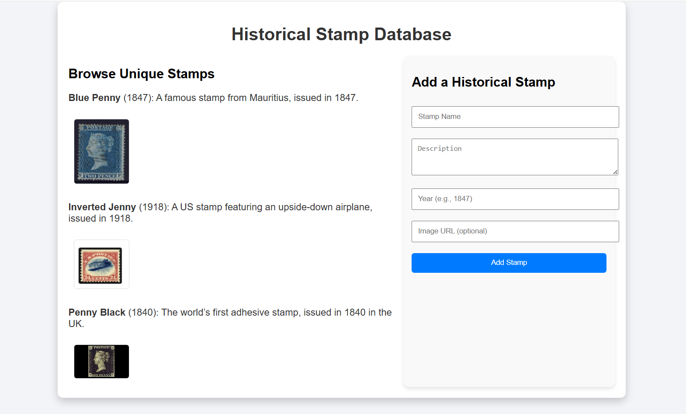

# Web Model Context API

_Enabling web apps to provide context and tools that can be accessed from other apps to create complex workflows._

**Andrew Nolan, Brandon Walderman, Leo Lee**

**July 2025**

## Status of this document

This document is a starting point for engaging the community and standards bodies in developing collaborative solutions fit for standardization. As the solutions to problems described in this document progress along the standards-track, we will retain this document as an archive and use this section to keep the community up-to-date with the most current standards venue and content location of future work and discussions.

**This document status**: Active

**Expected venue**: [W3C Web Incubation Working Group](https://wicg.io)

**Current version**: [This document](./explainer.md)

## TL:DR;

We propose a new JavaScript interface available on web pages that allows web developers to define "tools"; JS functions annotated with natural language descriptions and a schema describing their usage and input parameters that can be leveraged by other apps. In a web browser, webpages implementing Web Model Context can easily be treated as [Model Context Protocol (MCP)](https://modelcontextprotocol.io/introduction) servers, giving web developers the ability to provide functionality from their site to AI agents with improved auth and state when a webpage is visible. These tools can also be leveraged by other technologies as well like assistive ones.

## The problem

The web platform's ubiquity and popularity have made it the world's gateway to information and capabilities. Its ability to support complex, interactive applications beyond static content, has empowered developers to build rich user experiences and applications. These user experiences rely on visual layouts, mouse and touch interactions, and visual cues to communicate functionality and state.

As AI agents become more prevalent, the potential for even greater user value is within reach. Yet, much of the challenges faced by assistive technologies also apply to AI agents that struggle to navigate these existing human-first interfaces. Even when agents succeed, simple operations often require multiple steps and can be slow or unreliable.

The web needs web developer involvement to thrive. What if web developers could easily provide their sites capabilities to the agentic web to engage with their users? Model Context Protocol (MCP) is one popular approach, yet the protocol requires backend Python or NodeJS, requires a server, and makes human-in-the-loop flows requiring auth and state management tricky. 

We propose Web Model Context, a JavaScript API that allows developers to define tools for their webpage. These tools allow for code reuse with front end code, maintain a single interface for users and agents, and simplify auth and state where users and agents are interacting in the same user interface.

Such an API would also be a boon for accessibility tools, enabling them to offer users higher-level actions to perform on a page. This would mark a significant step forward in making the web more inclusive and actionable for everyone.

## Goals of the Web Model Context API

Primary goals of the Web Model Context API:

- **Enable human-in-the-loop workflows**: Support scenarios where users work directly through delegating tasks to AI agents or assistive technologies while maintaining much of the visibility and control over the web page(s).
- **Simplify AI agent integration**: Allow AI agents to interact with web sites through well-defined tools defined in JavaScript rather than screen parsing, automation, or writing back-end code.
- **Minimize developer burden**: Any task that a user can accomplish through a page's UI can be made into a tool by re-using much of the page's existing JavaScript code.
- **Improve accessibility**: Provide a standardized way for assistive technologies to access web application functionality beyond what's available through traditional accessibility trees which are not widely implemented.

Non-goals:

- **Headless browsing scenarios**: While it may be possible to use this API for headless or server-to-server interactions where no human is present to observe progress, this is not a current goal. Headless scenarios create many questions like the launching of browsers and profile considerations.
- **Autonomous agent workflows**: The API is not intended for fully autonomous agents operating without human oversight, or where a browser UI is not required. This task is likely better suited to existing protocols like [A2A](https://a2aproject.github.io/A2A/latest/).
- **Replacement of existing protocols**: Web Model Context works with existing protocols like MCP and is not a replacement of existing protocols.

## Technical specification

### Definitions

- **Model context provider**: A single top-level browsing context navigated to a page that uses the Web Model Context API to provide context (i.e. tools) to agents.
- **Agent**: An application that uses the provided context. This may be something like an AI assistant integrated into the browser, or possibly a native/desktop application.  

### Understanding Web Model Context

While the Web Model Context API can define tools for other uses, the API loosely aligns with MCP and tools defined with Web Model Context can be treated as MCP tools by MCP clients.

Only a top-level browsing context, such as a browser tab can be a model context provider. A page calls the Web Model Context API's `provideContext()` method to register model context with the browser, which are JavaScript methods with descriptions an AI agent can invoke as tools. When an agent that is connected to the page sends a tool call, a JavaScript callback is invoked, where the page can handle the tool call and respond to the agent. Simple applications can handle tool calls entirely in page script, but more complex applications may choose to delegate computationally heavy operations to workers and respond to the agent asynchronously.


Handling tool cools in the main thread with the option of workers serves a few purposes:

- Ensures tool calls run one at a time and sequentially.
- The page can update UI to reflect state changes performed by tools.
- Handling tool calls in page script may be sufficient for simple applications.

### Benefits of this design

- **Familiar language/tools**: Lets a web developer implement their tools in JavaScript.
- **Code reuse**: A web developer may only need to make minimal changes to expose existing functionality as tools if their page already has an appropriate JavaScript function.
- **Local tool call handling**: Enables web developers to integrate their pages with AI-based agents by working with, but not solely relying on, techniques like Model Context Protocol that require a separate server and authentication. A web developer may only need to maintain one codebase for their frontend UI and agent integration, improving maintainability and quality-of-life for the developer. Local handling also potentially reduces network calls and enhances privacy/security.
- **Fine-grained permissions**: Tool calls are mediated through the browser, so the user has the opportunity to review the requesting client apps and provide consent.
- **Developer involvement**: Encourages developer involvement in the agentic web, required for a thriving web. Reduces the need for solutions like UI automation where the developer is not involved, improving privacy, reducing site expenses, and a better customer experience.
- **Seamless integration**: Since tool calls are handled locally on a real browser, the agent can interleave these calls with human input when necessary (e.g. for consent, auth flows, dialogs, etc.).
- **Accessibility**: Bringing tools to webpages via may help users with accessibility needs by allowing them to complete the same job-to-be-done via agentic or conversational interfaces instead of relying on the accessibility tree, which many websites have not implemented.

### Limitations of this design

- **Browsing context required**: Since tool calls are handled in JavaScript, a browsing context (i.e. a browser tab or a webview) must be opened. There is currently no support for agents or assistive tools to call tools "headlessly" without visible browser UI. This is a future consideration which is discussed further below.
- **UI synchronization**: For a satisfactory end user experience, web developers need to ensure their UI is updated to reflect the current app state, regardless of whether the state updates came from human interaction or from a tool call.
- **Complexity overhead**: In cases where the site UI is very complex, developers will likely need to do some refactoring or add JavaScript that handles app and UI state with appropriate outputs.
- **Tool discoverability**: There is no built-in mechanism for client applications to discover which sites provide callable tools without visiting or querying them directly. Search engines, or directories of some kind may play a role in helping client applications determine whether a site has relevant tools for the task it is trying to perform.

### API Options

The `window.agent` interface is introduced to represent an abstract AI agent that is connected to the page and uses the page's context. Below are the options being considered for the exact interface:

#### Option 1: Combined tool definition and implementation

The simplest approach, and one that aligns closely with libraries like the MCP SDK is to have a single API that lets the web developer declare tools and provide their implementations in a single call:

**Example:**

```js
// Declare tool schema and implementation functions.
window.agent.provideContext({
    tools: [
        {
            name: "add-todo",
            description: "Add a new todo item to the list",
            params: {
                type: "object",
                properties: {
                    text: { type: "string", description: "The text of the todo item" }
                },
                required: ["text"]
            },
            async run(params) => {
                // Add todo item and update UI.
                return /* structured content response */
            }
        }
    ]
});
```
**Advantages:**

- Simple for web developers to use.
- Enforces a single function per tool.

**Disadvantages:**

- Must navigate to the page and run JavaScript for tools to be defined.

#### Option 2: Separate tool definition and implementation (**Recommended**)

Defining and implementing the tools separately opens the possibility of declaring tools outside of JavaScript. A future iteration of this feature could for example introduce tools that are defined declaratively in an app manifest so that agents can discover these without needing to visit the web site first. Agents will of course still need to navigate to the site to actually use its tools, but a manifest makes it far less costly to discover these tools and reason about their relevance to the user's task.

**Example:**

```js
// 1. Declare tool schema to agent.
window.agent.provideContext({
    tools: [
        {
            name: "add-todo",
            description: "Add a new todo item to the list",
            params: {
                type: "object",
                properties: {
                    text: { type: "string", description: "The text of the todo item" }
                },
                required: ["text"]
            },
        }
    ]
});

// 2. Handle tool calls as events.
window.agent.addEventListener('toolcall', async e => {
    if (e.name === "add-todo") {
        // Add todo item and update UI.
        e.respondWith(/* structured content response */);
        return;
    } // etc...
});
```
Tool calls are handled as events. Since event handler functions can't respond to the agent by returning a value directly, the `'toolcall'` event object has a `respondWith()` method that needs to be called to signal completion and respond to the agent. This is based on the existing service worker `'fetch'` event.

**Advantages:**

- Allows multiple different discovery mechanisms.

**Disadvantages:**

- Slightly harder to keep definition and implementation in sync.

Although this API is slightly more complex than the former, support for declaring tools outside of JavaScript will likely be important to support agents' ability to discover tools without needing to navigate to a page. It is also simple to write a wrapper around the Option 2 API that makes it look like Option 1, which could be useful for sites that don't want to take advantage of the declarative approach.

#### Other API alternatives considered

An earlier version of this explainer that was not published considered supporting multiple agents connecting to a single page and using a Session object to represent a connection between a single agent and the page. The page would register a handler to be notified when a new agent connected and would be able to see basic info about the agent and provide different tools to different agents if needed:

```js
window.registerContextProvider({ name: "Example App" }, session => {
    console.log("Agent name: " + session.clientInfo.name);

    session.provideContext({
        tools: [ /.../ ]
    });
});
```
This approach was abandoned as supporting multiple agents at a time introduced unneeded complexity. Exposing information about the client agent was also of limited use to the page since there was no way for the page to verify the client's identity.

## Example of Web Model Context API usage

Consider a web application like an example Historical Stamp Database. The complete source is available in the examples/stamps/ folder alongside this explainer.



The page shows the stamps currently in the database and has a form to add a new stamp to the database. The author of this app is interested in leveraging the Web Model Context API to enable agentic scenarios like:

- Importing multiple stamps from outside data sources
- Back-filling missing images
- Populating/correcting descriptions with deep research
- Adding information to descriptions about rarity
- Allowing end users to engage in a conversational interface about the stamps on the site and use that information in agentic flows

sing the Web Model Context API, the author can add just a few simple tools to the page for adding, updating, and retrieving stamps. With these relatively simple tools, an AI agent would have the ability to perform complex tasks like the ones illustrated above on behalf of the user.

The example below walks through adding one such tool, the "add-stamp" tool, using Option #2 of the Web Model Context API, so that AI agents can update the stamp collection.

The webpage today is designed with a visual UX in mind. It uses simple JavaScript with a `'submit'` event handler that reads the form fields, adds the new record, and refreshes the UI:

```js
document.getElementById('addStampForm').addEventListener('submit', (event) => {
    event.preventDefault();

    const stampName = document.getElementById('stampName').value;
    const stampDescription = document.getElementById('stampDescription').value;
    const stampYear = document.getElementById('stampYear').value;
    const stampImageUrl = document.getElementById('stampImageUrl').value;

    addStamp(stampName, stampDescription, stampYear, stampImageUrl);
});
```

To facilitate code reuse, the developer has already extracted the code to add a stamp and refresh the UI into a helper function `addStamp()`:

```js
function addStamp(stampName, stampDescription, stampYear, stampImageUrl) {
      // Add the new stamp to the collection
    stamps.push({
        name: stampName,
        description: stampDescription,
        year: stampYear,
        imageUrl: stampImageUrl || null
    });

    // Confirm addition and update the collection
    document.getElementById('confirmationMessage').textContent = `Stamp "${stampName}" added successfully!`;
    renderStamps();
}
```

To let AI agents use this functionality, the author first defines the available tools. The `agent` property on the `Window` is checked to ensure the browser supports Web Model Context. If supported, the `provideContext()` method is called, passing in an array of tools with a single item, a definition for the new "Add Stamp" tool. The tool accepts as parameters the same set of fields that are present in the HTML form, since this tool and the form should be functionally equivalent.

```js
window.agent.provideContext({
    tools: [
        {
            name: "add-stamp",
            description: "Add a new stamp to the collection",
            params: {
                type: "object",
                properties: {
                    name: { type: "string", description: "The name of the stamp" },
                    description: { type: "string", description: "A brief description of the stamp" },
                    year: { type: "number", description: "The year the stamp was issued" },
                    imageUrl: { type: "string", description: "An optional image URL for the stamp" }
                },
                required: ["name", "description", "year"]
            },
        }
    ]
});
```

Now the author needs to handle tool calls coming from connected agents. After defining the "Add Stamp" tool above, the author handles the `'toolcall'` event and implements the tools operations. The tool needs to update the stamp database, and refresh the UI to reflect the change to the database. Since the code to do this is already available in the `addStamp()` function written earlier, the event handler is very simple and just needs to call this helper when an "add-stamp" tool call is received. After calling the helper, the event handler needs to signal completion and should also provide some sort of feedback to the client application that requested the tool call. It calls `e.respondWith()` with a text message indicating the stamp was added:

```js
window.addEventListener('toolcall', async (e) => {
    if (e.name === 'add-stamp') {
        const { name, description, year, imageUrl } = e.input;
        addStamp(name, description, year, imageUrl);

        return e.respondWith({
            content: [
                {
                    type: "text",
                    text: `Stamp "${name}" added successfully! The collection now contains ${stamps.length} stamps.`,
                },
            ]
        });
    }
});
```
### Future improvements to this example

#### Use a worker

To improve the user experience and make it possible for the stamp application to handle a large number of tool calls without tying up the document's main thread, the web developer may choose to move the tool handling into a dedicated worker script. Handling tool calls in a worker keeps the UI responsive, and makes it possible to handle potentially long-running operations. For example, if the user asks an AI agent to add a list of hundreds of stamps from an external source such as a spreadsheet, this will result in hundreds of tool calls.

#### Adaptive UI

The author may also wish to change the on-page user experience when a client is connected. For example, if the user is interacting with the page primarily through an AI agent or assistive tool, then the author might choose to disable or hide the HTML form input and use more of the available space to show the stamp collection.

## Open topics for Web Model Context

### Security considerations

There are security considerations that will need to be accounted for, especially if the Web Model Context API is used by semi-autonomous systems like LLM-based agents. Engagement from the community is welcome.

### Model poisoning

Explorations should be made on the potential implications of allowing web developers to create tools in their front-end code for use in AI agents and LLMs. For example, vulnerabilities like being able to access content the user would not typically be able to see will need to be investigated.

### Cross-Origin Isolation

Client applications would have access to many different web sites that expose tools. Consider an LLM-based agent. It is possible and even likely that data output from one application's tools could find its way into the input parameters for a second application's tool. There are legitimate reasons for the user to want to send data across origins to achieve complex tasks. Care should be taken to indicate to the user which web applications are being invoked and with what data so that the user can intervene.

### Permissions

A trust boundary is crossed both when a web site first registers as a model context provider, and when a new client agent wants to use this context (e.g. by calling a tool). When a web site registers tools, it exposes information about itself and the services it provides to the host environment (i.e. the browser). When agents send tool calls, the site receives untrusted input in the parameters and the outputs in turn may contain sensitive user information. The browser should prompt the user at both points to grant permission and also provide a means to see what information is being sent to and from the site when a tool is called. To streamline workflows, browsers may give users the choice to always allow tool calls for a specific web app and client app pair.

## Other Alternatives considered

### Web App Manifest, other Manifest, or declarative

We considered declaring tools statically in a site's Web App Manifest. Declaring tools solely in the Web App Manifest limits Web Model Context to PWAs which could impact adoption since users would need to install a site as an app for tools to be available.

Another type of manifest could be proposed but using this approach also means that only a fixed set of static tools are available and can't be updated dynamically based on application state, which seems like an important ability for web developers. Since manifests can't execute code, it also means manifests are additional work for the developer since they will need to still implement the tool somewhere.

Our recommended approach above allows for the possibility of declarative tools in the future while giving web developers as much control as possible by defining tools in script.

### Handling tool calls in worker threads

Handling tool calls on the main thread raises performance concerns, especially if an agent requests a large amount of tool calls in sequence, and/or the tools are computationally expensive. A design alternative that required tool calls to be handled in workers was considered instead.

One proposal was to expose the Web Model Context API only in service workers and let the service worker post messages to individual client windows/tabs as needed in order to update UI. This would have complicated the architecture and required web developers to add a service worker. This would also have required the Session concept described earlier to help the service worker differentiate between agents that are connected to different windows and dispatch requests from a particular agent to the correct window.

For long-running, batched, or expensive tool calls, we expect web developers will dynamically update their UI when these are taking place to temporarily cede control to the agent (e.g. disable or remove human form inputs, indicate via UI that an agent is in control), and take advantage of dedicated workers as needed to offload expensive operations. This can be achieved with existing dedicated or shared workers.

### Model Context Protocol (MCP) without Web Model Context

MCP has quickly garnered wide interest from the developer community, with hundreds of MCP servers being created. Web Model Context API is designed to work well with MCP, so that developers can reuse many of the MCP topics with their front-end website using JavaScript. We originally planned to propose an explainer very tightly aligned with MCP, providing all the same concepts supported by MCP at the time of writing, including tools, resources, and prompts. Since MCP is still actively changing, matching its exact capabilities would be an ongoing effort. Aligning the Web Model Context API tightly with MCP would also make it more difficult to tailor Web Model Context for non-LLM scenarios like OS and accessibility assistant integrations. Keeping the Web Model Context API as agnostic as possible increases the chance of it being useful to a broader range of potential clients.

We expect some web developers will continue to prefer standalone MCP instead of Web Model Context if they want to have an always-on MCP server running that does not require page navigation in a full browser process. For example, server-to-server scenarios such as fully autonomous agents will likely benefit more from MCP servers. Web Model Context is best suited for local browser workflows with a human in the loop.

The Web Model Context API still maps nicely to MCP, and exposing context provided via Web Model Context to external applications via an MCP server is still a useful scenario that a browser implementation may wish to enable.

### Existing web automation techniques (DOM, accessibility tree)

One of the scenarios we want to enable is making the web more accessible to general-purpose AI-based agents. In the absence of alternatives like MCP servers to accomplish their goals, these general-purpose agents often rely on observing the browser state through a combination of screenshots, and DOM and accessibility tree snapshots, and then interact with the page by simulating human user input. We believe that Web Model Context will give these tools an alternative means to interact with the web that give the web developer more control over whether and how an AI-based agent interacts with their site.

The proposed API will not conflict with these existing automation techniques. If an agent or assistive tool finds that the task it is trying to accomplish is not achievable through the Web Model Context tools that the page provides, then it can fall back to general-purpose browser automation to try and accomplish its task.

## Future explorations

### Progressive web apps (PWA)

PWAs should also be able to use the Web Model Context API as described in this proposal. There are potential advantages to installing a site as a PWA. In the current proposal, tools are only discoverable once a page has been navigated to and only persist for the lifetime of the page. A PWA with an app manifest could declare tools that are available "offline", that is, even when the PWA is not currently running. The host system would then be able to launch the PWA and navigate to the appropriate page when a tool call is requested.

### Background model context providers

Some tools that a web app may want to provide for agents and assistive technologies may not require any web UI. For example, a web developer building a "To Do" application may want to expose a tool that adds an item to the user's todo list without showing a browser window. The web developer may be content to just show a notification that the todo item was added. 
For scenarios like this, it may be helpful to combine tool call handling with something like the ['launch'](https://github.com/WICG/web-app-launch/blob/main/sw_launch_event.md) event. A client application might attach a tool call to a "launch" request which is handled entirely in a service worker without spawning a browser window.
