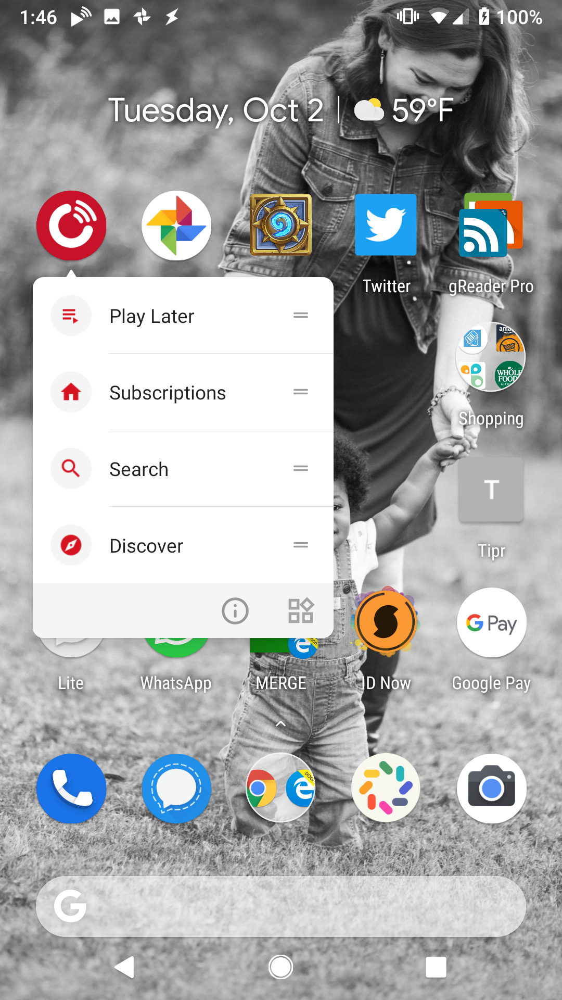
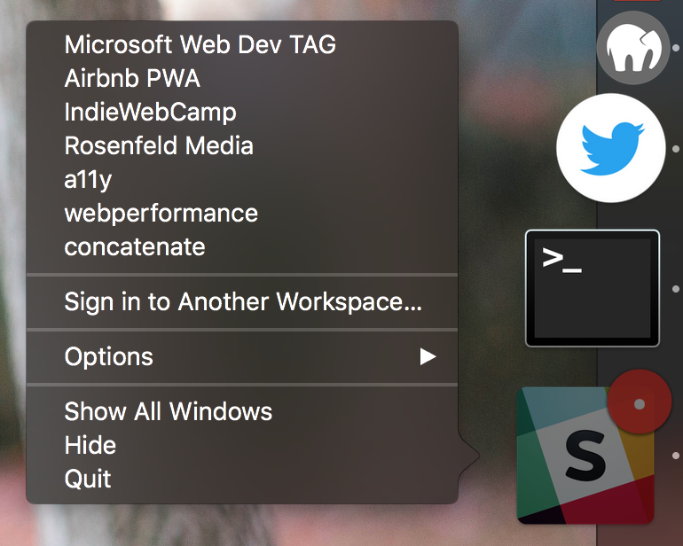
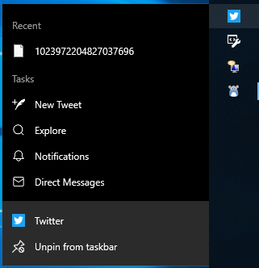

# Shortcuts Explainer

Authors: [Aaron Gustafson](https://github.com/aarongustafson)

## Introduction

A number of operating systems offer a means by which authors can provide quick access to key tasks for an app. Typically these are exposed via the app’s icon.

## Why are Shortcuts needed?

Shortcuts will provide another mechanism for Progressive Web Apps to facilitate re-engagement with key tasks.

## Goals

* Enable authors to provide a list of Quick Links to specific URLs within their PWA in a standardized fashion
* Enable users to access key tasks easily

## Non-goals

* Enable authors to directly trigger JavaScript events from Quick Links

## Use Cases
Most progressive web apps have a handful of key tasks that users need to do with relative frequency. Providing quick access to those tasks from anywhere the app icon is displayed will improve users’ productivity as well as increase their engagement with the app. It will also reduce the number of clicks needed to access numerous locations and features including:

* Top-level navigation items (e.g., home, timeline, orders)
* Search
* Data entry tasks (e.g., compose a tweet, add a receipt)

## Examples

<figure>



<figcaption>PlayerFM Shortcuts in Android</figcaption>
</figure>

<figure>



<figcaption>Slack’s Dock Menu in macOS</figcaption>
</figure>

<figure>



<figcaption>Twitter’s Jump List in Windows 10</figcaption>
</figure>

## API Proposal

We are proposing that a new member be added to the Web App Manifest JSON object: shortcuts. This member would take an array of objects similar to the icons member. For example, to replicate the shortcut menu from PlayerFM, an author could do the following:

```json
"shortcuts": [
  {
    "title": "Play Later",
    "description": "View the list of podcasts you saved for later",
    "uri": "https://playerfm.com/play-later",
    "icon": "https://playerfm.com/icons/play-later.svg"
  },
  {
    "title": "Subscriptions",
    "description": "View the list of podcasts you listen to",
    "uri": "https://playerfm.com/subscriptions",
    "icon": "https://playerfm.com/icons/subscriptions.svg"
  },
  
  {
    "title": "Search",
    "description": "Search for new podcasts to listen to",
    "uri": "https://playerfm.com/search",
    "icon": "https://playerfm.com/icons/search.svg"
  },
  
  {
    "title": "Discover",
    "description": "Browse for new podcasts to listen to",
    "uri": "https://playerfm.com/discover",
    "icon": "https://playerfm.com/icons/discover.svg"
  }  
]
```

## Existing Implementations

This section describes a possible treatment on each major OS. User agents are free to implement however they like, but this should give an idea of what the API will look like in practice. In all cases, the menu items consist of text, a destination, and an icon.

### Android

In Android, shortcut activation is triggered via a long press.  Android allows the list to be supplemented at runtime via Dynamic Shortcuts and allows users to rearrange and "pin" shortcut items.

### iOS

In iOS, a hard press (3D Touch) exposes the menu items (iOS 9.0+ on 3D touch-capable devices). iOS also enables a subtitle and has a hard limit of 4 items.

### macOS/Windows/Linux GUI/etc.

In most OSes, this context menu is triggered by right clicking (or two finger tapping) on the icon.  Windows calls these Jump Lists and allows each shortcut item to have a description. macOS refers to these shortcuts as the Dock Menu.

### Electron

Electron enables shortcuts for macOS and Windows app icons as well.