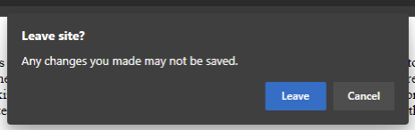
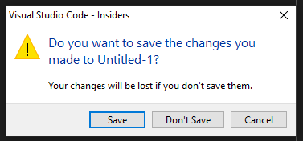
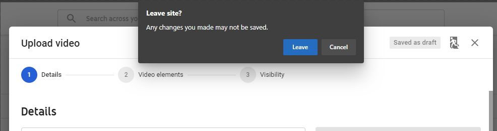
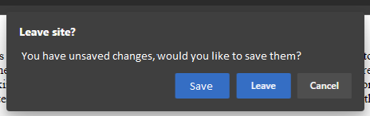
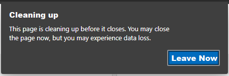
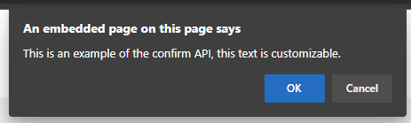

# Custom Dialog On Close

## Authors:

-   Austin Orion

## Status of this Document
This document is intended as a starting point for engaging the community and standards bodies in developing collaborative solutions fit for standardization. As the solutions to problems described in this document progress along the standards-track, we will retain this document as an archive and use this section to keep the community up-to-date with the most current standards venue and content location of future work and discussions.
* This document status: **Withdrawn**
* Note: This design conflicted with the philosophy of keeping tab close as fast as possible. Work is ongoing to describe a way to meet the needs that this design aimed to address.

## Introduction
Installed PWAs need a way to allow developers to perform asynchronous operations (such as saving a file) and optionally show a customizable dialog before the user closes the app and their state is lost.

## Scope
This capability should only be exposed to installed PWAs. Allowing arbitrary websites the ability to interrupt the leaving flow with a custom dialog would be a regression in browser security. This capability is important to a complete user experience, but can also be harmful and thus should only be available to sites the user has signaled that they trust via installation as a PWA.

## Current State
Currently, the only way a site can prompt a user before they leave is by adding an event listener for beforeunload events, which causes this dialog to be displayed before the tab is closed.



The problem is that the website can't communicate to users why they are being prompted, and the site can't offer the user a quick way to resolve the situation and then let them leave.

There are some options that seem to solve the saving state on tab close issue, but they either have limitations that make them difficult or impossible to implement or beforeunload imposes constraints that make them unworkable.

| Alternative | Limitations |
| ----------- | ---------- |
| Service Workers | <ul><li>Service workers can't access the DOM, and serializing then passing this data via `postMessage()` can take too long to run on tab close.</li></ul> |
| XHR and sendBeacon | <ul><li>Doesn't work in an offline scenario.</li><li>Requires a public endpoint to send data to, if the application is used as a library the host needs to have this endpoint accessible.</li></ul> |
| IndexedDB | <ul><li>Does not work for users with multiple browsers or devices.</li><li>API is asynchronous, so it can't be used in the beforeunload handler.</li></ul> |
| Local Storage | <ul><li>Does not work for users that use multiple browsers or devices.</li><li>The local storage API is not well suited to storing application state data.</li></ul> |

## Use Cases
There are many scenarios in which the web developer may want to invoke this dialog before the end user leaves the site, but some of the most common ones we've seen during our investigations are:

1. Text editing sites could display a dialog to the user before the page is closed/refreshed/navigated away from, allowing the user to save their changes before they are lost.



2. Sites could provide better warnings to users that leaving would cancel pending operations, such as file uploads.



## Proposed Solution
### A Declarative Site State
In order to prevent user data loss and provide more context about potentially undesired behaviors on application exit, we propose that sites should be able to indicate when they are in a dirty state and opt-in to showing a customizable dialog and/or have some asynchronous Javascript code run on exit.

When the user enters data or begins an operation that would be cancelled on tab close, the site can enter a dirty state by calling `window.setDirtyState(true)`. When the operation is finished or the data is saved, the site can exit the dirty state by calling `window.setDirtyState(false)`. When the tab is closed or navigated away from while the site is in a dirty state, a dialog may be shown and/or some JavaScript code may be run.

The site opts-in to having a dialog show by calling `window.setExitDialog()`. The site can customize this dialog by passing in a JSON object with optional `message` and `buttonLabel` properties. If the message property is missing, a default message will be displayed. If the buttonLabel property is missing, only the two default buttons will be displayed. If no object or an invalid object is passed, a default dialog will be shown instead. A well formed object might look like this:

```javascript
window.setExitDialog({
  message: "You have unsaved changes, would you like to save them?",
  buttonLabel: "Save"
});
```

And that would prompt a dialog that looks like this to be displayed:



Additionally, the site can provide a Javascript function to be run via the `window.setDirtyStateHandler()` API. This code will be run conditionally if a dialog is shown, only if the user selects the custom button on the dialog, or unconditionally if no dialog is shown. While this code is running, tab close should be delayed.

To help communicate why this delay in tab close is happening to the user, we propose that a second dialog should be displayed after a short timeout (perhaps 500 ms) explaining that the site is cleaning up, and offering an option to leave now.




#### Time limit
To avoid a poor user experience from websites that take a long time to complete their task, we propose that there should be a time limit on how long the operation can run for. Currently, Chromium based browser display a warning if the synchronous code in the beforeunload event handler takes a long time.

`[Violation] 'beforeunload' handler took 53921ms`

However, no time limit is actually enforced. We propose strictly enforcing a time limit that starts as soon as the user makes a selection on the "Leave Site?" dialog. What that limit should be will need to be researched further. An error message such as this should be displayed if the limit is reached:
`The beforeunload promise did not resolve within the X second time limit. The operation has been cancelled.`

#### Sequence Diagram
Below is a sequence diagram to illustrate the flow when this new capability is used.
```
App         "Leave Site?" Dialog      Dirty State Handler    "Cleaning up" Dialog 
 |
 | User attempts to close app
 | ----------------->| User selects "Save" option
 | <---------------- |
 | --------------------------------------> | short delay before dialog appears
 |                                         |-------------------> | 
 |                                         |                     | 
 | <-------------------------------------- | <------------------ | Code handler resolves, times out, or user force exits
 |  
```

### Interacting With Legacy Events
We propose that if a site sets the dirty state to true, or provides a dirty state handler, then the UA should not send a beforeunload event.

## Avoiding Misuse
While this feature fills a gap in the platform that will improve the end user experience when used responsibly; it, like many other APIs, does introduce the potential for abuse if not mitigated by the UA. Some examples of abuse that we have identified, and recommended mitigations, follow:

| Risk | Mitigations |
| ---- | ----------- |
| The user accidentally clicks an ad, or otherwise has an unwanted tab appear. They try to close the tab as quickly as possible, but are unable to due to a confirmation dialog. | The user must have interacted with the page to allow the site to prompt the user or perform asynchronous actions on tab close. |
| The user attempts to navigate away from a tab, but is convinced to wait for the site to perform some action before they leave. The site intentionally takes an excessively long time, perhaps displaying ads while the user is waiting for the tab to close itself. | <ul><li>There should be a time limit on how long the asynchronous code can run for, at the end of the time limit there should be a "leave anyway" dialog, or some other mechanism that allows the user to cancel the async task and leave immediately.</li><li>A second attempt to close the tab, via clicking the "x" or ctrl+w, should immediately close the tab.</li><li>The DOM should be frozen while the dirty state handler code is run, preventing the site from displaying new alarming text or advertisements.</ul> |
| A website displays alarming text, to try and convince the user to stay on the site or perform some harmful action. | <ul><li>This capability should only be available to installed PWAs, and not arbitrary websites. </li><li>The UI should make it clear that the message is coming from the site, and not from the browser. Similar to how the `alert()` dialog says "This site says..." </li><li>The text that the website can display should be limited in length and not allow formatting.</li><li>Always display "Leave" and "Cancel" buttons on the dialog, and only allow websites to add a third option which could be customizable.</li></ul> |

## Considered Alternatives
### Extend the beforeunload event
A familiar way to interrupt the leaving flow is to use the beforeunload event's properties, either calling `preventDefault()` or assigning a value to `returnValue`. In line with this pattern, we are proposing the addition of a new property to the beforeunload event: `dialog`. The `dialog` property would have several methods `setMessage()`, `setButtonLabel()`, and `show()`. These functions are how the developer will customize the dialog, and provide code that will run based on the user's selection.
```javascript
window.addEventListener("beforeunload", (event) => {
    if (event.dialog) {
      event.dialog.setMessage("You have unsaved changes, would you like to save them?");
      event.dialog.setButtonLabel("Save");
      event.dialog.show().then(async (result) => {
        if (result == "Save"){
          // save the document.
        }
      });
    }
});
```

`show()` returns a promise that will resolve with the user's selection. Once it resolves, the code provided by the developer will run, and the tab will close when it is finished. While the developer's code is running, we should display a dialog indicating that some work is being done, and present an option to the user that lets them cancel the work and leave immediately. Here is an example of how this "Cleaning up" dialog may look:

This option will not be pursued, in favor of the declarative approach. The two approaches are very similar, offering the same capability, but the declarative approach has several clear benefits over this proposal such as: 
- The UA can prepare the dialog ahead of time, and display it on behalf of a suspended tab without unsuspending it.
- Having a beforeunload handler can harm the performance of the browser by preventing optimizations like BFCache. A declarative approach should lessen the frequency with which this optimization is missed.

### Extend window.confirm()
[`window.confirm()`](https://developer.mozilla.org/en-US/docs/Web/API/Window/confirm) is a familiar API that lets websites query the user and act based on their response.



We could extend this API to allow websites to add a new options to the dialog and have it return a promise with the user's selection. The website would then return a promise by calling .then() on window.confirm(). When the returned promise settles, the User Agent will close the tab. For example:
    
For example:
```javascript
window.addEventListener("beforeunload", (event) => {
  if (featureDetectNewConfirmDialog()) {
    return window.confirm("You have unsaved changes, would you like to save them?", "Save & Leave").then(function(result) {
      // Perform the work to save the document.
      resolve(); // The tab closes at this point.
    });
  } else {
    event.preventDefault();
  }
});
```

However, this proposal brings confusion because window.confirm() would behave differently depending on if it was called from a beforeunload handler or not. It is also not a common pattern, and currently User Agents are allowed to deny showing window.confirm() dialogs from the beforeunload handler. For these reasons, this proposal was not chosen.

### Fully customizable dialog

We considered allowing the developer to design and show a fully customizable dialog, perhaps via the proposed [modal-window](https://github.com/adrianhopebailie/modal-window/blob/master/explainer.md), but this was not chosen due to it's additional complexity and the increased potential for abuse. For example, the site could choose to show only an "Accept" option, and no option to cancel. While mitigations for problems like this exist, the user experience would be worse than the proposed solution, where it is guaranteed that the user is given the option to leave a site immediately.

## Privacy
This extension of the beforeunload event would increase browser fingerprinting capabilities by adding a feature-detectable API. However, as this API holds no user preferences, fingerprinting capabilities are limited to detecting large cohorts of users of particular browsers.

## Security
This capability may have some security concerns by allowing malicious websites to trick users, as well as accepting untrusted input from web developers and running code during shutdown. Discussion is ongoing about how to mitigate the former and should consider UI design as well as code. To ensure the latter is handled appropriately, a thorough security review of the code will be performed once a design is agreed upon.
