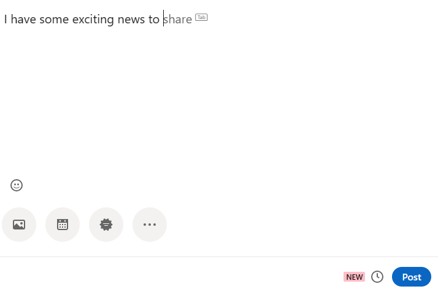
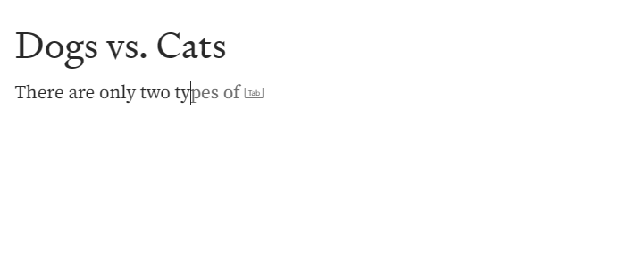
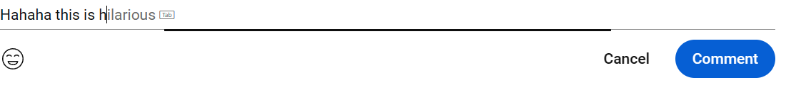
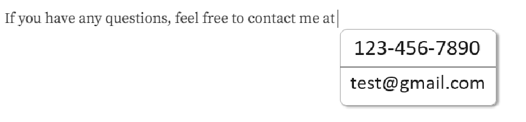

# Writingsuggestions attribute to control UA-provided writing assistance

Consider all sections required unless otherwise noted.

Authors: [Sanket Joshi](https://github.com/sanketj)
Previous authors: [Ben Mathwig](https://github.com/bmathwig)

## Status of this Document

This document is a starting point for engaging the community and standards bodies in developing collaborative solutions fit for standardization. As the solutions to problems described in this document progress along the standards-track, we will retain this document as an archive and use this section to keep the community up-to-date with the most current standards venue and content location of future work and discussions.

* This document status: **Active**
* Expected venue: [WHATWG](https://whatwg.org/)
* Current version: [Link](#)

## Introduction
UAs are starting to provide writing suggestions to users as they type on various editable fields across the web (see the [use case](#use-case) section below). While this is
generally useful for users, there are cases when developers may want to turn off UA-provided writing assistance, such as extensions or sites that wish to provide similar functionality on their own. To that end, this explainer proposes a solution that would allow developers to turn on/off UA-provided writing assistance.

## Use Case
A developer may use this control to take advantage of browser-provided writing assistance features like text prediction on `contenteditable` elements.

### Facebook.com: Writing a post

### Medium.com: Drafting an article

### Youtube.com: Commenting on a video

This control could also be used to enable additional browser-provided writing suggestions in the future. See a hypothetical example below.

A developer may also use this control to turn off browser-provided writing suggestions if they want to provide their own writing assistance tools.

## Out of Scope
1. Defining expected user agent behavior or user interface design.
2. Styling of UA-provided writing suggestions.

## Proposed Solution
We propose the addition of a new attribute called `writingsuggestions` with values `on`/`off` that would allow developers to turn on/off browser-provided writing suggestions. This attribute will have a default state per element, as established by the UA. The attribute's state for an element can also be inherited from ancestor elements, thereby allowing developers to control this functionality at a per-element or per-document/sub-document scale.

## Privacy and Security Considerations
UAs may choose to provide users with personal settings to turn on/off writing assitance, similar to settings that are available for spellchecking. Similar to the `spellcheck` attribute, UAs must keep the values of the `writingsuggestions` attribute independent of the user's settings. Letting the user's setting influence the value of the attribute may introduce a new fingerprinting surface.

## Alternative Solutions
### Extending the `autocomplete` attribute to [editing hosts](https://html.spec.whatwg.org/multipage/interaction.html#editing-host)
The `autocomplete` attribute is primarily designed for form fill scenarios and supports a [large number of values](https://html.spec.whatwg.org/multipage/form-control-infrastructure.html#autofilling-form-controls:-the-autocomplete-attribute), many of which are not applicable to writing scenarios. Reasoning about how each of these values should behave on editing hosts would be complex for browser and web developers alike.

### Spellcheck Attribute
The `spellcheck` attribute is specifically designed to control the browser's spellcheck and grammar check capabilities, therefore it is not semantically appropriate for controling writing suggestions.

### Text Prediction Attribute
A `textprediction` attribute could be introduced that takes `on/off` values, allowing developers to control whether the browser's text prediction is available on a text control. Such an attribute would be specific to text prediction and would not be future proof against additional types of writing suggestions that browsers may introduce in the future.