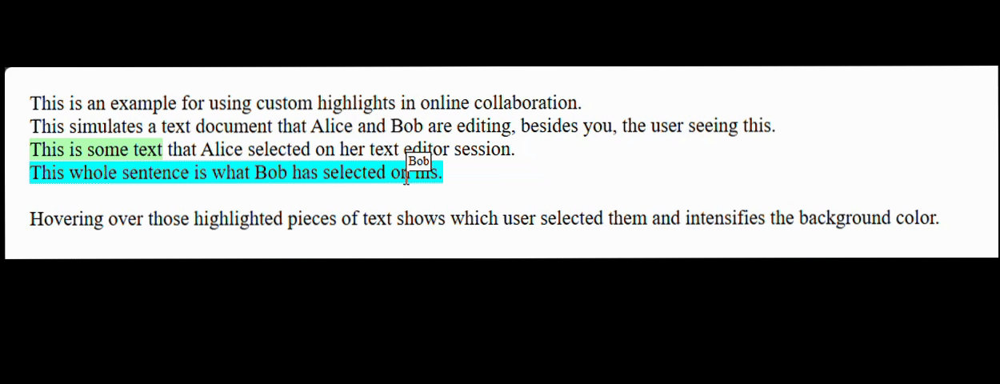

# HighlightsFromPoint API Explainer

Authors: [Stephanie Zhang](https://github.com/stephanieyzhang), [Sanket Joshi](https://github.com/sanketj), [Fernando Fiori](https://github.com/ffiori)

Previous authors: [Dan Clark](https://github.com/dandclark), [Luis Sánchez Padilla](https://github.com/luisjuansp)

## Status of this Document
This document is intended as a starting point for engaging the community and standards bodies in developing collaborative solutions fit for standardization. As the solutions to problems described in this document progress along the standards-track, we will retain this document as an archive and use this section to keep the community up-to-date with the most current standards venue and content location of future work and discussions.
* This document status: **Active**
* Expected venue: [W3C CSS Working Group](https://www.w3.org/Style/CSS/)
* Current version: this document

## Introduction
[Highlights](https://drafts.csswg.org/css-highlight-api-1/) allow developers to give an appearance to a range of text. Use cases for this include rendering background colors to denote comments or annotations in a document, highlighting selections of other users in online collaboration for text or code editing, highlighting find-on-page results for virtualized content, and squiggles for spelling and grammar checking.

These use cases require that the users not only be able to see the highlighted portion of the document, but have the ability to interact with it.

Here are some inspirational examples of how users may interact with highlighted ranges:
 - When a user hovers over content that a different user has selected or is editing, display some information about the user currently working on that content.
 - When a user clicks a highlighted result from find-on-page, the selection may be moved to cover the result so that it can be copied or edited easily.
 - When a user hovers over a misspelled word, the web app may display UI with suggested replacement text.
 - When a user clicks an annotation in a document, the web app may emphasize and scroll into view the corresponding annotation in a pane which lists all the annotations in the document.

Currently, web developers who want to implement some sort of interaction with custom highlights need to use workarounds that are cumbersome to code and maintain and that potentially incur performance penalties.

## Customer Problem Example

For example, let's have a deeper look at the case of online collaboration mentioned above where it's needed to show the name of the user who is selecting some piece of text upon hovering over it.
This could look as follows, where the chunks of text each user selected are highlighted with a different color:



In the [Appendix](#example-code-without-highlightsfrompoint) there is a full example of code showing how this could be achieved with custom highlights, but let's focus on the section where the event listeners are added:

```html
function isPointInsideDOMRect(x, y, rect) {
    return (
        x >= rect.left && x <= rect.right &&
        y >= rect.top && y <= rect.bottom
    );
}

function createActiveHighlights(x, y) {
    resetActiveHighlights();
    for (highlight of CSS.highlights.values()) {
        let username = highlightToUsername.get(highlight);
        if (username != undefined) {
            for (highlightAbstractRange of highlight.values()) {
                let range = new Range();
                range.setStart(highlightAbstractRange.startContainer, highlightAbstractRange.startOffset);
                range.setEnd(highlightAbstractRange.endContainer, highlightAbstractRange.endOffset);
                for (rect of range.getClientRects()) {
                    if (isPointInsideDOMRect(x, y, rect)) {
                        setActiveHighlight(highlight, username, x, y);
                    }
                }
            }
        }
    }
}

div.addEventListener('mousemove', (event) => {
    createActiveHighlights(event.pageX, event.pageY);
});
```

Some things to notice:

- There's a loop over all of the registered custom highlights in `CSS.highlights`.
- There's another loop over all of the highlight's ranges to see if the point `(x,y)` is inside one of them.
- A `Range` has to be created for each range of the highlight because they can be `StaticRanges`, which don't support `getClientRects()`.
- There's a loop over all of the `DOMRects` returned by `getClientRects()` for each range.
- Determining if a point is inside a `DOMRect` needs some extra computation which was added in a helper `isPointInsideDOMRect`.


## Proposal
The `highlightsFromPoint()` API aims to provide a robust mechanism for identifying and interacting with custom highlights, making it easier for web developers to implement features like the ones described in the [Introduction](#introduction) of this document.

Some considerations about it:

- **Multiple Overlapping Highlights**: When multiple highlights overlap from different features (e.g., a spell-checker and a find-on-page feature), it's crucial to identify all highlights at a specific point. This ensures that all relevant highlights are accurately identified, enabling web developers to handle overlapping highlights more effectively.
- **Performance Optimization**: By providing a dedicated API for hit-testing highlights, the method can optimize performance. Instead of relying on more complex and potentially slower methods to determine which highlights are under a specific point, this method offers a streamlined and efficient way to perform this task, improving overall performance (refer to the [Performance Analysis](#performance-analysis) in the Appendix for more details on an example).
- **Shadow DOM Handling**: Highlights within shadow DOMs require special handling to maintain encapsulation. The method can be designed to respect shadow DOM boundaries, ensuring highlights inside shadows are managed correctly. This helps maintain the integrity of the shadow DOM while still allowing highlights to be identified and interacted with.

The `highlightsFromPoint()` method proposed would be part of the `CSS.highlights` interface. It would return a sequence of highlights at a specified point, ordered by [priority](https://drafts.csswg.org/css-highlight-api-1/#priorities). The developer has the option to pass in `options`, which is an optional dictionary where the key maps to an array of `ShadowRoot` objects. The API can search for and return highlights within the provided shadow DOM. The approach of passing an `options` parameter of `ShadowRoot` object is similar to [caretPositionFromPoint()](https://drafts.csswg.org/cssom-view/#dom-document-caretpositionfrompoint) and [getHTML()](https://html.spec.whatwg.org/multipage/dynamic-markup-insertion.html#dom-element-gethtml) methods. 

### Customer Problem Example Using highlightsFromPoint

Now going back to the text editor online collaboration example discussed in [Customer Problem Example](#customer-problem-example) section, let's see how `createActiveHighlights` could be implemented using the proposed API:

```html
function createActiveHighlights(x, y) {
    resetActiveHighlights();
    let highlights = CSS.highlights.highlightsFromPoint(event.clientX, event.clientY);
    for (highlight of highlights) {
        let username = highlightToUsername.get(highlight);
        if (username != undefined) {
            setActiveHighlight(highlight, username, x, y);
        }
    }
}
```

This piece of code is significantly smaller and simpler than the solution that was shown in the previous section without highlightsFromPoint. More specifically:
- There's no need to iterate over all the ranges of the highlights registered anymore, now highlightsFromPoint gives us only the highlights that are under the point `(x,y)`.
- There's no need to deal with ranges and rectangles anymore because that's handled by the API.

You can refer to a full implementation in the [Appendix](#example-code-using-highlightsfrompoint).

## Alternative Solutions
### Event-based API
A [previous explainer](events-explainer.md) proposed an [event](https://dom.spec.whatwg.org/#event)-based API to handle interactions with custom Highlights.
This has been discussed in the CSSWG too, see [this issue](https://github.com/w3c/csswg-drafts/issues/7513) for details. The main idea was dispatching events to the Highlights present under the cursor upon user actions. Different approaches were taken into account:

1. A separate event is dispatched for each Highlight under the cursor in descending priority order. The default action is to advance to the next Highlight and `preventDefault()` can be used to stop this. This might result in firing an arbitrary number of events for a single user action.
2. Dispatch a single event for the top-priority Highlight, with the event path including other Highlights and then bubbling to the DOM tree. However, pointer events can currently only target elements, so this approach might break other specification assumptions.
3. A combination of approaches 1 and 2, dispatching two events per user action: one for Highlights and one for the DOM tree. The Highlight event propagates through overlapping Highlights, and if `preventDefault()` wasn't called in that sequence, a new event is fired on the DOM tree.

If we wanted to apply option 3 above to the example of online collaboration described before, instead of adding the event listener to the `div` element, we should add it to the highlights themselves. This could be achieved as follows:

```html
let currentActiveHighlightUsernames = new Set([]);

function createActiveHighlight(highlight, x, y) {
    let username = highlightToUsername.get(highlight);
    if (username != undefined) {
        setActiveHighlight(highlight, username, x, y);
    }
}

function removeActiveHighlight(highlight) {
    let username = highlightToUsername.get(highlight);
    if (username != undefined) {
        let activeHighlightName = 'active-selection-highlight-' + username;
        CSS.highlights.delete(activeHighlightName);
        currentActiveHighlightUsernames.delete(username);
        if (currentActiveHighlightUsernames.size == 0) {
            cursorBox.style.display = 'none';
        }
        else {
            cursorBox.textContent = buildActiveUsernamesLabel();
        }
    }
}

for (highlight of highlightToUsername.keys()) {
    highlight.addEventListener('mouseover', (event) => {
        createActiveHighlight(event.currentTarget, event.pageX, event.pageY);
    });

    highlight.addEventListener('mouseout', (event) => {
        removeActiveHighlight(event.currentTarget);        
    });
}
```

In contrast to the solutions presented before, in `createActiveHighlights` now we don't have to loop over the highlights affected, but we have to do it beforehand to set all the necessary event listeners.
Also notice how now we have to be careful and keep track of the active highlights since we're not rebuilding them in the same step, introducing some extra code on that front that wasn't required before.

However, each of these event-based options carry significant complexity from a specification point of view. Option 3 mentioned above would be the most suitable one, but the event phases are hard to define. Let's suppose that the user moves the mouse over the Highlight `h1` set on element `e1`, and an event listener was set on `h1`. The phases should look as follows:

    Capture phase e1 pointermove - target:e1 currentTarget:e1
    Target phase h1 pointermove - target:e1 currentTarget:h1
    Bubbling phase e1 pointermove - target:e1 currentTarget:e1

A workaround is needed here where `event.target` should stay as the element `e1` because pointer events can only target elements, but actually the target was the highlight, which doesn't really follow the definition for `event.target`.
Furthermore, when `currentTarget == target`, it should be target phase, this would imply the event phases work in a new way and it could break current site implementations or introduce inconsistencies with current specifications.

In conclusion, the `highlightsFromPoint()` API is much simpler to implement and specify, it doesn't need these kind of workarounds nor creates these open questions, and still satisfies the use cases adequately.

### Promise-based API

Another asynchronous variation for `highlightsFromPoint` could be returning a [Promise](https://tc39.es/ecma262/multipage/control-abstraction-objects.html#sec-promise-objects), which returns the highlights present at the given point upon resolving.
This is some example code for how to implement the online collaboration website with it:

```html
function createActiveHighlights(x, y) {
    let highlightsPromise = CSS.highlights.highlightsFromPoint(event.clientX, event.clientY);
    highlightsPromise.then((highlights) => {
        resetActiveHighlights();
        for (highlight of highlights) {
            let username = highlightToUsername.get(highlight);
            if (username != undefined) {
                setActiveHighlight(highlight, username, x, y);
            }
        }
    });
    return highlightsPromise;
}
```

This could become a little chaotic as in what could happen if one Promise resolves after other things take place. Let's say for example in this case if the user moves the mouse out of any highlighted ranges and keeps it static in that position. If an old Promise where the mouse was over some Highlight resolves after that, it could incorrectly create active highlights and they would stay there until the user moves the mouse again. This would be problematic for the developer to fix.

Another disadvantage of this option is that being promise-based would be inconsistent with other similar APIs like [`elementFromPoint`](https://drafts.csswg.org/cssom-view/#dom-document-elementfrompoint) and [`caretPositionFromPoint`](https://drafts.csswg.org/cssom-view/#dom-document-caretpositionfrompoint), which are synchronous, potentially introducing some developer confusion regards how to handle these functions and how they work.

### Making `highlightsFromPoint` part of `DocumentOrShadowRoot`
While exploring the implementation of the `highlightsFromPoint()` API, we considered adding it to the [`DocumentOrShadowRoot`](https://dom.spec.whatwg.org/#documentorshadowroot) interface. However, we decided against this approach due to the complexities involved in managing shadow DOM encapsulation and to ensure consistency with existing APIs like [`caretPositionFromPoint()`](https://drafts.csswg.org/cssom-view/#dom-document-caretpositionfrompoint) and [`getHTML()`](https://html.spec.whatwg.org/multipage/dynamic-markup-insertion.html#dom-element-gethtml), which face similar encapsulation challenges.

## Privacy and Security Considerations
### Privacy Considerations
The API is designed to minimize the exposure of user information by only revealing highlights at a specific point. It does not handle personal or sensitive information directly, but developers must ensure that highlights do not contain private data. The API respects shadow DOM boundaries to maintain encapsulation and operates independently of user state, so to not reveal any personal information.

### Security Considerations
The API introduces no new security risks. 

## Relevant Discussions
  1. [[css-highlight-api] Approaches for dispatching highlight pointer events · Issue #7513 · w3c/csswg-drafts (github.com)](https://github.com/w3c/csswg-drafts/issues/7513)
  2. [[css-highlight-api] Exposing shadow DOM highlights in highlightsFromPoint() · Issue #7766 · w3c/csswg-drafts (github.com)](https://github.com/w3c/csswg-drafts/issues/7766)

  ---
  [Related issues](https://github.com/MicrosoftEdge/MSEdgeExplainers/labels/highlightsFromPoint) | [Open a new issue](https://github.com/MicrosoftEdge/MSEdgeExplainers/issues/new?title=%5BhighlightsFromPoint%5D)

## Appendix

### highlightsFromPoint IDL Proposed

```html
interface HighlightRegistry {
  // Returned values in priority order.
  sequence<Highlight> highlightsFromPoint(float x, float y, optional HighlightsFromPointOptions options = {});
};

dictionary HighlightsFromPointOptions {
  sequence<ShadowRoot> shadowRoots = [];
};
```

### Example Code Without highlightsFromPoint

This is the full implementation for the text editor online collaboration example mentioned in [Customer Problem Example](#customer-problem-example) section. This is one way the code for it could be written nowadays without highlightsFromPoint API.

```html
<!DOCTYPE html>
<html>
<head>
<style>
    div {
        padding: 20px;
        font-size: 22px;
    }
    div::highlight(selection-highlight-Alice) {
        background-color: rgba(0, 255, 0, 0.3);
    }
    div::highlight(selection-highlight-Bob) {
        background-color: rgba(0, 255, 255, 0.3);
    }
    div::highlight(active-selection-highlight-Alice) {
        background-color: rgba(0, 255, 0, 1);
    }
    div::highlight(active-selection-highlight-Bob) {
        background-color: rgba(0, 255, 255, 1);
    }
    #cursorBox {
        position: absolute;
        background-color: white;
        padding: 2px;
        border: 1px solid black;
        display: none;
        font-size: 14px;
    }
</style>
</head>
<body>
<div contenteditable="true" spellcheck="false">
This is an example for using custom highlights in online collaboration.</br>
This simulates a text document that Alice and Bob are editing, besides you, the user seeing this.</br>
This is some text that Alice selected on her text editor session.</br>
This whole sentence is what Bob has selected on his.</br>
</br>
Hovering over those highlighted pieces of text shows which user selected them and intensifies the background color.</br> 
</div>
<div id="cursorBox"></div>
<script>
    let listenForMouseMove = false;
    let cursorBox = document.getElementById('cursorBox');
    let div = document.querySelector('div');
    let aliceTextNode = div.childNodes[4];
    let aliceRange = new StaticRange({startContainer: aliceTextNode, startOffset: 0, endContainer: aliceTextNode, endOffset: 18});
    let bobTextNode = div.childNodes[6];
    let bobRange = new StaticRange({startContainer: bobTextNode, startOffset: 0, endContainer: bobTextNode, endOffset: bobTextNode.textContent.length});

    let aliceHighlightName = 'selection-highlight-Alice';
    let aliceHighlight = new Highlight(aliceRange);
    let aliceActiveHighlight = new Highlight(aliceRange);
    CSS.highlights.set(aliceHighlightName, aliceHighlight);
    let bobHighlightName = 'selection-highlight-Bob';
    let bobHighlight = new Highlight(bobRange);
    let bobActiveHighlight = new Highlight(bobRange);
    CSS.highlights.set(bobHighlightName, bobHighlight);

    let highlightToUsername = new Map([
        [aliceHighlight, "Alice"],
        [bobHighlight, "Bob"]
    ]);

    function resetActiveHighlights() {
        for(username of highlightToUsername.values()){
            let activeHighlightName = 'active-selection-highlight-' + username;
            CSS.highlights.delete(activeHighlightName);
        }
        cursorBox.style.display = 'none';
        cursorBox.textContent = '';
    }

    function setActiveHighlight(highlight, username, x, y) {
        let activeHighlightName = 'active-selection-highlight-' + username;
        CSS.highlights.set(activeHighlightName, highlight);
        cursorBox.textContent += (cursorBox.textContent.length ? ', ' : '') + username;
        cursorBox.style.display = 'block';
        cursorBox.style.left = (x + 2) + 'px';
        cursorBox.style.top = (y - cursorBox.getBoundingClientRect().height - 6) + 'px';
    }

    function isPointInsideDOMRect(x, y, rect) {
        return (
            x >= rect.left && x <= rect.right &&
            y >= rect.top && y <= rect.bottom
        );
    }

    function createActiveHighlights(x, y) {
        resetActiveHighlights();
        for (highlight of CSS.highlights.values()) {
            let username = highlightToUsername.get(highlight);
            if (username != undefined) {
                for (highlightAbstractRange of highlight.values()) {
                    // Need to create a Range for getClientRects() because it can be a StaticRange.
                    let range = new Range();
                    range.setStart(highlightAbstractRange.startContainer, highlightAbstractRange.startOffset);
                    range.setEnd(highlightAbstractRange.endContainer, highlightAbstractRange.endOffset);
                    let rangeIsHit = false;
                    for (rect of range.getClientRects()) {
                        if (isPointInsideDOMRect(x, y, rect)) {
                            setActiveHighlight(highlight, username, x, y);
                            rangeIsHit = true;
                            break;
                        }
                    }
                    if (rangeIsHit) {
                        break;
                    }
                }
            }
        }
    }

    div.addEventListener('mouseover', (event) => {
        listenForMouseMove = true;
    });

    div.addEventListener('mousemove', (event) => {
        if (listenForMouseMove) {
            createActiveHighlights(event.pageX, event.pageY);
        }
    });

    div.addEventListener('mouseout', (event) => {
        listenForMouseMove = false;
    });
</script>
</body>
</html>
```

### Example Code Using highlightsFromPoint

This is the full implementation for the text editor online collaboration example mentioned in [Customer Problem Example](#customer-problem-example-using-highlightsfrompoint) section, using the new highlightsFromPoint API proposed.

```html
<!DOCTYPE html>
<html>
<head>
<style>
    div {
        padding: 20px;
        font-size: 22px;
    }
    div::highlight(selection-highlight-Alice) {
        background-color: rgba(0, 255, 0, 0.3);

    }
    div::highlight(selection-highlight-Bob) {
        background-color: rgba(0, 255, 255, 0.3);
    }
    div::highlight(active-selection-highlight-Alice) {
        background-color: rgba(0, 255, 0, 1);
    }
    div::highlight(active-selection-highlight-Bob) {
        background-color: rgba(0, 255, 255, 1);
    }
    #cursorBox {
        position: absolute;
        background-color: white;
        padding: 2px;
        border: 1px solid black;
        display: none;
        font-size: 14px;
    }
</style>
</head>
<body>
<div contenteditable="true" spellcheck="false">
This is an example for using custom highlights in online collaboration.</br>
This simulates a text document that Alice and Bob are editing, besides you, the user seeing this.</br>
This is some text that Alice selected on her text editor session.</br>
This whole sentence is what Bob has selected on his.</br>
</br>
Hovering over those highlighted pieces of text shows which user selected them and intensifies the background color.</br> 
</div>
<div id="cursorBox"></div>
<script>
    let listenForMouseMove = false;
    let cursorBox = document.getElementById('cursorBox');
    let div = document.querySelector('div');
    let aliceTextNode = div.childNodes[4];
    let aliceRange = new StaticRange({startContainer: aliceTextNode, startOffset: 0, endContainer: aliceTextNode, endOffset: 18});
    let bobTextNode = div.childNodes[6];
    let bobRange = new StaticRange({startContainer: bobTextNode, startOffset: 0, endContainer: bobTextNode, endOffset: bobTextNode.textContent.length});

    let aliceHighlightName = 'selection-highlight-Alice';
    let aliceHighlight = new Highlight(aliceRange);
    let aliceActiveHighlight = new Highlight(aliceRange);
    CSS.highlights.set(aliceHighlightName, aliceHighlight);
    let bobHighlightName = 'selection-highlight-Bob';
    let bobHighlight = new Highlight(bobRange);
    let bobActiveHighlight = new Highlight(bobRange);
    CSS.highlights.set(bobHighlightName, bobHighlight);

    let highlightToUsername = new Map([
        [aliceHighlight, "Alice"],
        [bobHighlight, "Bob"]
    ]);

    function resetActiveHighlights() {
        for(username of highlightToUsername.values()){
            let activeHighlightName = 'active-selection-highlight-' + username;
            CSS.highlights.delete(activeHighlightName);
        }
        cursorBox.style.display = 'none';
        cursorBox.textContent = '';
    }

    function setActiveHighlight(highlight, username, x, y) {
        let activeHighlightName = 'active-selection-highlight-' + username;
        CSS.highlights.set(activeHighlightName, highlight);
        cursorBox.textContent += (cursorBox.textContent.length ? ', ' : '') + username;
        cursorBox.style.display = 'block';
        cursorBox.style.left = (x + 2) + 'px';
        cursorBox.style.top = (y - cursorBox.getBoundingClientRect().height - 6) + 'px';
    }

    function createActiveHighlights(x, y) {
        resetActiveHighlights();
        let highlights = CSS.highlights.highlightsFromPoint(x, y);
        for (highlight of highlights) {
            let username = highlightToUsername.get(highlight);
            if (username != undefined) {
                setActiveHighlight(highlight, username, x, y);
            }
        }
    }

    div.addEventListener('mouseover', (event) => {
        listenForMouseMove = true;
    });

    div.addEventListener('mousemove', (event) => {
        if (listenForMouseMove) {
            createActiveHighlights(event.pageX, event.pageY);
        }
    });

    div.addEventListener('mouseout', (event) => {
        listenForMouseMove = false;
    });
</script>
</body>
</html>
```

### Performance Analysis

We compared the performance of the two approaches presented for the online collaboration example analyzed throughout this explainer: with and without the proposed `highlightsFromPoint` API.
We compared how long it takes for the event listener added for 'mousemove' events to complete in both cases when the mouse moves over a highlighted portion and when it moves over unaffected text. For this, we slightly modified the listener as shown below and also implemented a `testPerformance` function as follows, adding a hundred extra highlights to stress the test:

```html
let accumulatedTime = 0;
let eventsFired = 0;
div.addEventListener('mousemove', (event) => {
    let start = performance.now();
    if (listenForMouseMove) {
        createActiveHighlights(event.pageX, event.pageY);
    }
    accumulatedTime += performance.now() - start;
    eventsFired++;
});

function wait(ms) {
    return new Promise(resolve => setTimeout(resolve, ms));
}

async function testPerformance() {
    let mousemoveEvent = new Event('mousemove');
    let highlightRange = new Range();
    highlightRange.setStart(bobRange.startContainer, bobRange.startOffset);
    highlightRange.setEnd(bobRange.endContainer, bobRange.endOffset);
    let rangeRect = highlightRange.getClientRects()[0];

    mousemoveEvent.pageX = rangeRect.left + rangeRect.width/2;
    mousemoveEvent.pageY = rangeRect.top + rangeRect.height/2;

    // Add more highlights to stress the test.
    for(let i=0; i<100; i++){
        let h = new Highlight(bobRange);
        let name = "highlight-" + i;
        CSS.highlights.set(name, h);
        highlightToUsername.set(h, name)
    }
    
    // First dispatches can be outliers.
    for(let i=0; i<100; i++){
        div.dispatchEvent(mousemoveEvent);
    }
    await wait(100); 
    
    // Measure the time it takes to process a mousemove event over highlights.
    accumulatedTime = 0;
    eventsFired = 0;
    for(let i=0; i<1000; i++){
        div.dispatchEvent(mousemoveEvent);
    }
    await wait(1000); 
    console.log("Average time it took to process a mousemove event over highlights: " + (accumulatedTime/eventsFired));

    // Now measure the time it takes to process a mousemove event outside of the highlights.
    mousemoveEvent.pageY = rangeRect.top - 1;
    accumulatedTime = 0;
    eventsFired = 0;
    for(let i=0; i<1000; i++){
        div.dispatchEvent(mousemoveEvent);
    }
    await wait(1000);
    console.log("Average time it took to process a mousemove event outside of the highlights: " + (accumulatedTime/eventsFired));
}

testPerformance();
```

After executing both examples, we got the following results showing a ~1.9x improvement on hovering over highlights and a ~17x improvement on hovering outside of any highlights when using `highlightsFromPoint`:

- Using `highlightsFromPoint`:
    - Average time it took to process a mousemove event over highlights: 6.60029999999702
    - Average time it took to process a mousemove event outside of highlights: 0.015899999991059302

- Not using `highlightsFromPoint`:
    - Average time it took to process a mousemove event over highlights: 12.525500000044703
    - Average time it took to process a mousemove event outside of highlights: 0.2749000000208616

When the mouse move event happens outside of the higlights, the performance profiler from developer tools shows that `createActiveHighlights` takes more time dealing with the ranges and getting the rectangles compared to the version that uses `highlightsFromPoint`. And when the event happens on a highlight, the call to `highlightsFromPoint` takes less time than all the necessary calls to `getClientRects` that are fired in the version that doesn't use the new API. Both measurements indicate that using the new API gives a performance advantage compared to implementing this use case with the current APIs available.
