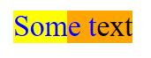
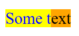

# Highlight API Explained

## Status of this Document
This document is intended as a starting point for engaging the community and standards bodies in developing collaborative solutions fit for standardization. As the solutions to problems described in this document progress along the standards-track, we will retain this document as an archive and use this section to keep the community up-to-date with the most current standards venue and content location of future work and discussions.
* This document status: **ARCHIVED**
* Current venue: [W3C CSS Working Group](https://www.w3.org/Style/CSS/) | [w3c/csswg-drafts](https://github.com/w3c/csswg-drafts) | 
* Current version: [CSS Custom Highlight API Module Level 1](https://drafts.csswg.org/css-highlight-api-1/)

## Overview

The Highlight API extends the concept of [CSS Highlight Pseudo-elements](https://drafts.csswg.org/css-pseudo-4/#highlight-pseudos) by providing a way for web developers to style the text of arbitrary Range objects, rather than being limited to the user-agent defined ```::selection```, ```::inactive-selection```, ```::spelling-error```, and ```::grammar-error```. This is useful in a variety of scenarios, including editing frameworks that wish to implement their own selection, find-on-page over virtualized documents, multiple selection to represent online collaboration, and spellchecking frameworks.

Current browsers do not provide this functionality which forces web developers and framework authors to modify the underlying structure of the DOM tree in order to achieve the rendering they desire. This can quickly become complicated in cases where the desired highlight/selection spans elements across multiple subtrees, and requires DOM updates to the view in order to adjust highlights as they change. The Highlight API provides a programmatic way of adding and removing highlights that do not affect the underlying DOM structure, but instead applies styles to text based on Range objects.

## Example usage

The following code uses the ```::highlight``` pseudo-element to apply a yellow background and blue foreground color to the text ```One two```. It does so by adding a **Highlight** to the **HighlightRegistry** (both of these are new concepts introduced by this proposal). The Highlight will contain a Range whose boundary points surround the text ```One two```.

```html
<style>
:root::highlight(example-highlight) {
    background-color: yellow;
    color:blue;
}
</style>
<body><span>One </span><span>two </span><span>three...</span>
<script>
    let highlightsRange = new Range();
    highlightsRange.setStart(document.body, 0);
    highlightsRange.setEnd(document.body, 2);

    let highlight = new Highlight(highlightsRange);

    CSS.highlights.set("example-highlight", highlight);
</script>
```

CSS.highlights is a **HighlightRegistry**. The **HighlightRegistry** is a [maplike](https://heycam.github.io/webidl/#idl-maplike) object that maps a name to a Highlight object. The presence of a Highlight in the highlight registry enables the text within the contained Ranges to be styled – a Highlight not added to the HighlightRegistry will have no effect on rendering. **Highlight** represents a set of Ranges and exposes a [setlike](https://heycam.github.io/webidl/#idl-setlike) interface. Highlights can have styles applied by the ::highlight pseudo elements, when the identifier passed to the ::highlight pseudo is the same as the name of the Highlight in the HighlightRegistry. The Highlight also has a `priority` property – this is used to disambiguate which styles should be used when text content is covered by Ranges from different Highlights.

## Application of CSS properties

The HighlightRegistry is structured as a map so that there is a logical grouping of highlights. This allows web developers and frameworks to have highlights grouped in such a way that they are more easily composed (e.g. one framework can do spellcheck highlighting, while another can manage find-on-page, with yet another performing highlighting for selection).

During the CSS cascade, the ```::highlight``` pseudo will cascade style properties into a map referenced by the matching [originating element](https://drafts.csswg.org/selectors-4/#originating-element), indexed by the identifier name. If there is a Highlight that exists in the highlight map under that identifier, the text within each of that highlight group's ranges will be styled based on these computed maps of the originating elements that are covered by the containing range (which can be a single element).

In terms of painting, the ```::highlight``` pseudo is treated as a highlight pseudo-element, as described in [CSS Pseudo Elements Level 4](https://drafts.csswg.org/css-pseudo-4/#highlight-pseudos). Only a specific subset of style properties will apply and are limited to those that affect text.

Following the code example above, if we have the following snippet of HTML:

```html
<p>Some |text|</p>
```

where 'text' is covered by a Range (as denoted by the ```|``` characters) in a Highlight in the HighlightRegistry under the 'example-highlight' identifier. In this case, during painting, the inline box containing ```Some text``` will detect that there is a Range that spans part of the box. Due to this, painting ```text``` will reference the Range and its container  Highlight in the HighlightRegistry in order to determine what styles to use. For this example the Range belongs to the 'example-highlight' identifier, which applies ```background-color:yellow``` and ```color:blue```, based on the map that was cascaded onto the ```<p>``` element. The text 'Some ' will be painted as it normally would.

There can be multiple such ranges for a given inline box and Highlights added to the map can overlap &mdash; in these cases, the associated text will be partitioned into a set of intervals, such that each member of the set has a unique collection of Highlights covering it. The style properties are then computed for each member in the set by applying the styles of the applicable Highlights in ascending priority order (based on the ```priority``` property), where the last write of a given property wins. In the event that Highlights overlap and have the same priority, the timestamp of when the Highlight was added to the map is used.

It is also possible to add entries in the HighlightRegistry, without there being a corresponding ```::highlight()``` pseudo element for the associated document. In this case there are no cascaded properties to apply when painting inline boxes and there will be no impact on painting).

## Example with overlapping Ranges

Take the following html snippet:
```html
<style>
p::highlight(foo) {
    color:blue;
    background-color:yellow;
}
p::highlight(bar) {
    background-color:orange;
}

</style>
<p>|Som|e t|ext|</p>
   1   2   1   2
<script>
let highlight1 = new Highlight(range1);
let highlight2 = new Highlight(range2);
CSS.highlights.set("foo", highlight1);
CSS.highlights.set("bar", highlight2);
</script>
```
Where (1) shows that ```range1``` covers ```"Some t"``` and (2) denotes ```range2``` covers ```"e text"```.

Because there are no priorities set (i.e. there is a tie between ```highlight1``` and ```highlight2```), the Highlights' styles are applied in timestamp order. The rendered results will have ```"Som"``` with blue text on yellow background, ```"e t"``` with blue text on orange background, and ```"ext"``` with the default color on orange background.



Setting ```highlight1.priority = 1;``` would cause ```highlight1``` to apply on top of ```highlight2```, which results in ```"Some t"``` being blue on yellow, and ```"ext"``` being default color on orange.



## Invalidation

Ranges are live ranges - DOM changes within one of the Range objects will result in the new contents being highlighted. Changes to the boundary points of Ranges in the HighlightRegistry will result in the user-agent invalidating the view and repainting the changed highlights appropriately. If there are DOM/CSS changes that result in a different cascaded highlight map for a given element, and there exists one or more Range objects in the highlights map for the cascaded identifiers, the layout representation of that element should be notified that the painting of the element might have changed. Ranges that are positioned inside of documents that are not in the view are ignored. The HighlightRegistry is per-document &mdash; therefore, Ranges that are positioned inside of a different document than the HighlightRegistry it is a part of are ignored for rendering.

Note that some browsers have layout limitations in that they are unable to apply ligatures across inline element boundaries.  As a result, text may appear to jump in online editors that implement their own selection using inline elements.  The highlight API offers an alternative way for these editors to implement their own selection without modifying the document and browsers must implement this API using painting techniques similar to those used for native browser selection to avoid impacting the layout of text.

## Removal of highlights

Because Range objects are live ranges, they must be modified when web developers wish their contents to no longer be highlighted. This can be achieved by removing the Range from the corresponding Highlight, by passing it to the ```delete()``` method.

## Open questions

How should inline 'inherit' values be treated? The cascaded values are resolved per usual, but a range can span multiple elements which could all have different 'computed' values for 'inherit'.

How to treat existing highlight mechanisms built into the browser?  Should we establish a priority order for those so its clear how the author can defer to or override those built-in highlights?

Obtaining a range from built-in elements and closed shadow roots may be important for extensions like Grammarly.  Should we define a mechanism to obtain a range that refers to the contents of built-in elements?  How would that be done for close shadow roots?

---
[Related issues](https://github.com/MicrosoftEdge/MSEdgeExplainers/labels/Highlight%20API) | [Open a new issue](https://github.com/MicrosoftEdge/MSEdgeExplainers/issues/new?title=%5BHighlight%20API%5D)
