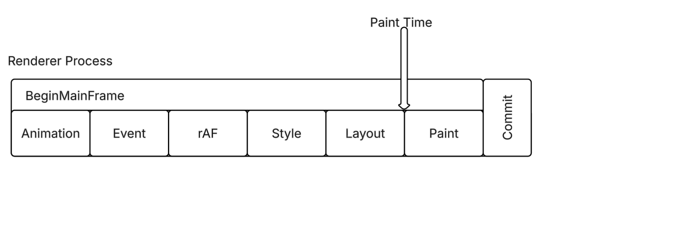
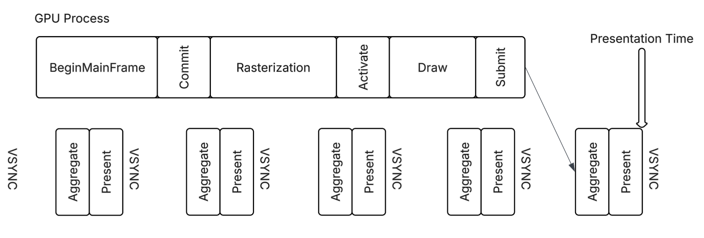

# performance.markPaintTime() Explainer

Author:  [Wangsong Jin](https://github.com/JosephJin0815) - Engineer at Microsoft Edge

## Status of this Document

This document is a starting point for engaging the community and standards bodies in developing collaborative solutions fit for standardization. As the solutions to problems described in this document progress along the standards-track, we will retain this document as an archive and use this section to keep the community up-to-date with the most current standards venue and content location of future work and discussions.

* This document status: **Active**
* Expected venue: [W3C Web Incubator Community Group](https://wicg.io/)
* Current version: this document

## Table of Contents

- [Introduction](#introduction)
- [Goals](#goals)
- [Non-goals](#non-goals)
- [The Problem](#the-problem)
- [Proposed API](#proposed-api)
- [Rendering Pipeline and Timing](#rendering-pipeline-and-timing)
- [Key Design Decisions](#key-design-decisions)
- [Alternatives Considered](#alternatives-considered)
- [Open Questions](#open-questions)
- [Security and Privacy Considerations](#security-and-privacy-considerations)
- [Appendix: WebIDL](#appendix-webidl)

## Introduction

Web developers need to measure when their visual updates actually render — not just the browser-detected milestones like First Paint or [`Largest Contentful Paint`](https://www.w3.org/TR/largest-contentful-paint/), but any update they care about: a component mount, a state transition, a style change.

The platform already captures paint and presentation timestamps for key moments via [`PaintTimingMixin`](https://w3c.github.io/paint-timing/#sec-PerformancePaintTiming), but only for entries the browser selects automatically. `performance.markPaintTime()` extends this capability to let developers capture the same `paintTime` and `presentationTime` for any visual update, on demand.

## Goals
 - Give developers on-demand access to `paintTime` and `presentationTime` for any visual update.
 - Deliver timestamps through `PerformanceObserver`, consistent with modern performance APIs.

## Non-goals
 - **Replacing existing paint timing entries.** [FP](https://w3c.github.io/paint-timing/#sec-PerformancePaintTiming), [FCP](https://w3c.github.io/paint-timing/#sec-PerformancePaintTiming), [LCP](https://w3c.github.io/largest-contentful-paint/), [Event Timing](https://w3c.github.io/event-timing/), and [LoAF](https://w3c.github.io/long-animation-frames/) continue to serve their existing purposes.
 - **Forcing a rendering update.** `markPaintTime()` does not cause a rendering opportunity — it tags the next one that naturally occurs.

## The Problem

Without an on-demand API, developers resort to workarounds like double-rAF or rAF+setTimeout to approximate when the rendering update completes, but these workarounds are unreliable (see [Nolan Lawson's analysis](https://nolanlawson.com/2018/09/25/accurately-measuring-layout-on-the-web/)). Furthermore, no existing workaround provides `presentationTime` — the actual time when pixels appear on screen. For example, a developer wants to measure when a chat input box appears after the page loads, but the component is rendered asynchronously by a framework. A typical pattern uses `IntersectionObserver` to detect when the element enters the viewport, then `requestAnimationFrame` to approximate the paint time:

### Single requestAnimationFrame

```javascript
const observer = new IntersectionObserver((entries) => {
  if (entries[0].isIntersecting) {
    observer.disconnect();
    requestAnimationFrame(() => {
      performance.mark('chat-input-visible');
    });
  }
});
observer.observe(document.querySelector('.chat-input'));
```

Since `requestAnimationFrame` fires before the browser paints, the recorded timestamp is earlier than when the content is actually rendered. It is better than logging at the moment of the DOM update, but still only an approximation.

### Double requestAnimationFrame

```javascript
const observer = new IntersectionObserver((entries) => {
  if (entries[0].isIntersecting) {
    observer.disconnect();
    requestAnimationFrame(() => {
      requestAnimationFrame(() => {
        performance.mark('chat-input-visible');
      });
    });
  }
});
observer.observe(document.querySelector('.chat-input'));
```

The second rAF fires after the first frame's paint, getting closer to the actual paint time. However, there is no guarantee that this captures the frame that corresponds to the change. This gets worse when observers (e.g., `ResizeObserver`, `IntersectionObserver`) are present — their callbacks add work between frames, making the second rAF even less likely to land on the expected frame.

### requestAnimationFrame + setTimeout

```javascript
const observer = new IntersectionObserver((entries) => {
  if (entries[0].isIntersecting) {
    observer.disconnect();
    requestAnimationFrame(() => {
      setTimeout(() => {
        performance.mark('chat-input-visible');
      }, 0);
    });
  }
});
observer.observe(document.querySelector('.chat-input'));
```

This defers the mark to the next task after the rAF callback, which is more likely to land after the paint. However, the overshoot is non-deterministic due to other queued tasks — the timestamp ends up well past the actual frame, making the measurement less precise.

### With markPaintTime

```javascript
const observer = new IntersectionObserver((entries) => {
  if (entries[0].isIntersecting) {
    observer.disconnect();
    performance.markPaintTime('chat-input-visible');
  }
});
observer.observe(document.querySelector('.chat-input'));

new PerformanceObserver((list) => {
  for (const entry of list.getEntries()) {
    console.log(`Paint: ${entry.paintTime}ms`);
    console.log(`Presented: ${entry.presentationTime}ms`);
  }
}).observe({ type: 'mark-paint-time' });
```

- **Accurate**: `paintTime` is captured at the rendering update, not approximated by rAF.
- **End-to-end**: `presentationTime`, when available, tells you when pixels appeared on the display.
- **Stable**: No rAF variance — the timestamps come from the rendering pipeline, not rAF approximation.

## Proposed API

`performance.markPaintTime(markName)` tags the next rendering update with a developer-chosen name. The browser then delivers a `PerformancePaintTimeMark` entry through `PerformanceObserver` with the following properties:

 | Attribute | Description |
 |-----------|-------------|
 | `entryType` | Always `"mark-paint-time"` |
 | `name` | The mark name passed to `markPaintTime()` |
 | `startTime` | `performance.now()` at the time `markPaintTime()` was called, unless overridden via `options.startTime` — same semantics as [`performance.mark()`](https://w3c.github.io/user-timing/#the-performancemark-constructor) (see [step 5](https://w3c.github.io/user-timing/#the-performancemark-constructor)). This is **not** a rendering-pipeline timestamp; it records when the developer invoked the API, regardless of where in the event loop the call occurs (e.g., a microtask, `IntersectionObserver` callback, or `requestAnimationFrame`). |
 | `duration` | Always `0` |
 | `paintTime` | The rendering update end time — same as FP/FCP/LCP `paintTime` |
 | `presentationTime` | When pixels were shown on the display, or `null` if unsupported by the UA — same as FP/FCP/LCP `presentationTime` |

**Behavior:**
- On-demand — no data is collected until `markPaintTime()` is called.
- One-shot — each call tags the next rendering update and produces exactly one entry.
- Multiple calls within the same rendering opportunity each produce their own entry with the same `paintTime` and `presentationTime`, but distinct `name` and `startTime`. Calls that span different rendering opportunities produce entries with distinct `paintTime` and `presentationTime`.
- If `options.startTime` is provided, it is used as the entry's `startTime`; if negative, a `TypeError` is thrown. Otherwise, `startTime` defaults to `performance.now()` at call time — consistent with [`performance.mark()`](https://w3c.github.io/user-timing/#the-performancemark-constructor).
- `presentationTime` may be `null` when the user agent does not support implementation-defined presentation timestamps, consistent with [`PaintTimingMixin`](https://w3c.github.io/paint-timing/#sec-PaintTimingMixin).

The entry reuses [`PaintTimingMixin`](https://w3c.github.io/paint-timing/#sec-PerformancePaintTiming) from the Paint Timing spec, so `paintTime` and `presentationTime` have identical semantics to the timestamps developers already see on FP, FCP, and LCP entries.

## Rendering Pipeline and Timing

`markPaintTime()` captures timestamps at specific points in the browser's rendering pipeline.

### paintTime

`paintTime` is the rendering update end time, captured after style recalculation and layout. This is the same timestamp that FP/FCP/LCP use via [PaintTimingMixin](https://w3c.github.io/paint-timing/#sec-PerformancePaintTiming), defined at [step 11.14.21 of the event loop](https://html.spec.whatwg.org/multipage/webappapis.html#event-loop-processing-model).



### presentationTime

`presentationTime` is the implementation-defined time when the composited frame is presented to the display.



### What developers can measure

- **`startTime`**: `performance.now()` at the time `markPaintTime()` is called.
- **`paintTime - startTime`** = main-thread rendering cost (how long until the browser finished processing the visual update)
- **`presentationTime - startTime`** (when `presentationTime` is non-null) = end-to-end visual latency (how long until the user actually sees the update)
- **`presentationTime - paintTime`** (when `presentationTime` is non-null) = pipeline cost from rendering update to display (includes paint, compositing, and GPU presentation)

## Key Design Decisions

- **Reuses PaintTimingMixin**: No new timestamp concepts — `paintTime` and `presentationTime` are the same timestamps that FP/FCP/LCP already expose. Developers who understand paint timing milestones already understand this API.
- **On-demand**: Unlike FP/FCP/LCP which fire automatically for browser-detected milestones, `markPaintTime()` is triggered by the developer for any visual update at any time.
- **PerformanceObserver-based**: Consistent with modern performance APIs (LoAF, FCP, LCP).

## Alternatives Considered

### requestPostAnimationFrame (rPAF)

`requestPostAnimationFrame` fires immediately after the rendering update completes. Using it for the same chat-input example:

```javascript
const observer = new IntersectionObserver((entries) => {
  if (entries[0].isIntersecting) {
    observer.disconnect();
    requestPostAnimationFrame(() => {
      performance.mark('chat-input-visible');
    });
  }
});
observer.observe(document.querySelector('.chat-input'));
```

This would approximate `paintTime` more accurately than double-rAF, since the callback fires right after paint rather than at the start of the next frame. However:

- **No `presentationTime`** — rPAF fires on the main thread, before compositor and GPU work. For UAs that support `presentationTime`, there is no way to obtain this timestamp through rPAF. For UAs that do not, `paintTime` and a rPAF callback would provide similar timing, though `markPaintTime()` still offers a standardized `PerformanceObserver`-based delivery model.
- **Not being pursued** — the proposal's original author has noted that a post-animation callback may not be useful for optimizing rendering latency, as downstream graphics pipeline latency matters more than hitting a specific VSYNC deadline, and the [proposal is not being pursued](https://github.com/WICG/request-post-animation-frame).

## Open Questions

### paintTime vs. a new "post-paint" timestamp

The current design reuses `paintTime` from PaintTimingMixin, which is captured at [step 11.14.21 of the rendering update](https://html.spec.whatwg.org/multipage/webappapis.html#event-loop-processing-model) — right before the browser performs the actual paint. This means it does not include the cost of paint itself, so it is not truly the last piece of main-thread work for the frame.

A "post-paint" timestamp — captured after paint completes — would more accurately reflect the total main-thread rendering cost. However:

- **Security concerns**: a post-paint timestamp could expose more precise timing information about rendering complexity, potentially enabling new side-channel attacks.
- **Interoperability**: the HTML spec's update-the-rendering steps do not define a "post-paint" point. This concept does not exist as a spec-level primitive today, making cross-browser agreement uncertain.

We welcome feedback on whether `paintTime` is sufficient for developer needs or whether a post-paint timestamp is worth pursuing despite these tradeoffs.

### API naming: `markPaintTime()` vs. alternatives

The current name `markPaintTime()` mirrors `performance.mark()`, but unlike `mark()` — which records a timestamp synchronously — `markPaintTime()` schedules observation of a future rendering update. This mismatch could mislead developers into thinking the timestamp is captured at call time.

Alternative names that better signal deferred capture:

- **`markNextPaint()`** — emphasizes that the mark targets the *next* rendering opportunity, not the current moment.
- **`observeNextPaint()`** — aligns with the observation pattern (`PerformanceObserver`) and makes the asynchronous nature explicit.

We welcome feedback on whether the current naming is clear enough or whether a rename would reduce developer confusion.

## Security and Privacy Considerations

- `paintTime` and `presentationTime` are subject to the same cross-origin coarsening as existing paint timing entries.
- Timestamps are coarsened to mitigate timing side-channel attacks, consistent with `performance.now()` resolution restrictions.

## Appendix: WebIDL

```webidl
// Extends Paint Timing spec — https://w3c.github.io/paint-timing/
dictionary MarkPaintTimeOptions {
  DOMHighResTimeStamp startTime;
};

partial interface Performance {
  undefined markPaintTime(DOMString markName, optional MarkPaintTimeOptions options = {});
};

[Exposed=Window]
interface PerformancePaintTimeMark : PerformanceEntry {
  [Default] object toJSON();
};
PerformancePaintTimeMark includes PaintTimingMixin;

// PaintTimingMixin already defined in Paint Timing spec:
// interface mixin PaintTimingMixin {
//   readonly attribute DOMHighResTimeStamp paintTime;
//   readonly attribute DOMHighResTimeStamp? presentationTime;
// };
```
